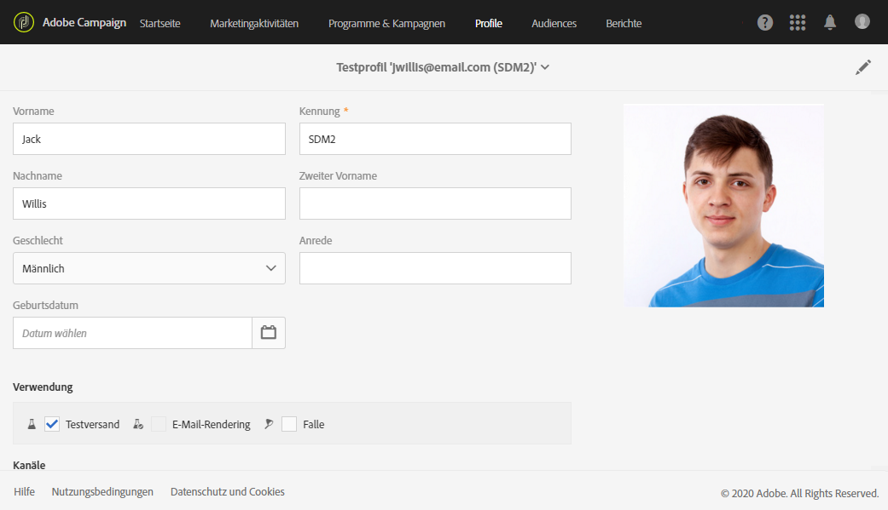
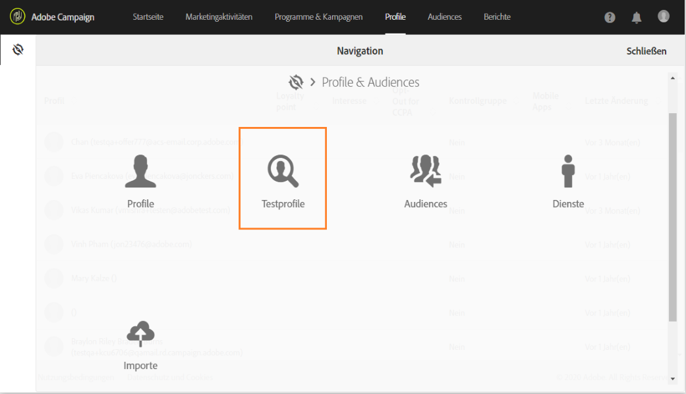
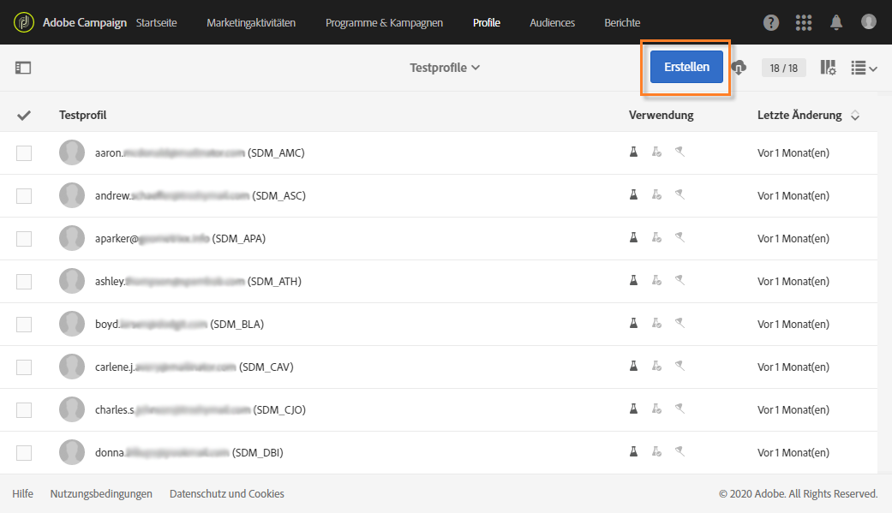
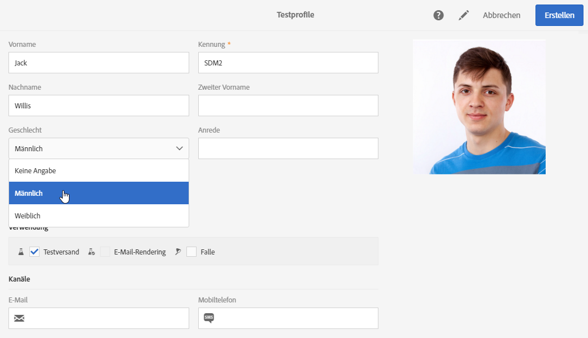
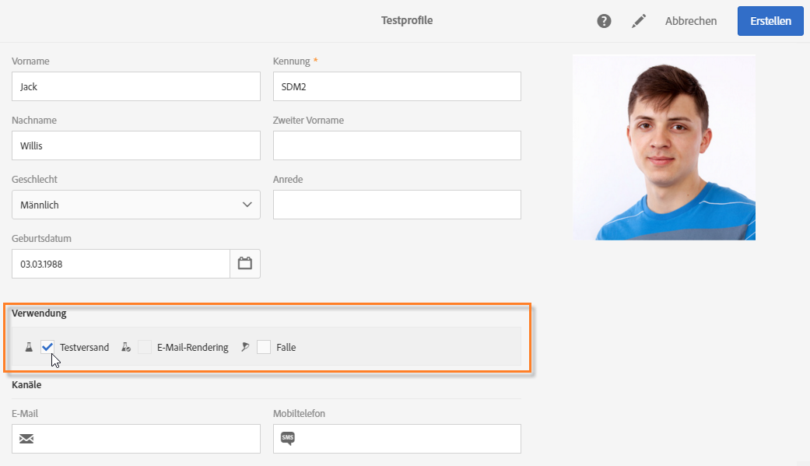

# Verwaltung von Testprofilen {#managing-test-profiles}

## Über Testprofile {#about-test-profiles}

Testprofile ermöglichen es, zusätzliche Empfänger anzusprechen, die nicht den definierten Zielgruppenkriterien entsprechen. Sie werden Audiences hinzugefügt, um beispielsweise Missbrauch bei der Nutzung Ihrer Empfängerliste aufzudecken oder den korrekten Erhalt der Sendungen zu kontrollieren.

 [Funktion im Video kennenlernen](#video).

Testprofile werden im erweiterten Menü **[!UICONTROL Profile &amp; Audiences > Testprofile]** verwaltet.

Testprofile sind Profile mit fiktiven oder vom Absender kontrollierten Kontaktinformationen, die verschiedenen Zwecken dienen können:

* **Testsendungen**: Dabei handelt es sich um einen speziellen Versand, der es ermöglicht, eine Nachricht vor dem Versenden an die Empfänger zu validieren. Testversand-Empfänger sind verantwortlich für die Validierung des Inhalts und der Form von Sendungen. Siehe [Testversand durchführen](../../sending/using/sending-proofs.md).
* **E-Mail-Rendering**: Diese Art von Testprofilen wird verwendet, um den Empfang und die Darstellung Ihrer Nachricht in den verschiedenen E-Mail-Clients zu testen. Beispielsweise Webmail, SMS, Mobilgeräte etc. Siehe [E-Mail-Rendering](../../sending/using/email-rendering.md).

  Die Funktion **E-Mail-Rendering** ist schreibgeschützt. Testprofile mit diesem Verwendungszweck sind ausschließlich nativ in Adobe Campaign enthalten.

* Als **Falle**: Die Nachricht wird auf dieselbe Weise an das Testprofil gesendet wie an die Hauptzielgruppe. Siehe [Verwenden von Fallen](../../sending/using/using-traps.md).
* **Vorschau** einer Nachricht: Durch Auswahl eines Testprofils lässt sich die korrekte Umsetzung von Personalisierungselementen innerhalb einer Nachricht prüfen. Siehe [Vorschau der Nachricht erzeugen](/help/sending/using/previewing-messages.md).

## Testprofile erstellen {#creating-test-profiles}

1. Greifen Sie mithilfe des Adobe-Campaign-Logos auf das erweiterte Menü **Profile &amp; Audiences > Testprofile** zu, um die Liste mit Testprofilen aufzurufen.

   

1. Verwenden Sie in der Übersicht der **[!UICONTROL Testprofile]** die Schaltfläche **Erstellen**.

   

1. Machen Sie die erforderlichen Angaben zum Profil.

   

1. Kreuzen Sie die Verwendung des Testprofils an.

   

1. Geben Sie die verschiedenen Kontaktkanäle (**[!UICONTROL E-Mail, Telefon, Mobiltelefon, Mobile App]**) sowie bei Bedarf die Adresse des Testprofils an.

   >[!NOTE]
   >
   >Sie können ein bevorzugtes E-Mail-Format definieren: **[!UICONTROL Text]** oder **[!UICONTROL HTML]**.

1. Geben Sie einen Ereignistyp sowie die Ereignisdaten an, wenn Sie dieses Testprofil dazu verwenden möchten, die Personalisierung einer Transaktionsnachricht zu testen.
1. Speichern Sie das Testprofil mithilfe der Schaltfläche **[!UICONTROL Erstellen]**.

Das Testprofil wurde der Liste der Profile hinzugefügt.

## Testprofile bearbeiten {#editing-test-profiles}

Gehen Sie wie folgt vor, um ein bereits existierendes Testprofil zu bearbeiten bzw. seine Daten einzusehen oder es zu ändern:

1. Wählen Sie das zu ändernde Testprofil aus, indem Sie auf sein Bild klicken.
1. Nehmen Sie bei Bedarf die gewünschten Änderungen vor.

   

1. Verwenden Sie die Schaltfläche **[!UICONTROL Speichern]**, falls Sie Änderungen vorgenommen haben. Andernfalls können Sie oben im Bildschirm den Namen des Testprofils anklicken und dann in der sich öffnenden Dropdown-Liste **[!UICONTROL Testprofile]** auswählen, um zur Übersicht der Testprofile zurückzukehren.

## Anleitungsvideo {#video}

In diesem Video wird gezeigt, wie man ein Testprofil erstellt.

>[!VIDEO](https://video.tv.adobe.com/v/24094?quality=12)

Weitere Anleitungsvideos zu Campaign Standard finden Sie [hier](https://experienceleague.adobe.com/docs/campaign-standard-learn/tutorials/overview.html?lang=de).
