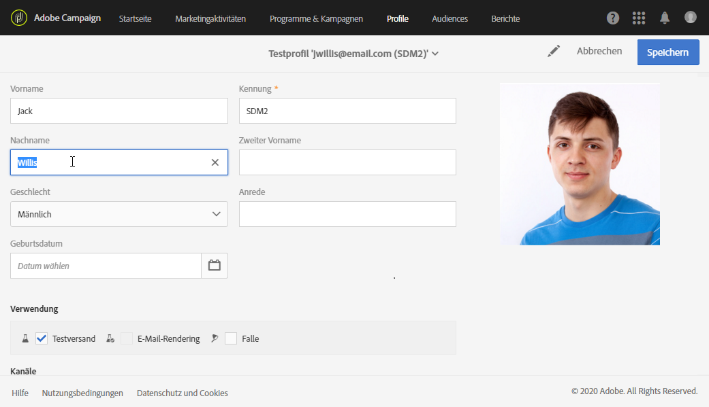

# Verwaltung von Testprofilen  {#managing-test-profiles}

## Über Testprofile {#about-test-profiles}

Testprofile ermöglichen es, zusätzliche Empfänger anzusprechen, die nicht den definierten Zielgruppenkriterien entsprechen. Sie werden Audiences hinzugefügt, um beispielsweise Missbrauch bei der Nutzung Ihrer Empfängerliste aufzudecken oder den korrekten Erhalt der Sendungen zu kontrollieren.

Sie können Ihre Test-Profil über das erweiterte Menü verwalten **[!UICONTROL Profiles & audiences > Test profiles]**.

Testprofile sind Profile mit fiktiven oder vom Absender kontrollierten Kontaktinformationen, die verschiedenen Zwecken dienen können:

* For sending **Proofs**: The Proof is a specific message used to check the message before sending the finalized delivery to recipients. Testversand-Empfänger sind verantwortlich für die Validierung des Inhalts und der Form von Sendungen. Siehe [Testversand durchführen](../../sending/using/sending-proofs.md).
* For **Email rendering**: The Email rendering test profile is used to check the way in which a message is displayed according to the message inbox that receives it. Beispielsweise Webmail, SMS, Mobilgeräte etc. Siehe [E-Mail-Rendering](../../sending/using/email-rendering.md).

   Die Funktion **E-Mail-Rendering** ist schreibgeschützt. Testprofile mit diesem Verwendungszweck sind ausschließlich nativ in Adobe Campaign enthalten.

* As a **Trap**: The message is sent to the test profile just as it is sent to the main target. Siehe [Verwenden von Traps](../../sending/using/using-traps.md).
* To **Preview** messages: A test profile can be selected when previewing a message to test the personalization elements. Siehe [Vorschau der Nachricht erzeugen](/help/sending/using/previewing-messages.md).

## Testprofile erstellen {#creating-test-profiles}

1. Greifen Sie mithilfe des Adobe-Campaign-Logos auf das erweiterte Menü **Profile &amp; Audiences > Testprofile** zu, um die Liste mit Testprofilen aufzurufen.

   

1. Klicken Sie im **[!UICONTROL Test profiles]** Dashboard auf **Erstellen**.

   

1. Machen Sie die erforderlichen Angaben zum Profil.

   

1. Kreuzen Sie die Verwendung des Testprofils an.

   

1. Geben Sie bei Bedarf die Kanal **[!UICONTROL Email, Telephone, Mobile, Mobile app]** sowie die Adresse des Profils ein.

   >[!NOTE]
   >
   >You can define a preferred email format: **[!UICONTROL Text]** or **[!UICONTROL HTML]**.

1. Geben Sie einen Ereignistyp sowie die Ereignisdaten an, wenn Sie dieses Testprofil dazu verwenden möchten, die Personalisierung einer Transaktionsnachricht zu testen.
1. Click **[!UICONTROL Create]** to save the test profile.

Das Testprofil wurde der Liste der Profile hinzugefügt.

**Verwandtes Thema:**

Video [Creating a test profile](https://docs.adobe.com/content/help/en/campaign-learn/campaign-standard-tutorials/profiles-and-audiences/test-profiles.html)

## Testprofile bearbeiten {#editing-test-profiles}

Gehen Sie wie folgt vor, um ein bereits existierendes Testprofil zu bearbeiten bzw. seine Daten einzusehen oder es zu ändern:

1. Wählen Sie das zu ändernde Testprofil aus, indem Sie auf sein Bild klicken.
1. Nehmen Sie bei Bedarf die gewünschten Änderungen vor.

   

1. Click **[!UICONTROL Save]** if you have entered your changes, or select the name of the test profile then **[!UICONTROL Test profiles]** in the section at the top of the screen to go back to the test profiles dashboard.
