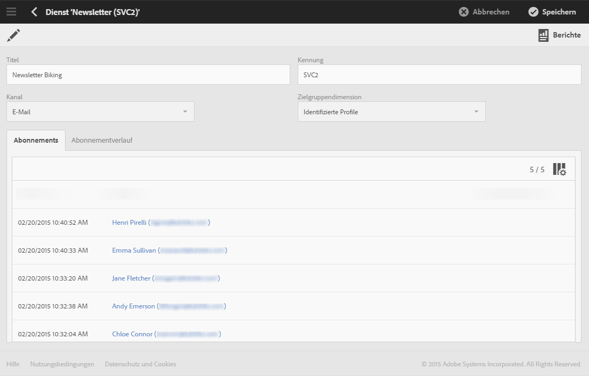
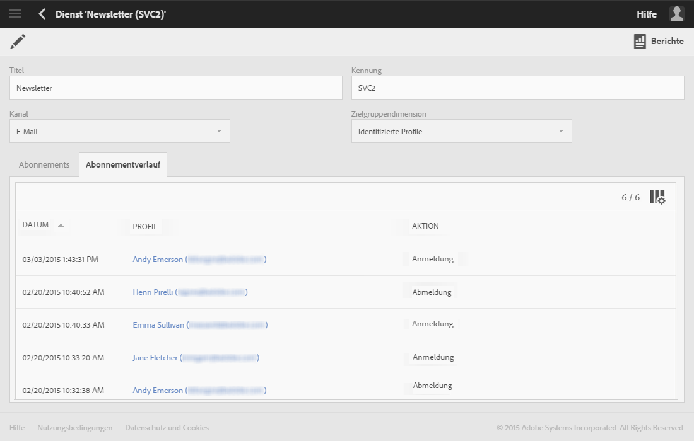
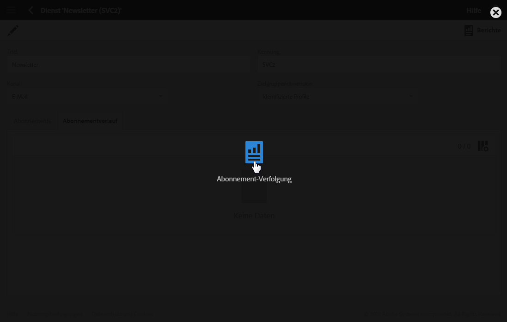
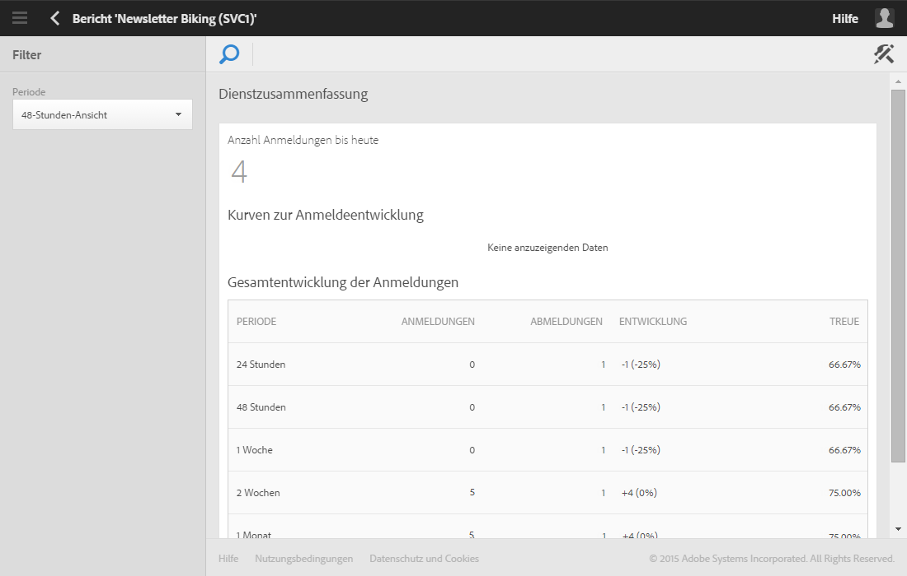
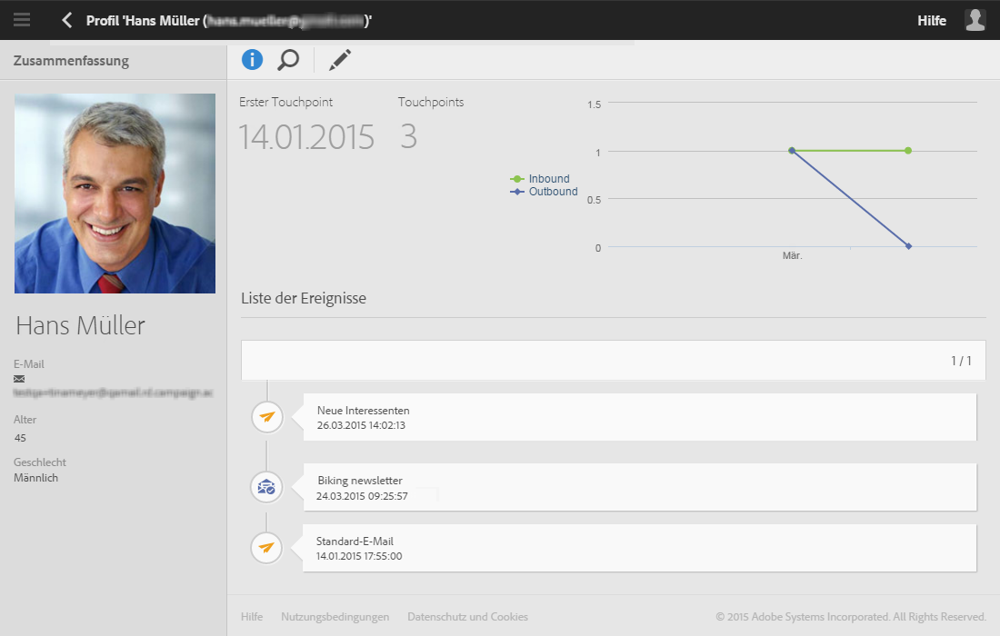

# Anmeldungen verfolgen{#monitoring-subscriptions}

In der Benutzeroberfläche von Adobe Campaign können Sie Ihre Abonnenten tracken und feststellen, wie erfolgreich Ihre Dienste sind.

Zur Verfolgung des An- und Abmeldeverhaltens bieten sich Ihnen verschiedene Optionen.

* Sehen Sie sich die Liste der Personen im Dienst-Dashboard an, die Ihren Dienst abonniert haben. Siehe [Dienst-Dashboard](#service-dashboard).
* Sehen Sie sich den Verlauf der An- und Abmeldungen im Tab **Abonnementverlauf** im Dienst-Dashboard an. Siehe [Abonnementverlauf](#subscription-history).
* Öffnen Sie einen Bericht zur An- und Abmeldeentwicklung im Bereich **Bericht** des Dienstes. Siehe [Dienst-Berichte](#service-reports).
* Öffnen Sie im Bereich **Profil** die Liste der Dienste, für die sich eine Person angemeldet hat. Siehe [Ereignisverlauf eines Profils](#history-of-events-linked-to-a-profile).

## Dienst-Dashboard     {#service-dashboard}

Gehen Sie wie folgt vor, um die Liste der Kontakte anzuzeigen, die für einen Dienst angemeldet sind:

1. Greifen Sie mithilfe des Adobe-Campaign-Logos oben links im Bildschirm und der Schaltflächen **Profile &amp; Audiences** > **Dienste** auf die Liste der Dienste zu.
1. Wählen Sie den gewünschten Dienst aus, um sein Dashboard anzuzeigen.
1. Die Liste der angemeldeten Kontakte ist im Tab **Abonnements** verfügbar.

## Abonnementverläufe     {#subscription-history}

Gehen Sie wie folgt vor, um den An- und Abmeldeverlauf anzuzeigen:

1. Greifen Sie mithilfe des Adobe-Campaign-Logos oben links im Bildschirm und der Schaltflächen **Profile &amp; Audiences** > **Dienste** auf die Liste der Dienste zu.
1. Wählen Sie den gewünschten Dienst aus, um sein Dashboard anzuzeigen.
1. Gehen Sie in den Tab **Abonnement-Verlauf**, um die zeitliche Verteilung der An- und Abmeldungen anzuzeigen.

## Dienst-Berichte     {#service-reports}

Gehen Sie wie folgt vor, um den Bericht zur An- und Abmeldeentwicklung anzuzeigen:

1. Greifen Sie mithilfe des Adobe-Campaign-Logos oben links im Bildschirm und der Schaltflächen **Profile &amp; Audiences** > **Dienste** auf die Liste der Dienste zu.
1. Wählen Sie den gewünschten Dienst aus, um sein Dashboard anzuzeigen.
1. Klicken Sie in der Aktionsleiste auf die Schaltfläche **Berichte** und im Auswahlbildschirm auf **Abonnement-Verfolgung**.

   

1. Der Bericht **Dienstzusammenfassung** enthält die Anzahl an aktuellen Abonnenten, die allgemeine Anmeldeentwicklung sowie eine Grafik zur zeitlichen Verteilung von An- und Abmeldungen.

## Ereignisverlauf eines Profils     {#history-of-events-linked-to-a-profile}

Um festzustellen, für welche Dienste sich ein Kontakt angemeldet hat, können Sie die Liste im Marketing-Verlauf des entsprechenden Profils zu Rate ziehen. Näheres hierzu finden Sie im Abschnitt [Integriertes Kundenprofil](../../audiences/using/integrated-customer-profile.md).

