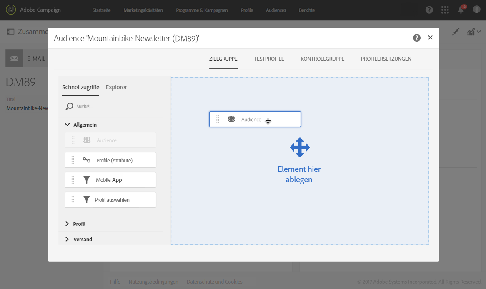

# Audience in einer Nachricht auswählen{#selecting-an-audience-in-a-message}

In Adobe Campaign können Audiences verschiedene Arten von Profilen enthalten.

Audiences können im Zuge der Nachrichtenerstellung im Assistenten oder im Nachhinein ausgehend vom Dashboard der Nachricht bestimmt werden.

>[!NOTE]
>
>Wenn die Audience innerhalb eines Workflows erstellt und mit Zusatzdaten angereichert wurde, können Sie diese Daten nicht zur Personalisierung eines Einzelversands verwenden. Diese Daten können nur über einen in einem Workflow ausgeführten Versand verwendet werden.

1. Gehen Sie im Dashboard einer Nachricht in die Audience-Kachel,

   

   um die gewünschten Profile auszuwählen. Der sich öffnende Bildschirm zeigt zwei Tabs, die die separate Definition der anzusprechenden Populationen ermöglichen:

   * Zielgruppe
   * Testprofile

   

1. Definieren Sie die **[!UICONTROL Hauptzielgruppe]** der E-Mail. Dies ist die tatsächliche Ziel-Audience der E-Mail.

   Im Tab **[!UICONTROL Zielgruppe]** werden aus den identifizierten Profilen der Datenbank diejenigen ausgewählt, die den Versand erhalten sollen.

   Dies kann beispielsweise unter Verwendung des [Abfrageeditors](../../automating/using/editing-queries.md#creating-queries) geschehen.

   Wenn Sie sich im Zielgruppe-Tab befinden, zeigt die Palette der **[!UICONTROL Schnellzugriffe]** nur vordefinierte Filter und Audiences, die sich auf identifizierte Profile beziehen. Der **[!UICONTROL Explorer]**-Tab bietet Zugriff auf fortgeschrittene Konfigurationen.

   Sie haben die Möglichkeit, zuvor erstellte Audiences wiederzuverwenden und zu kombinieren bzw. durch das Hinzufügen von Filtern weiter einzuschränken.

1. Definieren Sie die **[!UICONTROL Testprofile]**, die Sie für die E-Mail verwenden möchten. Die Testprofile erhalten Testsendungen, die Sie probeweise senden können, bevor Sie die endgültige E-Mail an die Hauptzielgruppe senden.

   Weiterführende Informationen zur Testprofil-Konfiguration finden Sie im Abschnitt [Testprofile](../../audiences/using/managing-test-profiles.md).

1. Bei Bedarf können Sie über den entsprechenden Tab eine Kontrollgruppe definieren. Auf diese Weise können Sie einige Profile aus Ihrer Zielgruppe entfernen, damit diese die Nachricht nicht erhalten. Weitere Informationen finden Sie unter [Hinzufügen einer Kontrollgruppe](../../sending/using/control-group.md).

1. Sie können auch Ersatzadressen verwenden, um eine genaue Darstellung der Nachricht zu erhalten, die das Profil erhält.  Weiterführende Informationen finden Sie unter [Testen von E-Mail-Nachrichten mit Zielgruppenprofilen](../../sending/using/testing-messages-using-target.md).

Nach Abschluss der Konfigurationen zeigt die Audiences-Kachel an, dass sowohl die Zielgruppe als auch Testprofile definiert wurden.

