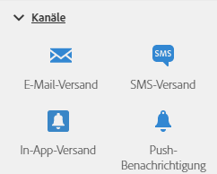

# Über Kanalaktivitäten{#about-channel-activities}

Öffnen Sie in der Palette auf der linken Bildschirmseite den Bereich **[!UICONTROL Kanäle]**.

Diese Aktivitäten repräsentieren die verschiedenen Kommunikationskanäle. Sie können sie zu einem kanalübergreifenden Workflow verbinden.

Im Bereich **[!UICONTROL Kanäle]** stehen folgende Aktivitäten zur Verfügung:

* [E-Mail-Versand](../../automating/using/email-delivery.md)
* [SMS-Versand](../../automating/using/sms-delivery.md)
* [Push-Benachrichtigungsversand](../../automating/using/push-notification-delivery.md)
* [Briefpost-Versand](../../automating/using/direct-mail-delivery.md)
* [In-App-Versand](../../automating/using/in-app-delivery.md)

