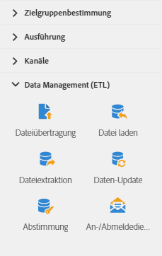

# Über Datenverwaltungsaktivitäten{#about-data-management-activities}

Öffnen Sie in der Palette auf der linken Bildschirmseite den Bereich **[!UICONTROL Daten-Management (ETL)]**.

Mit diesen Aktivitäten können Sie Daten bearbeiten. Beispielsweise können Sie damit Daten importieren, gebündelt Daten in Datenbankfeldern aktualisieren, Dateien empfangen oder senden oder nicht identifizierte Daten mit bestehenden Ressourcen verknüpfen.

Im Bereich **[!UICONTROL Daten-Management (ETL)]** werden die folgenden Aktivitäten bereitgestellt:

* [Daten-Update](../../automating/using/update-data.md)
* [Datei laden](../../automating/using/load-file.md)
* [Dateiübertragung](../../automating/using/transfer-file.md)
* [Abstimmung](../../automating/using/reconciliation.md)
* [Dateiextraktion](../../automating/using/extract-file.md)
* [Anmeldedienste](../../automating/using/subscription-services.md)

In den Aktivitäten **[!UICONTROL Daten-Management (ETL)]** können Sie **Segmentcodes** für die ausgehenden Transitionen definieren. Anschließend können Sie auf diesen Segmentcodes basierende Berichte erstellen, um die Effizienz Ihrer Marketingkampagnen zu messen. Weiterführende Informationen hierzu finden Sie in [diesem Abschnitt](../../reporting/using/creating-a-report-workflow-segment.md).
