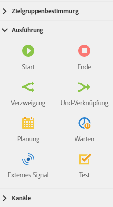

# Über Ausführungsaktivitäten{#about-execution-activities}

Öffnen Sie in der Palette auf der linken Bildschirmseite den Bereich **[!UICONTROL Ausführung]**.

Die folgenden Aktivitäten dienen der Anordnung und Ausführung von Workflows. Sie ermöglichen die Koordinierung der anderen Aktivitäten.

Im Bereich **[!UICONTROL Ausführung]** stehen folgende Aktivitäten zur Verfügung:

* [Start und Ende](../../automating/using/start-and-end.md)
* [Verzweigung](../../automating/using/fork.md)
* [Und-Verknüpfung](../../automating/using/and-join.md)
* [Planung](../../automating/using/scheduler.md)
* [Warten](../../automating/using/wait.md)
* [Externes Signal](../../automating/using/external-signal.md)
* [Test](../../automating/using/test.md)

