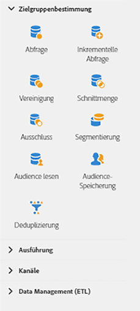

# Über Zielgruppenbestimmungsaktivitäten{#about-targeting-activities}

Öffnen Sie über das auf der linken Bildschirmseite den Bereich **[!UICONTROL Zielgruppenbestimmung]**.

Diese Aktivitäten dienen der Erstellung von Zielgruppen und der Verwendung bzw. Filterung von Populationen. Sie können damit eine oder mehrere Zielpopulationen definieren, welche im Anschluss durch die Aktivitäten Schnittmenge, Vereinigung und Ausschluss gesplittet oder zusammengefasst werden können.

Im Bereich **[!UICONTROL Targeting]** stehen folgende Aktivitäten zur Verfügung:

* [Abfrage](../../automating/using/query.md)
* [Inkrementelle Abfrage](../../automating/using/incremental-query.md)
* [Vereinigung](../../automating/using/union.md)
* [Schnittmenge](../../automating/using/intersection.md)
* [Ausschluss](../../automating/using/exclusion.md)
* [Segmentierung](../../automating/using/segmentation.md)
* [Audience lesen](../../automating/using/read-audience.md)
* [Audience-Speicherung](../../automating/using/save-audience.md)
* [Deduplizierung](../../automating/using/deduplication.md)
* [Anreicherung](../../automating/using/enrichment.md)

Mit **[!UICONTROL Targeting]**-Aktivitäten können Sie **Segmentcodes** für die ausgehenden Transitionen definieren. Anschließend können Sie auf diesen Segmentcodes basierende Berichte erstellen, um die Effizienz Ihrer Marketingkampagnen zu messen. Weiterführende Informationen hierzu finden Sie in [diesem Abschnitt](../../reporting/using/creating-a-report-workflow-segment.md).

## Datenauswahl {#selecting-data}

Sie können Daten mithilfe der folgenden Aktivitäten auswählen:

* Eine **[!UICONTROL Abfrage]** dient der Filterung und Extraktion einer Population, die sich aus Elementen der Adobe Campaign-Datenbank zusammensetzt. Siehe den Abschnitt [Abfrage](../../automating/using/query.md).
* Eine **[!UICONTROL Inkrementelle Abfrage]** dient der Filterung und Extraktion einer Population, die sich aus Elementen der Adobe-Campaign-Datenbank zusammensetzt. Bei jeder neuen Ausführung dieser Aktivität werden die Ergebnisse der vorangehenden Ausführungen ausgeschlossen. Dadurch lassen sich ausschließlich neue Elemente abrufen. Siehe den Abschnitt [Inkrementelle Abfrage](../../automating/using/incremental-query.md).
* Die Aktivität **[!UICONTROL Audience lesen]** ermöglicht es Ihnen, eine vorhandene Audience abzurufen und sie durch zusätzliche Filterbedingungen einzuengen. Siehe den Abschnitt [Audience lesen](../../automating/using/read-audience.md).

## Daten segmentieren {#segmenting-data}

Adobe Campaign bietet die Möglichkeit, eingehende Daten zusammenzufassen oder aber zu segmentieren. Sie können also verschiedene Populationen vereinen, einen Teil daraus ausschließen oder nur die in jeder der Populationen enthaltenen Datensätze verwenden.

* Eine **[!UICONTROL Vereinigung]** dient der Zusammenfassung der Ergebnisse mehrerer Aktivitäten in einer Zielgruppe. Siehe den Abschnitt [Vereinigung](../../automating/using/union.md).
* Eine **[!UICONTROL Schnittmenge]** dient der Extraktion der gemeinsamen Population aus den eingehenden Aktivitäten. Siehe den Abschnitt [Schnittmenge](../../automating/using/intersection.md).
* Ein **[!UICONTROL Ausschluss]** ermöglicht es, bestimmten Kriterien entsprechende Elemente aus einer Population auszuschließen. Siehe den Abschnitt [Ausschluss](../../automating/using/exclusion.md).
* Mit der **[!UICONTROL Segmentierung]** lassen sich von einer durch frühere Aktivitäten berechneten Population ausgehend ein oder mehrere Segmente erstellen. Diese können bei Abschluss der Aktivität in einer einzigen oder verschiedenen Transition(en) verarbeitet werden. Siehe den Abschnitt [Segmentierung](../../automating/using/segmentation.md).

## Daten anreichern {#enriching-data}

Identifizierte und abgerufene Daten können angereichert, zusammengefasst und bearbeitet werden, um die Zielgruppenerstellung zu optimieren. Sie können den Zielgruppenbestimmungsvorgang durch Einschluss von nicht im Datamart modellisierten Daten vereinfachen und optimieren.

Mithilfe des Tabs **[!UICONTROL Zusatzdaten]** der Aktivitäten **[!UICONTROL Abfrage]** und **[!UICONTROL Inkrementelle Abfrage]** lassen sich die aus der Abfrage hervorgehenden Daten anreichern und an die Folgeaktivitäten des Workflows übermitteln, in denen sie weiterverwendet werden können. Insbesondere die folgenden Elemente lassen sich hinzufügen:

* einfache Daten
* Aggregate
* Sammlungen

**Verwandte Themen:**

* [Anwendungsfall: E-Mail mit Zusatzdaten personalisieren](../../automating/using/personalizing-email-with-additional-data.md)
