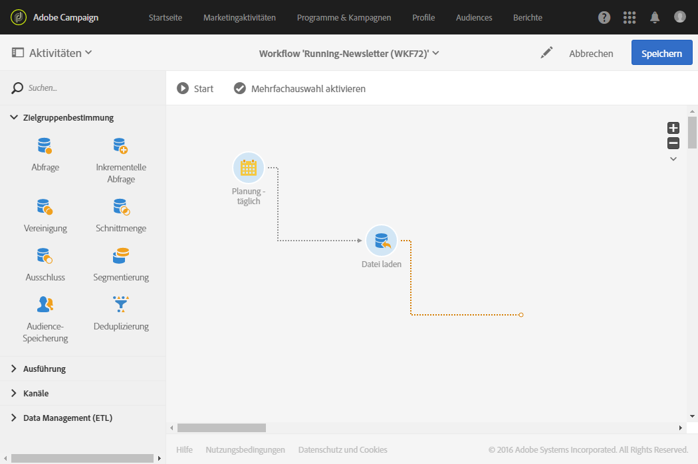
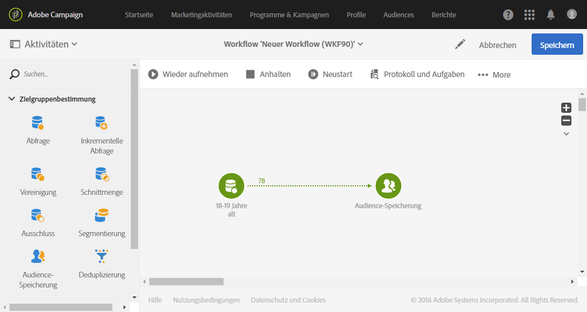

# Über die Ausführung von Workflows {#about-workflow-execution}

Workflows werden grundsätzlich manuell gestartet, können jedoch anschließend inaktiv bleiben, wenn dies mithilfe einer [Planung](../../automating/using/scheduler.md) konfiguriert wurde.

>[!CAUTION]
>
> Adobe empfiehlt seinen Kunden, bei der Durchführung von Workflows Prioritäten festzulegen und bis zu 20 gleichzeitige Workflows auszuführen, um ständig die Maximalleistung Ihrer Instanz auszunutzen. Es können auch mehr als 20 gleichzeitige Workflows geplant werden. Diese werden standardmäßig nacheinander ausgeführt. Sie können die Standardeinstellung für die maximale Anzahl gleichzeitiger Workflows ändern, indem Sie ein Ticket an die Kundenunterstützung senden.

Bei Aktionen bezüglich der Ausführung des Workflows (Start, Stopp, Pause etc.) handelt es sich um **asynchrone** Prozesse, d. h. der jeweilige Befehl wird gespeichert und erst dann ausgeführt, wenn ein Server verfügbar ist.

Die Übermittlung der Ergebnisse der einzelnen Workflow-Aktivitäten erfolgt über Transitionen, welche in Form von Pfeilen dargestellt werden.

Transitionen, die nicht mit einer Zielaktivität verbunden sind, werden als schwebend bezeichnet.

>[!NOTE]
>
>Auch mit schwebenden Transitionen kann ein Workflow ausgeführt werden: Die Ausführung erzeugt einen Warnhinweis und wird bei Aktivierung einer derartigen Transition ausgesetzt. Es wird jedoch kein Fehler erzeugt. Auf diese Weise ist es möglich, einen Workflow zu starten, auch wenn seine Konzeption noch nicht vollständig abgeschlossen ist, und ihn nach und nach zu vervollständigen.

Sobald eine Aktivität ausgeführt worden ist, wird die Anzahl der in der Transition übertragenen Datensätze oberhalb der Transition angezeigt.

Sie können Transitionen vor oder nach der Ausführung des Workflows öffnen, um zu überprüfen, ob die übermittelten Daten korrekt sind. Die vorhandenen Daten sowie deren Struktur lassen sich visualisieren.

Standardmäßig können nur die Details der letzten Transition des Workflows abgerufen werden. Um auch auf die Ergebnisse der vorangehenden Aktivitäten zugreifen zu können, ist vor dem Start des Workflows in den Workflow-Eigenschaften im Bereich **[!UICONTROL Ausführung]** die Option **[!UICONTROL Zwischenergebnis festhalten]** zu aktivieren.

>[!NOTE]
>
>Diese Option verbraucht eine große Menge an Speicherplatz und dient der Erstellung eines Workflows und der korrekten Konfiguration. Aktivieren Sie sie nicht bei Produktionsinstanzen.

Bei einer geöffneten Transition kann ihr **[!UICONTROL Titel]** geändert oder derselben ein **[!UICONTROL Segment-Code]** zugewiesen werden. Bearbeiten Sie hierzu die entsprechenden Felder und validieren Sie Ihre Änderungen.

Mit Campaign Standard-REST APIs können Sie einen Workflow **starten**, **unterbrechen**, **fortsetzen** und **anhalten**. Weiterführende Informationen und Beispiele für REST-Aufrufe finden Sie in der [API-Dokumentation.](../../api/using/controlling-a-workflow.md)
