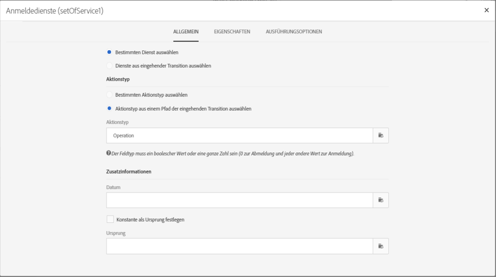
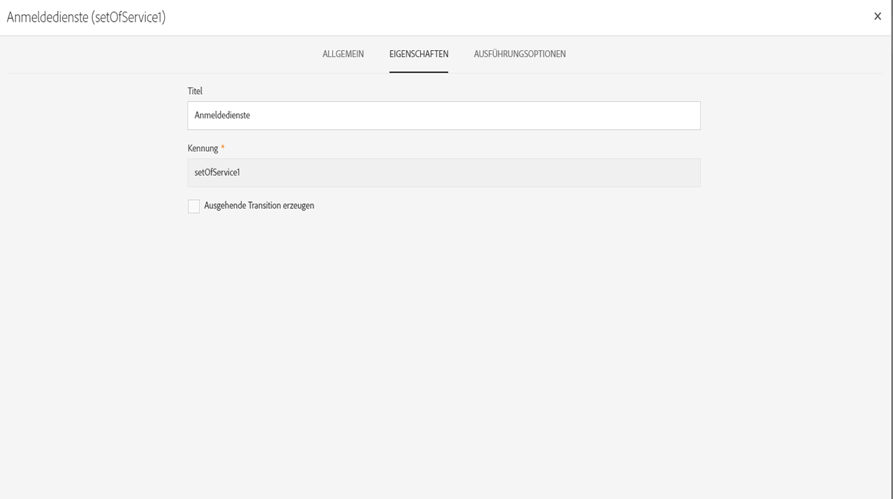
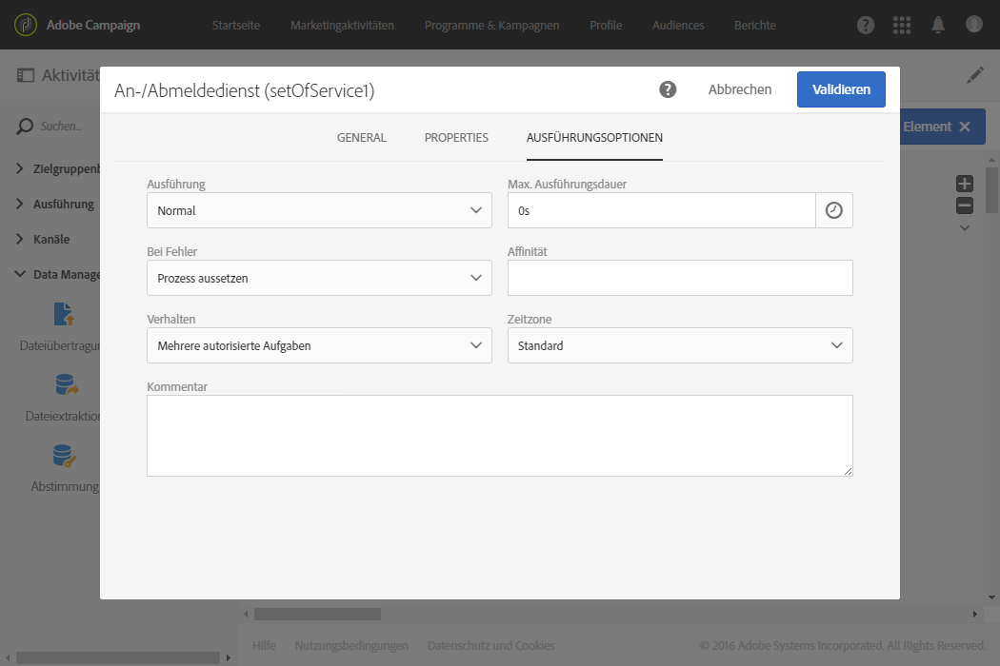

# Eigenschaften von Aktivitäten verwalten {#activity-properties}

## Allgemeine Eigenschaften einer Aktivität {#global-properties-of-an-activity}

Jede Aktivität verfügt über den Tab **[!UICONTROL Allgemein]**, über den Sie allgemeine Parameter ändern können, die für die Aktivität spezifisch sind.

Im Tab **[!UICONTROL Eigenschaften]** lassen sich die allgemeinen Parameter der Aktivität, insbesondere Titel und Kennung anpassen. Die Konfiguration dieses Tabs is optional.

## Verwaltung ausgehender Transitionen von Aktivitäten          {#managing-an-activity-s-outbound-transitions}

Standardmäßig verfügen bestimmte Aktivitäten nicht über ausgehende Transitionen. Sie haben jedoch die Möglichkeit, diese in den Tabs **[!UICONTROL Transitionen]** oder **[!UICONTROL Eigenschaften]** der Aktivität hinzuzufügen, um auf Ihre Population im selben Workflow andere Prozesse anzuwenden.

Je nach Aktivität lassen sich verschiedene Arten ausgehender Transitionen hinzufügen:

* **Standardtransition**: mittels der Aktivität berechnete Population.
* **Transition ohne Population**: Dieser Typ der ausgehenden Transition kann hinzugefügt werden, um den Workflow fortzusetzen. Er enthält keine Population, um nicht unnötig Speicherplatz im System zu belegen.
* **Zurückweisungen**: zurückgewiesene Population. Dies trifft zu, wenn z. B. in eine Aktivität eingehende Daten aufgrund von Fehlerhaftigkeit oder Unvollständigkeit nicht verarbeitet werden konnten.
* **Komplement**: nach der Ausführung der Aktivität verbleibende Population. Dies trifft zu, wenn z. B. eine Segmentierungsaktivität dahingehend konfiguriert ist, dass lediglich ein bestimmter Prozentsatz der eingehenden Population beibehalten wird.

Es besteht die Möglichkeit, für die ausgehende Transition der Aktivität einen **[!UICONTROL Segmentcode]** anzugeben. Der Segmentcode ermöglicht es, die Herkunft von Teilmengen der Zielpopulation zu identifizieren, und kann im weiteren Verlauf für die Nachrichtenpersonalisierung verwendet werden.

## Ausführungsoptionen von Aktivitäten          {#activity-execution-options}

In einer Workflow-Aktivität erlaubt Ihnen der Tab **[!UICONTROL Ausführungsoptionen]** im Eigenschaften-Bildschirm insbesondere die Definition des Ausführungsmodus sowie des Verhaltens beim Auftritt von Fehlern.

Markieren Sie zum Zugriff auf diese Optionen die gewünschte Aktivität im Workflow und öffnen Sie sie in der Aktionsleiste unter Verwendung der Schaltfläche .

Im Feld **[!UICONTROL Ausführung]** können Sie die Aktion definieren, die bei Aktivierung der Aufgabe ausgelöst werden soll. Dabei stehen drei Optionen zur Wahl:

* **Normal** - die Aufgabe wird ausgeführt.
* **Aktivieren aber nicht ausführen** - die Aktivität wird ausgesetzt. Dies bedeutet, dass auch die nachfolgenden Aktivitäten nicht ausgeführt werden. Dies kann sich als nützlich erweisen, wenn Sie beispielsweise zum Zeitpunkt der Aufgabenaktivierung den Workflow überwachen möchten.
* **Nicht aktivieren** - die Aktivität sowie alle im selben Zweig folgenden Aktivitäten werden nicht ausgeführt.

Im Feld **[!UICONTROL Bei Fehler]** lassen sich mögliche Reaktionen bei Auftreten eines Fehlers bestimmen. Zwei Optionen stehen zur Wahl:

* **Prozess aussetzen** - der Workflow wird automatisch angehalten. Der Workflow-Status wechselt in **fehlerhaft** und sein Symbol wird rot hinterlegt. Nach Beseitigung der Fehlerursache kann der Workflow neu gestartet werden.
* **Ignorieren** - die den Fehler verursachende Aktivität sowie alle im selben Zweig folgenden Aktivitäten werden nicht ausgeführt. Diese Konfiguration empfiehlt sich bei wiederkehrenden Aufgaben. Wenn der Workflow-Zweig eine Planungsaktivität enthält, führt diese automatisch zum nächsten geplanten Zeitpunkt zu einer erneuten Ausführung.

Im Feld **[!UICONTROL Verhalten]** können Sie das Verhalten des Workflows im Fall von asynchronen Aufgaben bestimmen. Zwei Optionen stehen zur Wahl:

* **Mehrere autorisierte Aufgaben** - mehrere Aufgaben können gleichzeitig ausgeführt werden.
* **Laufende Aufgabe hat Vorrang** - solange eine Aufgabe läuft, wird keine neue Aufgabe gestartet. Solange eine Aufgabe läuft, wird keine neue Aufgabe gestartet.

Im Feld **[!UICONTROL Max. Ausführungsdauer]** kann eine maximale Dauer für die Workflow-Ausführung bestimmt werden, z. B. &quot;30s&quot; oder &quot;1h&quot;. Wenn eine Aufgabe die angegebene Dauer überschreitet, wird ein Warnhinweis erzeugt. Die Workflow-Ausführung wird hiervon jedoch nicht beeinflusst.

Das Feld **[!UICONTROL Affinität]** bietet die Möglichkeit, die Ausführung eines Workflows oder einer Workflow-Aktivität an eine bestimmte Engine zu binden. Hierzu müssen eine oder mehrere Affinitäten auf Workflow- oder Aktivitätsniveau definiert werden.

Im Feld **[!UICONTROL Zeitzone]** können Sie der Aktivität eine bestimmte Zeitzone zuweisen. Adobe Campaign ist in der Lage, verschiedene Zeitzonen innerhalb einer Instanz zu verwalten. Die entsprechenden Einstellungen werden bei der Instanzerstellung vorgenommen.

>[!NOTE]
>
>Wenn keine Zeitzone ausgewählt ist, verwendet die Aktivität standardmäßig die in den Eigenschaften des Workflows definierte Zeitzone.

Im Feld **Kommentar** kann eine Bemerkung eingegeben werden. Es handelt sich um ein freies Textfeld.
