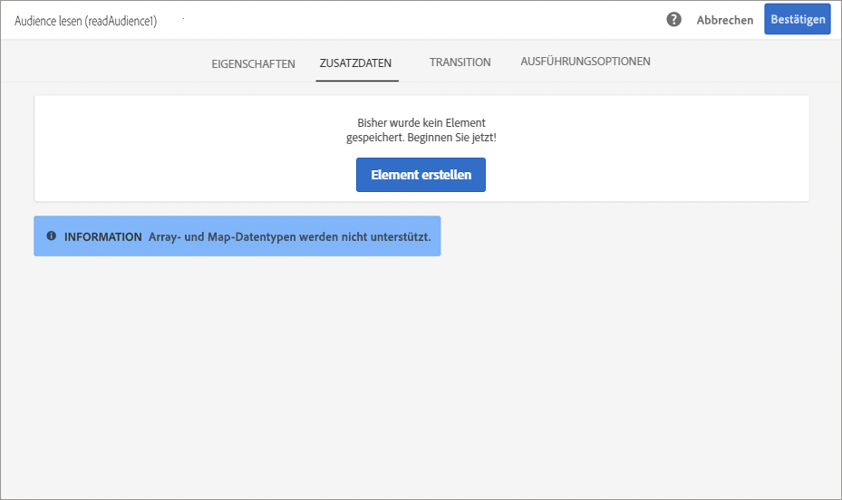
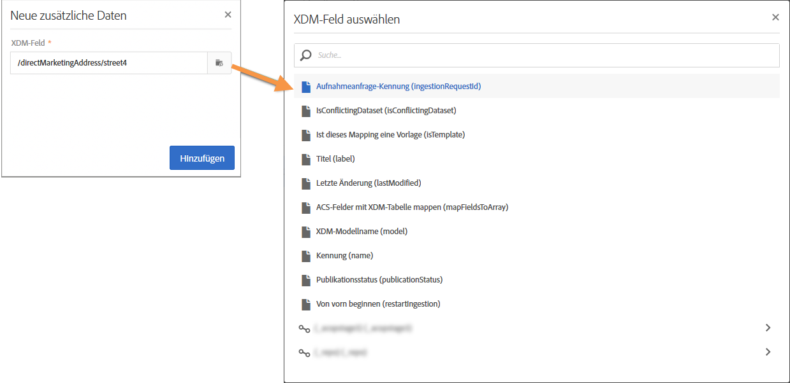
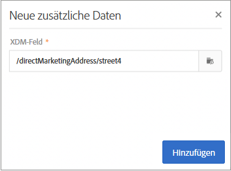

# Kampagnen mithilfe von Adobe Experience Platform-Attributen personalisieren {#personalizing-campaigns-using-aep-attributes}

>[!IMPORTANT]
>
>Der Audience Destinations-Dienst befindet sich derzeit in der Betaphase, die häufig ohne Vorankündigung aktualisiert werden kann. Kunden müssen auf Azure gehostet werden (derzeit nur für Nordamerika in der Betaphase), um auf diese Funktionen zugreifen zu können. Wenden Sie sich an die Adobe-Kundenunterstützung, wenn Sie Zugriff haben möchten.
>
>**Push**- und **In-App**-Kanäle stehen noch nicht zur Personalisierung mit Kontextdaten aus Adobe Experience Platform zur Verfügung.

Sobald Ihr Workflow mit einer [Adobe Experience Platform-Audience](../../audiences/using/aep-about-audience-destinations-service.md) konfiguriert wurde, können Sie Nachrichten mit Profilattributen personalisieren, die ausschließlich im Experience-Datenmodell (XDM) vorhanden sind.

To do this, you must add these attributes into the **[!UICONTROL Read audience]** activity:

1. Open the **[!UICONTROL Read audience]** activity. Klicken Sie auf der **[!UICONTROL Additional data]** Registerkarte auf die **[!UICONTROL Create element]** Schaltfläche.

   Note that the **[!UICONTROL Additional data]** tab is only available after an Adobe Experience Platform audience has been selected.

   

   >[!NOTE]
   >
   >Array- und Map-Datentypen werden in dieser Funktion nicht unterstützt. Außerdem werden nur Daten aus dem Vereinigungsschema in der Auswahl angezeigt.

1. Select the desired XDM field from the list, then click **[!UICONTROL Confirm]**.

   

1. Click the **[!UICONTROL Add]** button to add it to the list of additional data.

   

1. Wiederholen Sie diese Schritte für jedes XDM-Feld, das Sie Ihrem Workflow hinzufügen möchten.

   >[!NOTE]
   >
   >You can add a maximum of 20 XDM fields in a **[!UICONTROL Read audience]** activity.

1. Once all the fields have been added, click the **[!UICONTROL Confirm]** button to save your changes. Sie stehen nun zur Personalisierung Ihrer Sendungen zur Verfügung.

Weitere Informationen zum Erstellen und Personalisieren von Sendungen finden Sie in der Dokumentation zu Campaign Standard:

* [Kommunikationskanäle](../../channels/using/get-started-communication-channels.md)
* [Über Kanalaktivitäten](../../automating/using/about-channel-activities.md)
* [Sendungen personalisieren](../../designing/using/personalization.md)
