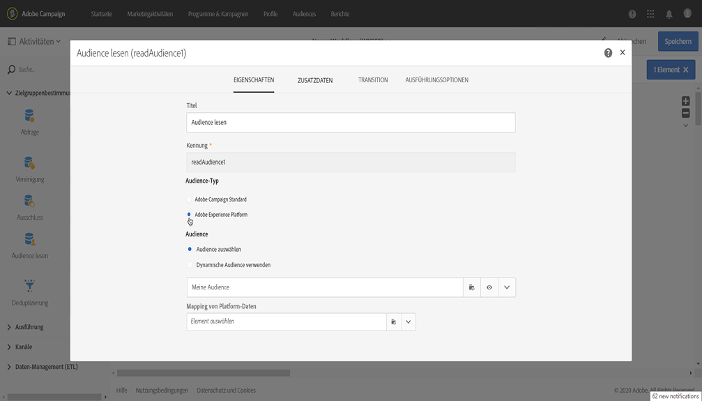
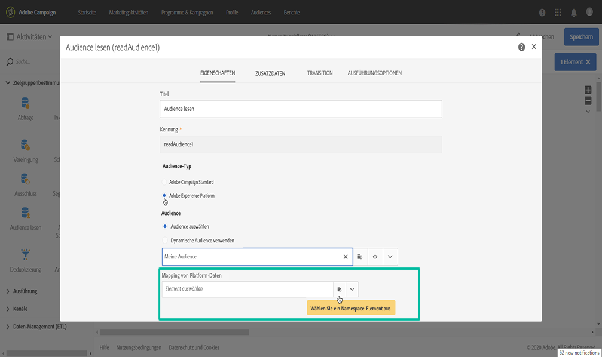
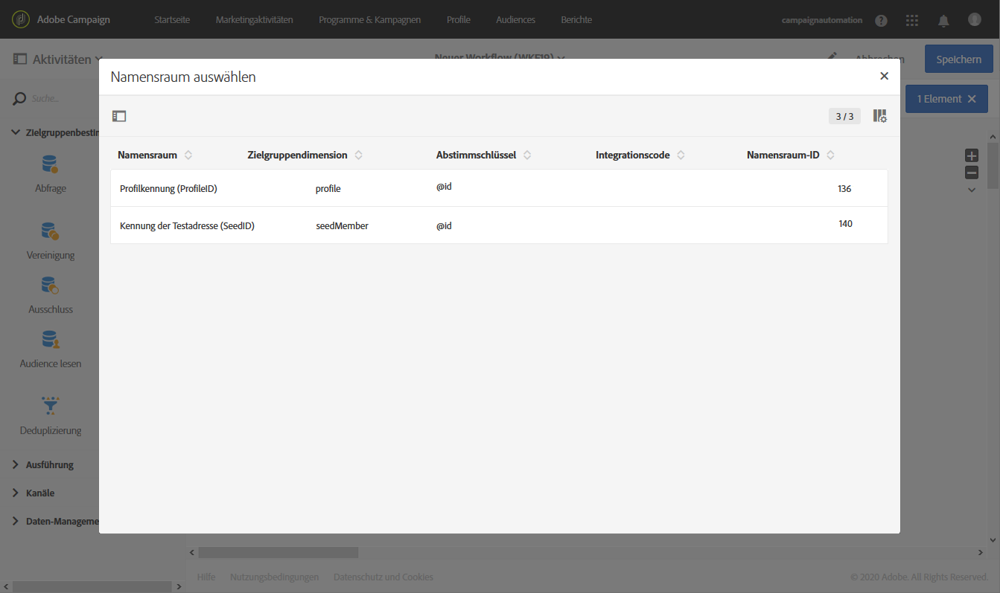
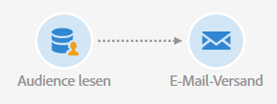

# Targeting von Adobe Experience Platform-Zielgruppen {#targeting-aep-audiences}

>[!IMPORTANT]
>
>Der Zielgruppen-Zieldienst befindet sich derzeit in der Betaphase, die häufig ohne Vorankündigung aktualisiert werden kann. Kunden müssen auf Azurblau gehostet werden (derzeit nur in der Beta-Version für Nordamerika), um auf diese Funktionen zugreifen zu können. Wenden Sie sich an den Adobe-Kundendienst, wenn Sie Zugriff haben möchten.

Nachdem Sie mit dem Segmentaufbau &quot;Einheitliches Profil&quot;eine [Adobe Experience Platform-Zielgruppe](../../audiences/using/aep-about-audience-destinations-service.md) erstellt haben, können Sie diese auf dieselbe Weise wie für eine Kampagnenzielgruppe in Workflows verwenden, um Nachrichten zu personalisieren und zu senden.

Gehen Sie wie folgt vor, um eine Adobe Experience Platform-Zielgruppe in Ihre Arbeitsabläufe zu aktivieren:

1. Fügen Sie dem Workflow eine Aktivität zum **[!UICONTROL Lesen von Zielgruppen]**hinzu und öffnen Sie sie.

1. Wählen Sie die Option **[!UICONTROL Adobe Experience Platform]**unter**[!UICONTROL  Zielgruppentyp]**und fügen Sie dann die gewünschte Zielgruppe hinzu.

   

1. (Optional) Nachdem die Zielgruppe ausgewählt wurde, können Sie auf die Augenschaltfläche klicken, um die Segmentdefinition zu überprüfen und/oder zu bearbeiten (stellen Sie sicher, dass Sie die Änderungen erneut speichern).

   Wenn Sie auf die Augenschaltfläche klicken, gelangen Sie einfach zum Einheitlichen Segmentaufbau (in einer anderen Registerkarte), der der ausgewählten Zielgruppe in der Kampagne zugeordnet ist.

1. Wählen Sie ein **[!UICONTROL Plattformdatenzuordnungselement]**aus, um die gewünschte Targeting-Dimension für die ausgewählte Zielgruppe der Adobe Experience Platform festzulegen.

   Standardmäßig ist der Hauptschlüssel (z. B. iRecipientID für die Profiltabelle, iAppSubscriptionID für die AppSubscription-Tabelle), der für den Abgleich verwendet wird, automatisch in der Dropdownliste verfügbar. Um ein Targeting außerhalb des primären Schlüssels durchzuführen, müssen Sie einen benutzerdefinierten **Namespace** erstellen.

   >[!NOTE]
   >
   >Bei Zielen außerhalb des primären Schlüssels müssen Sie auch eine benutzerdefinierte Zielzuordnung erstellen, die dem benutzerdefinierten Namespace entspricht. For more information on Target Mapping, refer to [this section](../../administration/using/target-mappings-in-campaign.md).

   

   Diese Liste enthält alle Experience Data Model (XDM)-Zuordnungen, die auf Ihrer Instanz konfiguriert wurden. Weitere Informationen zu Adobe Experience Platform Data Connector finden Sie in [diesem Dokument](../../administration/using/aep-about-data-connector.md).

   

1. Nachdem die Zielgruppen- und Targeting-Dimensionen korrekt konfiguriert wurden, klicken Sie auf die Schaltfläche **[!UICONTROL Bestätigen]**, um die Änderungen zu speichern.

Sie können Ihren Workflow jetzt mit anderen Aktivitäten konfigurieren. Sie können beispielsweise eine **[!UICONTROL E-Mail-Zustellungsaktivität]**verknüpfen, um eine E-Mail an die ausgewählte Zielgruppe zu senden.

>[!NOTE]
>
>Mit Campaign Standard können Sie Adobe Experience Platform-Zielgruppen in allen Bereitstellungskanälen auswählen: E-Mails, SMS-Nachrichten, Direktnachrichten, Push-Benachrichtigungen und In-App-Nachrichten.

Weitere Informationen zur Verwendung von Workflows und Auslieferungen finden Sie in den folgenden Abschnitten:

* [Workflows](../../automating/using/discovering-workflows.md)
* [Workflow erstellen](../../automating/using/building-a-workflow.md)
* [Kommunikationskanäle](../../channels/using/discovering-communication-channels.md)
* [Über Kanalaktivitäten](../../automating/using/about-channel-activities.md)
