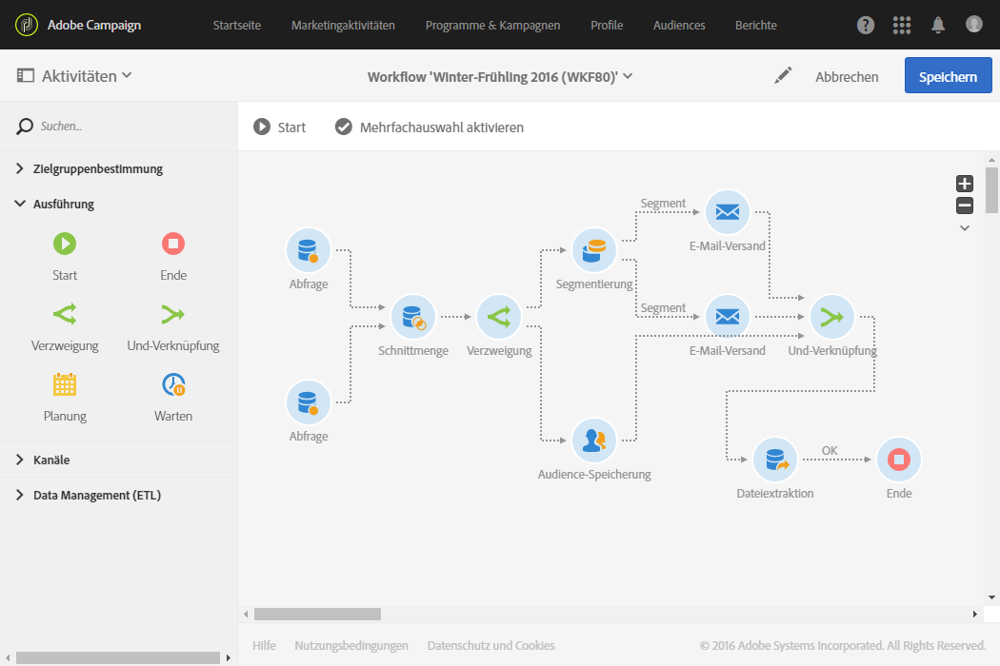

# Und-Verknüpfung{#and-join}

## Beschreibung {#description}

Die **[!UICONTROL Und-Verknüpfung]** ermöglicht es, die Ausführung verschiedener Workflow-Zweige zu synchronisieren.

## Anwendungskontext {#context-of-use}

Bei einer **[!UICONTROL Und-Verknüpfung]** wird die ausgehende Transition erst aktiviert, wenn alle eingehenden Transitionen aktiviert wurden, d. h. wenn alle vorangehenden Aktivitäten beendet sind.

## Konfiguration {#configuration}

1. Ziehen Sie verschiedene Aktivitäten, z. B. Abfragen in den Workflow-Arbeitsbereich, um mindestens zwei Zweige zu bilden.
1. Ziehen Sie eine **[!UICONTROL Und-Verknüpfung]** in den Arbeitsbereich.
1. Schließen Sie die Aktivität an die zwei verschiedenen Zweige an, um diese zu synchronisieren.
1. Markieren Sie die Aktivität und öffnen Sie sie mithilfe der im Schnellzugriff angezeigten Schaltfläche .
1. Wählen Sie die in der ausgehenden Transition beizubehaltende Hauptmenge aus. Wenn keine Hauptmenge angegeben wird, wird die in der ausgehenden Transition übermittelte Population nach dem Zufallsprinzip ermittelt.
1. Validieren Sie die Konfiguration der Aktivität und speichern Sie Ihren Workflow.

## Beispiel {#example}

Das folgende Beispiel zeigt die Ausführung der zwei Zweige eines Workflows, bevor diese in der **[!UICONTROL Und-Verknüpfung]** zusammenfließen. Die Dateiextraktion kann erst erfolgen, wenn die drei in die **[!UICONTROL Und-Verknüpfung]** eingehenden Transitionen aktiviert wurden.

