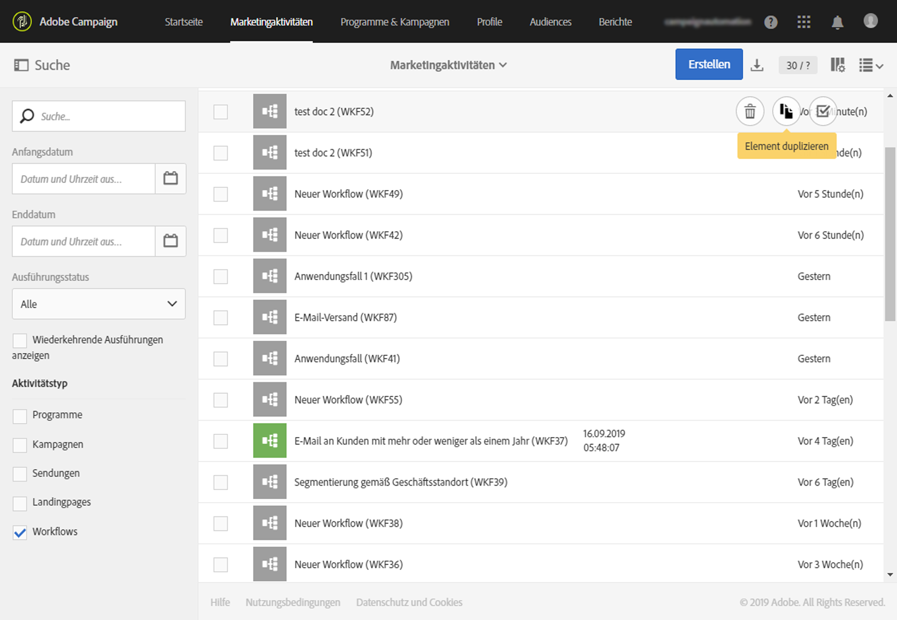
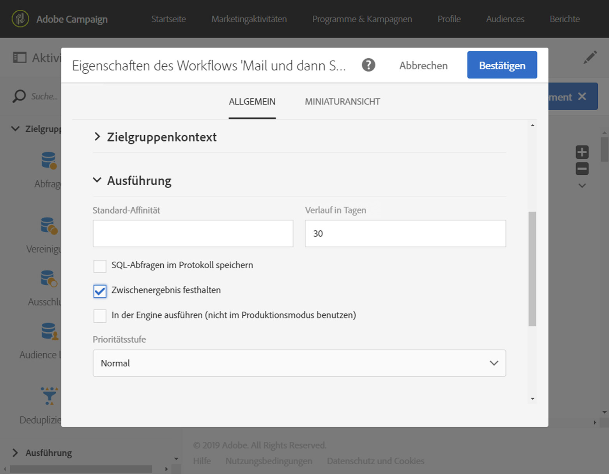
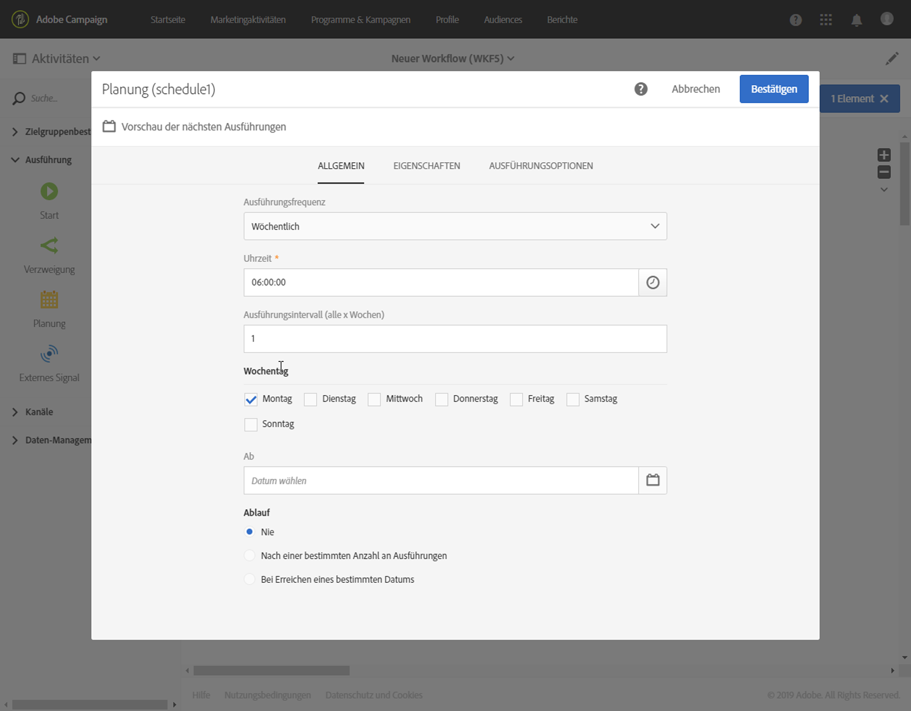

# Best Practices für Workflows{#workflow-best-practices}

Mit Adobe Campaign können Sie zahlreiche Workflows einrichten und damit eine Fülle von Aufgaben ausführen. Doch beim Erstellen und Ausführen von Workflows ist große Vorsicht geboten, da eine nicht ordnungsgemäße Implementierung zu unzureichenden Leistungen, Fehlern und Plattformproblemen führen kann. Unten finden Sie deshalb eine Liste mit Best Practices sowie Tipps zur Fehlerbehebung.

>[!NOTE]
>
>Die Erstellung und Ausführung von Workflows muss durch einen erfahrenen Adobe Campaign-Benutzer erfolgen.

## Benennung{#naming}

Um die Fehlerbehebung bei Workflows zu vereinfachen, empfiehlt Adobe, die Workflows mit Titeln und Namen zu versehen. Beschreiben Sie im entsprechenden Feld des Workflows kurz, woraus der Prozess besteht, damit er für den Benutzer leicht verständlich ist.
Wenn der Workflow Teil eines Prozesses ist, der mehrere Workflows umfasst, können Sie diese der Reihe nach mit Zahlen kennzeichnen.

Beispiel:

* 001 - Importieren - Empfänger importieren
* 002 - Importieren - Verkäufe importieren
* 003 - Importieren - Verkaufsdetails importieren
* 010 - Exportieren - Versandlogs exportieren
* 011 - Exportieren - Trackinglogs exportieren

## Workflows duplizieren{#duplicating-workflows}

Sie können Workflows duplizieren. Bewegen Sie dazu in den **[!UICONTROL Marketingaktivitäten]** den Mauszeiger über den jeweiligen Workflow und wählen Sie **[!UICONTROL Element duplizieren]** aus. Nach dem Duplizieren werden Änderungen des Workflows nicht in die Kopie des Workflows übernommen. Die Kopie des Workflows kann bearbeitet werden.

## Ausführung{#execution}

### Anzahl von Workflows

Standardmäßig wird empfohlen, nicht mehr als 20 Workflows gleichzeitig auszuführen. Nach Erreichen dieses Limits werden Workflows in die Warteschlange gestellt, damit die Gesamtleistung nicht beeinträchtigt wird. Adobe empfiehlt ebenso, die Ausführung von Workflows zeitlich zu verteilen.
In bestimmten Situationen müssen Sie möglicherweise mehr als 20 Workflows ausführen. Dies gilt nicht für Workflows, die auf eine geplante Ausführung warten. Besprechen Sie die Anwendungsfälle bei Bedarf mit einem Campaign-Experten und kontaktieren Sie die Adobe-Kundenunterstützung, um das Limit zu erhöhen.

### Häufigkeit

Ein Workflow kann automatisch maximal alle zehn Minuten ausgeführt werden.
Das Ausführungsintervall der Aktivität kann nicht weniger als 10 Minuten betragen. Wenn das Ausführungsintervall den Standardwert (= 0) aufweist, wird nur die Ausführungsfrequenz berücksichtigt.

### Ausgesetzte Workflows

Workflows, die für mehr als sieben Tage ausgesetzt oder fehlgeschlagen waren, werden gestoppt, um weniger Speicherplatz zu belegen. Die Bereinigungsaufgabe wird in den Workflow-Logs angezeigt.

### Transitionen

Auch mit schwebenden Transitionen kann ein Workflow ausgeführt werden. Bei der Ausführung wird einen Warnhinweis erzeugt und der Workflow wird bei Aktivierung einer derartigen Transition ausgesetzt. Es wird jedoch kein Fehler erzeugt. Auf diese Weise ist es möglich, einen Workflow zu starten, auch wenn seine Konzeption noch nicht vollständig abgeschlossen ist, und ihn nach und nach zu vervollständigen.

Weiterführende Informationen finden Sie im Abschnitt zum [Ausführen von Workflows](../../automating/using/about-workflow-execution.md).

### Zeitzone

Mit den Eigenschaften des Workflows können Sie eine bestimmte Zeitzone definieren, die standardmäßig in allen zugehörigen Aktivitäten verwendet wird. Standardmäßig ist die Zeitzone des Workflows die für den aktuellen Campaign-Benutzer definierte Zeitzone.

## Aktivität{#activity}

### Anzahl der Aktivitäten pro Workflow {#number-activities}

Es wird empfohlen, bis zu 100 Aktivitäten in einem Arbeitsablauf zu verwenden. Über 100 Aktivitäten kann es bei der Entwicklung und Konfiguration des Workflows zu Leistungseinbußen kommen.

### Workflow-Erstellung

Um sicherzustellen, dass der Workflow ordnungsgemäß beendet wird, sollten Sie die letzte Transition eines Workflows nicht allein mit einer **[!UICONTROL End-Aktivität]** belassen.

Um zur Detailansicht der Transitionen zu gelangen, aktivieren Sie im Abschnitt zur Ausführung der Workflow-Eigenschaften die Option **[!UICONTROL Zwischenergebnis festhalten]**.

>[!CAUTION]
>
>Diese Option belegt viel Speicherplatz. Sie hilft Ihnen aber bei der Erstellung eines Workflows, dessen Konfiguration und Verhalten fehlerfrei sind. Aktivieren Sie sie nicht bei Produktionsinstanzen.

### Aktivitäten benennen{#activity-labeling}

Bei der Erstellung eines Workflows wird für jede Aktivität ein Name generiert ebenso wie für alle Adobe Campaign-Objekte. Während der Name einer Aktivität durch das Tool erzeugt wird und nicht bearbeitet werden kann, ist es empfehlenswert, die Aktivität bei deren Konfiguration mit einem speziellen Namen zu versehen.

### Aktivitäten duplizieren{#activity-duplicating}

Zum Duplizieren vorhandener Aktivitäten können Sie Copy &amp; Paste verwenden. Dadurch bleiben die ursprünglich definierten Einstellungen unverändert. Weiterführende Informationen dazu finden Sie im Abschnitt zum [Duplizieren von Workflow-Aktivitäten](../../automating/using/workflow-interface.md).

### Aktivität &quot;Planung&quot;{#acheduler-activity}

Pro Workflow-Verzweigung darf nur eine einzige **[!UICONTROL Planungsaktivität]** verwendet werden. Wenn dieselbe Verzweigung eines Workflows mehrere Planungen enthält, die miteinander verknüpft sind, steigt die Anzahl der auszuführenden Aufgaben exponentiell an, wodurch die Datenbank überlastet würde.

Sie können die jeweils nächsten zehn Ausführungen Ihrer Workflows in der Vorschau anzeigen, indem Sie **[!UICONTROL Vorschau der nächsten Ausführungen]** auswählen.

Weiterführende Informationen dazu finden Sie in der [Planungsaktivität](../../automating/using/scheduler.md).

## Workflow mit Parametern abrufen{#workflow-with-parameters}

Stellen Sie sicher, dass Name und Anzahl der Parameter identisch mit denen sind, die beim Aufrufen des Workflows definiert wurden (siehe . Darüber hinaus müssen die Parametertypen den erwarteten Werten entsprechen.

Stellen Sie sicher, dass alle Parameter in der Aktivität **[!UICONTROL Externes Signal]** deklariert wurden. Andernfalls tritt ein Fehler beim Ausführen der Aktivität auf.

Weiterführende Informationen dazu finden Sie unter [Workflow mit externen Parametern aufrufen](../../automating/using/calling-a-workflow-with-external-parameters.md).

## Packages exportieren{#exporting-packages}

Um Packages zu exportieren, dürfen die exportierten Ressourcen keine Standardkennungen enthalten. Deshalb ist es notwendig, die Kennungen exportierbarer Ressourcen so abzuändern, dass sie sich von den automatisch vergebenen Kennungen in Adobe Campaign Standard unterscheiden. Weiterführende Informationen dazu finden Sie unter [Package-Verwaltung](../../automating/using/managing-packages.md).

## Listenexport{#exporting-lists}

Die Exportlisten-Option erlaubt standardmäßig den Export von maximal 100.000 Zeilen, die durch die Option **Nms_ExportListLimit definiert wurden**. Diese Option kann vom funktionalen Administrator im Menü **[!UICONTROL Administration]** > **[!UICONTROL Anwendungskonfiguration]** > **[!UICONTROL Optionen]** verwaltet werden.
Weiterführende Informationen dazu finden Sie unter [Listenexport](../../automating/using/exporting-lists.md).

## Problembehebung{#workflow-troubleshooting}

Adobe Campaign verfügt über unterschiedliche Protokolle, mit deren Hilfe Sie Workflow-Probleme lösen können.

### Workflow-Logs{#using-workflow-logs}

Mithilfe von Workflow-Logs können Sie die Ausführung Ihrer Aktivitäten überwachen. Er zeigt in chronologischer Abfolge alle Vorgänge und Ausführungsfehler. Im Protokoll-Tab finden Sie frühere (ausgewählte) Aktivitäten.
Der Aufgaben-Tab zeigt die Ausführungsabfolge der Aktivitäten. Um mehr Informationen über eine Aktivität zu erhalten, wählen Sie eine Aufgabe aus.
Weiterführende Informationen dazu finden Sie unter [Workflow-Ausführung überwachen](../../automating/using/monitoring-workflow-execution.md).

#### Fehlerbehebung bei Datenverwaltungsaktivitäten{#troubleshooting-data-management-activities}

Sie können SQL-Anfragen im Protokoll-Tab analysieren.

1. Wählen Sie im Workflow-Arbeitsbereich **[!UICONTROL Eigenschaften bearbeiten]** aus.
1. Aktivieren Sie unter **[!UICONTROL Allgemein]** > **[!UICONTROL Ausführung]** die Optionen **[!UICONTROL SQL-Abfragen im Protokoll speichern]** und **[!UICONTROL In der Engine ausführen]** und wählen Sie **[!UICONTROL Bestätigen]** aus.

**So können Sie sich SQL-Abfragen im Protokoll ansehen:**
1. Wählen Sie **[!UICONTROL Protokoll und Aufgaben]** aus.
1. Öffnen Sie im Tab **[!UICONTROL Logs]** das Fenster **[!UICONTROL Suche]**.
1. Aktivieren Sie die Option **[!UICONTROL Nur SQL-Protokolle anzeigen]**.

Die Abfrage wird in der Spalte **[!UICONTROL Nachricht]** der Protokolle angezeigt.

### Versandlogs{#using-delivery-logs}

Mit Versandlogs können Sie feststellen, wie erfolgreich Ihre Sendungen sind. Ausschlusslogs enthalten während der Vorbereitung des Versands ausgeschlossene Nachrichten. Versandlogs beinhalten außerdem für jedes Profil den Versandstatus.
Weiterführende Informationen dazu finden Sie unter [Ursachen von fehlgeschlagenen Sendungen](../../sending/using/understanding-delivery-failures.md).

### Versandwarnung verwenden{#delivery-alerting}

Bei der Funktion Versandwarnungen handelt es sich um ein Warnungsmanagementsystem, über das eine Benutzergruppe automatisch Benachrichtigungen zu ihren Sendungen erhält.
Weiterführende Informationen dazu finden Sie unter [Versandwarnung](../../sending/using/receiving-alerts-when-failures-happen.md).

**Verwandte Themen:**

* [Umgang mit Fehlern](../../automating/using/monitoring-workflow-execution.md)
