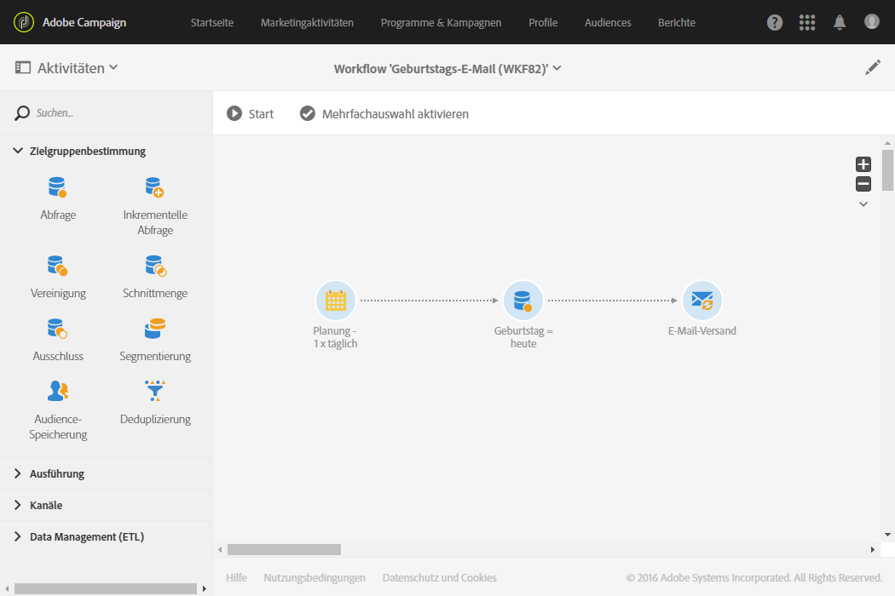
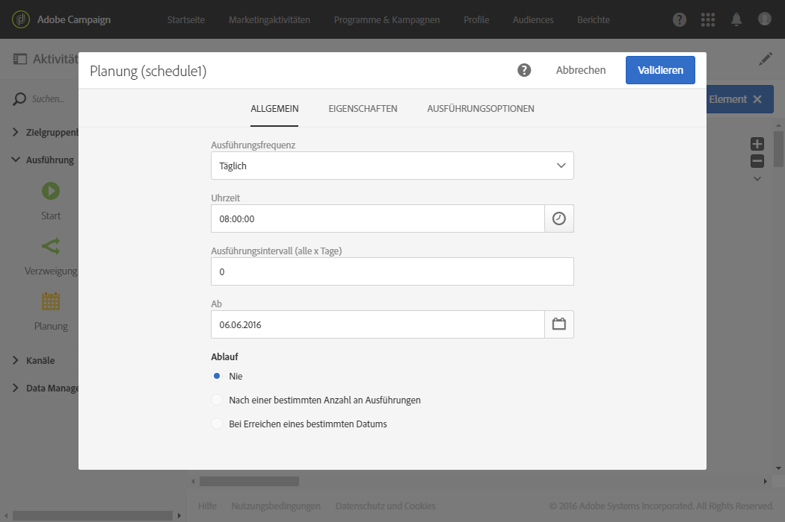
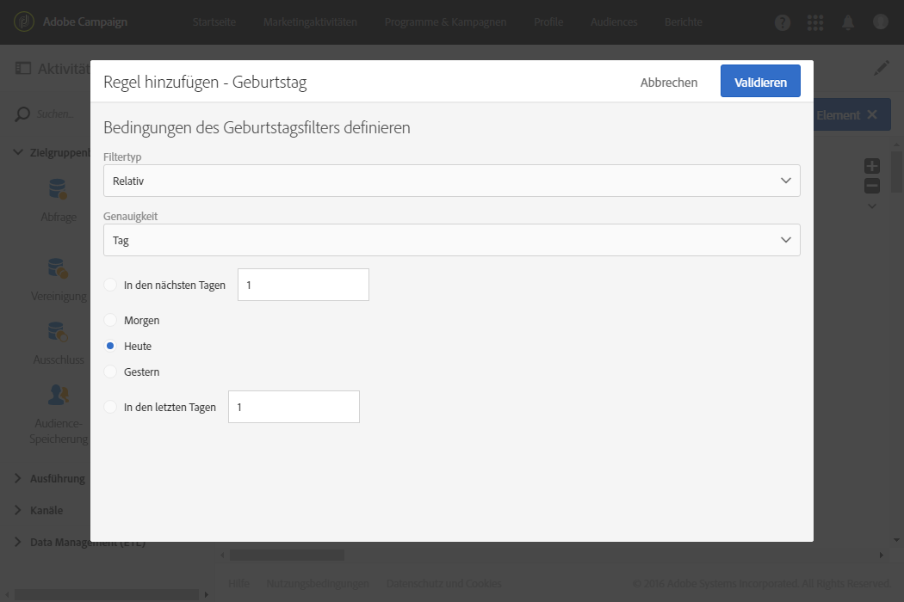
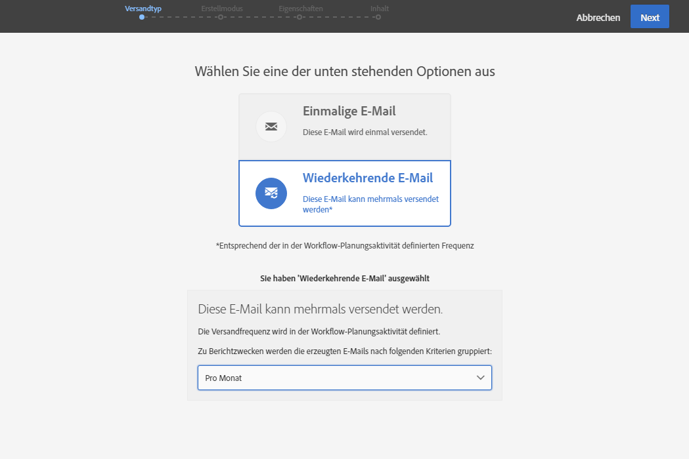

# Versand zum Geburtstag {#birthday-delivery}

Das folgende Beispiel zeigt einen Geburtstags-Workflow. Jeden Tag wird eine E-Mail an alle Profile gesendet, die Geburtstag haben.

Gehen Sie wie folgt vor, um den Workflow zu erstellen:

* Eine [Planung](../../automating/using/scheduler.md) startet den Workflow täglich um 8 Uhr.

  

* Die auf die Planung folgende [Abfrage](../../automating/using/query.md) ruft alle Profile aus der Datenbank ab, die am aktuellen Datum Geburtstag haben und deren E-Mail-Adresse bekannt ist. Der Geburtstagsfilter ist standardmäßig im Abfragetool enthalten.

  

* Der [E-Mail-Versand](../../automating/using/email-delivery.md) ist wiederkehrend. die Sendungen werden pro Monat aggregiert. Auf diese Weise sind alle innerhalb eines Monats gesendeten E-Mails in einer einzigen Ansicht enthalten. Innerhalb eines Jahres werden folglich 365 Sendungen ausgeführt, die jedoch innerhalb der Adobe-Campaign-Benutzeroberfläche in nur 12 Ansichten (auch **wiederkehrende Ausführungen** genannt) zusammengefasst werden. Der Verlauf und die Berichte zeigen monatliche Zusammenfassungen und nicht jeden einzelnen Versand.

  
