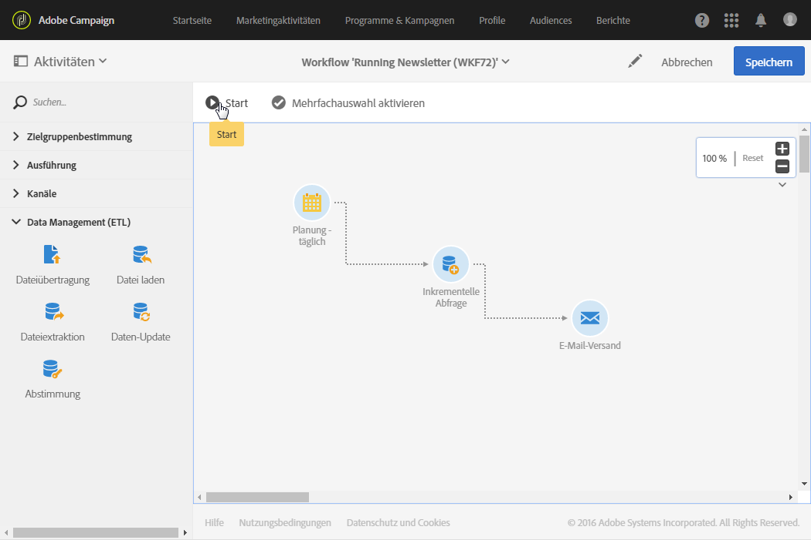
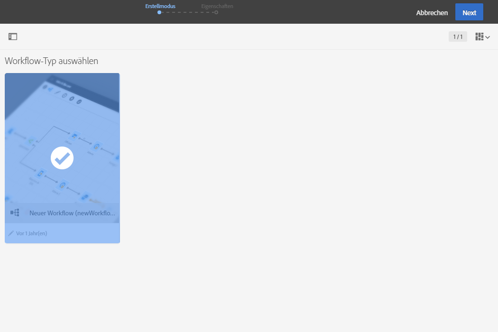
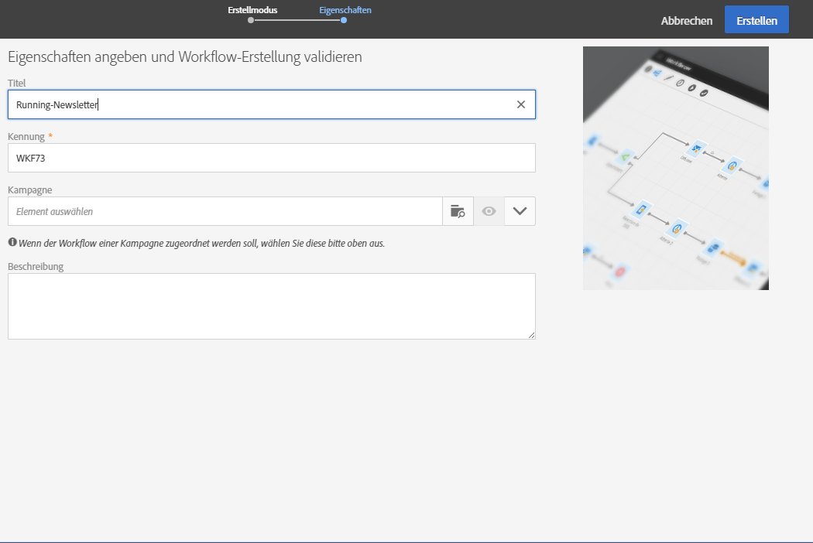
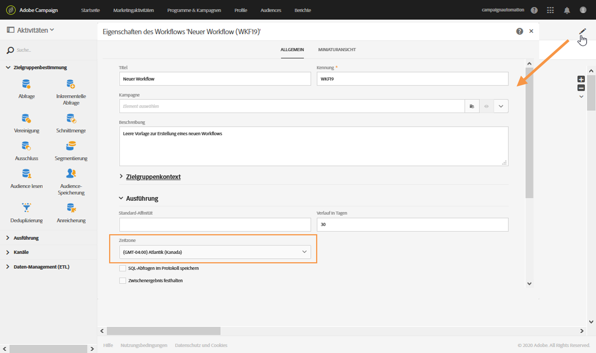

# Workflow erstellen{#building-a-workflow}

In diesem Abschnitt erfahren Sie die wichtigsten Schritte und Best Practices bei der Erstellung eines neuen Workflows.

## Funktionsweise von Workflows{#workflow-operating-principles}

Ein Workflow besteht aus einer **Abfolge konfigurierbarer Aktivitäten**. Jeder Aktivität kommt im Rahmen des Prozesses eine spezifische Rolle zu. Das Ergebnis der Aktivitäten wird über eine durch einen Pfeil symbolisierte **Transition** an die anschließende Aktivität übermittelt.

Die Art der von einer Aktivität zur nächsten übermittelten Daten kann die Konfiguration der Folgeaktivitäten beeinflussen. Wenn beispielsweise ein E-Mail-Versand auf eine Zielbestimmungsaktivität folgt, kann die in letzterer ermittelte Population als Zielgruppe für den Versand verwendet werden.

Sie können Aktivitäten vor oder nach der Ausführung des Workflows öffnen, um Parameter zu überprüfen oder abzuändern.

Sie können Transitionen vor oder nach der Ausführung des Workflows öffnen, um zu überprüfen, ob die übermittelten Daten korrekt sind. Um zur Detailansicht der Transitionen zu gelangen, müssen Sie die Option **[!UICONTROL Zwischenergebnis festhalten]** im Abschnitt **[!UICONTROL Ausführung]** der Workflow-Eigenschaften ankreuzen.

>[!CAUTION]
>
>Diese Option belegt viel Speicherplatz. Sie hilft Ihnen aber bei der Erstellung eines Workflows, dessen Konfiguration und Verhalten fehlerfrei sind. Aktivieren Sie sie nicht bei Produktionsinstanzen.

## Workflow erstellen      {#creating-a-workflow}

Die Erstellung von Workflows erfolgt im Rahmen von Programmen oder Kampagnen oder in der Marketingaktivitätenliste.

 [Erfahren Sie im Video, wie man einen Workflow erstellt](#video)

Lesen Sie diesbezüglich auch den Abschnitt [Marketingaktivitäten erstellen](../../start/using/marketing-activities.md#creating-a-marketing-activity).

1. Im Rahmen der Workflow-Erstellung ist zunächst die Workflow-Vorlage auszuwählen, die Sie verwenden möchten.

   

   >[!NOTE]
   >
   >Für jede Aktivität werden mehrere Standardtypen angeboten. Diese erlauben es, je nach Bedarf gewisse Parameter im Voraus zu konfigurieren. Weiterführende Informationen finden Sie im Abschnitt [Marketingaktivitäten-Vorlagen](../../start/using/marketing-activity-templates.md).

1. Konfigurieren Sie die allgemeinen Workflow-Eigenschaften.

   

   Benennen Sie den Workflow im Feld **Titel** und passen Sie gegebenenfalls die Kennung an. Titel und Kennung der Aktivität erscheinen in der Benutzeroberfläche, sind jedoch für die Nachrichtenempfänger nicht sichtbar.

   >[!NOTE]
   >
   >Wenn Sie einen Workflow von der Marketingaktivitätenliste ausgehend erstellen, können Sie ihn einer bereits existierenden übergeordneten Kampagne zuordnen. Fügen Sie bei Bedarf eine Beschreibung hinzu.

   Fügen Sie bei Bedarf eine Beschreibung hinzu. Diese ist im Kampagneninhalt sichtbar.

   Um die Suche und Fehlerbehebung zu vereinfachen, empfiehlt Adobe, Ihre Workflows mit eigenen Namen und Titeln zu versehen: Erläutern Sie im Beschreibungsfeld des Workflows kurz den jeweiligen Prozess, damit dessen Zweck für den Benutzer leicht ersichtlich ist.

1. Nach Bestätigung der Aktivitätserstellung werden Sie zum entsprechenden Dashboard weitergeleitet. Lesen Sie diesbezüglich auch den Abschnitt [Workflow-Oberfläche](../../automating/using/workflow-interface.md).

1. Sobald der Workflow zur Konfiguration bereit ist, können Sie über die Schaltfläche **[!UICONTROL Eigenschaften bearbeiten]** auf weitere Optionen zugreifen.

   Sie können beispielsweise eine bestimmte Zeitzone definieren, die standardmäßig in allen Aktivitäten des Workflows verwendet werden soll. Standardmäßig ist die Zeitzone des Workflows die für den aktuellen Campaign-Benutzer definierte Zeitzone.

   Weitere Informationen zu Workflow-Eigenschaften finden Sie auf [dieser Seite](../../automating/using/managing-execution-options.md).

   

## Aktivitäten hinzufügen und verbinden {#adding-and-linking-activities}

Definieren Sie jetzt die verschiedenen Aktivitäten und verbinden Sie sie in einem Diagramm.

>[!NOTE]
>
>Sollte die Palette nicht angezeigt werden, können Sie sie durch Auswahl der ersten Schaltfläche links in der Symbolleiste einblenden.

In den einzelnen Bereichen der Palette werden die Aktivitäten nach Kategorie geordnet angezeigt.

* Der erste Bereich enthält [Zielgruppenbestimmungsaktivitäten](../../automating/using/about-targeting-activities.md).
* Der zweite Bereich enthält die [Steuerungsaktivitäten](../../automating/using/about-execution-activities.md), die in erster Linie der Koordination der anderen Aktivitäten dienen.
* Der dritte Bereich enthält Aktivitäten, mit denen Nachrichten auf unterschiedlichen [Kanälen](../../automating/using/about-channel-activities.md) gesendet werden können. Aktivitäten in diesem Bereich können abhängig von den in Ihrer Instanz aktivierten Kanälen variieren.
* Der vierte Bereich enthält [Dateibearbeitungs- und -verwaltungsaktivitäten](../../automating/using/about-data-management-activities.md).

So erstellen Sie das Diagramm:

1. Fügen Sie eine Aktivität hinzu, indem Sie sie aus der Palette in das Diagramm ziehen und dort ablegen.

   Beispielsweise können Sie zuerst einen **[Beginn](../../automating/using/start-and-end.md)** und anschließend einen **[E-Mail-Versand](../../automating/using/email-delivery.md)** in das Diagramm ziehen.

1. Verbinden Sie die beiden Aktivitäten, indem Sie die Transition des **Beginns** über den **E-Mail-Versand** ziehen und ablegen.

   >[!NOTE]
   >
   >Zwei Aktivitäten werden automatisch miteinander verbunden, wenn Sie die zweite Aktivität direkt am Ende der Transition der ersten Aktivität platzieren.

1. Fügen Sie weitere benötigte Aktivitäten hinzu und verbinden Sie sie, um den Workflow abzuschließen.

   >[!NOTE]
   >
   >Sie können auch vorhandene Aktivitäten mit Copy &amp; Paste duplizieren. Dadurch bleiben die ursprünglich definierten Einstellungen unverändert. Weiterführende Informationen dazu finden Sie im Abschnitt zum [Duplizieren von Workflow-Aktivitäten](../../automating/using/workflow-interface.md#duplicating-workflow-activities).

Nach der Verknüpfung Ihrer Workflow-Aktivitäten können Sie die Transitionen zwischen ihnen mit dem **Titel** Ihrer Wahl personalisieren. Doppelklicken Sie dazu auf die Transition, um auf ihre Eigenschaften zuzugreifen.

Darüber hinaus können Sie mit den Aktivitäten **[!UICONTROL Targeting]** und **[!UICONTROL Daten-Management (ETL)]** **Segmentcodes** für die ausgehenden Transitionen definieren. Anschließend können Sie auf diesen Segmentcodes basierende Berichte erstellen, um die Effizienz Ihrer Marketingkampagnen zu messen. Weiterführende Informationen hierzu finden Sie in [diesem Abschnitt](../../reporting/using/creating-a-report-workflow-segment.md).

**Anwendungsfälle für Workflows:**

* [Anwendungsfall: Erstellung eines einmaligen E-Mail-Versands pro Woche](../../automating/using/workflow-weekly-offer.md)
* [Anwendungsfall: Erstellung eines Standort-segmentierten Versands](../../automating/using/workflow-segmentation-location.md)
* [Anwendungsfall: Erstellen von Sendungen mit einem Komplement](../../automating/using/workflow-created-query-with-complement.md)
* [Anwendungsfall: Retargeting-Workflow für einen erneuten Versand an Nicht-Öffner](../../automating/using/workflow-cross-channel-retargeting.md)

## Aktivitäten konfigurieren {#configuring-activities}

Die Aktivitäten sind nicht standardmäßig konfiguriert und verarbeiten die Daten nur korrekt, wenn sie konfiguriert werden. Jede Aktivität enthält mehrere Tabs zur Verwaltung mehrerer Konfigurationen und aktivitätsspezifischer Optionen, wie zum Beispiel ausgehender Transitionen, Titel usw.

1. Vergewissern Sie sich, dass alle Aktivitäten korrekt miteinander verbunden sind. Manche Aktivitäten zeigen nur dann die korrekten Konfigurationsoptionen an, wenn sie die Struktur oder Art der eingehenden Daten erkennen.
1. Wählen Sie eine Aktivität per Doppelklick aus oder selektieren Sie sie und wählen Sie dann **[!UICONTROL Bearbeiten]** aus, um das entsprechende Konfigurationsfenster zu öffnen.
1. Bearbeiten Sie den Titel der Aktivität.
1. Definieren Sie alle Optionen, die Sie zur Verarbeitung der Daten benötigen. Die möglichen Optionen für jede Aktivität erfahren Sie im jeweiligen Abschnitt dieser Dokumentation.
1. Speichern Sie die Aktivität und wiederholen Sie das Verfahren für jede Aktivität im Workflow.
1. Speichern Sie den Workflow.

## Tutorial {#video}

In diesem Video wird gezeigt, wie man einen Workflow erstellt.

>[!VIDEO](https://video.tv.adobe.com/v/23937?quality=12)

Weitere Anleitungsvideos zu Campaign Standard finden Sie [hier](https://experienceleague.adobe.com/docs/campaign-standard-learn/tutorials/overview.html?lang=de).
