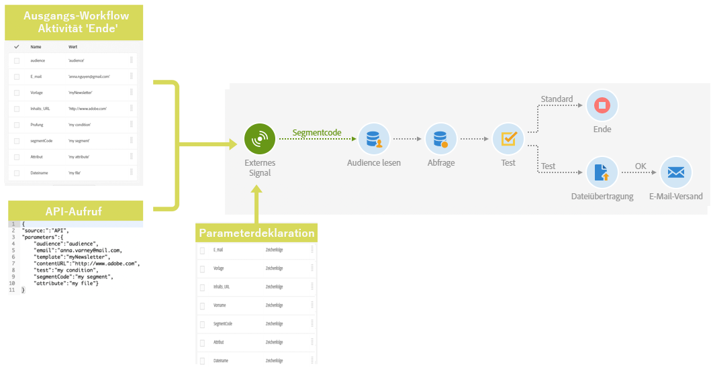

# Übersicht {#calling-a-workflow-with-external-parameters}

Campaign Standard ermöglicht Ihnen, einen Workflow unter Verwendung von Parametern aufzurufen (mit dem Namen einer Audience oder einer zu importierenden Datei, mit einem Teil eines Nachrichteninhalts etc.). Auf diese Weise lassen sich Ihre automatisch durchgeführten Campaign-Prozesse einfach mit einem externen Datensystem integrieren.

Sehen wir uns folgendes Beispiel an, in dem E-Mails direkt von einem CMS gesendet werden sollen. Sie können für dieses Beispiel Ihr System so konfigurieren, dass die Audience ausgewählt und der E-Mail-Inhalt in das CMS importiert wird. Durch Anklicken von &quot;Senden&quot; wird ein Campaign-Workflow mit diesen Parametern aufgerufen. Dies ermöglicht Ihnen, diese Parameter im Workflow für die Definition der Audience und des URL-Inhalts für den Versand zu verwenden.

Workflows werden mit Parametern folgendermaßen aufgerufen:

1. Deklarieren Sie die Parameter in der Aktivität **[!UICONTROL Externes Signal]**. Siehe [Parameter in der externen Signalaktivität deklarieren](../../automating/using/declaring-parameters-external-signal.md).
1. Konfigurieren Sie die Aktivität **[!UICONTROL Ende]** oder den API-Aufruf, um die Parameter zu definieren und den Workflow für die Aktivität **[!UICONTROL Externes Signal]** auszulösen. Siehe [diese Seite](../../automating/using/defining-parameters-calling-workflow.md)
1. Nachdem der Workflow ausgelöst wurde, werden die Parameter in die Ereignisvariablen des Workflows aufgenommen und können im Workflow verwendet werden. Weiterführende Informationen finden Sie auf [dieser Seite](../../automating/using/customizing-workflow-external-parameters.md).

