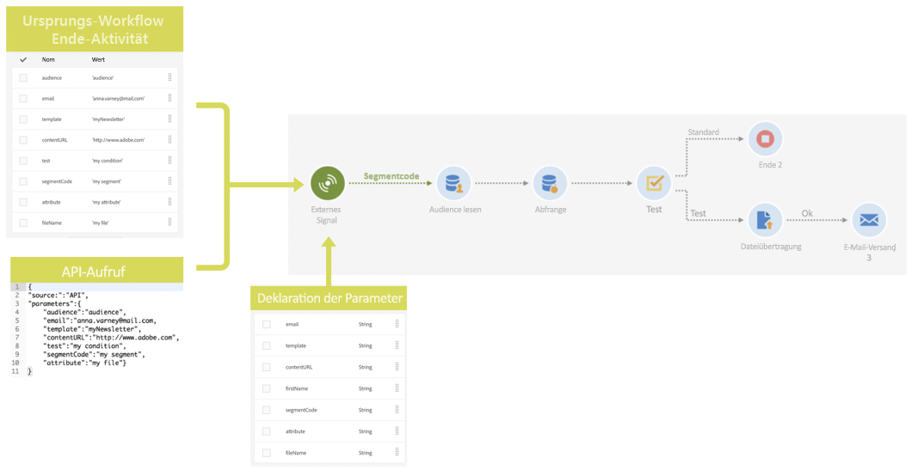
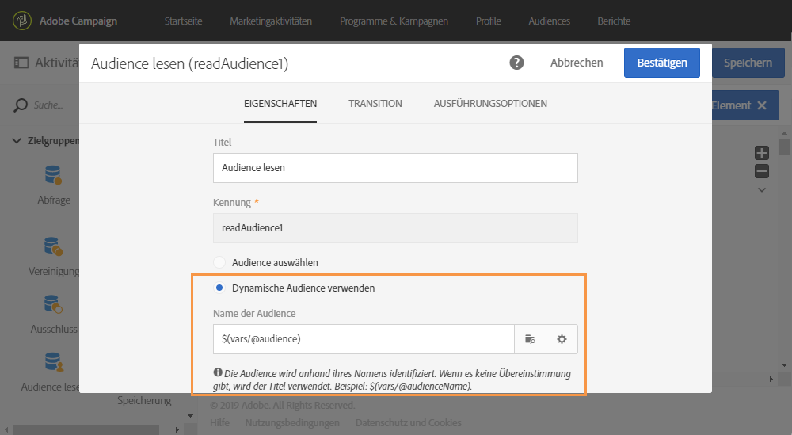
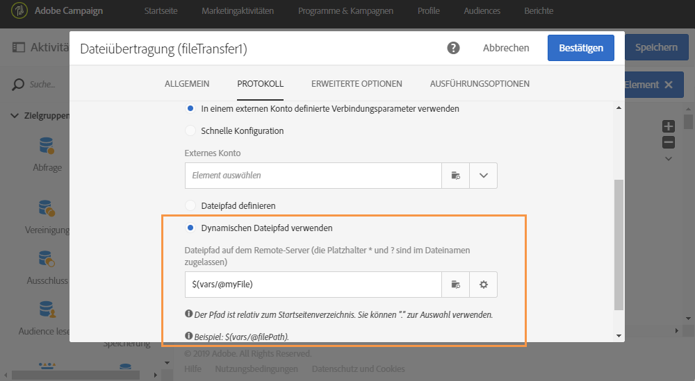
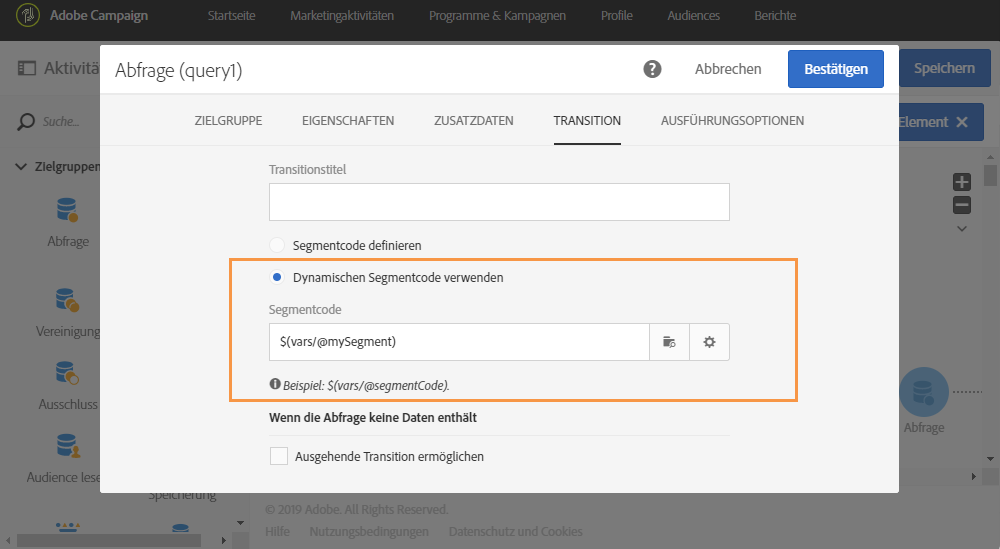
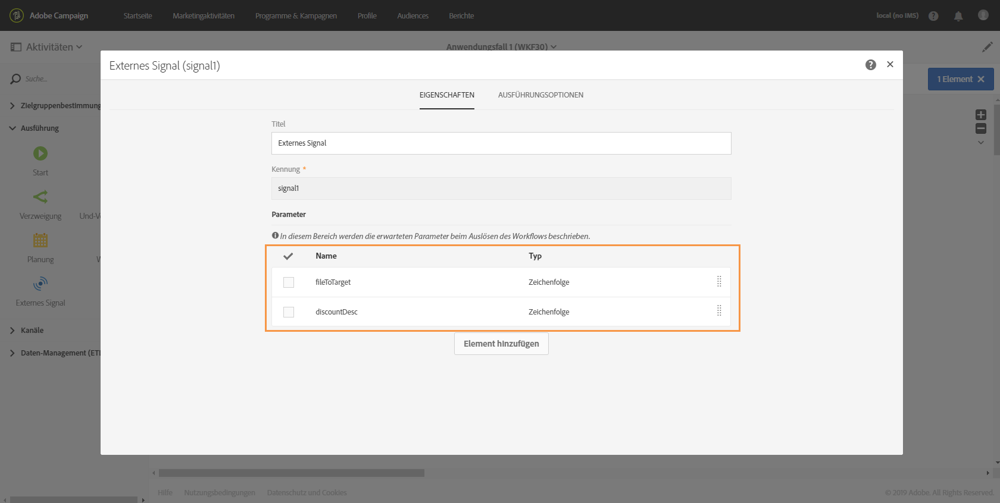
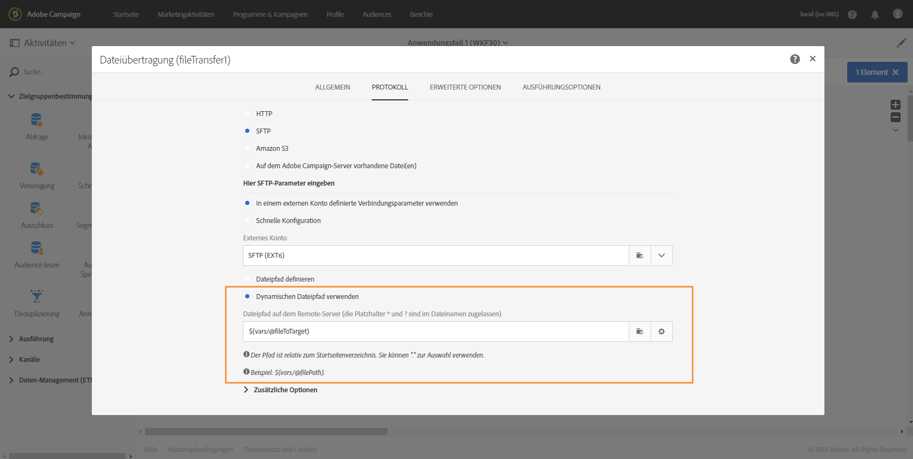
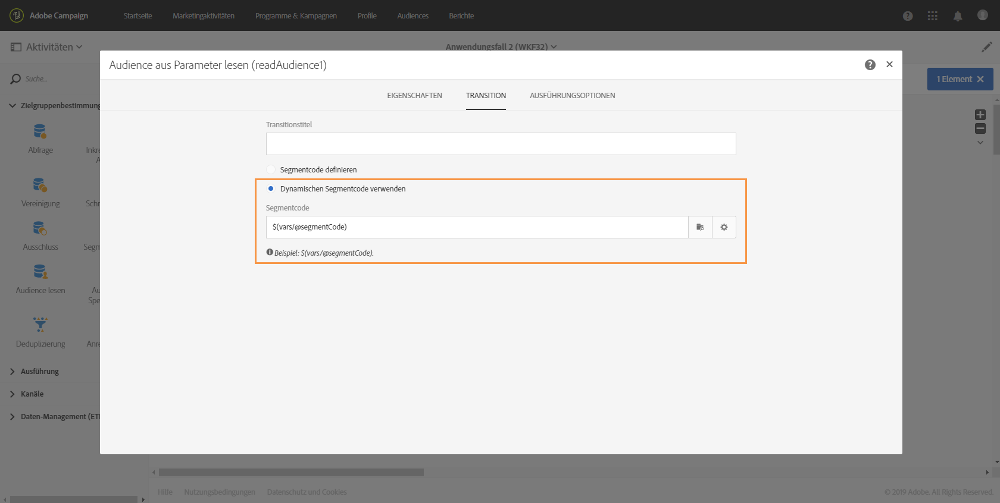
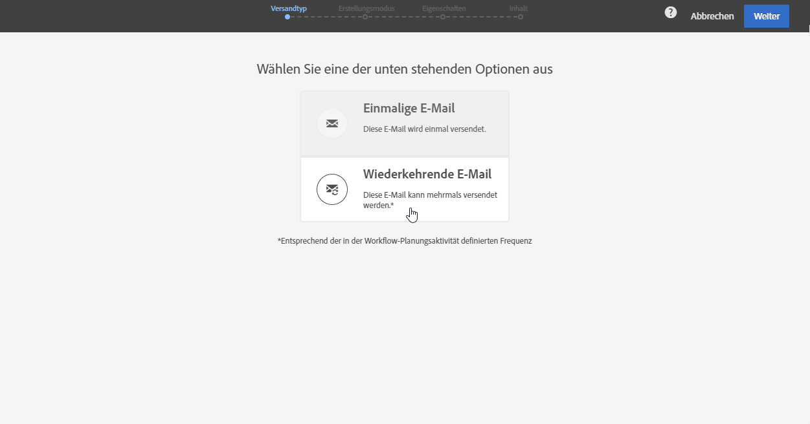
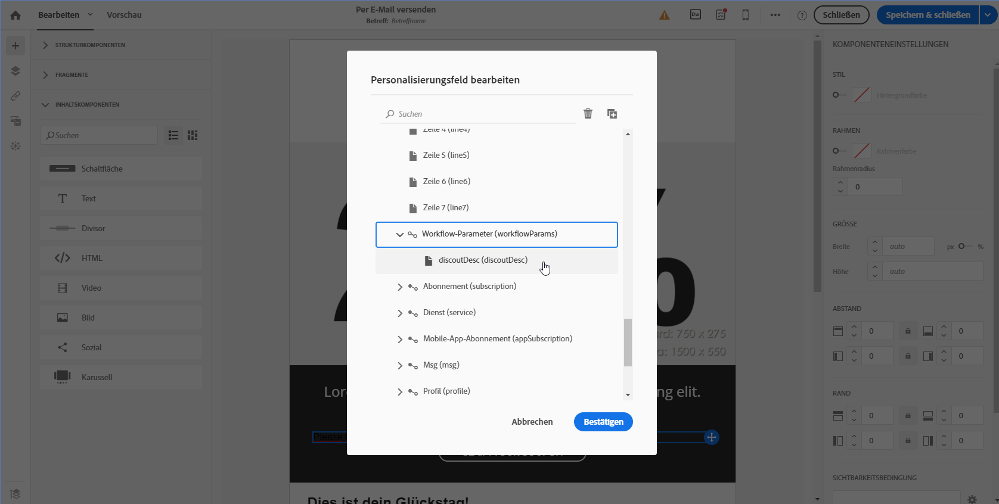

# Workflow mit externen Parametern aufrufen{#calling-a-workflow-with-external-parameters}

Campaign Standard ermöglicht Ihnen, einen Workflow unter Verwendung von Parametern aufzurufen (mit dem Namen einer Audience oder einer zu importierenden Datei, mit einem Teil eines Nachrichteninhalts etc.). Auf diese Weise lassen sich Ihre automatisch durchgeführten Campaign-Prozesse einfach mit einem externen Datensystem integrieren.

Sehen wir uns folgendes Beispiel an, in dem E-Mails direkt von einem CMS gesendet werden sollen. Sie können für dieses Beispiel Ihr System so konfigurieren, dass die Audience ausgewählt und der E-Mail-Inhalt in das CMS importiert wird. Durch Anklicken von &quot;Senden&quot; wird ein Campaign-Workflow mit diesen Parametern aufgerufen. Dies ermöglicht Ihnen, diese Parameter im Workflow für die Definition der Audience und des URL-Inhalts für den Versand zu verwenden.

Workflows werden mit Parametern folgendermaßen aufgerufen:

1. Deklarieren Sie die Parameter in der **[!UICONTROL External signal]** Aktivität. Siehe [Parameter in der externen Signalaktivität deklarieren](../../automating/using/calling-a-workflow-with-external-parameters.md#declaring-the-parameters-in-the-external-signal-activity).
1. Configure the **[!UICONTROL End]** activity or the API call to define the parameters and trigger the workflow **[!UICONTROL External signal]** activity.

Nachdem der Workflow ausgelöst wurde, werden die Parameter in die Ereignisvariablen des Workflows aufgenommen und können im Workflow verwendet werden. Siehe [Workflow mit externen Parametern anpassen](../../automating/using/calling-a-workflow-with-external-parameters.md#customizing-a-workflow-with-external-parameters).



## Parameter in der Aktivität &quot;Externes Signal&quot; deklarieren  {#declaring-the-parameters-in-the-external-signal-activity}

The first step to call a workflow with parameters is to declare them in an **[!UICONTROL External signal]** activity.

1. Öffnen Sie die **[!UICONTROL External signal]** Aktivität und wählen Sie die **[!UICONTROL Parameters]** Registerkarte aus.
1. Click the **[!UICONTROL Create element]** button, then specify the name and type of each parameter.

   >[!CAUTION]
   >
   >Achten Sie darauf, dass der Name und die Anzahl der Parameter mit den beim Aufruf des Workflows definierten übereinstimmen (siehe [Parameter beim Aufruf des Workflows definieren](../../automating/using/calling-a-workflow-with-external-parameters.md#defining-the-parameters-when-calling-the-workflow)). Darüber hinaus müssen die Parametertypen den erwarteten Werten entsprechen.

   

1. Schließen Sie nach der Deklaration der Parameter die Konfiguration des Workflows ab und führen Sie ihn aus.

## Parameter beim Aufruf des Workflows definieren  {#defining-the-parameters-when-calling-the-workflow}

In diesem Abschnitt wird beschrieben, wie Sie Parameter beim Aufruf eines Workflows definieren können. Weiterführende Informationen zur Durchführung dieses Vorgang mit einem API-Aufruf finden Sie in der [REST-APIs-Dokumentation](../../api/using/triggering-a-signal-activity.md).

Vor der Definition der Parameter müssen folgende Voraussetzungen gegeben sein:

* The parameters have been declared in the **[!UICONTROL External Signal]** activity. Siehe [Parameter in der externen Signalaktivität deklarieren](../../automating/using/calling-a-workflow-with-external-parameters.md#declaring-the-parameters-in-the-external-signal-activity).
* Der Workflow, der die Signalaktivität enthält, wird ausgeführt.

To configure the **[!UICONTROL End]** activity, follow the steps below:

1. Öffnen Sie die **[!UICONTROL End]** Aktivität und wählen Sie die **[!UICONTROL External signal]** Registerkarte aus.
1. Wählen Sie den Workflow und die Aktivität &quot;Externes Signal&quot; aus, die aufgerufen werden sollen.
1. Click the **[!UICONTROL Create element]** button to add a parameter, then fill in its name and value.

   * **[!UICONTROL Name]**: den Namen, der in der **[!UICONTROL External signal]** Aktivität deklariert wurde (siehe [Deklarieren der Parameter in der Aktivität](../../automating/using/calling-a-workflow-with-external-parameters.md#declaring-the-parameters-in-the-external-signal-activity)&quot;Externes Signal&quot;).
   * **[!UICONTROL Value]**: den Wert, den Sie dem Parameter zuweisen möchten. Der Wert sollte der **Standardsyntax** entsprechen, die in [diesem Abschnitt](../../automating/using/advanced-expression-editing.md#standard-syntax) beschrieben wird.
   

   >[!CAUTION]
   >
   >Make sure that all the parameters have been declared in the **[!UICONTROL External signal]** activity. Andernfalls tritt ein Fehler beim Ausführen der Aktivität auf.

1. Bestätigen Sie nach der Definition der Parameter die Aktivität und speichern Sie Ihren Workflow.

## Ereignisvariablen überwachen  {#monitoring-the-events-variables}

Es ist möglich, die im Workflow verfügbaren Ereignisvariablen zu überwachen, einschließlich der deklarierten externen Parameter. Gehen Sie dazu wie folgt vor:

1. Wählen Sie die Aktivität aus, die auf die **[!UICONTROL External signal]** Aktivität folgt, und klicken Sie dann auf die **[!UICONTROL Log and tasks]** Schaltfläche.
1. In the **[!UICONTROL Tasks]** tab, click  button.

   

1. Im Ausführungskontext der Aufgabe werden jetzt ID, Status, Dauer etc. angezeigt, einschließlich aller Ereignisvariablen, die im Workflow zur Verfügung stehen.

   

## Workflow mit externen Parametern anpassen  {#customizing-a-workflow-with-external-parameters}

Nachdem der Workflow ausgelöst wurde, werden die Parameter in die Ereignisvariablen aufgenommen und können zur Anpassung der Workflow-Aktivitäten verwendet werden.

They can, for example, be used to define which audience to read in the **[!UICONTROL Read audience]** activity, the name of the file to transfer in the **[!UICONTROL Transfer file]** activity, etc.

Die Aktivitäten, die mit Ereignisvariablen angepasst werden können, finden Sie in [diesem Abschnitt](../../automating/using/calling-a-workflow-with-external-parameters.md#customizing-activities-with-events-variables).

### Verwendung von Ereignisvariablen  {#using-events-variables}

Ereignisvariablen werden innerhalb eines Ausdrucks verwendet, der die **[Standardsyntax](../../automating/using/advanced-expression-editing.md#standard-syntax)**berücksichtigen muss.

The syntax to use events variables must follow the format below, and use the parameter&#39;s name that has been defined in the **[!UICONTROL External signal]** activity (see [Declaring the parameters in the External signal activity](../../automating/using/calling-a-workflow-with-external-parameters.md#declaring-the-parameters-in-the-external-signal-activity)):

```
$(vars/@parameterName)
```

Mit dieser Syntax gibt die **$**-Funktion den Datentyp **String** zurück. Mithilfe der folgenden Funktionen können Sie einen anderen Datentyp festlegen:

* **$long**: ganze Zahl
* **$float**: Dezimalzahl
* **$boolean**: wahr/falsch
* **$datetime**: Zeitstempel

Wenn eine Variable in einer Aktivität verwendet wird, kann sie über die Benutzeroberfläche aufgerufen werden.


* : Wählen Sie die Variable &quot;Ereignis&quot;unter allen Variablen aus, die im Workflow verfügbar sind.

   

* : Hier können Sie Ausdrücke durch eine Kombination von Variablen und Funktionen bearbeiten. Weiterführende Informationen zum Ausdruckseditor finden Sie in [diesem Abschnitt](../../automating/using/advanced-expression-editing.md).

   

**Verwandte Themen:**

* [Ausdruck bearbeiten](../../automating/using/advanced-expression-editing.md#edit-an-expression)
* [Standardsyntax](../../automating/using/advanced-expression-editing.md#standard-syntax)
* [Funktionsliste](../../automating/using/list-of-functions.md)

### Aktivitäten mit Ereignisvariablen anpassen  {#customizing-activities-with-events-variables}

Die im folgenden Abschnitt aufgelisteten Aktivitäten können mit Ereignisvariablen angepasst werden. Weiterführende Informationen zum Aufruf einer Variablen in einer Aktivität finden Sie in [diesem Abschnitt](../../automating/using/calling-a-workflow-with-external-parameters.md#using-events-variables).

**[!UICONTROL Read audience]** Aktivität: definieren Sie die Audience zur Zielgruppe auf der Grundlage von Ereignis-Variablen.

Weiterführende Informationen zur Verwendung der Aktivität finden Sie in [diesem Abschnitt](../../automating/using/read-audience.md).



**[!UICONTROL Test]** Aktivität : : Hier können Sie Bedingungen auf der Basis von Ereignisvariablen spezifizieren.

Weiterführende Informationen zur Verwendung der Aktivität finden Sie in [diesem Abschnitt](../../automating/using/test.md).


**[!UICONTROL Transfer file]** Aktivität: Passen Sie die zu übertragende Datei je nach Ereignis-Variablen an.

Weiterführende Informationen zur Verwendung der Aktivität finden Sie in [diesem Abschnitt](../../automating/using/transfer-file.md).



**[!UICONTROL Query]** Aktivität: können in einer Abfrage referenziert werden, indem Ausdruck Ereignis-Variablen und -Funktionen kombinieren. To do this, add a rule then click the **[!UICONTROL Advanced mode]** link to access the expression editing window (see [Advanced expression editing](../../automating/using/advanced-expression-editing.md)).

Weiterführende Informationen zur Verwendung der Aktivität finden Sie in [diesem Abschnitt](../../automating/using/query.md).


**[!UICONTROL Channels]** Aktivitäten: Personalisieren von Versänden basierend auf Ereignissen-Variablen.

>[!NOTE]
>
>Die Werte der Versandparameter werden jedes Mal abgerufen, wenn der Versand vorbereitet wird.
>
>Die Vorbereitung eines sich wiederholenden Versands basiert auf dem **Aggregat-Zeitraum** des Versands. Wenn der Aggregat-Zeitraum beispielsweise &quot;nach Tag&quot; lautet, wird der Versand nur einmal pro Tag erneut vorbereitet. Wenn der Wert eines Versandparameters im Laufe des Tages geändert wird, wird er beim Versand nicht aktualisiert, da er bereits einmal vorbereitet wurde.
>
>If you plan on calling the workflow multiple times a day, use the [!UICONTROL No aggregation] option, so that the delivery parameters are updated each time. Weiterführende Informationen zur Konfiguration eines sich wiederholenden Versands finden Sie in [diesem Abschnitt](/help/automating/using/email-delivery.md#configuration).

Um einen Versand auf der Basis von Ereignisvariablen zu personalisieren, deklarieren Sie zuerst in der Versandaktivität die Variablen, die Sie verwenden möchten:

1. Wählen Sie die Aktivität und danach die Schaltfläche  aus, um auf die Einstellungen zuzugreifen.
1. Select the **[!UICONTROL General]** tab, then add the events variables that will be available as personalization fields in the delivery.

   

1. Click the **[!UICONTROL Confirm]** button.

Jetzt sind in der Liste der Personalisierungsfelder die deklarierten Ereignisvariablen verfügbar. Sie können sie im Versand für die unten beschriebenen Aktionen verwenden:

* Definieren Sie den Namen der für den Versand zu verwendenden Vorlage.

   >[!NOTE]
   >
   >Diese Aktion ist nur für den **wiederkehrenden** Versand verfügbar.

   

* Personalize the delivery: when selecting a personalization field to configure a delivery, events variables are available in the **[!UICONTROL Workflow parameters]** element. Sie können sie für ein beliebiges Personalisierungsfeld verwenden, z. B. zur Definition des Betreffs oder des Absenders.

   Die Versandpersonalisierung wird im Detail in [diesem Abschnitt](../../designing/using/personalization.md) beschrieben.

   

**Segmentcode**: Definieren Sie den Segmentcode auf der Basis von Ereignisvariablen.

>[!NOTE]
>
>This action can be performed from any activity that lets you define a segment code like, for example, **[!UICONTROL Query]** or **[!UICONTROL Segmentation]** activities.



**Versandtitel**: Definieren Sie den Versandtitel basierend auf den Ereignisvariablen.


## Anwendungsbeispiel {#use-case}

Im folgenden Anwendungsbeispiel wird gezeigt, wie Sie einen Workflow mit Parametern innerhalb Ihrer Workflows abrufen können.

Dabei soll ein Workflow durch einen API-Aufruf mit externen Parametern ausgelöst werden. Durch diesen Workflow werden aus einer Datei Daten in Ihre Datenbank geladen und eine entsprechende Audience erstellt. Nach der Erstellung der Audience wird ein zweiter Workflow ausgelöst, durch den eine Nachricht gesendet wird, die mit den externen, im API-Aufruf definierten Parametern personalisiert wurde.

Führen Sie dazu folgende Aktionen aus:

1. Führen Sie einen **API-Aufruf** aus, um Workflow 1 mit externen Parametern auszulösen. Siehe [Schritt 1: API-Aufruf konfigurieren](../../automating/using/calling-a-workflow-with-external-parameters.md#step-1--configuring-the-api-call)..
1. **Erstellen Sie Workflow 1**: Mit dem Workflow wird eine Datei übertragen und in die Datenbank geladen. Danach wird getestet, ob die Daten leer sind oder nicht, und schließlich werden die Profile in der Audience gespeichert. Abschließend wird Workflow 2 ausgelöst. Siehe [Schritt 2: Workflow 1 konfigurieren](../../automating/using/calling-a-workflow-with-external-parameters.md#step-2--configuring-workflow-1)..
1. **Erstellen Sie Workflow 2**: Mit diesem Workflow wird die Audience gelesen, die in Workflow 1 erstellt wurde. Danach wird eine personalisierte Nachricht an die Profile gesendet, wobei ein Segmentcode verwendet wird, in den die Parameter eingefügt werden. Siehe [Schritt 3: Workflow 2 konfigurieren](../../automating/using/calling-a-workflow-with-external-parameters.md#step-3--configuring-workflow-2)..


### Voraussetzungen {#prerequisites}

Before configuring the workflows, you need to create Workflow 1 and 2 with an **[!UICONTROL External signal]** activity in each of them. Auf diese Weise können Sie diese Signalaktivitäten auswählen, wenn Sie die Workflows aufrufen.

### Schritt 1: API-Aufruf konfigurieren  {#step-1--configuring-the-api-call}

Führen Sie einen API-Aufruf aus, um Workflow 1 mit Parametern auszulösen. Weiterführende Informationen zur Syntax des API-Aufrufs finden Sie in der [Dokumentation zu Campaign Standard-REST-APIs](../../api/using/triggering-a-signal-activity.md).

In diesem Beispiel soll der Workflow mit den unten stehenden Parametern aufgerufen werden:

* **fileToTarget**: der Name der Datei, die in die Datenbank importiert werden soll.
* **discountDesc**: die Beschreibung, die im Versand für den Rabatt angezeigt werden soll.

```
-X POST https://mc.adobe.io/<ORGANIZATION>/campaign/<TRIGGER_URL>
-H 'Authorization: Bearer <ACCESS_TOKEN>' 
-H 'Cache-Control: no-cache' 
-H 'X-Api-Key: <API_KEY>' 
-H 'Content-Type: application/json;charset=utf-8' 
-H 'Content-Length:79' 
-i
-d {
-d "source:":"API",
-d "parameters":{
-d "fileToTarget":"profile.txt",
-d "discountDesc":"Running shoes"
-d } 
```

### Schritt 2: Workflow 1 konfigurieren  {#step-2--configuring-workflow-1}

Workflow 1 wird folgendermaßen erstellt:

* **[!UICONTROL External signal]** Aktivität: wobei die externen Parameter deklariert werden müssen, damit sie im Workflow verwendet werden können.
* **[!UICONTROL Transfer file]** Aktivität: importiert die Datei mit dem in den Parametern definierten Namen.
* **[!UICONTROL Load file]** Aktivität: lädt Daten aus der importierten Datei in die Datenbank.
* **[!UICONTROL Update data]** Aktivität: die Datenbank mit Daten aus der importierten Datei einfügen oder aktualisieren.
* **[!UICONTROL Test]** Aktivität : : Prüft, ob importierte Daten verfügbar sind.
* **[!UICONTROL Save audience]** Aktivität: Wenn die Datei Daten enthält, speichert sie die Profil in einer Audience.
* **[!UICONTROL End activity]** Aktivität: Ruft Workflow 2 mit den Parametern auf, die Sie darin verwenden möchten.


Führen Sie zur Konfiguration des Workflows die folgenden Schritte aus:

1. Deklarieren Sie die im API-Aufruf definierten Parameter. To do this, open the **[!UICONTROL External signal]** activity, then add the parameters&#39; names and types.

   

1. Add a **[!UICONTROL Transfer file]** activity to import data into the database.To do this, drag and drop the activity, open it, then select the **[!UICONTROL Protocol]** tab.
1. Wählen Sie die **[!UICONTROL Use a dynamic file path]** Option und verwenden Sie dann den Parameter **fileToTarget** als zu übertragende Datei:

   ```
   $(vars/@fileToTarget)
   ```

   

1. Laden Sie die Daten aus der Datei in die Datenbank.

   To do this, drag and drop a **[!UICONTROL Load file]** activity into the workflow, then configure it according to your needs.

1. Fügen Sie Daten aus der importierten Datei in die Datenbank ein und aktualisieren Sie die Datenbank.

   To do this, drag and drop an **[!UICONTROL Update data]** activity, then select the **[!UICONTROL Identification]** tab to add a reconciliation criteria (in our case the **email** field).

   

1. Select the **[!UICONTROL Fields to update]** tab, then specify the fields to update in the database (in our case the **firstname** and **email** fields).

   

1. Überprüfen Sie, ob die Daten aus der Datei abgerufen wurden. To do this, drag and drop a **[!UICONTROL Test]** activity into the workflow, then click the **[!UICONTROL Add an element]** button to add a condition.
1. Benennen und definieren Sie die Bedingung. In diesem Fall soll getestet werden, ob die ausgehende Transition Daten mit der unten stehenden Syntax enthält.

   ```
   $long(vars/@recCount)>0
   ```

   

1. Wenn Daten abgerufen werden, speichern Sie sie in einer Audience. To do this, add a **[!UICONTROL Save audience]** activity to the **Target not empty** transition, then open it.
1. Select the **[!UICONTROL Use a dynamic label]** option, then use the **fileToTarget** parameter as the label of the audience:

   ```
   $(vars/@fileToTarget)
   ```

   

1. Drag and drop an **[!UICONTROL End]** activity that will call Workflow 2 with parameters, then open it.
1. Select the **[!UICONTROL External signal]** tab, then specify the workflow to trigger and its associated signal activity.
1. Definieren Sie die in Workflow 2 zu verwendenden Parameter sowie deren Werte.

   In diesem Fall sollen die Parameter übermittelt werden, die ursprünglich im API-Aufruf definiert wurden (**fileToTarget** und **discountDesc**), sowie der zusätzlichen Parameter **segmentCode** mit einem konstanten Wert (&quot;20 % Rabatt&quot;).

   

Workflow 1 ist somit konfiguriert. Erstellen Sie jetzt Workflow 2. Weiterführende Informationen hierzu finden Sie in [diesem Abschnitt](../../automating/using/calling-a-workflow-with-external-parameters.md#step-3--configuring-workflow-2).

### Schritt 3: Workflow 2 konfigurieren  {#step-3--configuring-workflow-2}

Workflow 2 wird folgendermaßen erstellt:

* **[!UICONTROL External signal]** Aktivität: wobei die Parameter deklariert werden müssen, damit sie im Workflow verwendet werden können.
* **[!UICONTROL Read audience]** Aktivität: liest die in Workflow 1 gespeicherte Audience.
* **[!UICONTROL Email delivery]** Aktivität: sendet eine wiederkehrende Meldung an die zielgerichtete Audience, personalisiert mit Parametern.


Führen Sie zur Konfiguration des Workflows die folgenden Schritte aus:

1. Deklarieren Sie die in Workflow 1 definierten Parameter.

   To do this, open the **[!UICONTROL External signal]** activity, then add the name and type of each parameter defined in the **[!UICONTROL End]** activity of Workflow 1.

   

1. Verwenden Sie die in Workflow 1 gespeicherte Audience. To do this, drag and drop a **[!UICONTROL Read audience]** activity into the workflow, then open it.
1. Select the **[!UICONTROL Use a dynamic audience]** option, then use the **fileToTarget** parameter as the name of the audience to read:

   ```
   $(vars/@fileToTarget)
   ```

   

1. Benennen Sie die ausgehende Transition entsprechend dem Parameter **segmentCode**.

   Wählen Sie dazu die **[!UICONTROL Transition]** Registerkarte und dann die **[!UICONTROL Use a dynamic segment code]** Option aus.

1. Verwenden Sie den Parameter **segmentCode** als den Namen der ausgehenden Transition:

   ```
   $(vars/@segmentCode)
   ```

   

1. Drag and drop an **[!UICONTROL Email delivery]** activity to send a message to the audience.
1. Identifizieren Sie die in der Nachricht zu verwendenden Parameter, um sie mit dem Parameter **discountDesc** zu personalisieren. Öffnen Sie dazu die erweiterten Optionen der Aktivität und fügen Sie den Namen und den Wert des Parameters hinzu.

   

1. Sie können die Nachricht jetzt konfigurieren. Öffnen Sie die Aktivität und wählen Sie **[!UICONTROL Recurring email]**.

   

1. Wählen Sie die zu verwendende Vorlage aus und definieren Sie die E-Mail-Eigenschaften entsprechend Ihren Anforderungen.
1. Verwenden Sie den Parameter **discountDesc** als ein Personalisierungsfeld. Wählen Sie das Feld dazu aus der Liste der Personalisierungsfelder aus.

   

1. Jetzt können Sie die Konfiguration der Nachricht abschließen und diese wie üblich versenden.

   

### Workflows ausführen  {#executing-the-workflows}

Nach dem Erstellen der Workflows können diese ausgeführt werden. Achten Sie darauf, dass die beiden Workflows gestartet werden, bevor der API-Aufruf ausgeführt wird.
