# Workflow mit externen Parametern aufrufen{#calling-a-workflow-with-external-parameters}

Campaign Standard ermöglicht Ihnen, einen Workflow unter Verwendung von Parametern aufzurufen (mit dem Namen einer Audience oder einer zu importierenden Datei, mit einem Teil eines Nachrichteninhalts etc.). Auf diese Weise lassen sich Ihre automatisch durchgeführten Campaign-Prozesse einfach mit einem externen Datensystem integrieren.

Sehen wir uns folgendes Beispiel an, in dem E-Mails direkt von einem CMS gesendet werden sollen. Sie können für dieses Beispiel Ihr System so konfigurieren, dass die Audience ausgewählt und der E-Mail-Inhalt in das CMS importiert wird. Durch Anklicken von &quot;Senden&quot; wird ein Campaign-Workflow mit diesen Parametern aufgerufen. Dies ermöglicht Ihnen, diese Parameter im Workflow für die Definition der Audience und des URL-Inhalts für den Versand zu verwenden.

Workflows werden mit Parametern folgendermaßen aufgerufen:

1. Deklarieren Sie die Parameter in der Aktivität **[!UICONTROL Externes Signal]**. Siehe [Parameter in der externen Signalaktivität deklarieren](../../automating/using/calling-a-workflow-with-external-parameters.md#declaring-the-parameters-in-the-external-signal-activity).
1. Konfigurieren Sie die Aktivität **[!UICONTROL Ende]** oder den API-Aufruf, um die Parameter zu definieren und den Workflow für die Aktivität **[!UICONTROL Externes Signal]** auszulösen.

Nachdem der Workflow ausgelöst wurde, werden die Parameter in die Ereignisvariablen des Workflows aufgenommen und können im Workflow verwendet werden. Siehe [Workflow mit externen Parametern anpassen](../../automating/using/calling-a-workflow-with-external-parameters.md#customizing-a-workflow-with-external-parameters).


## Parameter in der Aktivität &quot;Externes Signal&quot; deklarieren   {#declaring-the-parameters-in-the-external-signal-activity}

Um einen Workflow mit Parametern aufzurufen, müssen Sie diese zunächst in der Aktivität **[!UICONTROL Externes Signal]** deklarieren.

1. Öffnen Sie die Aktivität **[!UICONTROL Externes Signal]** und wählen Sie den Tab **[!UICONTROL Parameter]** aus.
1. Wählen Sie die Schaltfläche **[!UICONTROL Element erstellen]** aus und geben Sie den Namen und den Typ eines jeden Parameters an.

   >[!CAUTION]
   >
   >Achten Sie darauf, dass der Name und die Anzahl der Parameter mit den beim Aufruf des Workflows definierten übereinstimmen (siehe [Parameter beim Aufruf des Workflows definieren](../../automating/using/calling-a-workflow-with-external-parameters.md#defining-the-parameters-when-calling-the-workflow)). Darüber hinaus müssen die Parametertypen den erwarteten Werten entsprechen.

   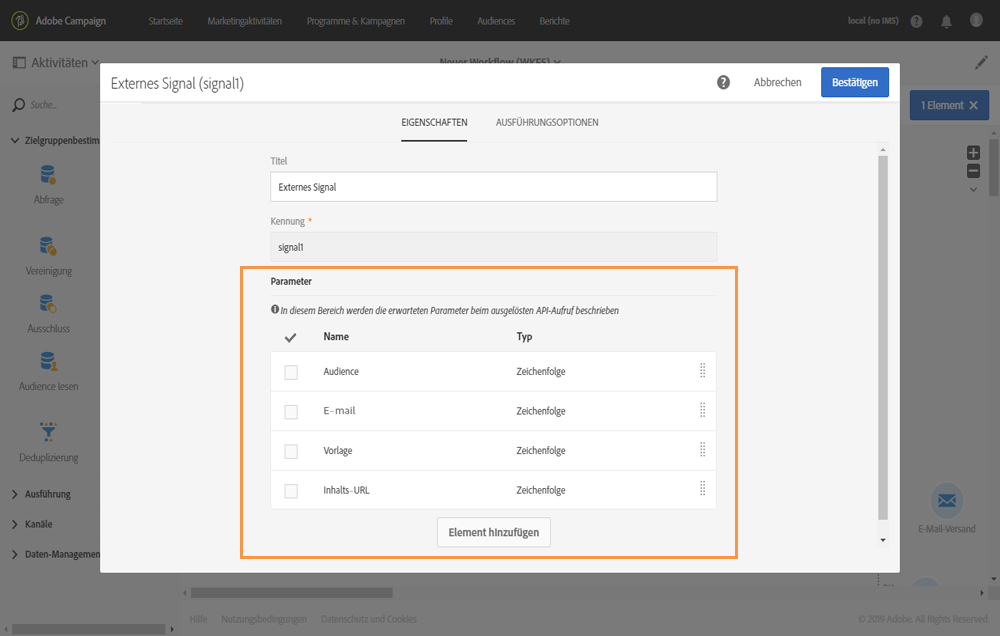

1. Schließen Sie nach der Deklaration der Parameter die Konfiguration des Workflows ab und führen Sie ihn aus.

## Parameter beim Aufruf des Workflows definieren   {#defining-the-parameters-when-calling-the-workflow}

In diesem Abschnitt wird beschrieben, wie Sie Parameter beim Aufruf eines Workflows definieren können. Weiterführende Informationen zur Durchführung dieses Vorgang mit einem API-Aufruf finden Sie in der [REST-APIs-Dokumentation](../../api/using/triggering-a-signal-activity.md).

Vor der Definition der Parameter müssen folgende Voraussetzungen gegeben sein:

* Die Parameter wurden in der Aktivität **[!UICONTROL Externes Signal]** deklariert. Siehe [Parameter in der externen Signalaktivität deklarieren](../../automating/using/calling-a-workflow-with-external-parameters.md#declaring-the-parameters-in-the-external-signal-activity).
* Der Workflow, der die Signalaktivität enthält, wird ausgeführt.

Gehen Sie zur Konfiguration der **[!UICONTROL Ende]**-Aktivität folgendermaßen vor:

1. Öffnen Sie die Aktivität **[!UICONTROL Ende]** und wählen Sie dann den Tab **[!UICONTROL Externes Signal]** aus.
1. Wählen Sie den Workflow und die Aktivität &quot;Externes Signal&quot; aus, die aufgerufen werden sollen.
1. Wählen Sie die Schaltfläche **[!UICONTROL Element erstellen]** aus, um einen Parameter hinzuzufügen. Geben Sie dann Namen und Wert ein.

   * **[!UICONTROL Name]**: der Name, der in der Aktivität **[!UICONTROL Externes Signal]** deklariert wurde (siehe [Parameter in der Aktivität &quot;Externes Signal&quot; deklarieren](../../automating/using/calling-a-workflow-with-external-parameters.md#declaring-the-parameters-in-the-external-signal-activity)).
   * **[!UICONTROL Wert]**: der Wert, der dem Parameter zugewiesen werden soll. Der Wert sollte der **Standardsyntax** entsprechen, die in [diesem Abschnitt](../../automating/using/advanced-expression-editing.md#standard-syntax) beschrieben wird.
   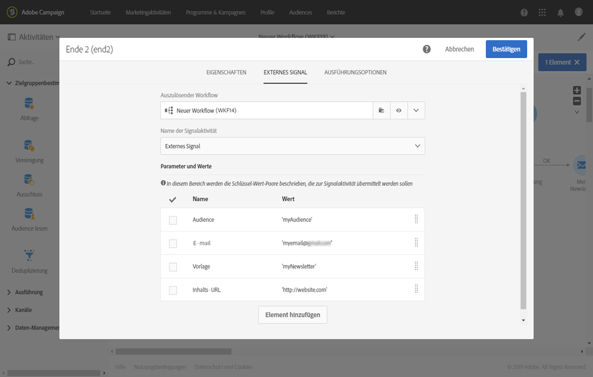

   >[!CAUTION]
   >
   >Stellen Sie sicher, dass alle Parameter in der Aktivität **[!UICONTROL Externes Signal]** deklariert wurden. Andernfalls tritt ein Fehler beim Ausführen der Aktivität auf.

1. Bestätigen Sie nach der Definition der Parameter die Aktivität und speichern Sie Ihren Workflow.

## Ereignisvariablen überwachen   {#monitoring-the-events-variables}

Es ist möglich, die im Workflow verfügbaren Ereignisvariablen zu überwachen, einschließlich der deklarierten externen Parameter. Gehen Sie dazu wie folgt vor:

1. Wählen Sie die Aktivität aus, die der Aktivität **[!UICONTROL Externes Signal]** folgt, und wählen Sie die Schaltfläche **[!UICONTROL Protokoll und Aufgaben]** aus.
1. Wählen Sie im Tab **[!UICONTROL Aufgaben]** die Schaltfläche  aus.

   

1. Im Ausführungskontext der Aufgabe werden jetzt ID, Status, Dauer etc. angezeigt, einschließlich aller Ereignisvariablen, die im Workflow zur Verfügung stehen.

   

## Workflow mit externen Parametern anpassen   {#customizing-a-workflow-with-external-parameters}

Nachdem der Workflow ausgelöst wurde, werden die Parameter in die Ereignisvariablen aufgenommen und können zur Anpassung der Workflow-Aktivitäten verwendet werden.

So kann mit ihnen beispielsweise definiert werden, welche Audience in der Aktivität **[!UICONTROL Audience lesen]** gelesen werden soll oder wie der Name der in der Aktivität **[!UICONTROL Dateiübertragung]** zu transferierenden Datei lautet.

Die Aktivitäten, die mit Ereignisvariablen angepasst werden können, finden Sie in [diesem Abschnitt](../../automating/using/calling-a-workflow-with-external-parameters.md#customizing-activities-with-events-variables).

### Verwendung von Ereignisvariablen   {#using-events-variables}

Ereignisvariablen werden innerhalb eines Ausdrucks verwendet, der die **[Standardsyntax](../../automating/using/advanced-expression-editing.md#standard-syntax)**berücksichtigen muss.

Die Syntax für die Verwendung von Ereignisvariablen muss dem unten stehenden Format entsprechen und den Namen des Parameters verwenden, der in der Aktivität **[!UICONTROL Externes Signal]** definiert wurde (siehe [Parameter in der Aktivität &quot;Externes Signal&quot; deklarieren](../../automating/using/calling-a-workflow-with-external-parameters.md#declaring-the-parameters-in-the-external-signal-activity)):

```
$(vars/@parameterName)
```

Mit dieser Syntax gibt die **$**-Funktion den Datentyp **String** zurück. Mithilfe der folgenden Funktionen können Sie einen anderen Datentyp festlegen:

* **$long**: ganze Zahl
* **$float**: Dezimalzahl
* **$boolean**: wahr/falsch
* **$datetime**: Zeitstempel

Wenn eine Variable in einer Aktivität verwendet wird, kann sie über die Benutzeroberfläche aufgerufen werden.

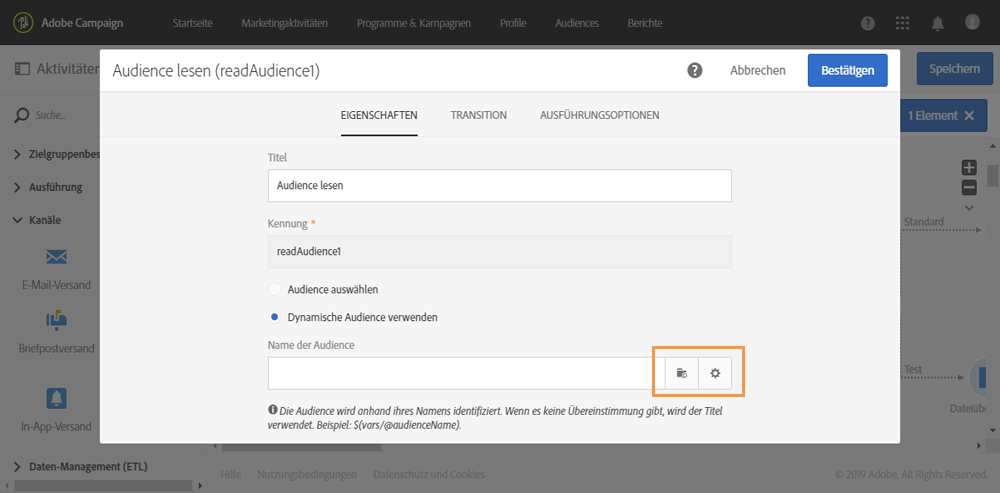

* : Wählen Sie die Ereignisvariable aus den im Workflow verfügbaren Variablen aus.

   

* : Hier können Sie Ausdrücke durch eine Kombination von Variablen und Funktionen bearbeiten. Weiterführende Informationen zum Ausdruckseditor finden Sie in [diesem Abschnitt](../../automating/using/advanced-expression-editing.md).

   

**Verwandte Themen:**

* [Ausdruck bearbeiten](../../automating/using/advanced-expression-editing.md#edit-an-expression)
* [Standardsyntax](../../automating/using/advanced-expression-editing.md#standard-syntax)
* [Funktionsliste](../../automating/using/list-of-functions.md)

### Aktivitäten mit Ereignisvariablen anpassen   {#customizing-activities-with-events-variables}

Die im folgenden Abschnitt aufgelisteten Aktivitäten können mit Ereignisvariablen angepasst werden. Weiterführende Informationen zum Aufruf einer Variablen in einer Aktivität finden Sie in [diesem Abschnitt](../../automating/using/calling-a-workflow-with-external-parameters.md#using-events-variables).

Aktivität **[!UICONTROL Audience lesen]**: Hier können Sie die auszuwählende Audience auf der Basis von Ereignisvariablen definieren.

Weiterführende Informationen zur Verwendung der Aktivität finden Sie in [diesem Abschnitt](../../automating/using/read-audience.md).


**[!UICONTROL Aktivität Test]**: Hier können Sie Bedingungen auf der Basis von Ereignisvariablen spezifizieren.

Weiterführende Informationen zur Verwendung der Aktivität finden Sie in [diesem Abschnitt](../../automating/using/test.md).

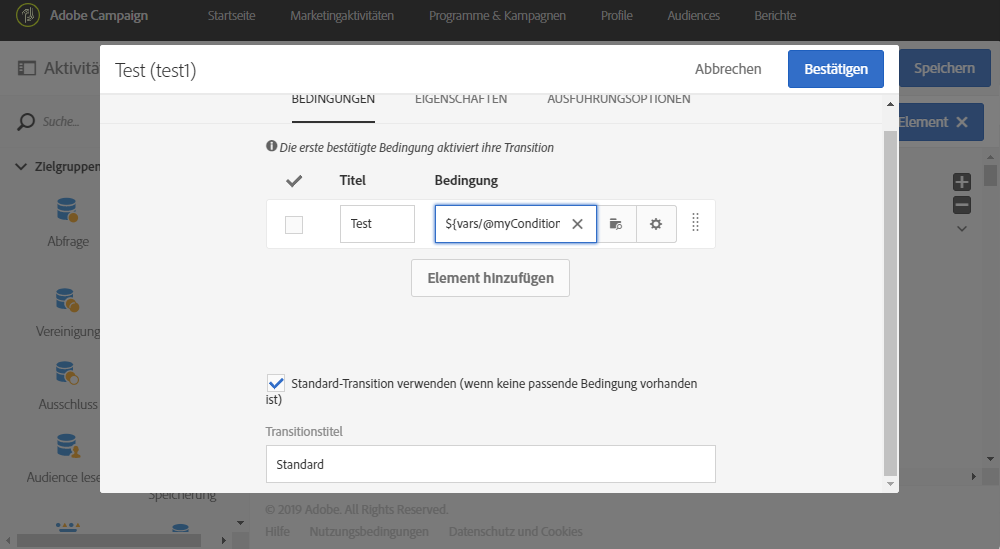

**[!UICONTROL Aktivität Dateiübertragung]**: Hier können Sie die zu übertragende Datei auf der Basis von Ereignisvariablen anpassen.

Weiterführende Informationen zur Verwendung der Aktivität finden Sie in [diesem Abschnitt](../../automating/using/transfer-file.md).


**[!UICONTROL Aktivität Abfrage]**: Parameter können in einer Abfrage durch die Verwendung von Ausdrücken referenziert werden, die Ereignisvariablen und Funktionen kombinieren. Fügen Sie zu diesem Zweck eine Regel hinzu und wählen Sie dann den Link **[!UICONTROL Erweiterter Modus]** aus, um das Ausdrucksbearbeitungsfenster zu öffnen (siehe [Ausdrucksbearbeitung](../../automating/using/advanced-expression-editing.md)).

Weiterführende Informationen zur Verwendung der Aktivität finden Sie in [diesem Abschnitt](../../automating/using/query.md).


**[!UICONTROL Aktivität Kanäle]**: Hier können Sie Sendungen auf der Basis von Ereignisvariablen personalisieren.

>[!NOTE]
>
>Die Werte der Versandparameter werden jedes Mal abgerufen, wenn der Versand vorbereitet wird.
>
>Die Vorbereitung eines sich wiederholenden Versands basiert auf dem **Aggregat-Zeitraum** des Versands. Wenn der Aggregat-Zeitraum beispielsweise &quot;nach Tag&quot; lautet, wird der Versand nur einmal pro Tag erneut vorbereitet. Wenn der Wert eines Versandparameters im Laufe des Tages geändert wird, wird er beim Versand nicht aktualisiert, da er bereits einmal vorbereitet wurde.
>
>Wenn Sie den Workflow mehrmals pro Tag ausführen möchten, verwenden Sie die Option [!UICONTROL Nicht aggregieren], damit die Versandparameter jedes Mal aktualisiert werden. Weiterführende Informationen zur Konfiguration eines sich wiederholenden Versands finden Sie in [diesem Abschnitt](/help/automating/using/email-delivery.md#configuration).

Um einen Versand auf der Basis von Ereignisvariablen zu personalisieren, deklarieren Sie zuerst in der Versandaktivität die Variablen, die Sie verwenden möchten:

1. Wählen Sie die Aktivität und danach die Schaltfläche  aus, um auf die Einstellungen zuzugreifen.
1. Wählen Sie den Tab **[!UICONTROL Allgemein]** aus und fügen Sie dann die Ereignisvariablen hinzu, die als Personalisierungsfelder im Versand verfügbar sein werden.

   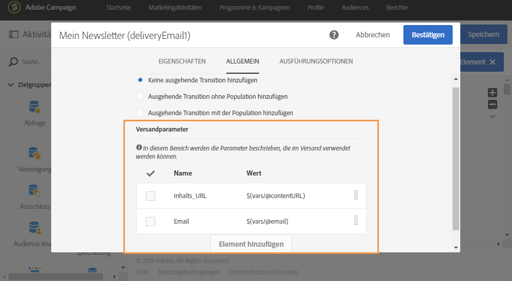

1. Wählen Sie die Schaltfläche **[!UICONTROL Bestätigen]** aus.

Jetzt sind in der Liste der Personalisierungsfelder die deklarierten Ereignisvariablen verfügbar. Sie können sie im Versand für die unten beschriebenen Aktionen verwenden:

* Definieren Sie den Namen der für den Versand zu verwendenden Vorlage.

   >[!NOTE]
   >
   >Diese Aktion ist nur für den **wiederkehrenden** Versand verfügbar.

   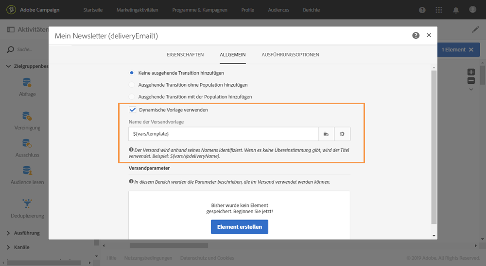

* Personalisieren Sie den Versand: Bei der Auswahl eines Personalisierungsfeldes zur Konfiguration eines Versands sind Ereignisvariablen im Element **[!UICONTROL Workflow-Parameter]** verfügbar. Sie können sie für ein beliebiges Personalisierungsfeld verwenden, z. B. zur Definition des Betreffs oder des Absenders.

   Die Versandpersonalisierung wird im Detail in [diesem Abschnitt](../../designing/using/personalization.md) beschrieben.

   

**Segmentcode**: Definieren Sie den Segmentcode auf der Basis von Ereignisvariablen.

>[!NOTE]
>
>Diese Aktion kann in jeder Aktivität ausgeführt werden, in der ein Segmentcode definiert werden kann, z. B. in der Aktivität **[!UICONTROL Abfrage]** oder **[!UICONTROL Segmentierung]**.


**Versandtitel**: Definieren Sie den Versandtitel basierend auf den Ereignisvariablen.


## Anwendungsbeispiel {#use-case}

Im folgenden Anwendungsbeispiel wird gezeigt, wie Sie einen Workflow mit Parametern innerhalb Ihrer Workflows abrufen können.

Dabei soll ein Workflow durch einen API-Aufruf mit externen Parametern ausgelöst werden. Durch diesen Workflow werden aus einer Datei Daten in Ihre Datenbank geladen und eine entsprechende Audience erstellt. Nach der Erstellung der Audience wird ein zweiter Workflow ausgelöst, durch den eine Nachricht gesendet wird, die mit den externen, im API-Aufruf definierten Parametern personalisiert wurde.

Führen Sie dazu folgende Aktionen aus:

1. Führen Sie einen **API-Aufruf** aus, um Workflow 1 mit externen Parametern auszulösen. Siehe [Schritt 1: API-Aufruf konfigurieren](../../automating/using/calling-a-workflow-with-external-parameters.md#step-1--configuring-the-api-call)..
1. **Erstellen Sie Workflow 1**: Mit dem Workflow wird eine Datei übertragen und in die Datenbank geladen. Danach wird getestet, ob die Daten leer sind oder nicht, und schließlich werden die Profile in der Audience gespeichert. Abschließend wird Workflow 2 ausgelöst. Siehe [Schritt 2: Workflow 1 konfigurieren](../../automating/using/calling-a-workflow-with-external-parameters.md#step-2--configuring-workflow-1)..
1. **Erstellen Sie Workflow 2**: Mit diesem Workflow wird die Audience gelesen, die in Workflow 1 erstellt wurde. Danach wird eine personalisierte Nachricht an die Profile gesendet, wobei ein Segmentcode verwendet wird, in den die Parameter eingefügt werden. Siehe [Schritt 3: Workflow 2 konfigurieren](../../automating/using/calling-a-workflow-with-external-parameters.md#step-3--configuring-workflow-2)..


### Voraussetzungen {#prerequisites}

Vor dem Konfigurieren des Workflows müssen Workflow 1 und 2 jeweils mit der Aktivität **[!UICONTROL Externes Signal]** erstellt werden. Auf diese Weise können Sie diese Signalaktivitäten auswählen, wenn Sie die Workflows aufrufen.

### Schritt 1: API-Aufruf konfigurieren   {#step-1--configuring-the-api-call}

Führen Sie einen API-Aufruf aus, um Workflow 1 mit Parametern auszulösen. Weiterführende Informationen zur Syntax des API-Aufrufs finden Sie in der [Dokumentation zu Campaign Standard-REST-APIs](../../api/using/triggering-a-signal-activity.md).

In diesem Beispiel soll der Workflow mit den unten stehenden Parametern aufgerufen werden:

* **fileToTarget**: der Name der Datei, die in die Datenbank importiert werden soll.
* **discountDesc**: die Beschreibung, die im Versand für den Rabatt angezeigt werden soll.

```
-X POST https://mc.adobe.io/<ORGANIZATION>/campaign/<TRIGGER_URL>
-H 'Authorization: Bearer <ACCESS_TOKEN>' 
-H 'Cache-Control: no-cache' 
-H 'X-Api-Key: <API_KEY>' 
-H 'Content-Type: application/json;charset=utf-8' 
-H 'Content-Length:79' 
-i
-d {
-d "source:":"API",
-d "parameters":{
-d "fileToTarget":"profile.txt",
-d "discountDesc":"Running shoes"
-d } 
```

### Schritt 2: Workflow 1 konfigurieren   {#step-2--configuring-workflow-1}

Workflow 1 wird folgendermaßen erstellt:

* **[!UICONTROL Aktivität Externes Signal]**; Hier müssen die externen Parameter deklariert werden, damit sie im Workflow verwendet werden können.
* **[!UICONTROL Aktivität Dateiübertragung]**: Importiert die Datei mit dem in den Parametern definierten Namen.
* Aktivität **[!UICONTROL Datei laden]**: Lädt Daten aus der importierten Datei in die Datenbank.
* **[!UICONTROL Aktivität Daten-Update]**: Fügt Daten aus der importierten Datei in die Datenbank ein oder aktualisiert die Datenbank.
* **[!UICONTROL Aktivität Test]**: Prüft, ob importierte Daten verfügbar sind.
* **[!UICONTROL Aktivität Audience-Speicherung]**: Wenn die Datei Daten enthält, werden die Profile in einer Audience gespeichert.
* **[!UICONTROL Aktivität Ende]**: Ruft Workflow 2 mit den gewünschten Parametern auf.

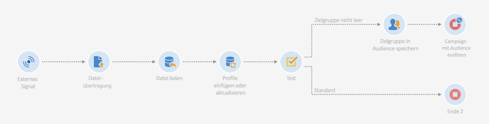

Führen Sie zur Konfiguration des Workflows die folgenden Schritte aus:

1. Deklarieren Sie die im API-Aufruf definierten Parameter. Öffnen Sie dazu die Aktivität **[!UICONTROL Externes Signal]** und fügen Sie dann die Namen und Typen der Parameter hinzu.

   

1. Fügen Sie die Aktivität **[!UICONTROL Dateiübertragung]** hinzu, um Daten in die Datenbank zu importieren. Ziehen Sie dazu die Aktivität in den Arbeitsbereich, öffnen Sie sie und wählen Sie den Tab **[!UICONTROL Protokoll]** aus.
1. Wählen Sie die Option **[!UICONTROL Dynamischen Dateipfad verwenden]** aus und verwenden Sie dann den Parameter **fileToTarget** als die zu übertragende Datei:

   ```
   $(vars/@fileToTarget)
   ```

   

1. Laden Sie die Daten aus der Datei in die Datenbank.

   Ziehen Sie dazu die Aktivität **[!UICONTROL Datei laden]** in den Workflow und konfigurieren Sie sie nach Bedarf.

1. Fügen Sie Daten aus der importierten Datei in die Datenbank ein und aktualisieren Sie die Datenbank.

   Ziehen Sie dazu die Aktivität **[!UICONTROL Daten-Update]** in den Arbeitsbereich und wählen Sie den Tab **[!UICONTROL Identifizierung]** aus, um ein Abstimmkriterium hinzuzufügen (in diesem Fall das Feld **E-Mail**).

   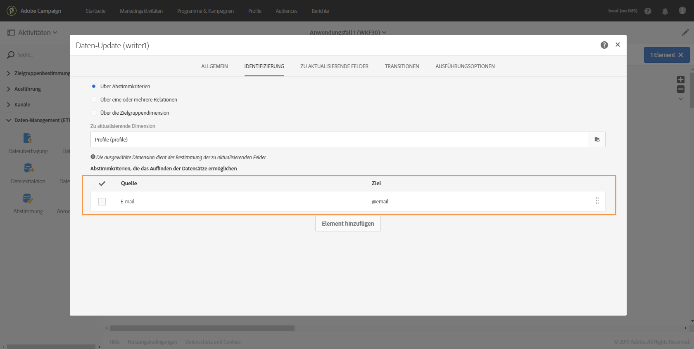

1. Wählen Sie den Tab **[!UICONTROL Zu aktualisierende Felder]** aus und spezifizieren Sie die in der Datenbank zu aktualisierenden Felder (in diesem Fall die Felder **Vorname** und **E-Mail**).

   

1. Überprüfen Sie, ob die Daten aus der Datei abgerufen wurden. Ziehen Sie dazu die Aktivität **[!UICONTROL Test]** in den Workflow und wählen Sie die Schaltfläche **[!UICONTROL Element hinzufügen]** aus, um eine Bedingung hinzuzufügen.
1. Benennen und definieren Sie die Bedingung. In diesem Fall soll getestet werden, ob die ausgehende Transition Daten mit der unten stehenden Syntax enthält.

   ```
   $long(vars/@recCount)>0
   ```

   

1. Wenn Daten abgerufen werden, speichern Sie sie in einer Audience. Fügen Sie zu diesem Zweck die Aktivität **[!UICONTROL Audience-Speicherung]** zur Transition **Target not empty** hinzu und öffnen Sie sie.
1. Wählen Sie die Option **[!UICONTROL Dynamischen Titel verwenden]** aus und fügen Sie dann den Parameter **fileToTarget** als den Titel der Audience ein:

   ```
   $(vars/@fileToTarget)
   ```

   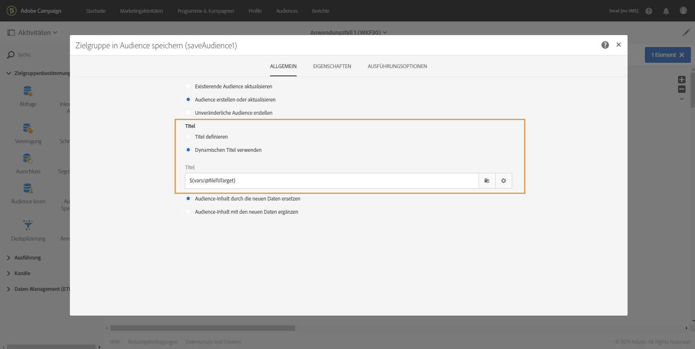

1. Ziehen Sie die Aktivität **[!UICONTROL Ende]** in den Arbeitsbereich. Dadurch wird Workflow 2 mit Parametern aufgerufen. Öffnen Sie dann die Aktivität.
1. Wählen Sie den Tab **[!UICONTROL Externes Signal]** aus und spezifizieren Sie den auszulösenden Workflow sowie die damit verknüpfte Signalaktivität.
1. Definieren Sie die in Workflow 2 zu verwendenden Parameter sowie deren Werte.

   In diesem Fall sollen die Parameter übermittelt werden, die ursprünglich im API-Aufruf definiert wurden (**fileToTarget** und **discountDesc**), sowie der zusätzlichen Parameter **segmentCode** mit einem konstanten Wert (&quot;20 % Rabatt&quot;).

   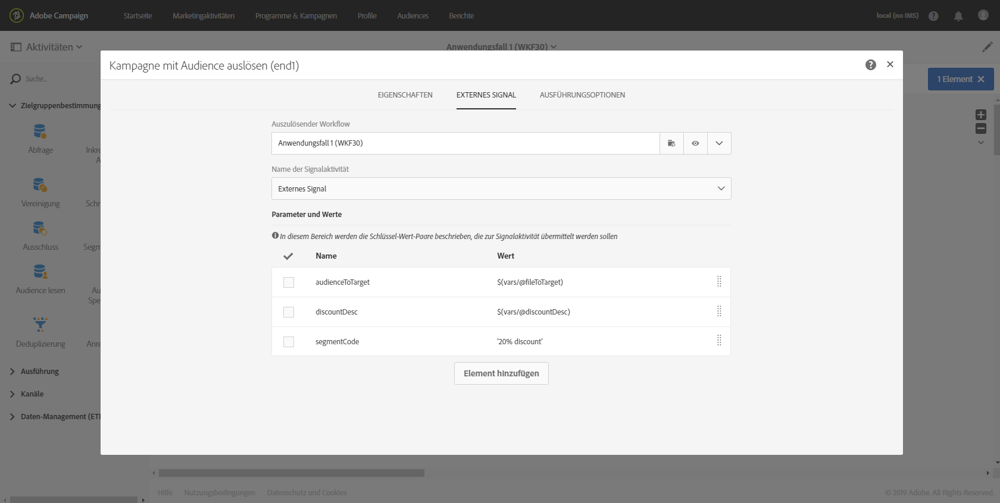

Workflow 1 ist somit konfiguriert. Erstellen Sie jetzt Workflow 2. Weiterführende Informationen hierzu finden Sie in [diesem Abschnitt](../../automating/using/calling-a-workflow-with-external-parameters.md#step-3--configuring-workflow-2).

### Schritt 3: Workflow 2 konfigurieren   {#step-3--configuring-workflow-2}

Workflow 2 wird folgendermaßen erstellt:

* **[!UICONTROL Aktivität Externes Signal]**: Die Parameter müssen deklariert werden, damit sie im Workflow verwendet werden können.
* Aktivität **[!UICONTROL Audience lesen]**: Liest die in Workflow 1 gespeicherte Audience.
* Aktivität **[!UICONTROL E-Mail-Versand]**: Sendet eine wiederkehrende durch Parameter personalisierte Nachricht an die entsprechende Audience.

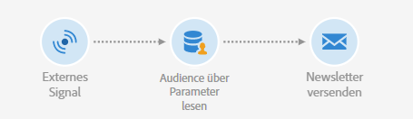

Führen Sie zur Konfiguration des Workflows die folgenden Schritte aus:

1. Deklarieren Sie die in Workflow 1 definierten Parameter.

   Öffnen Sie dazu die Aktivität **[!UICONTROL Externes Signal]**, und fügen Sie dann den Namen und den Typ eines jeden Parameters hinzu, der in der Aktivität **[!UICONTROL Ende]** von Workflow 1 definiert wurde.

   

1. Verwenden Sie die in Workflow 1 gespeicherte Audience. Platzieren Sie zu diesem Zweck die Aktivität **[!UICONTROL Audience lesen]** in den Workflow und öffnen Sie sie.
1. Wählen Sie die Option **[!UICONTROL Dynamische Audience verwenden]** aus und verwenden Sie den Parameter **fileToTarget** als den Namen der zu lesenden Audience:

   ```
   $(vars/@fileToTarget)
   ```

   

1. Benennen Sie die ausgehende Transition entsprechend dem Parameter **segmentCode**.

   Wählen Sie dazu den Tab **[!UICONTROL Transition]** und danach die Option **[!UICONTROL Dynamischen Segmentcode verwenden]** aus.

1. Verwenden Sie den Parameter **segmentCode** als den Namen der ausgehenden Transition:

   ```
   $(vars/@segmentCode)
   ```

   

1. Platzieren Sie die Aktivität **[!UICONTROL E-Mail-Versand]** in den Workflow, um eine Nachricht an die Audience zu senden.
1. Identifizieren Sie die in der Nachricht zu verwendenden Parameter, um sie mit dem Parameter **discountDesc** zu personalisieren. Öffnen Sie dazu die erweiterten Optionen der Aktivität und fügen Sie den Namen und den Wert des Parameters hinzu.

   

1. Sie können die Nachricht jetzt konfigurieren. Öffnen Sie die Aktivität und wählen Sie **[!UICONTROL Wiederholende E-Mail]** aus.

   

1. Wählen Sie die zu verwendende Vorlage aus und definieren Sie die E-Mail-Eigenschaften entsprechend Ihren Anforderungen.
1. Verwenden Sie den Parameter **discountDesc** als ein Personalisierungsfeld. Wählen Sie das Feld dazu aus der Liste der Personalisierungsfelder aus.

   

1. Jetzt können Sie die Konfiguration der Nachricht abschließen und diese wie üblich versenden.

   

### Workflows ausführen   {#executing-the-workflows}

Nach dem Erstellen der Workflows können diese ausgeführt werden. Achten Sie darauf, dass die beiden Workflows gestartet werden, bevor der API-Aufruf ausgeführt wird.
