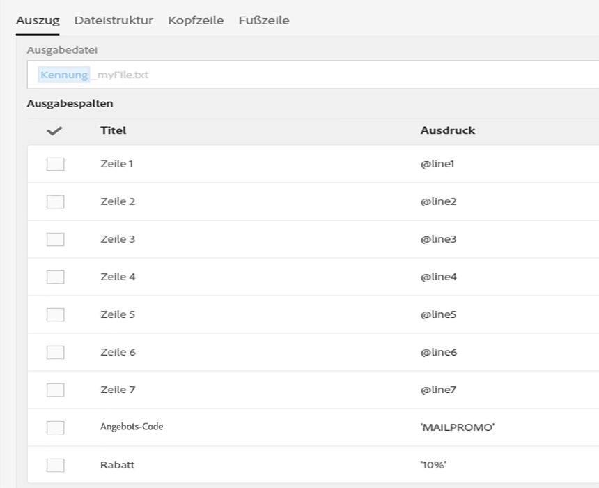
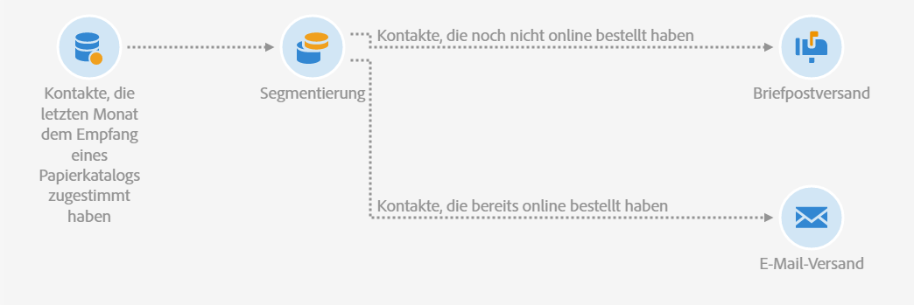

# E-Mail- und Briefpostversand verbinden {#coupling-email-direct-mail}

Als Marketer möchten Sie möglicherweise Kataloge per Briefpost versenden. Im Papierkatalog wird auf manchen Seiten ein Rabatt von 10 % angeboten, gemeinsam mit einem Promotioncode und einem Link für den Produktkauf auf der Website.

Die Kombination von Offline- und Online-Ressourcen ist interessant, da manche Kunden zwar lieber online einkaufen, aber Produktangebote lieber auf Papier ansehen.

Hier ist ein Beispiel für eine Briefpostvorlage, die verwendet werden könnte.

Hier ist ein Beispiel für einen Workflow, in dem die Kanäle Briefpost und E-Mail kombiniert werden.

**Verwandte Themen:**

* [Briefpostversand-Aktivität](../../automating/using/direct-mail-delivery.md)
* [Über Briefpost](../../channels/using/about-direct-mail.md)
