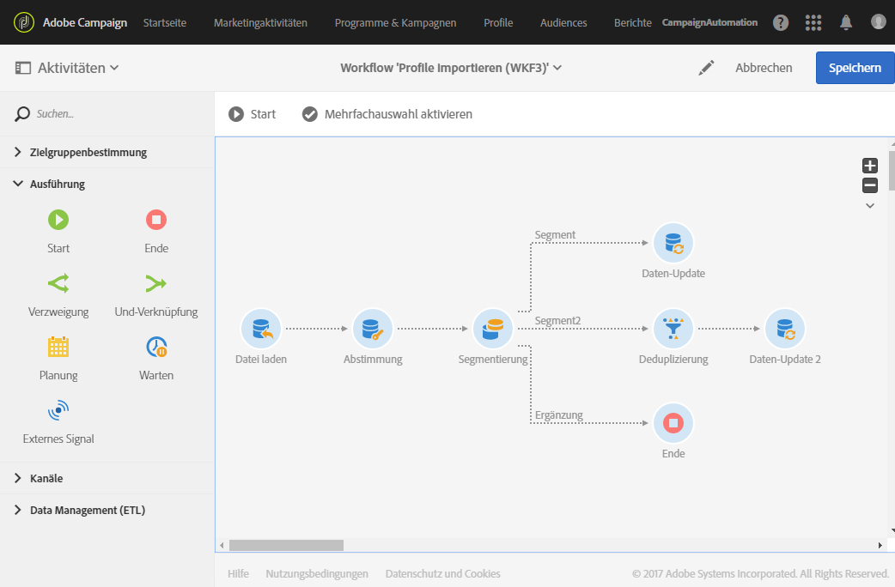
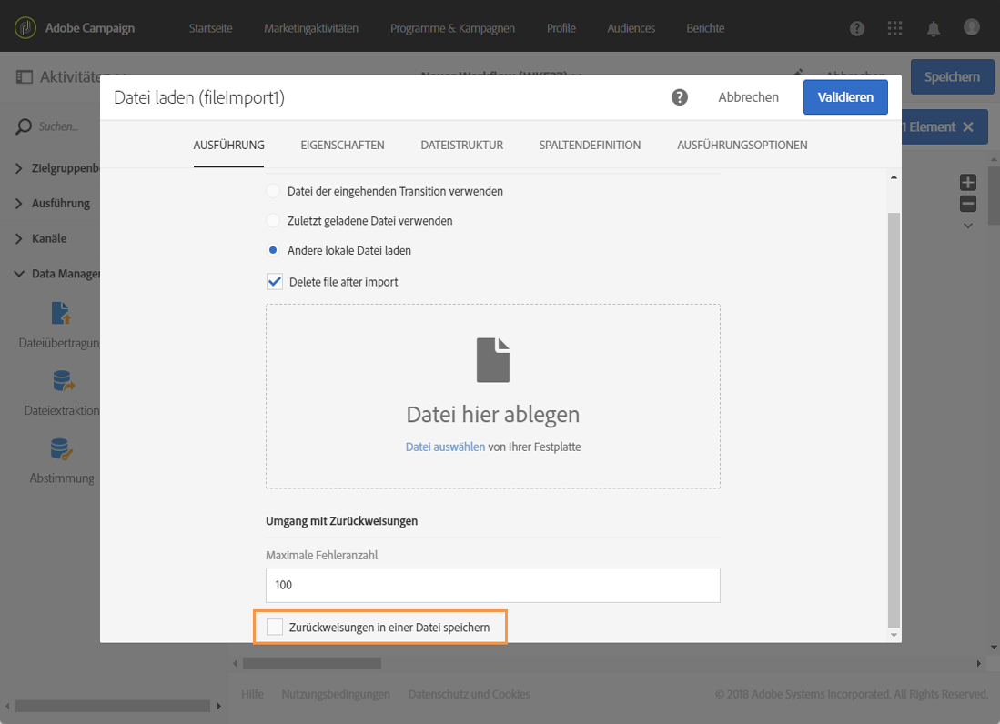
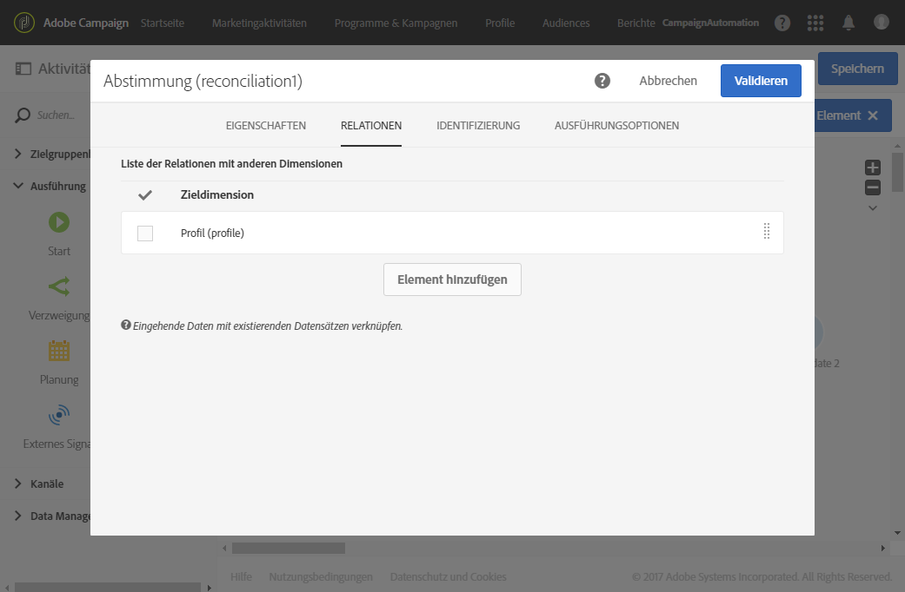
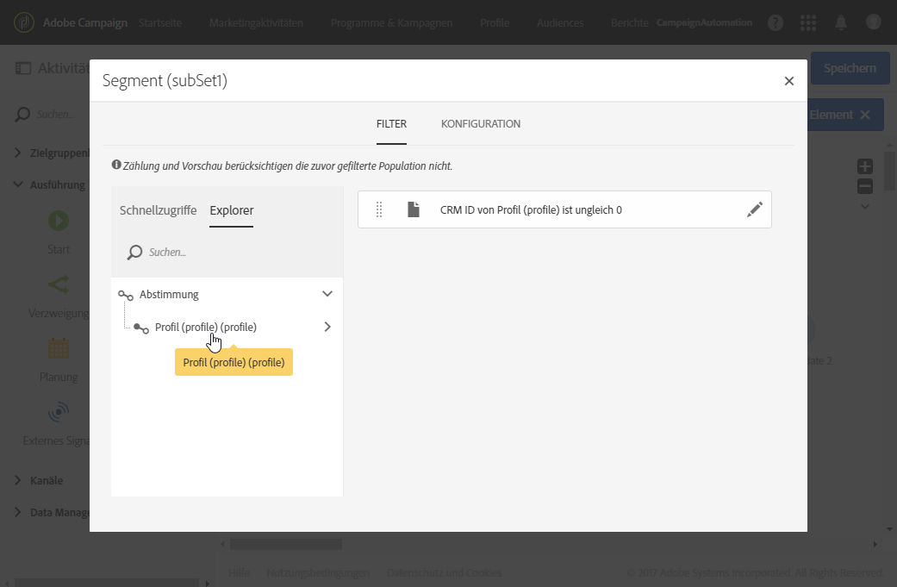
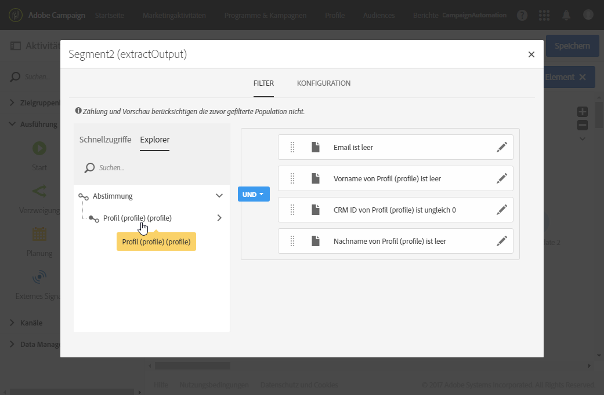
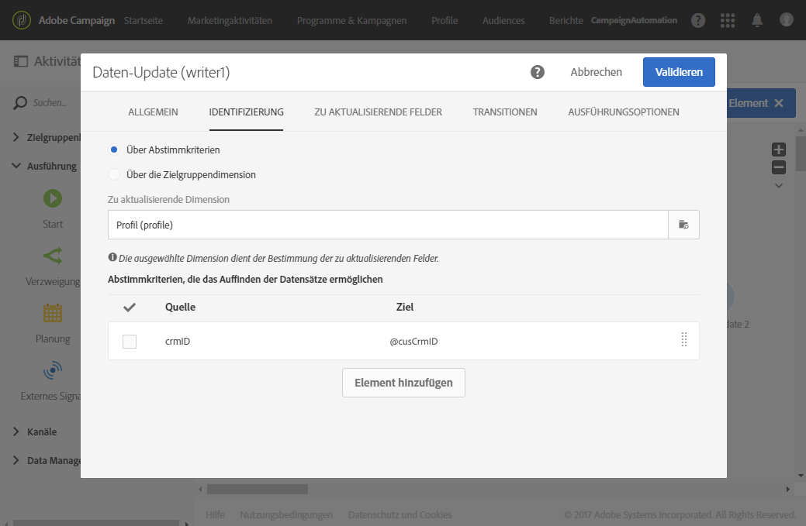
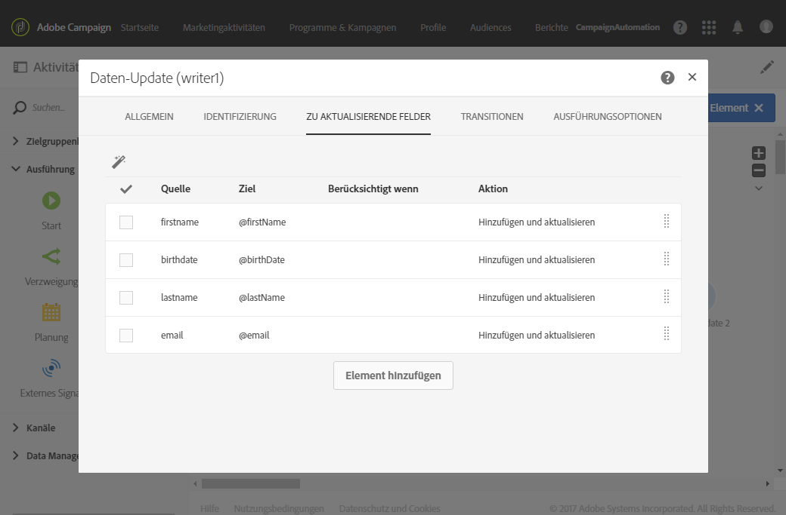
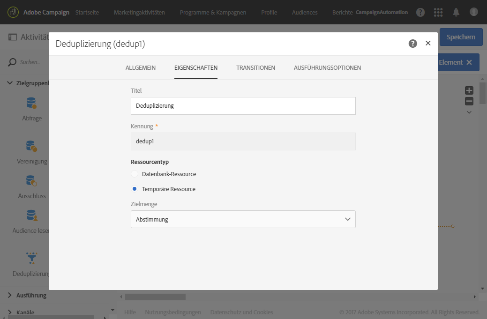
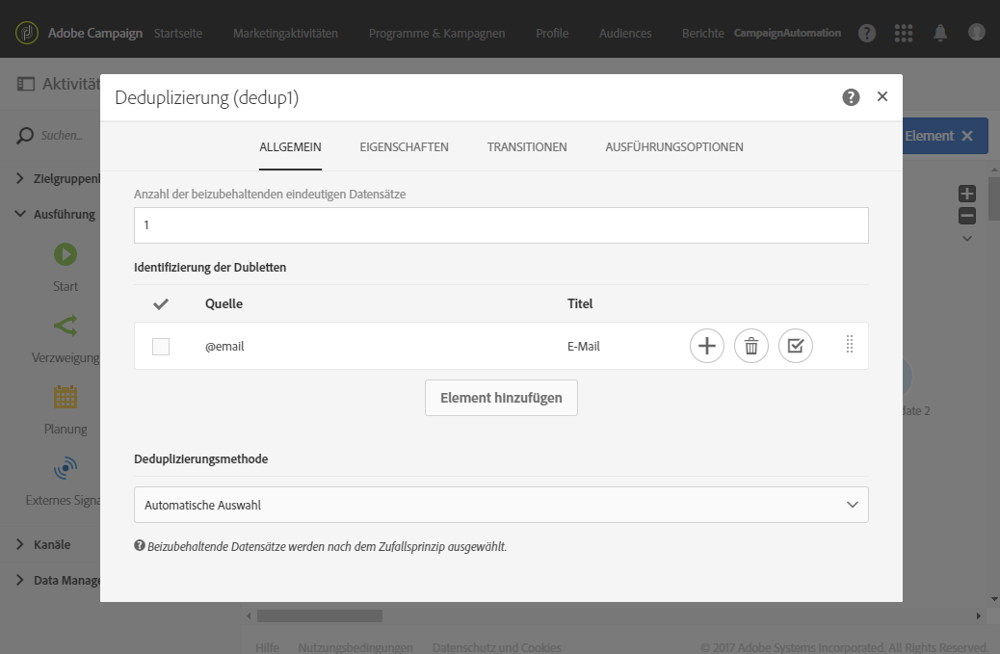
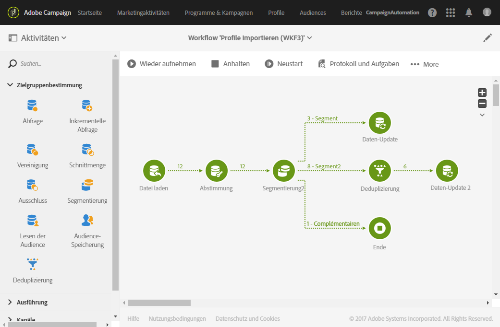

# Erstellen von Workflow-Vorlagen zum Importieren von Daten {#import-workflow-template}

Für den regelmäßigen Import von Dateien derselben Struktur empfiehlt sich die Verwendung einer Importvorlage.

In diesem Beispiel wird gezeigt, wie ein Workflow für den wiederholten Import von Profilen aus einer CRM-Lösung in der Adobe Campaign-Datenbank erstellt wird.

1. Erstellen Sie eine neue Workflow-Vorlage unter **[!UICONTROL Ressourcen > Vorlagen > Workflow-Vorlagen]**.
1. Fügen Sie die folgenden Aktivitäten hinzu:

   * **[!UICONTROL Datei laden]**: Definieren Sie die erwartete Struktur der Datei, die die zu importierenden Daten enthält.

     >[!NOTE]
     >
     >Im Zuge eines Imports können jeweils nur die Daten einer Datei importiert werden. Wenn der Workflow mehr als eine **[!UICONTROL Datei laden]**-Aktivität enthält, wird dieselbe Datei mehrmals verwendet.

   * **[!UICONTROL Abstimmung]**: Stimmen Sie die importierten Daten mit den Daten in der Datenbank ab.
   * **[!UICONTROL Segmentierung]**: Erstellen Sie Filter, um Datensätze, die abgestimmt werden konnten, und jene, die nicht abgestimmt werden konnten, unterschiedlich zu verarbeiten.
   * **[!UICONTROL Deduplizierung]**: Deduplizieren Sie die Daten aus der eingehenden Datei, bevor sie zur Datenbank hinzugefügt werden.
   * **[!UICONTROL Daten-Update]**: Aktualisieren Sie die Datenbank mit den importierten Profilen.

   

1. Konfigurieren Sie die Aktivität **[!UICONTROL Datei laden]**:

   * Definieren Sie die Struktur, die die Importdatei aufweisen soll, indem Sie eine Beispieldatei hochladen. Diese sollte nur einige wenige Zeilen aufweisen, aber alle für den Import erforderlichen Spalten. Prüfen und bearbeiten Sie das Dateiformat, um sicherzustellen, dass jeder Spaltentyp richtig eingerichtet ist: Text, Datum, Integer usw. Beispiel:

     ```
     lastname;firstname;birthdate;email;crmID
     Smith;Hayden;23/05/1989;hayden.smith@mailtest.com;123456
     ```

   * Wählen Sie im Bereich **[!UICONTROL Zu ladende Datei]** die Option **[!UICONTROL Andere lokale Datei laden]** und lassen Sie das Feld leer. Jedes Mal, wenn ein neuer Workflow von dieser Vorlage erstellt wird, können Sie hier die gewünschte Datei spezifizieren, solange sie der definierten Struktur entspricht.

     Sie können alle beliebigen Optionen verwenden, müssen aber die Vorlage entsprechend ändern. Wenn Sie beispielsweise **[!UICONTROL Datei der eingehenden Transition verwenden]** auswählen, können Sie die Aktivität **[!UICONTROL Dateiübertragung]** hinzufügen, bevor Sie die zu importierende Datei von einem FTP-/SFTP-Server abrufen.

     Wenn Sie Benutzern die Möglichkeit geben wollen, anschließend eine Datei mit während eines Imports aufgetretenen Fehlern herunterzuladen, aktivieren Sie die Option **[!UICONTROL Zurückweisungen in einer Datei speichern]** und geben Sie den **[!UICONTROL Dateinamen]** an.

     

1. Konfigurieren Sie die Aktivität **[!UICONTROL Abstimmung]**. Diese Aktivität hat in unserem Fall den Zweck, die eingehenden Daten zu identifizieren.

   * Wählen Sie im Tab **[!UICONTROL Relationen]** die Option **[!UICONTROL Element erstellen]** und definieren Sie eine Verknüpfung zwischen den importierten Daten und der Zielgruppendimension der Empfänger (siehe [Zielgruppendimensionen und Ressourcen](../../automating/using/query.md#targeting-dimensions-and-resources)). In unserem Beispiel wird diese Join-Bedingung mithilfe des benutzerdefinierten Feldes **Kennung im CRM** erstellt. Verwenden Sie das erforderliche Feld oder eine Kombination von Feldern, um eindeutige Datensätze zu identifizieren.
   * Lassen Sie im Tab **[!UICONTROL Identifizierung]** die Option **[!UICONTROL Dokument zur Zielgruppenbestimmung aufgrund der Arbeitsdaten identifizieren]** deaktiviert.

   

1. Konfigurieren Sie die Aktivität **[!UICONTROL Segmentierung]**, um abgestimmte Empfänger in einer Transition abzurufen und Empfänger, die nicht abgestimmt werden konnten, aber genügend Daten enthalten, in einer anderen Transition abzurufen.

   Danach kann die Datenbank mit der Transition mit abgestimmten Empfängern aktualisiert werden. Mit der Transition mit unbekannten Empfängern können dann neue Empfängereinträge in der Datenbank erstellt werden, vorausgesetzt die Datei enthält ein Mindestmaß an Daten.

   Empfänger, die nicht abgestimmt werden können und nicht genügend Daten aufweisen, werden in einer komplementären ausgehenden Transition ausgewählt und können in einer separaten Datei exportiert oder einfach ignoriert werden.

   * Wählen Sie im Tab **[!UICONTROL Allgemein]** der Aktivität für **[!UICONTROL Ressourcentyp]** die Option **[!UICONTROL Temporäre Ressource]** und danach **[!UICONTROL Abstimmung]** als Zielmenge.
   * Aktivieren Sie im Tab **[!UICONTROL Erweiterte Optionen]** die Option **[!UICONTROL Komplement erzeugen]**, um sich die Datensätze anzeigen zu lassen, die nicht in die Datenbank eingefügt werden können. Bei Bedarf können Sie dann für die komplementären Daten zusätzliche Verarbeitungsschritte setzen: Dateiexport, Listen-Update usw.
   * Fügen Sie dem ersten Segment des Tabs **[!UICONTROL Segmente]** eine Filterbedingung für die Eingangspopulation hinzu, um nur Datensätze auszuwählen, für die die Kennung im CRM nicht gleich 0 ist. Auf diese Weise werden in dieser Teilmenge Daten aus der Datei ausgewählt, die mit Empfängern aus der Datenbank abgestimmt sind.

     

   * Fügen Sie ein zweites Segment hinzu, das nicht abgestimmte Datensätze enthält, die aber genügend Informationen für die Aufnahme in die Datenbank aufweisen. Beispiel: E-Mail-Adresse, Vor- und Nachname. Nicht abgestimmte Datensätze weisen für Profile eine Kennung im CRM auf, deren Wert gleich 0 ist.

     

   * Alle nicht in den ersten beiden Teilmengen ausgewählten Datensätze werden im **[!UICONTROL Komplement]** ausgewählt.

1. Konfigurieren Sie die Aktivität **[!UICONTROL Daten-Update]**, die auf die erste ausgehende Transition der zuvor konfigurierten **[!UICONTROL Segmentierung]** folgt.

   * Wählen Sie als **[!UICONTROL Kampagnentyp]** die Option **[!UICONTROL Aktualisieren]** aus, da die eingehende Transition nur bereits in der Datenbank vorhandene Empfänger enthält.
   * Wählen Sie im Tab **[!UICONTROL Identifizierung]** die Option **[!UICONTROL Über Abstimmkriterien]** und definieren Sie einen Schlüssel zwischen **[!UICONTROL Zu aktualisierende Dimension]** – in unserem Fall Profile – und der in der Aktivität **[!UICONTROL Abstimmung]** erstellten Verknüpfung. In unserem Beispiel wird das benutzerdefinierte Feld **Kennung im CRM** verwendet.

     

   * Geben Sie im Tab **[!UICONTROL Zu aktualisierende Felder]** an, welche Felder aus der Profildimension mit dem Wert der entsprechenden Spalte in der Datei aktualisiert werden sollen. Wenn die Namen der Dateispalten mit den Namen der Dimensionsfelder der Empfänger übereinstimmen oder ihnen sehr ähnlich sind, können Sie die Felder mithilfe des Zauberstab-Symbols automatisch miteinander abstimmen.

     

     >[!NOTE]
     >
     >Wenn Sie diesen Profilen Briefpost senden möchten, fügen Sie eine Anschrift ein, da diese Informationen für den Briefpost-Dienstleister wesentlich sind. Beachten Sie außerdem, dass in der Profilinformation die Option **[!UICONTROL Anschrift angegeben]** aktiviert ist. Um diese Option in einem Workflow zu aktualisieren, fügen Sie einfach den zu aktualisierenden Feldern ein Element hinzu, geben Sie **1** für **[!UICONTROL Quelle]** an und wählen Sie für das Feld `postalAddress/@addrDefined`**[!UICONTROL Ziel]** aus. Weiterführende Informationen zu Briefpost und zur Verwendung der Option **[!UICONTROL Anschrift angegeben]** finden Sie in [diesem Dokument](../../channels/using/about-direct-mail.md#recommendations).

1. Konfigurieren Sie die Aktivität **[!UICONTROL Deduplizierung]**, die auf die Transition nicht abgestimmter Profile folgt:

   * Wählen Sie im Tab **[!UICONTROL Eigenschaften]** für **[!UICONTROL Ressourcentyp]** die vorübergehend durch die Aktivität **[!UICONTROL Abstimmung]** erzeugte Ressource des Workflows.

     

   * In diesem Beispiel wird das E-Mail-Feld zum Ermitteln eindeutiger Profile verwendet. Sie können aber auch jedes andere Feld verwenden, das ausgefüllt und Teil einer eindeutigen Kombination ist.
   * Wählen Sie eine **[!UICONTROL Deduplizierungsmethode aus]**. In diesem Fall wird von der Anwendung automatisch festgelegt, welche Datensätze im Fall von Duplikaten behalten werden.

   

1. Konfigurieren Sie die Aktivität **[!UICONTROL Daten-Update]**, die auf die zuvor konfigurierte Aktivität **[!UICONTROL Deduplizierung]** folgt.

   * Wählen Sie als **[!UICONTROL Kampagnentyp]** die Option **[!UICONTROL Nur hinzufügen]** aus, da die eingehende Transition nur noch nicht in der Datenbank vorhandene Profile enthält.
   * Wählen Sie im Tab **[!UICONTROL Identifizierung]** die Option **[!UICONTROL Über Abstimmkriterien]** und definieren Sie einen Schlüssel zwischen **[!UICONTROL Zu aktualisierende Dimension]** – in unserem Fall Profile – und der in der Aktivität **[!UICONTROL Abstimmung]** erstellten Verknüpfung. In unserem Beispiel wird das benutzerdefinierte Feld **Kennung im CRM** verwendet.

     

   * Geben Sie im Tab **[!UICONTROL Zu aktualisierende Felder]** an, welche Felder aus der Profildimension mit dem Wert der entsprechenden Spalte in der Datei aktualisiert werden sollen. Wenn die Namen der Dateispalten mit den Namen der Dimensionsfelder der Empfänger übereinstimmen oder ihnen sehr ähnlich sind, können Sie die Felder mithilfe des Zauberstab-Symbols automatisch miteinander abstimmen.

     

     >[!NOTE]
     >
     >Wenn Sie diesen Profilen Briefpost senden möchten, fügen Sie eine Anschrift ein, da diese Informationen für den Briefpost-Dienstleister wesentlich sind. Beachten Sie außerdem, dass in der Profilinformation die Option **[!UICONTROL Anschrift angegeben]** aktiviert ist. Um diese Option in einem Workflow zu aktualisieren, fügen Sie einfach den zu aktualisierenden Feldern ein Element hinzu, geben Sie als **Source** **[!UICONTROL 1]** an und wählen Sie als **[Destination]** das Feld **[!UICONTROL postalAddress/@addrDefined]** aus. Weiterführende Informationen zu Briefpost und zur Verwendung der Option **[!UICONTROL Anschrift angegeben]** finden Sie in [diesem Dokument](../../channels/using/about-direct-mail.md#recommendations).

1. Fügen Sie nach der dritten Transition der Aktivität **[!UICONTROL Segmentierung]** die Aktivität **[!UICONTROL Dateiextraktion]** und eine **[!UICONTROL Dateiübertragung]** hinzu, wenn Sie die noch nicht in die Datenbank übertragenen Daten verfolgen möchten. Konfigurieren Sie diese Aktivitäten, um die benötigte Spalte zu exportieren und die Datei auf einen FTP- oder SFTP-Server zu übertragen, wo Sie sie abrufen können.
1. Fügen Sie eine **[!UICONTROL Ende]**-Aktivität an und speichern Sie die Workflow-Vorlage.

Die Vorlage ist jetzt einsatzbereit und kann für jeden neuen Workflow verwendet werden. Dann muss nur noch die Datei spezifiziert werden, deren Daten in der Aktivität **[!UICONTROL Datei laden]** importiert werden sollen.


