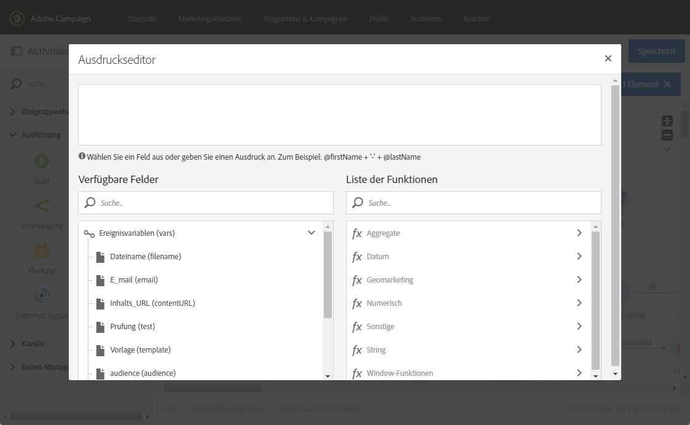
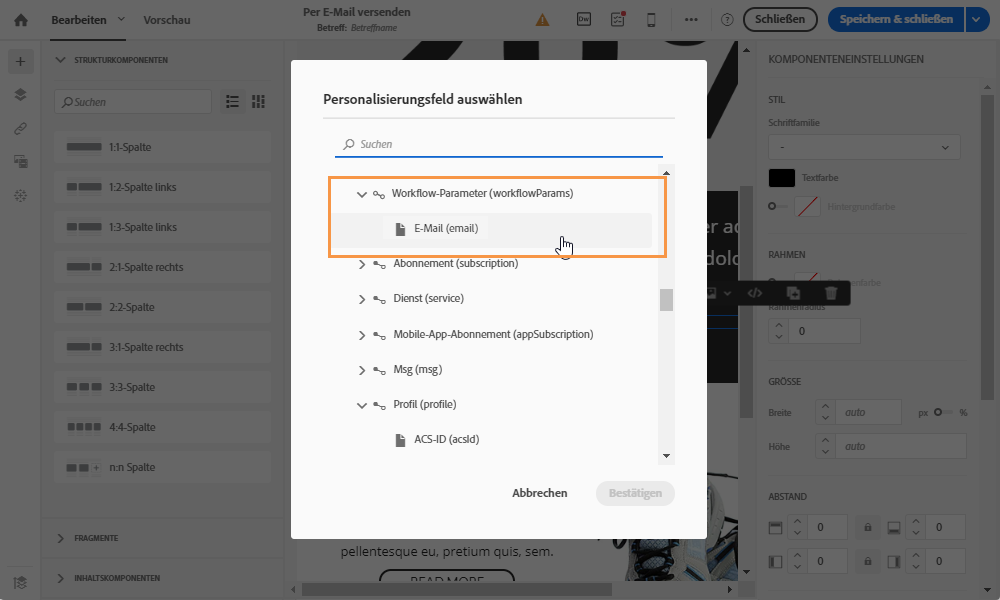

# Workflow mit externen Parametern anpassen    {#customizing-a-workflow-with-external-parameters}

Nachdem der Workflow ausgelöst wurde, werden die Parameter in die Ereignisvariablen aufgenommen und können zur Anpassung der Workflow-Aktivitäten verwendet werden.

So kann mit ihnen beispielsweise definiert werden, welche Audience in der Aktivität **[!UICONTROL Audience lesen]** gelesen werden soll oder wie der Name der in der Aktivität **[!UICONTROL Dateiübertragung]** zu transferierenden Datei lautet. (Siehe [](../../automating/using/customizing-workflow-external-parameters.md)).

## Verwendung von Ereignisvariablen    {#using-events-variables}

Ereignisvariablen werden innerhalb eines Ausdrucks verwendet, der die [Standardsyntax](../../automating/using/advanced-expression-editing.md#standard-syntax) berücksichtigen muss.

Die Syntax für die Verwendung von Ereignisvariablen muss dem unten stehenden Format entsprechen und den Namen des Parameters verwenden, der in der Aktivität **[!UICONTROL Externes Signal]** definiert wurde (siehe [Parameter in der Aktivität &quot;Externes Signal&quot; deklarieren](../../automating/using/declaring-parameters-external-signal.md)):

```
$(vars/@parameterName)
```

Mit dieser Syntax gibt die **$**-Funktion den Datentyp **String** zurück. Mithilfe der folgenden Funktionen können Sie einen anderen Datentyp festlegen:

* **$long**: ganze Zahl
* **$float**: Dezimalzahl
* **$boolean**: wahr/falsch
* **$datetime**: Zeitstempel

Wenn eine Variable in einer Aktivität verwendet wird, kann sie über die Benutzeroberfläche aufgerufen werden.


* : Wählen Sie die Ereignisvariable aus den im Workflow verfügbaren Variablen aus.

   

* : Hier können Sie Ausdrücke durch eine Kombination von Variablen und Funktionen bearbeiten (siehe [](../../automating/using/advanced-expression-editing.md)).

   

   Diese Liste bietet Funktionen, mit denen Sie komplexe Filtervorgänge durchführen können. Diese Funktionen sind in [diesem Abschnitt](../../automating/using/list-of-functions.md) ausführlich beschrieben.

   Darüber hinaus können Sie die folgenden Funktionen verwenden, die in allen Aktivitäten zur Verfügung stehen, die die Verwendung von Ereignisvariablen nach dem Aufruf eines Workflows mit externen Parametern ermöglichen (siehe [](../../automating/using/customizing-workflow-external-parameters.md#customizing-activities-with-events-variables)):

   | Name | Beschreibung  | Syntax |
   ---------|----------|---------
   | EndWith | Gibt an, ob eine Zeichenfolge (1. Parameter) mit einer bestimmten Zeichenfolge (2. Parameter) endet. | EndWith(&lt;String>,&lt;String>) |
   | startWith | Gibt an, ob eine Zeichenfolge (1. Parameter) mit einer bestimmten Zeichenfolge (2. Parameter) beginnt. | startWith(&lt;String>,&lt;String>) |
   | Extract | Gibt die ersten Zeichen einer Zeichenfolge mithilfe eines Trennzeichens zurück. | Extract(&lt;String>,&lt;Separator>) |
   | ExtractRight | Gibt die letzten Zeichen einer Zeichenfolge mithilfe eines Trennzeichens zurück. | ExtractRight(&lt;String>,&lt;Separator>) |
   | DateFormat | Formatiert ein Datum mit dem im 2. Parameter angegebenen Format (Beispiel: &#39;%4Y%2M%2D&#39;) | DateFormat(&lt;Date>,&lt;Format>) |
   | FileName | Gibt den Namen eines Dateipfads zurück. | FileName(&lt;String>) |
   | FileExt | Gibt die Erweiterung eines Dateipfads zurück. | FileExt(&lt;String>) |
   | IsNull | Gibt an, ob eine Zeichenfolge oder ein Datum null ist. | IsNull(&lt;String/date>) |
   | UrlUtf8Encode | Kodiert eine URL in UTF8. | UrlUtf8Encode(&lt;String>) |

## Aktivitäten mit Ereignisvariablen anpassen    {#customizing-activities-with-events-variables}

Die im folgenden Abschnitt aufgelisteten Aktivitäten können mit Ereignisvariablen angepasst werden. Weiterführende Informationen zum Aufruf einer Variablen in einer Aktivität finden Sie in [diesem Abschnitt](../../automating/using/customizing-workflow-external-parameters.md#using-events-variables).

Aktivität **[!UICONTROL Audience lesen]**: Hier können Sie die auszuwählende Audience auf der Basis von Ereignisvariablen definieren. Weiterführende Informationen zur Verwendung der Aktivität finden Sie in [diesem Abschnitt](../../automating/using/read-audience.md).


**[!UICONTROL Aktivität Test]**: Hier können Sie Bedingungen auf der Basis von Ereignisvariablen spezifizieren. Weiterführende Informationen zur Verwendung der Aktivität finden Sie in [diesem Abschnitt](../../automating/using/test.md).


**[!UICONTROL Aktivität Dateiübertragung]**: Hier können Sie die zu übertragende Datei auf der Basis von Ereignisvariablen anpassen. Weiterführende Informationen zur Verwendung der Aktivität finden Sie in [diesem Abschnitt](../../automating/using/transfer-file.md).


**[!UICONTROL Aktivität Abfrage]**: Parameter können in einer Abfrage durch die Verwendung von Ausdrücken referenziert werden, die Ereignisvariablen und Funktionen kombinieren. Fügen Sie zu diesem Zweck eine Regel hinzu und wählen Sie dann den Link **[!UICONTROL Erweiterter Modus]** aus, um das Ausdrucksbearbeitungsfenster zu öffnen (siehe [Ausdrucksbearbeitung](../../automating/using/advanced-expression-editing.md)).

Weiterführende Informationen zur Verwendung der Aktivität finden Sie in [diesem Abschnitt](../../automating/using/query.md).


**[!UICONTROL Aktivität Kanäle]**: Hier können Sie Sendungen auf der Basis von Ereignisvariablen personalisieren.

>[!NOTE]
>
>Die Werte der Versandparameter werden jedes Mal abgerufen, wenn der Versand vorbereitet wird.
>
>Die Vorbereitung eines sich wiederholenden Versands basiert auf dem **Aggregat-Zeitraum** des Versands. Wenn der Aggregat-Zeitraum beispielsweise &quot;nach Tag&quot; lautet, wird der Versand nur einmal pro Tag erneut vorbereitet. Wenn der Wert eines Versandparameters im Laufe des Tages geändert wird, wird er beim Versand nicht aktualisiert, da er bereits einmal vorbereitet wurde.
>
>Wenn Sie den Workflow mehrmals pro Tag ausführen möchten, verwenden Sie die Option [!UICONTROL Nicht aggregieren], damit die Versandparameter jedes Mal aktualisiert werden. Weiterführende Informationen zur Konfiguration eines sich wiederholenden Versands finden Sie in [diesem Abschnitt](/help/automating/using/email-delivery.md#configuration).

Um einen Versand auf der Basis von Ereignisvariablen zu personalisieren, deklarieren Sie zuerst in der Versandaktivität die Variablen, die Sie verwenden möchten:

1. Wählen Sie die Aktivität und danach die Schaltfläche  aus, um auf die Einstellungen zuzugreifen.
1. Wählen Sie den Tab **[!UICONTROL Allgemein]** aus und fügen Sie dann die Ereignisvariablen hinzu, die als Personalisierungsfelder im Versand verfügbar sein werden.

   

1. Wählen Sie die Schaltfläche **[!UICONTROL Bestätigen]** aus.

Jetzt sind in der Liste der Personalisierungsfelder die deklarierten Ereignisvariablen verfügbar. Sie können sie im Versand für die unten beschriebenen Aktionen verwenden:

* Definieren Sie den Namen der für den Versand zu verwendenden Vorlage.

   >[!NOTE]
   >
   >Diese Aktion ist nur für den **wiederkehrenden** Versand verfügbar.

   

* Personalisieren Sie den Versand: Bei der Auswahl eines Personalisierungsfeldes zur Konfiguration eines Versands sind Ereignisvariablen im Element **[!UICONTROL Workflow-Parameter]** verfügbar. Sie können sie für ein beliebiges Personalisierungsfeld verwenden, z. B. zur Definition des Betreffs oder des Absenders.

   Die Versandpersonalisierung wird im Detail in [diesem Abschnitt](../../designing/using/personalization.md) beschrieben.

   

**Segmentcode**: Definieren Sie den Segmentcode auf der Basis von Ereignisvariablen.

>[!NOTE]
>
>Diese Aktion kann in jeder Aktivität ausgeführt werden, in der ein Segmentcode definiert werden kann, z. B. in der Aktivität **[!UICONTROL Abfrage]** oder **[!UICONTROL Segmentierung]**.


**Versandtitel**: Definieren Sie den Versandtitel basierend auf den Ereignisvariablen.


