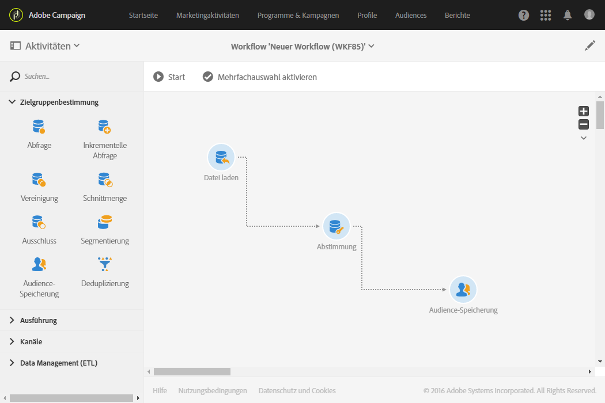
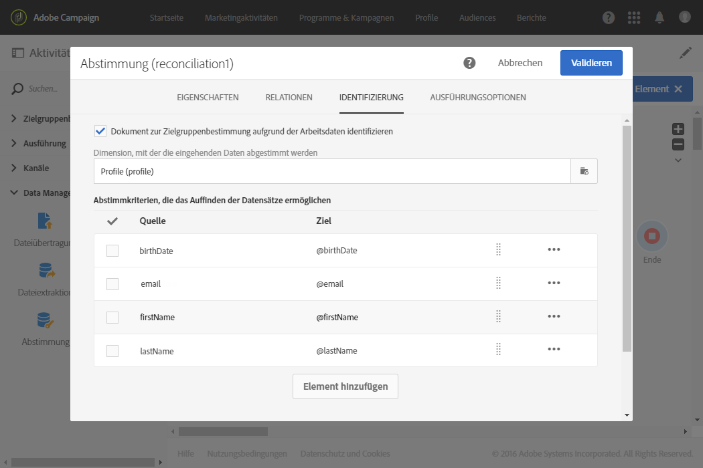
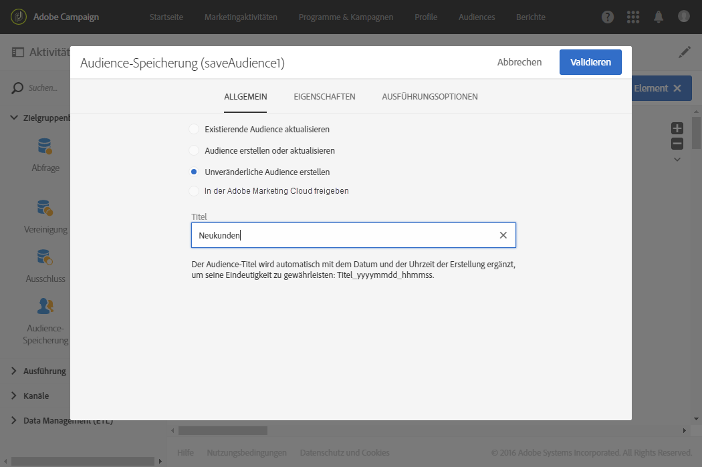

# Datenaktualisierung mittels Abstimmung {#data-update-reconciliation}

Das folgende Beispiel zeigt einen Workflow zur Erstellung einer Profil-Audience, die direkt von einer importierten Datei mit neuen Kunden ausgeht. Er setzt sich aus folgenden Aktivitäten zusammen:



* [Datei laden](../../automating/using/load-file.md) zum Laden und Erkennen der Daten der zu importierenden Datei. Die importierte Datei enthält folgende Daten:

  ```
  lastname;firstname;email;dateofbirth
  jackman;megan;megan.jackman@testmail.com;07/08/1975
  phillips;edward;phillips@testmail.com;09/03/1986
  weaver;justin;justin_w@testmail.com;11/15/1990
  martin;babeth;babeth_martin@testmail.net;11/25/1964
  reese;richard;rreese@testmail.com;02/08/1987
  cage;nathalie;cage.nathalie227@testmail.com;07/03/1989
  xiuxiu;andrea;andrea.xiuxiu@testmail.com;09/12/1992
  grimes;daryl;daryl_890@testmail.com;12/06/1979
  tycoon;tyreese;tyreese_t@testmail.net;10/08/1971
  ```

* [Abstimmung](../../automating/using/reconciliation.md) zur Zuordnung jeder Spalte der geladenen Datei zu einer Spalte der Profildimension. Die nicht identifizierbaren Datensätze der Datei (fehlende Daten, inkompatible Datentypen etc.) werden zur Wahrung der Integrität der endgültigen Audience-Daten ignoriert.

  

* Aktivität [Audience-Speicherung](../../automating/using/save-audience.md) zum Speichern der Profil-Audience.

  
