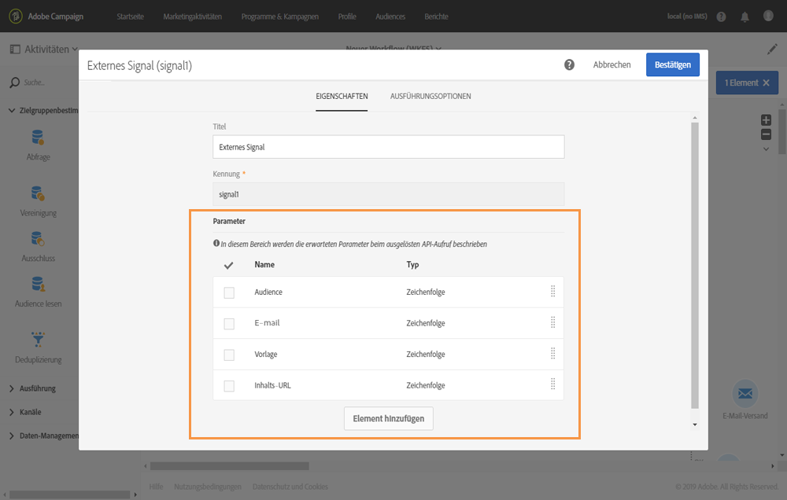

# Parameter in der Aktivität &quot;Externes Signal&quot; deklarieren     {#declaring-the-parameters-in-the-external-signal-activity}

Um einen Workflow mit Parametern aufzurufen, müssen Sie diese zunächst in der Aktivität **[!UICONTROL Externes Signal]** deklarieren.

1. Öffnen Sie die Aktivität **[!UICONTROL Externes Signal]** und wählen Sie den Tab **[!UICONTROL Parameter]** aus.
1. Wählen Sie die Schaltfläche **[!UICONTROL Element erstellen]** aus und geben Sie den Namen und den Typ eines jeden Parameters an.

   >[!CAUTION]
   >
   >Stellen Sie sicher, dass Name und Anzahl der Parameter mit der Definition beim Aufrufen des Workflows übereinstimmen (siehe [diese Seite](../../automating/using/defining-parameters-calling-workflow.md)). Darüber hinaus müssen die Parametertypen den erwarteten Werten entsprechen.

   

1. Schließen Sie nach der Deklaration der Parameter die Konfiguration des Workflows ab und führen Sie ihn aus.
