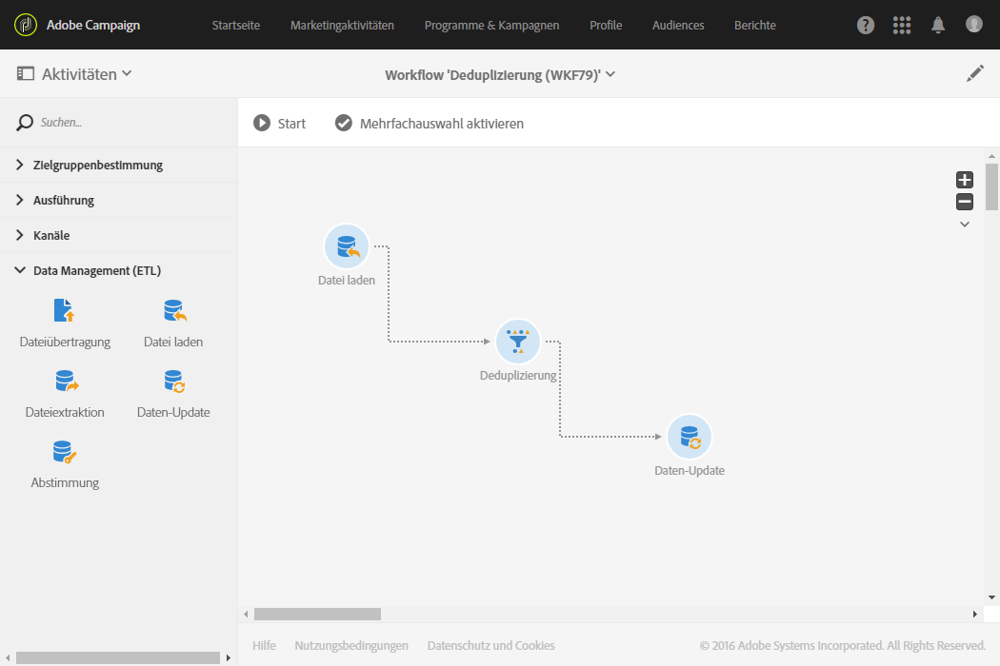
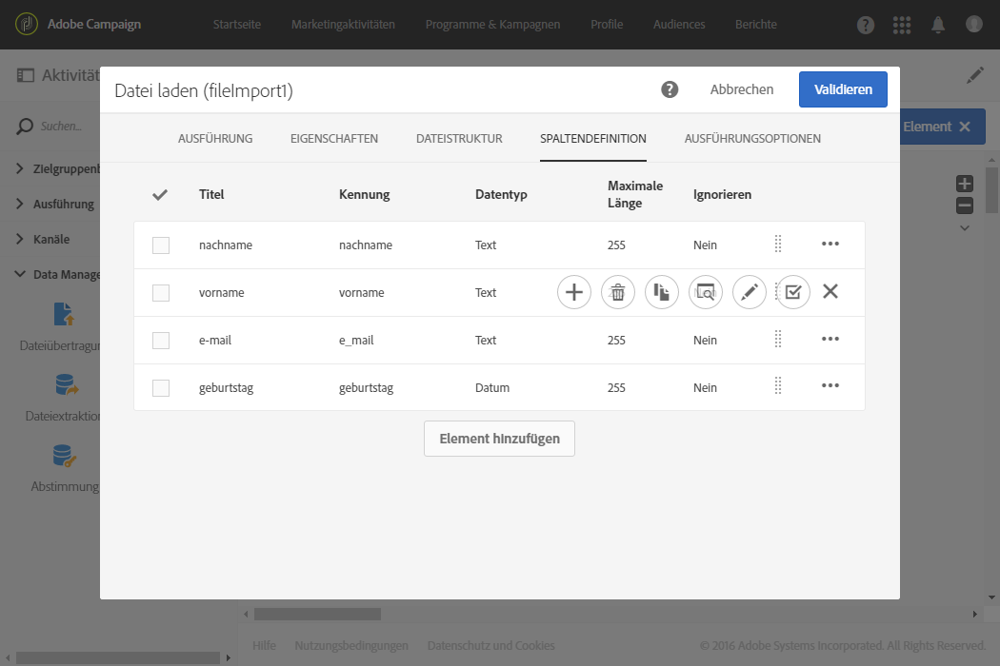

# Daten einer importierten Datei deduplizieren {#deduplicating-the-data-from-an-imported-file}

In diesem Beispiel wird gezeigt, wie sich Daten einer importierten Datei vor dem Laden in die Datenbank deduplizieren lassen. Mithilfe dieses Prozesses lässt sich die Qualität der in die Datenbank geladenen Daten verbessern.

Der Workflow setzt sich folgendermaßen zusammen:



* [Datei-laden](../../automating/using/load-file.md)-Aktivität zum Import einer Datei, die eine Profilliste enthält. In unserem Beispiel weist die importierte Datei das .csv-Format auf und enthält 10 Profile:

  ```
  lastname;firstname;dateofbirth;email
  Smith;Hayden;23/05/1989;hayden.smith@example.com
  Mars;Daniel;17/11/1987;dannymars@example.com
  Smith;Clara;08/02/1989;hayden.smith@example.com
  Durance;Allison;15/12/1978;allison.durance@example.com
  Lucassen;Jody;28/03/1988;jody.lucassen@example.com
  Binder;Tom;19/01/1982;tombinder@example.com
  Binder;Tommy;19/01/1915;tombinder@example.com
  Connor;Jade;10/10/1979;connor.jade@example.com
  Mack;Clarke;02/03/1985;clarke.mack@example.com
  Ross;Timothy;04/07/1986;timross@example.com
  ```

  Diese Datei kann außerdem als Beispieldatei zur Erkennung und Definition des Spaltenformats dienen. Prüfen Sie im Tab **[!UICONTROL Spaltendefinition]**, ob jede Spalte der importierten Datei korrekt konfiguriert ist.

  

* Aktivität [Deduplizierung](../../automating/using/deduplication.md). Die Deduplizierung erfolgt direkt nach dem Dateiimport und vor der Einfügung der Daten in die Datenbank. Sie basiert folglich auf der von der **[!UICONTROL Datei-laden]**-Aktivität erzeugten **[!UICONTROL temporären Ressource]**.

  Im vorliegenden Beispiel soll pro in der Datei enthaltener E-Mail-Adresse ausschließlich ein Eintrag beibehalten werden. Die Identifizierung der Duplikate erfolgt also mittels der Spalte **email** der temporären Ressource. Nun tauchen zwei E-Mail-Adressen aber jeweils zweimal in der Datei auf. Zwei Zeilen werden also als Duplikate angesehen.

  

* Die Aktivität [Daten-Update](../../automating/using/update-data.md) ermöglicht die Einfügung der nach der Deduplizierung beibehaltenen Daten in die Datenbank. Die importierten Daten werden erst zum Zeitpunkt des Daten-Updates als der Profildimension zugehörig identifiziert.

  Als Aktionstyp wurde im vorliegenden Beispiel **[!UICONTROL Nur hinzufügen]** gewählt, um noch nicht vorhandene Profile in die Datenbank aufzunehmen. Als Abstimmschlüssel werden dabei die E-Mail-Spalte der Datei und das E-Mail-Feld der **Profil**-Dimension verwendet.

  

  Führen Sie im Tab **[!UICONTROL Zu aktualisierende Felder]** das Mapping zwischen den Dateispalten, deren Daten Sie einfügen möchten, und den entsprechenden Feldern der Datenbank durch.

  

Starten Sie nun den Workflow. Die nach der Deduplizierung beibehaltenen Datensätze werden nun den Profilen Ihrer Datenbank hinzugefügt.
