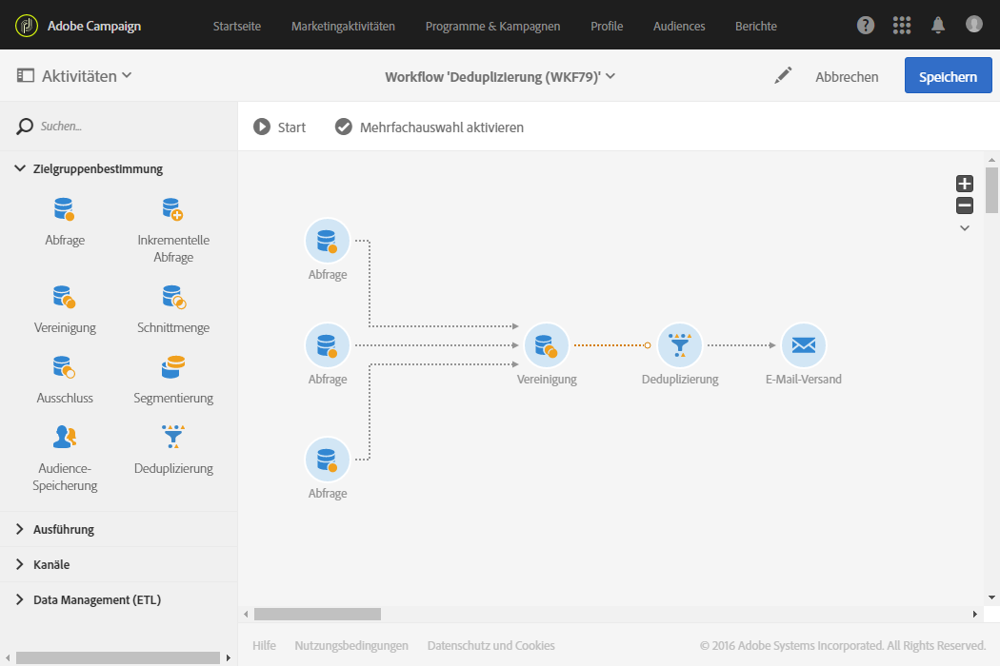
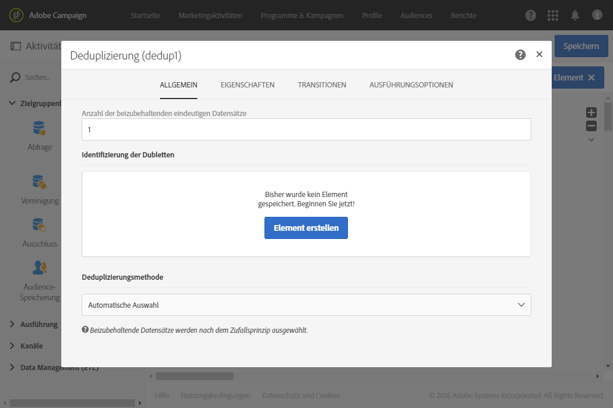
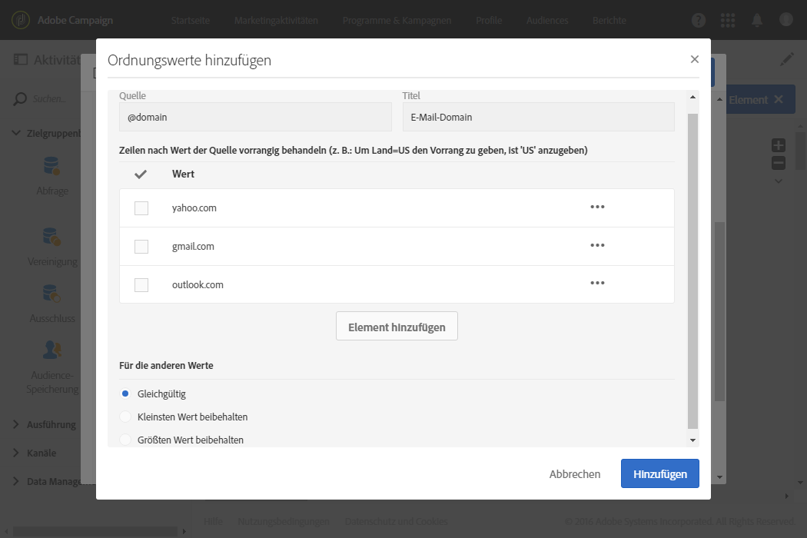
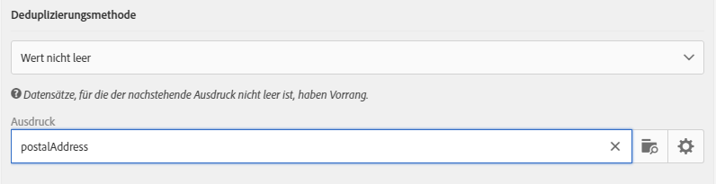

# Deduplizierung{#deduplication}

## Beschreibung {#description}

Mithilfe der Aktivität **[!UICONTROL Deduplizierung]** lassen sich Dubletten in Ergebnissen aus eingehenden Aktivitäten löschen.

## Anwendungskontext {#context-of-use}

Die Aktivität **[!UICONTROL Deduplizierung]** wird im Allgemeinen im Anschluss an Zielgruppenbestimmungs- oder Dateiimportaktivitäten und vor Aktivitäten verwendet, die dem Zieldatenverbrauch dienen.

Bei einer Deduplizierung werden die eingehenden Transitionen getrennt voneinander verarbeitet. Sollte beispielsweise ein Profil &#39;A&#39; sowohl im Ergebnis der Abfrage 1 als auch im Ergebnis der Abfrage 2 vorkommen, wird es nicht dedupliziert.

Deshalb ist es ratsam sicherzustellen, dass Deduplizierungen nur eine einzige eingehende Transition aufweisen. Hierfür können Sie Ihre unterschiedlichen Abfragen mithilfe von Aktivitäten wie Vereinigung, Schnittmenge etc. verknüpfen, die den Anforderungen Ihrer Zielgruppenbestimmung gerecht werden, z. B.:

**Verwandte Themen**

* [Verwendungsfall: Identifizieren von Duplikaten vor einem Versand](../../automating/using/identifying-duplicated-before-delivery.md)
* [Verwendungsfall: Deduplizieren der Daten aus einer importierten Datei](../../automating/using/deduplicating-data-imported-file.md)

## Konfiguration {#configuration}

Zur Konfiguration einer Deduplizierung müssen Sie ihren Titel, Deduplizierungsmethode und -kriterien sowie die das Ergebnis betreffenden Optionen angeben.

1. Ziehen Sie eine **[!UICONTROL Deduplizierung]** in den Workflow-Arbeitsbereich.
1. Markieren Sie die Aktivität und öffnen Sie sie mithilfe der im Schnellzugriff angezeigten Schaltfläche .

   

1. Wählen Sie den **[!UICONTROL Ressourcentyp]** aus, den Sie deduplizieren möchten:

   * **[!UICONTROL Datenbank-Ressource]**, wenn sich die Deduplizierung auf bereits in der Datenbank existierende Daten bezieht. Wählen Sie die **[!UICONTROL Filterdimension]** und die **[!UICONTROL Zielgruppendimension]** entsprechend den Daten aus, die Sie deduplizieren möchten. Standardmäßig bezieht sich die Deduplizierung auf **Profile**.
   * **[!UICONTROL Temporäre Ressource]**, wenn sich die Deduplizierung auf temporäre Daten des Workflows bezieht: Wählen Sie die **[!UICONTROL Zielmenge]** mit den zu deduplizierenden Daten aus. Dieser Fall kann im Anschluss an einen Dateiimport auftreten oder wenn die Daten der Datenbank angereichert wurden (z. B. mit einem Segmentcode).

1. Bestimmen Sie die **[!UICONTROL Anzahl der beizubehaltenden eindeutigen Datensätze]**. Der Standardwert dieses Felds ist 1. Mittels des Werts 0 lassen sich alle Dubletten beibehalten.

   Nehmen wir z. B. den Fall, dass die Datensätze A und B wie Dubletten des Datensatzes Y und ein Datensatz C wie eine Dublette des Datensatzes Z angesehen werden:

   * Wenn der Wert des Felds 1 ist: nur die Datensätze Y und Z werden beibehalten.
   * Wenn der Wert des Felds 0 ist: alle Datensätze werden beibehalten.
   * Wenn der Wert des Felds 2 ist: Die Datensätze C und Z werden beibehalten und von den Datensätzen A, B und Y werden zwei entweder nach dem Zufallsprinzip oder in Abhängigkeit von der im Anschluss ausgewählten Deduplizierungsmethode beibehalten.

1. Definieren Sie die Kriterien zur **[!UICONTROL Identifizierung der Dubletten]**, indem Sie der dafür vorgesehenen Liste Bedingungen hinzufügen. Geben Sie die Felder und/oder Ausdrücke an, für die sich mittels identischer Werte Dubletten identifizieren lassen: E-Mail-Adresse, Nachname, Vorname etc. Mithilfe der Reihenfolge der Bedingungen lässt sich die Priorität ihrer Bearbeitung bestimmen.
1. Wählen Sie aus der Dropdown-Liste die **[!UICONTROL Deduplizierungsmethode]** aus:

   * **[!UICONTROL Automatische Auswahl]**: wählt nach dem Zufallsprinzip unter den Dubletten den beizubehaltenden Datensatz aus.
   * **[!UICONTROL Gemäß einer Werteliste]**: ermöglicht die Bestimmung einer Reihenfolge nach Priorität von Werten für ein oder mehrere Felder. Wählen Sie zur Bestimmung dieser Werte ein Feld aus oder erstellen Sie einen Ausdruck, fügen Sie dann den oder die Werte der entsprechenden Tabelle hinzu. Verwenden Sie die Schaltfläche **[!UICONTROL Hinzufügen]** oberhalb der Werteliste, um ein neues Feld zu definieren.

      

   * **[!UICONTROL Wert nicht leer]**: hiermit lassen sich vornehmlich jene Datensätze beibehalten, für die der Wert des ausgewählten Ausdrucks nicht leer ist.

      

   * **[!UICONTROL Von einem Ausdruck ausgehend]**: hiermit lassen sich Datensätze beibehalten, für die der angegebene Ausdruck den kleinsten oder größten Wert aufweist.

      

1. Bei Bedarf können Sie unter Verwendung von [Transitionen](../../automating/using/activity-properties.md) auf erweiterte Optionen zur Ausgabepopulation zugreifen.
1. Validieren Sie die Konfiguration der Aktivität und speichern Sie Ihren Workflow.
