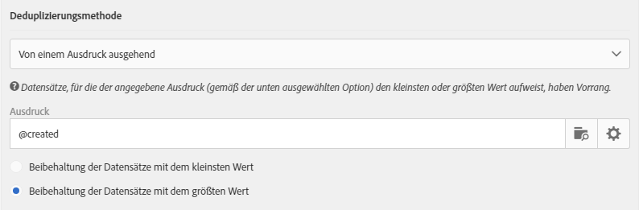
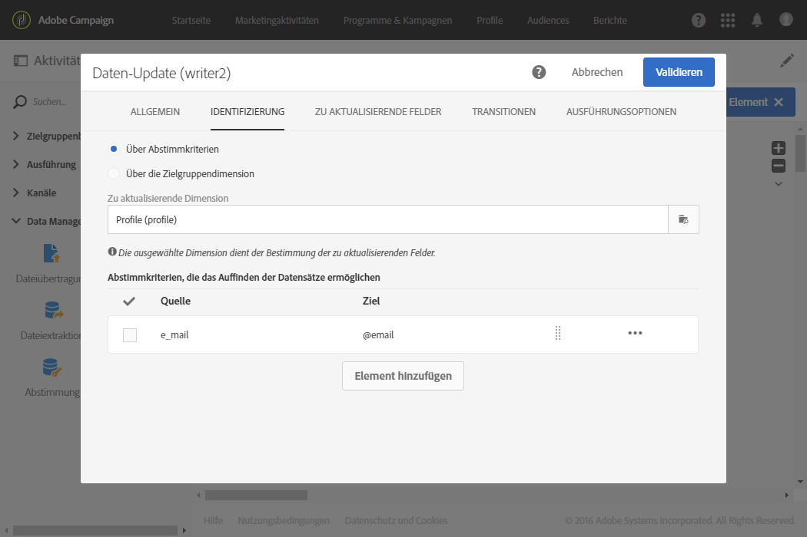
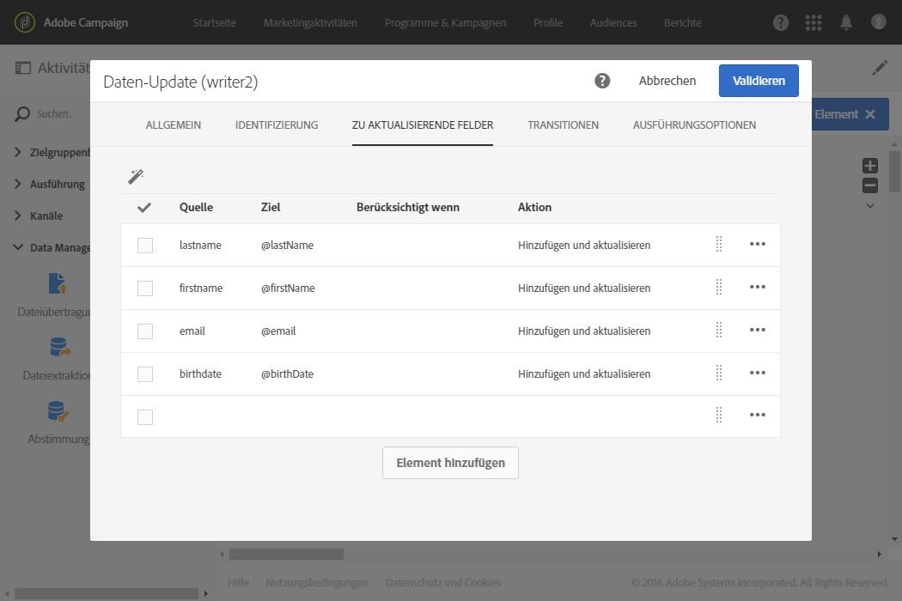

# Deduplizierung{#deduplication}

## Beschreibung {#description}


Mithilfe der Aktivität **[!UICONTROL Deduplizierung]** lassen sich Dubletten in Ergebnissen aus eingehenden Aktivitäten löschen.

## Anwendungskontext {#context-of-use}

Die Aktivität **[!UICONTROL Deduplizierung]** wird im Allgemeinen im Anschluss an Zielgruppenbestimmungs- oder Dateiimportaktivitäten und vor Aktivitäten verwendet, die dem Zieldatenverbrauch dienen.

Bei einer Deduplizierung werden die eingehenden Transitionen getrennt voneinander verarbeitet. Sollte beispielsweise ein Profil &#39;A&#39; sowohl im Ergebnis der Abfrage 1 als auch im Ergebnis der Abfrage 2 vorkommen, wird es nicht dedupliziert.

Deshalb ist es ratsam sicherzustellen, dass Deduplizierungen nur eine einzige eingehende Transition aufweisen. Hierfür können Sie Ihre unterschiedlichen Abfragen mithilfe von Aktivitäten wie Vereinigung, Schnittmenge etc. verknüpfen, die den Anforderungen Ihrer Zielgruppenbestimmung gerecht werden, z. B.:


## Konfiguration {#configuration}

Zur Konfiguration einer Deduplizierung müssen Sie ihren Titel, Deduplizierungsmethode und -kriterien sowie die das Ergebnis betreffenden Optionen angeben.

1. Ziehen Sie eine **[!UICONTROL Deduplizierung]** in den Workflow-Arbeitsbereich.
1. Markieren Sie die Aktivität und öffnen Sie sie mithilfe der im Schnellzugriff angezeigten Schaltfläche .

   

1. Wählen Sie den **[!UICONTROL Ressourcentyp]** aus, den Sie deduplizieren möchten:

   * **[!UICONTROL Datenbank-Ressource]**, wenn sich die Deduplizierung auf bereits in der Datenbank existierende Daten bezieht. Wählen Sie die **[!UICONTROL Filterdimension]** und die **[!UICONTROL Zielgruppendimension]** entsprechend den Daten aus, die Sie deduplizieren möchten. Standardmäßig bezieht sich die Deduplizierung auf **Profile**.
   * **[!UICONTROL Temporäre Ressource]**, wenn sich die Deduplizierung auf temporäre Daten des Workflows bezieht: Wählen Sie die **[!UICONTROL Zielmenge]** mit den zu deduplizierenden Daten aus. Dieser Fall kann im Anschluss an einen Dateiimport auftreten oder wenn die Daten der Datenbank angereichert wurden (z. B. mit einem Segmentcode).

1. Bestimmen Sie die **[!UICONTROL Anzahl der beizubehaltenden eindeutigen Datensätze]**. Der Standardwert dieses Felds ist 1. Mittels des Werts 0 lassen sich alle Dubletten beibehalten.

   Nehmen wir z. B. den Fall, dass die Datensätze A und B wie Dubletten des Datensatzes Y und ein Datensatz C wie eine Dublette des Datensatzes Z angesehen werden:

   * Wenn der Wert des Felds 1 ist: nur die Datensätze Y und Z werden beibehalten.
   * Wenn der Wert des Felds 0 ist: alle Datensätze werden beibehalten.
   * Wenn der Wert des Felds 2 ist: Die Datensätze C und Z werden beibehalten und von den Datensätzen A, B und Y werden zwei entweder nach dem Zufallsprinzip oder in Abhängigkeit von der im Anschluss ausgewählten Deduplizierungsmethode beibehalten.

1. Definieren Sie die Kriterien zur **[!UICONTROL Identifizierung der Dubletten]**, indem Sie der dafür vorgesehenen Liste Bedingungen hinzufügen. Geben Sie die Felder und/oder Ausdrücke an, für die sich mittels identischer Werte Dubletten identifizieren lassen: E-Mail-Adresse, Nachname, Vorname etc. Mithilfe der Reihenfolge der Bedingungen lässt sich die Priorität ihrer Bearbeitung bestimmen.
1. Wählen Sie aus der Dropdown-Liste die **[!UICONTROL Deduplizierungsmethode]** aus:

   * **[!UICONTROL Automatische Auswahl]**: wählt nach dem Zufallsprinzip unter den Dubletten den beizubehaltenden Datensatz aus.
   * **[!UICONTROL Gemäß einer Werteliste]**: ermöglicht die Bestimmung einer Reihenfolge nach Priorität von Werten für ein oder mehrere Felder. Wählen Sie zur Bestimmung dieser Werte ein Feld aus oder erstellen Sie einen Ausdruck, fügen Sie dann den oder die Werte der entsprechenden Tabelle hinzu. Verwenden Sie die Schaltfläche **[!UICONTROL Hinzufügen]** oberhalb der Werteliste, um ein neues Feld zu definieren.

      

   * **[!UICONTROL Wert nicht leer]**: hiermit lassen sich vornehmlich jene Datensätze beibehalten, für die der Wert des ausgewählten Ausdrucks nicht leer ist.

      

   * **[!UICONTROL Von einem Ausdruck ausgehend]**: hiermit lassen sich Datensätze beibehalten, für die der angegebene Ausdruck den kleinsten oder größten Wert aufweist.

      

1. Bei Bedarf können Sie unter Verwendung von [Transitionen](../../automating/using/activity-properties.md) auf erweiterte Optionen zur Ausgabepopulation zugreifen.
1. Validieren Sie die Konfiguration der Aktivität und speichern Sie Ihren Workflow.

## Beispiel 1: Dubletten vor einem Versand identifizieren {#example-1--identifying-duplicates-before-a-delivery}

Das folgende Beispiel zeigt eine Deduplizierung, mithilfe derer die Dubletten einer Zielgruppe vor dem Versand einer E-Mail ausgeschlossen werden können. Dadurch lässt sich vermeiden, eine Information mehrmals an ein und dasselbe Profil zu schicken.

Der Workflow setzt sich folgendermaßen zusammen:


* **[!UICONTROL Abfrage]** zur Bestimmung der Zielgruppe der E-Mail. Im vorliegenden Beispiel zielt der Workflow auf all jene Profile im Alter zwischen 18 und 25 Jahren ab, die seit mehr als einem Jahr in der Kundendatenbank sind.

   

* **[!UICONTROL Deduplizierung]** zur Identifizierung der aus der vorangehenden Abfrage hervorgehenden Dubletten. Im vorliegenden Beispiel wird für jede Dublette ein einziger Datensatz beibehalten. Die Dubletten werden mittels der E-Mail-Adresse identifiziert. Auf diese Weise kann ein E-Mail-Versand nur ein einziges Mal an jede in der Zielgruppenbestimmung enthaltene E-Mail-Adresse gesendet werden.

   Bei der ausgewählten Deduplizierungsmethode handelt es sich um **[!UICONTROL Wert nicht leer]**. Dadurch kann sichergestellt werden, dass es sich bei den im Fall von Dubletten beibehaltenen Datensätzen vornehmlich um diejenigen handelt, bei denen das Feld **Vorname** ausgefüllt ist. Dies ist insbesondere dann empfehlenswert, wenn der Vorname in den Personalisierungsfeldern des E-Mail-Inhalts verwendet wird.

   Des Weiteren wird eine komplementäre Transition erzeugt, um die Dubletten beizubehalten und sie auflisten zu können.

   

* **[!UICONTROL E-Mail-Versand]**, der im Anschluss an die ausgehende Haupttransition der Deduplizierung platziert wird. Die Konfiguration von E-Mail-Sendungen wird im Abschnitt [E-Mail-Versand](../../automating/using/email-delivery.md) beschrieben.
* **[!UICONTROL Audience-Speicherung]**, die im Anschluss an die komplementäre Transition der Deduplizierung platziert wird, um die Dubletten in einer **Dubletten**-Audience zu speichern. Diese Audience kann in der Folge wiederverwendet werden, um ihre Mitglieder direkt von jeglichem E-Mail-Versand auszuschließen.

## Beispiel 2: Daten einer importierten Datei deduplizieren {#example-2--deduplicating-the-data-from-an-imported-file}

In diesem Beispiel wird gezeigt, wie sich Daten einer importierten Datei vor dem Laden in die Datenbank deduplizieren lassen. Mithilfe dieses Prozesses lässt sich die Qualität der in die Datenbank geladenen Daten verbessern.

Der Workflow setzt sich folgendermaßen zusammen:


* **[!UICONTROL Datei-laden]**-Aktivität zum Import einer Datei, die eine Profilliste enthält. In unserem Beispiel weist die importierte Datei das .csv-Format auf und enthält 10 Profile:

   ```
   lastname;firstname;dateofbirth;email
   Smith;Hayden;23/05/1989;hayden.smith@example.com
   Mars;Daniel;17/11/1987;dannymars@example.com
   Smith;Clara;08/02/1989;hayden.smith@example.com
   Durance;Allison;15/12/1978;allison.durance@example.com
   Lucassen;Jody;28/03/1988;jody.lucassen@example.com
   Binder;Tom;19/01/1982;tombinder@example.com
   Binder;Tommy;19/01/1915;tombinder@example.com
   Connor;Jade;10/10/1979;connor.jade@example.com
   Mack;Clarke;02/03/1985;clarke.mack@example.com
   Ross;Timothy;04/07/1986;timross@example.com
   ```

   Diese Datei kann außerdem als Beispieldatei zur Erkennung und Definition des Spaltenformats dienen. Prüfen Sie im **[!UICONTROL Spaltendefinition]**-Tab, ob jede Spalte der importierten Datei korrekt konfiguriert ist.

   

* **[!UICONTROL Deduplizierung]**-Aktivität. Die Deduplizierung erfolgt direkt nach dem Dateiimport und vor der Einfügung der Daten in die Datenbank. Man muss sich folglich auf die aus der **[!UICONTROL Datei-laden]**-Aktivität hervorgehende **[!UICONTROL Temporäre Ressource]** stützen.

   Im vorliegenden Beispiel soll pro in der Datei enthaltener E-Mail-Adresse ausschließlich ein Eintrag beibehalten werden. Die Identifizierung der Dubletten erfolgt also mittels der Spalte **email** der temporären Ressource. Nun tauchen zwei E-Mail-Adressen aber jeweils zweimal in der Datei auf. Zwei Zeilen werden also als Dubletten angesehen.

   

* **[!UICONTROL Daten-Update]**-Aktivität zur Einfügung der nach der Deduplizierung beibehaltenen Daten in die Datenbank. Die importierten Daten werden erst zum Zeitpunkt des Daten-Updates als der Profildimension zugehörig identifiziert.

   Als Aktionstyp wurde im vorliegenden Beispiel **[!UICONTROL Nur hinzufügen]** gewählt, um noch nicht vorhandene Profile in die Datenbank aufzunehmen. Als Abstimmschlüssel werden dabei die &#39;email&#39;-Spalte der Datei und das E-Mail-Feld der **Profil**-Dimension verwendet.

   

   Führen Sie im Tab **[!UICONTROL Zu aktualisierende Felder]** das Mapping zwischen den Dateispalten, deren Daten Sie einfügen möchten, und den entsprechenden Feldern der Datenbank durch.

   

Starten Sie nun den Workflow. Die nach der Deduplizierung beibehaltenen Datensätze werden nun den Profilen Ihrer Datenbank hinzugefügt.
