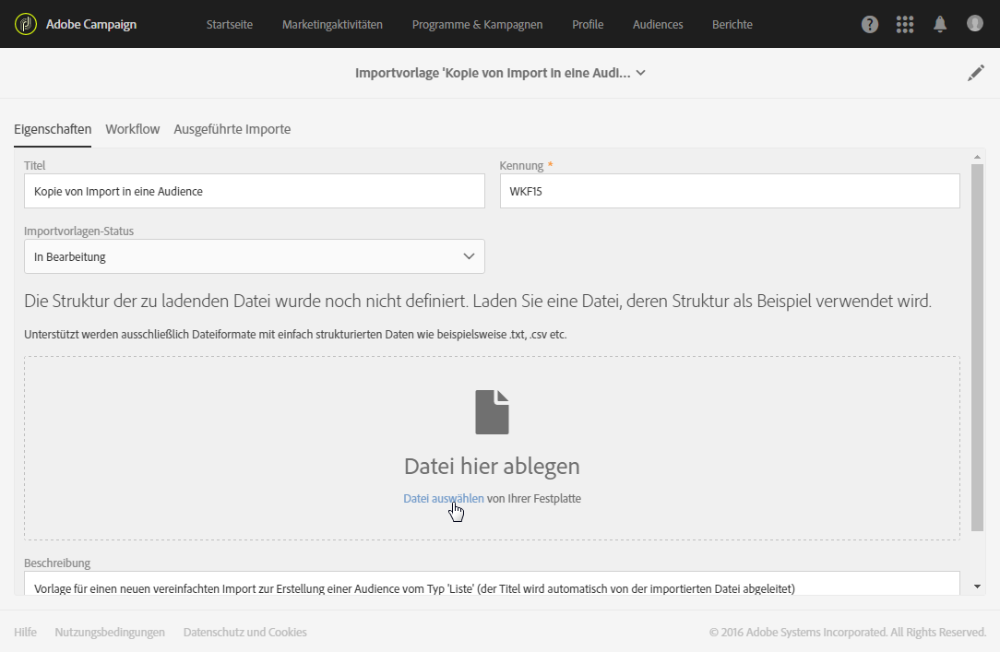
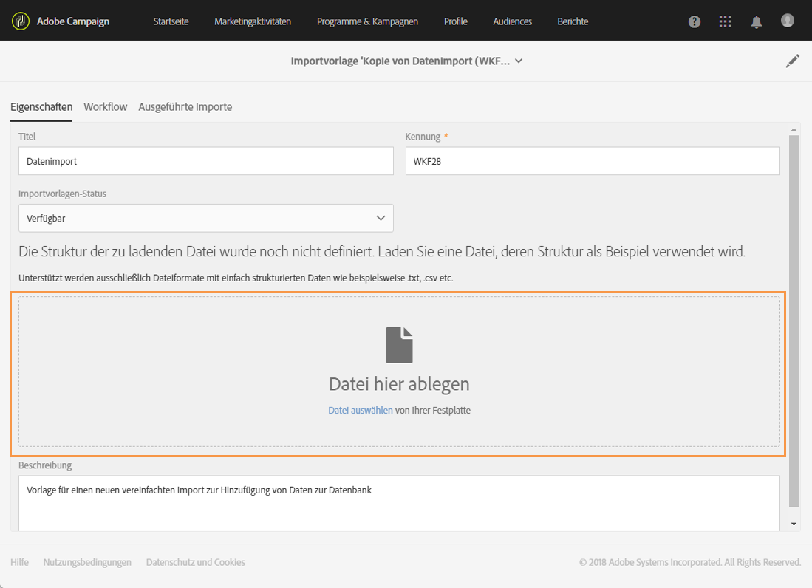
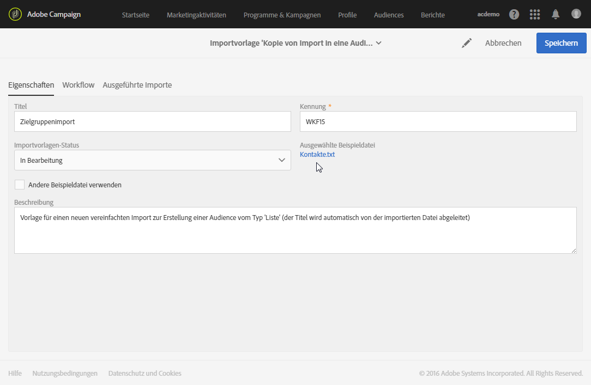
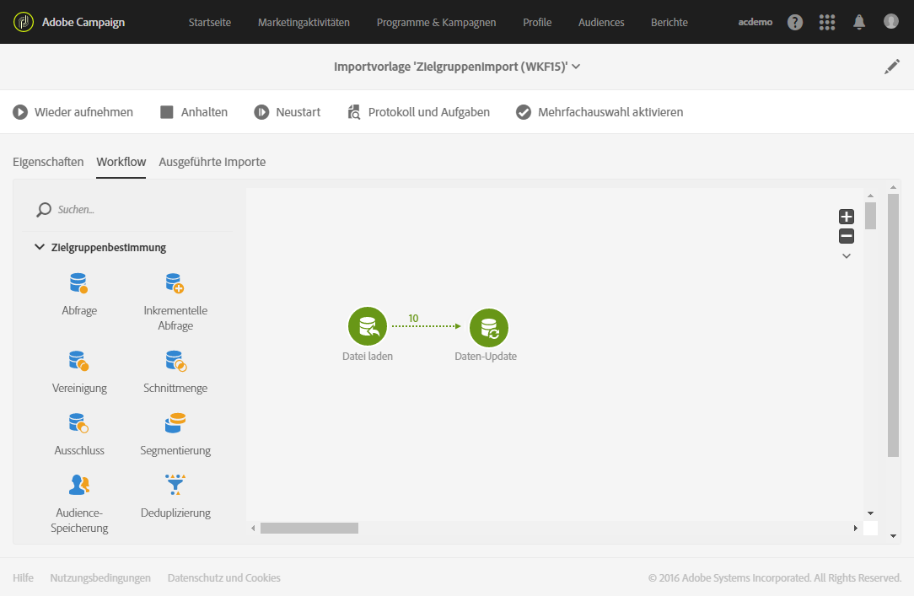

# Importvorlagen konfigurieren{#defining-import-templates}

Mit Importvorlagen kann der Administrator gewisse technische Importparameter konfigurieren. Diese Vorlagen können dann den Standardbenutzern zur Verfügung gestellt werden, um Datei-Uploads durchzuführen.

An import template is defined by the functional administrator and can be managed under the **[!UICONTROL Resources]** > **[!UICONTROL Templates]** > **[!UICONTROL Import templates]** menu.

Drei schreibgeschützte Vorlagen stehen standardmäßig zur Verfügung:

* **[!UICONTROL Update Direct mail quarantines and delivery logs]**: Diese Vorlage kann als Grundlage für neue Importe dienen, um Quarantänen und Versandlogs zur Briefpost zu aktualisieren. Der dieser Vorlage zugrunde liegende Workflow enthält die folgenden Aktivitäten:
* **[!UICONTROL Import data]**: Diese Vorlage kann als Grundlage für neue Importe dienen, um Daten aus einer Datei in die Datenbank einzufügen. Der dieser Vorlage zugrunde liegende Workflow enthält die folgenden Aktivitäten:

   * **[!UICONTROL Load file]**: Mit dieser Aktivität können Sie eine Datei auf den Adobe Campaign-Server hochladen.
   * **[!UICONTROL Update data]**: Mit dieser Aktivität können Sie Daten aus der Datei in die Datenbank einfügen.

* **[!UICONTROL Import list]**: Diese Vorlage kann als Grundlage für neue Importe dienen, um eine Audience vom Typ &quot; **Liste** &quot;aus Daten in einer Datei zu erstellen. Der dieser Vorlage zugrunde liegende Workflow enthält die folgenden Aktivitäten:

   * **[!UICONTROL Load file]**: Mit dieser Aktivität können Sie eine Datei auf den Adobe Campaign-Server hochladen.
   * **[!UICONTROL Reconciliation]**: Mit dieser Aktivität können Sie eine Zielgruppendimension mit importierten Daten verknüpfen. Dies erlaubt im Anschluss die Erstellung einer Audience vom Typ **Liste**. Sollte die Zielgruppendimension der importierten Daten nicht bekannt sein, ist die erstellte Audience vom Typ **Datei**. Siehe [Zielgruppendimensionen und Ressourcen](../../automating/using/query.md#targeting-dimensions-and-resources).
   * **[!UICONTROL Save audience]**: Mit dieser Aktivität können Sie importierte Daten in Form einer Audience vom Typ **Liste** speichern. Der Name der gespeicherten Audience entspricht dem Namen der importierten Datei, dem das Datum und die Uhrzeit des Imports als Suffix beigefügt werden. Beispiel: &#39;profiles_20150406_151448&#39;.

Diese Standardvorlagen sind schreibgeschützt und für Standardbenutzer nicht sichtbar. Um eine Vorlage zu erstellen, die Benutzer verwenden können, gehen Sie folgendermaßen vor:

1. Duplizieren Sie eine der Standardvorlagen. Die duplizierte Vorlage enthält drei Tabs:

   * **[!UICONTROL Properties]**: die allgemeinen Parameter der Importvorlage. Dieser Tab ermöglicht es insbesondere, die Vorlage zu aktivieren und eine Beispieldatei zu laden.
   * **[!UICONTROL Workflow]**: Importarbeitsablauf. In diesem Tab werden die einzelnen Aktivitäten zur Ausführung des Imports definiert. Diese sind für den Benutzer, der sich letztlich des vereinfachten Imports bedient, nicht sichtbar.
   * **[!UICONTROL Executed imports]**: Liste der Einfuhren, die unter Verwendung dieses Meldebogens durchgeführt wurden. Angezeigt werden Status, Details und Ergebnisse aller auf der Vorlage beruhenden Importe. Von dieser Liste aus können Sie direkt auf den (für den Import durchführenden Endbenutzer verborgen ausgeführten) Workflow zugreifen.

1. From the **[!UICONTROL Properties]** tab, rename the template and add a description. Letztere ist für die Benutzer sichtbar, sobald die Vorlage verfügbar gemacht wurde.

   

1. Go to the **[!UICONTROL Workflow]** tab. Ergänzen Sie hier bei Bedarf den standardmäßig angebotenen Workflow mit weiteren Aktivitäten.

   Weiterführende Informationen zur Konfiguration der Workflow-Aktivitäten erfahren Sie im Anwendungsbeispiel in diesem Abschnitt: [Beispiel: Import-Workflow-Vorlage](../../automating/using/importing-data.md#example--import-workflow-template). In diesem Anwendungsbeispiel wird gezeigt, wie ein Workflow für den wiederholten Import von Profilen aus einer CRM-Lösung in der Adobe-Campaign-Datenbank erstellt wird.

1. Speichern Sie die Vorlage, damit die Konfiguration des Workflows berücksichtigt wird.
1. Upload a sample file from the **[!UICONTROL Properties]** tab. Neben den für den Import erforderlichen Spalten kann die Beispieldatei auch Daten enthalten, die es ermöglichen, den vereinfachten Import nach der Workflow-Erstellung zu testen. Die Beispieldatei steht nun auch späteren Benutzern zur Verfügung, die mithilfe der Vorlage einen Import durchführen.

   

   Sie kann beispielsweise heruntergeladen und mit den zu importierenden Daten ausgefüllt werden. Dieser Zweck sollte bei der Auswahl der Beispieldatei berücksichtigt werden. Speichern Sie die Vorlage.

1. Die Beispieldatei wird fortan berücksichtigt. Sie können sie jederzeit lokal herunterladen, um ihren Inhalt zu prüfen. At any moment you can download it to your computer to check the content, or modify it by checking the **[!UICONTROL Drop a new sample file]** option.

   

1. Go back to the **[!UICONTROL Workflow]** tab and open the **[!UICONTROL Load file]** activity to check and adjust the column configuration of the sample file that was uploaded at the previous step.
1. Testen Sie den Import, indem Sie den Workflow starten. Hierzu muss die im Schritt **5** geladene Beispieldatei Daten enthalten.

   Die Daten der Beispieldatei werden dann importiert. Verwenden Sie fiktive Daten in geringem Umfang, um die Kapazität Ihrer Datenbank nicht zu überfordern.

1. Prüfen Sie nun das Workflow-Ausführungsprotokoll, auf das Sie über die entsprechende Schaltfläche in der Symbolleiste zugreifen können. Sollten Fehler aufgetreten sein, ist die Konfiguration der Aktivitäten zu prüfen.

   

1. Legen Sie auf der **[!UICONTROL Properties]** Registerkarte den Wert **[!UICONTROL Import template status]** auf fest **[!UICONTROL Available]** und speichern Sie dann die Vorlage. Um die Verwendung dieser Vorlage zu beenden, können Sie die Einstellung **[!UICONTROL Import template status]** auf **[!UICONTROL Archived]**.

The template workflow can be modified by re-uploading the sample file and checking the **[!UICONTROL Load file]** configuration.

Die Importvorlage ist jetzt für Benutzer zum Hochladen von Dateien verfügbar.

**Verwandte Themen:**

* [Workflows](../../automating/using/get-started-workflows.md)
* [Daten importieren](../../automating/using/importing-data.md)
* [Beispiel: Import-Workflow-Vorlage](../../automating/using/importing-data.md#example--import-workflow-template)

