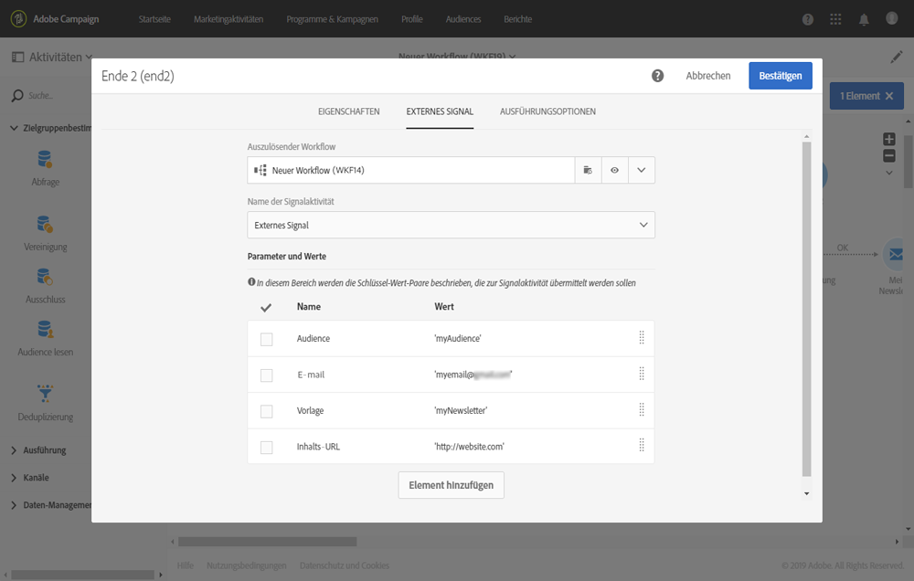

# Parameter beim Aufruf des Workflows definieren {#defining-the-parameters-when-calling-the-workflow}

In diesem Abschnitt wird beschrieben, wie Sie Parameter beim Aufruf eines Workflows definieren können. Weiterführende Informationen zur Durchführung dieses Vorgang mit einem API-Aufruf finden Sie in der [REST-APIs-Dokumentation](../../api/using/triggering-a-signal-activity.md).

Vor der Definition der Parameter müssen folgende Voraussetzungen gegeben sein:

* Die Parameter wurden in der Aktivität **[!UICONTROL Externes Signal]** deklariert. Weiterführende Informationen finden Sie auf [dieser Seite](../../automating/using/declaring-parameters-external-signal.md).
* Der Workflow, der die Signalaktivität enthält, wird ausgeführt.

Gehen Sie zur Konfiguration der **[!UICONTROL Ende]**-Aktivität folgendermaßen vor:

1. Öffnen Sie die Aktivität **[!UICONTROL Ende]** und wählen Sie dann den Tab **[!UICONTROL Externes Signal]** aus.
1. Wählen Sie den Workflow und die Aktivität &quot;Externes Signal&quot; aus, die aufgerufen werden sollen.
1. Wählen Sie die Schaltfläche **[!UICONTROL Element erstellen]** aus, um einen Parameter hinzuzufügen. Geben Sie dann Namen und Wert ein.

   * **[!UICONTROL Name]**: der Name, der in der Aktivität **[!UICONTROL Externes Signal]** angegeben wurde (siehe [diese Seite](../../automating/using/declaring-parameters-external-signal.md)).
   * **[!UICONTROL Wert]**: der Wert, der dem Parameter zugewiesen werden soll. Der Wert sollte der **Standardsyntax** entsprechen, die in [diesem Abschnitt](../../automating/using/advanced-expression-editing.md#standard-syntax) beschrieben wird.

   

   >[!CAUTION]
   >
   >Stellen Sie sicher, dass alle Parameter in der Aktivität **[!UICONTROL Externes Signal]** deklariert wurden. Andernfalls tritt ein Fehler beim Ausführen der Aktivität auf.

1. Bestätigen Sie nach der Definition der Parameter die Aktivität und speichern Sie Ihren Workflow.
