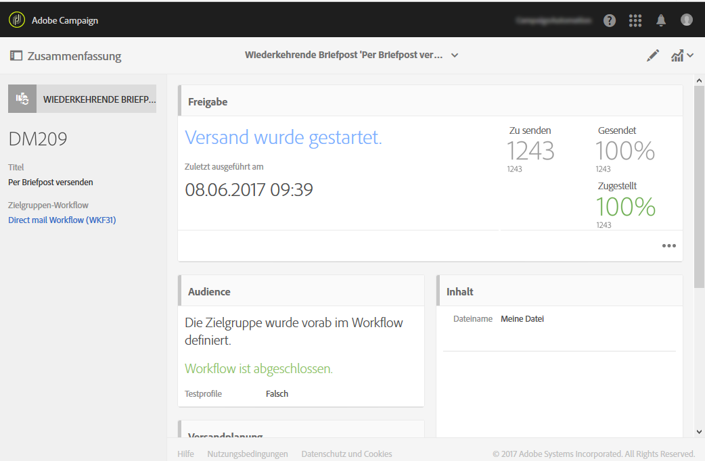
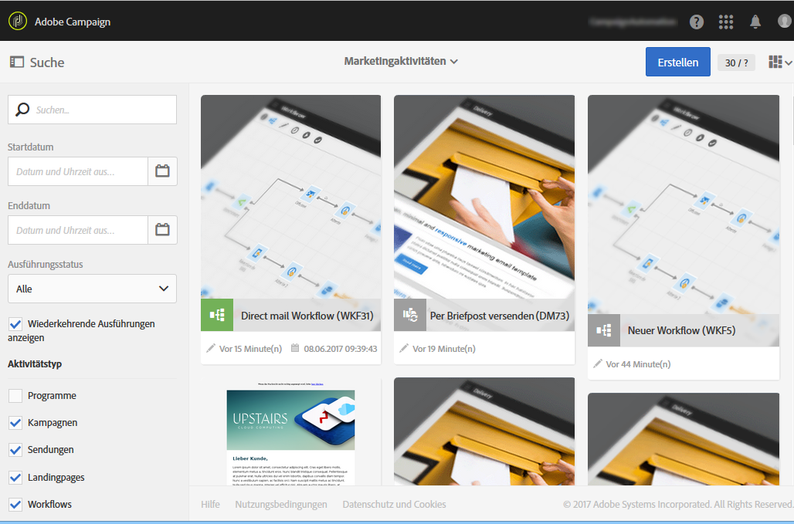
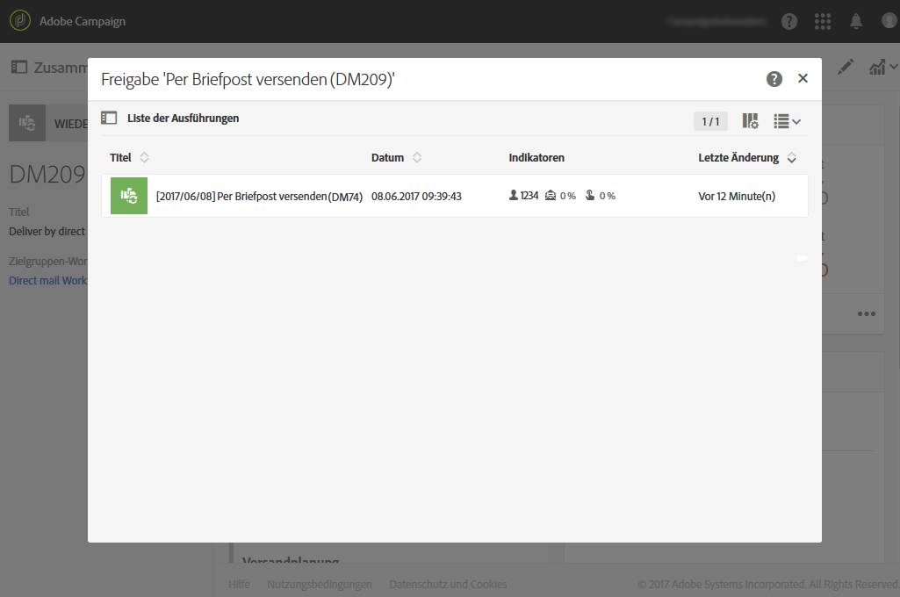

# Briefpost-Versand{#direct-mail-delivery}

## Beschreibung {#description}

Mit der Aktivität **[!UICONTROL Briefpost-Versand]**können Sie eine Datei mit Profildaten für eine Briefpost-Kampagne konfigurieren und vorbereiten. Dabei kann es sich um Briefpost handeln, die nur einmal gesendet wird, oder um** wiederkehrende **Briefpost.

Standardmäßig wird Briefpost einmal gesendet.

Wiederkehrende Versandaktionen ermöglichen den wiederholten Versand der gleichen Briefpost an verschiedene Zielgruppen. Für Berichtzwecke können bei Bedarf die einzelnen Sendungen nach Zeiträumen aggregiert werden.

## Anwendungskontext   {#context-of-use}

Die Aktivität **[!UICONTROL Briefpost-Versand]**wird normalerweise verwendet, um automatisch eine Datei vorzubereiten, die Profildaten enthält. Diese Datei kann anschließend an einen Partner/Dienstleister gesendet werden, der für den eigentlichen Versand zuständig ist.

In Verbindung mit einer Planungsaktivität kann wiederkehrende Briefpost konfiguriert werden.

Briefpostempfänger werden in vorangeschalteten Zielgruppenbestimmungsaktivitäten des Workflows wie beispielsweise Abfragen, Schnittmengen etc. definiert. Profile ohne Anschrift werden bei der Vorbereitung der Briefpost automatisch ausgeschlossen.

Die Vorbereitung der Nachricht wird in Abhängigkeit von den Ausführungsparametern des Workflows ausgelöst. Sie können im Nachrichten-Dashboard auswählen, ob eine manuelle Bestätigung zum Nachrichtenversand erforderlich ist oder nicht (standardmäßig erforderlich). Sie können den Workflow entweder manuell starten oder eine Planung verwenden, um die Ausführung zu automatisieren.

## Konfiguration   {#configuration}

1. Ziehen Sie einen **[!UICONTROL Briefpost-Versand]**in Ihren Workflow.
1. Markieren Sie die Aktivität und öffnen Sie sie mithilfe der in den Quick Actions angezeigten Schaltfläche .

   >[!NOTE]
   >
   >Die Schaltfläche  in den Quick Actions bietet Zugriff auf die allgemeinen Eigenschaften und erweiterten Optionen der Aktivität (aber nicht des Versands selbst). Diese Schaltfläche ist spezifisch für die Kanalaktivitäten. Auf die Eigenschaften der Briefpost können Sie über die Symbolleiste ihres Briefpost-Dashboards zugreifen.

1. Wählen Sie den Versandtyp der Briefpost aus:

   * **[!UICONTROL Briefpost]**: Die Briefpost wird ein einziges Mal versendet. Sie können an dieser Stelle entscheiden, ob Sie der Aktivität eine ausgehende Transition hinzufügen möchten oder nicht. Die unterschiedlichen Transitionstypen werden in Etappe 7 dieser Prozedur beschrieben.
   * **[!UICONTROL Wiederkehrende Briefpost]**: Die Briefpost wird wiederholt versendet. Die Frequenz des Versands wird in einer vorangeschalteten**[!UICONTROL  Planung]** definiert. Wählen Sie einen Aggregatzeitraum für die wiederkehrenden Sendungen aus. Auf diese Weise werden alle Nachrichten, die im angegebenen Zeitraum versendet wurden, in einer Briefpost zusammengefasst, die auch **wiederkehrende Ausführung** genannt wird. Diese ist in der Marketingaktivitätenliste der Anwendung zugänglich.

      Es besteht beispielsweise die Möglichkeit, die Ausführungen einer täglich gesendeten Geburtstagsnachricht pro Monat zu aggregieren. Auf diese Weise lässt sich ein monatlicher Versandbericht für eine täglich gesendete Nachricht generieren.

      >[!NOTE]
      >
      >Bei wiederkehrender Briefpost wird bei jeder Ausführung des Workflows eine neue Datei erstellt. Der ausgewählte Aggregatzeitraum hat keine Auswirkungen auf dieses Verhalten.

1. Wählen Sie einen Briefpost-Typ aus. Die verschiedenen Briefpost-Typen entsprechen Vorlagen, die im Menü **[!UICONTROL Ressourcen]**>**[!UICONTROL  Vorlagen]** > **[!UICONTROL Versandvorlagen]**definiert sind.
1. Geben Sie die allgemeinen Eigenschaften der Briefpost an. und ordnen Sie sie gegebenenfalls einer existierenden Kampagne zu. Der Titel der Versandaktivität des Workflows wird mit dem Titel der Briefpost aktualisiert.
1. Erstellen Sie den Briefpost-Inhalt. Weiterführende Informationen hierzu finden Sie im Abschnitt [Inhaltseditor](../../designing/using/personalization.md).
1. Der **[!UICONTROL Briefpost-Versand]**verfügt standardmäßig über keinerlei ausgehende Transitionen. Sie haben jedoch die Möglichkeit, dem**[!UICONTROL  Briefpost-Versand]** eine ausgehende Transition hinzuzufügen. Öffnen Sie hierzu mithilfe der Schaltfläche **[!UICONTROL aus den Quick Actions der Aktivität die erweiterten Optionen und aktivieren Sie im Tab]**Allgemeineine der folgenden Optionen:

   * **[!UICONTROL Ausgehende Transition ohne Population hinzufügen]**: ermöglicht die Erstellung einer ausgehenden Transition, die exakt dieselbe Population enthält wie die eingehende Transition. Diese Transition enthält die Datei, die von der Briefpost-Aktivität erstellt wurde, sowie die ursprüngliche Population, die von der Briefpost-Aktivität erhalten wurde.
   * **[!UICONTROL Ausgehende Transition mit Population hinzufügen]**: ermöglicht die Erstellung einer ausgehenden Transition, die die Population enthält, der die Briefpost gesendet wird. Der Teil der Zielgruppe, der in der Vorbereitung der Briefpost ausgeschlossen wurde (Quarantäne, ungültige Adresse etc.), ist von dieser Transition ausgeschlossen. Die Transition enthält auch die von der Briefpost erstellte Datei.

1. Validieren Sie die Konfiguration der Aktivität und speichern Sie Ihren Workflow.

Wenn Sie die Aktivität später erneut öffnen, gelangen Sie direkt in das Dashboard der Briefpost. Nur der Inhalt kann zu diesem Zeitpunkt noch geändert werden.

Standardmäßig wird durch den Versand-Workflow nur die Vorbereitung der Nachricht ausgelöst. Der in einem Workflow erstellte Nachrichtenversand muss noch bestätigt werden, nachdem der Workflow gestartet wurde. Sie können aber im Nachrichten-Dashboard die Option **[!UICONTROL Vor dem Nachrichtenversand Bestätigung einholen]**deaktivieren. Dies ist jedoch nur möglich, wenn die Nachricht in einem Workflow erstellt wurde. Ist diese Option deaktiviert, werden Nachrichten ohne weiteren Hinweis gesendet, sobald die Vorbereitung abgeschlossen ist.

## Bemerkungen   {#remarks}

Auf die von einem Workflow aus erstellten Sendungen kann in der Marketingaktivitätenliste der Anwendung zugegriffen werden. Über das Dashboard lässt sich der Ausführungsstatus des Workflows visualisieren. Die Links im Übersichtsmenü der Briefpost ermöglichen einen direkten Zugriff auf verknüpfte Elemente (Workflow, Kampagne, Elternversand im Fall einer E-Mail zum wiederkehrenden Versand).

Die Ausführungen wiederkehrender Sendungen sind standardmäßig ausgeblendet. Um sie anzuzeigen, aktivieren Sie im Suchmenü der Marketing-Aktivitäten die Option **[!UICONTROL Wiederkehrende Ausführungen anzeigen]**.

Ausgehend von den Elternsendungen, auf die über die Marketing-Aktivitätenliste oder direkt über die verknüpften wiederkehrenden Ausführungen zugegriffen werden kann, lässt sich die Gesamtheit aller getätigten Sendungen visualisieren (in Abhängigkeit vom bei der Konfiguration des **[!UICONTROL Briefpost-Versands]**festgelegten Aggregatzeitraum). To do this, open the detail view of the parent delivery&#39;s**[!UICONTROL  Deployment]** block by selecting the  button.

## Beispiel {#example}

Ein Anwendungsbeispiel für den **[!UICONTROL Briefpost-Versand]**ist im Kapitel[Briefpost](../../channels/using/example-of-direct-mail-in-a-workflow.md)verfügbar.
