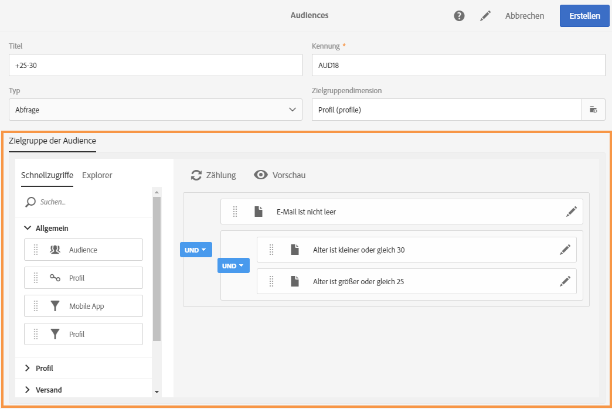
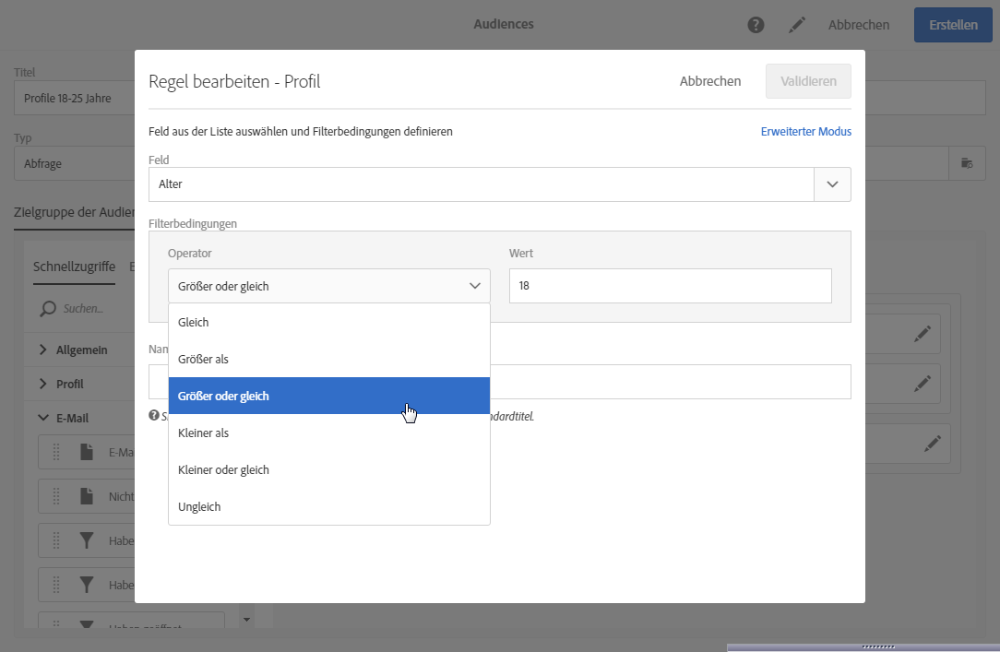
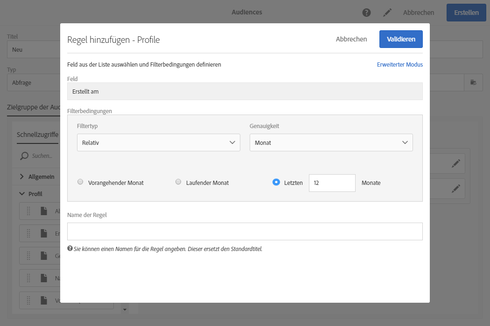
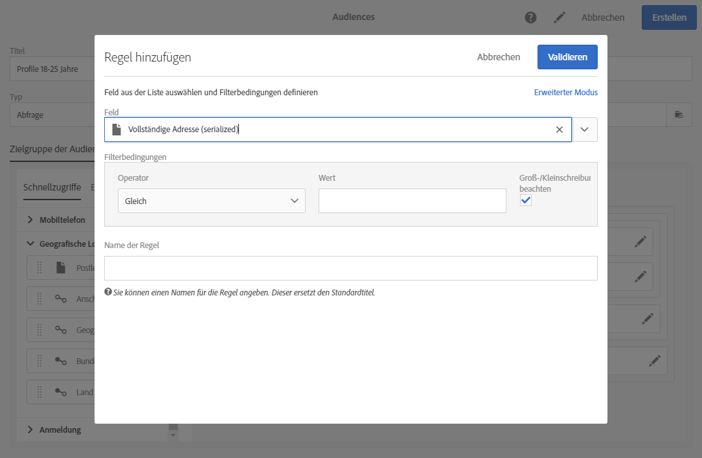
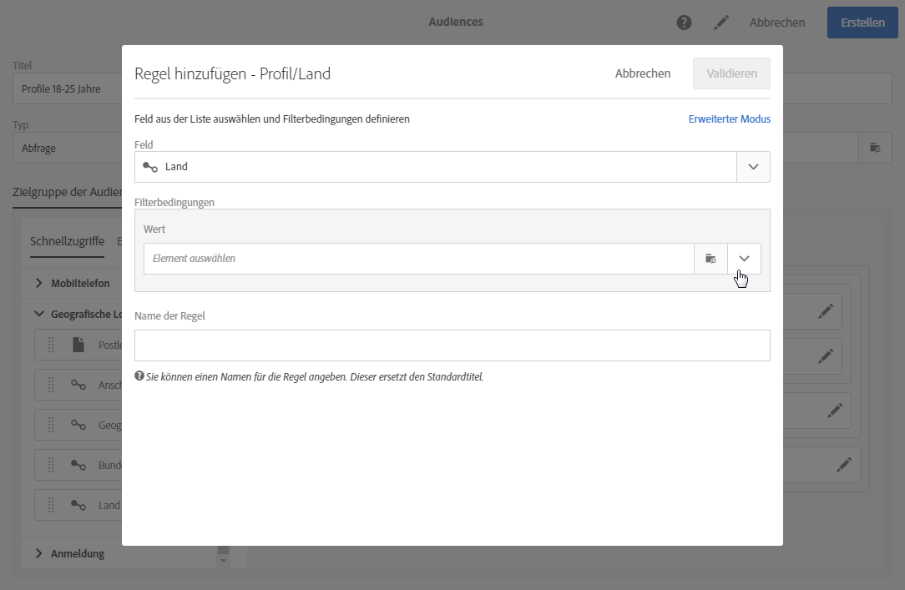
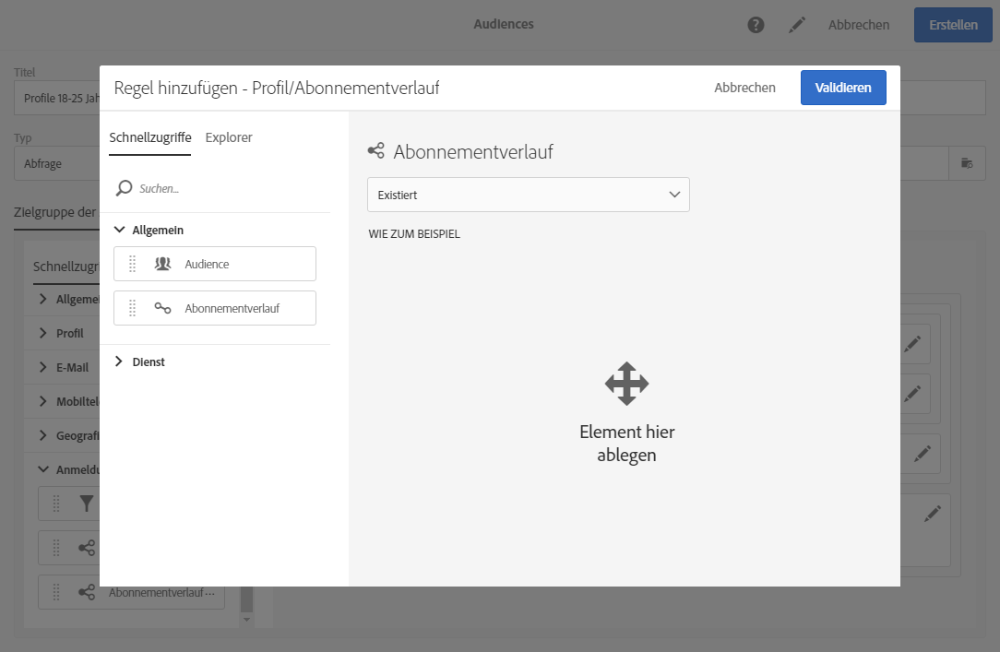
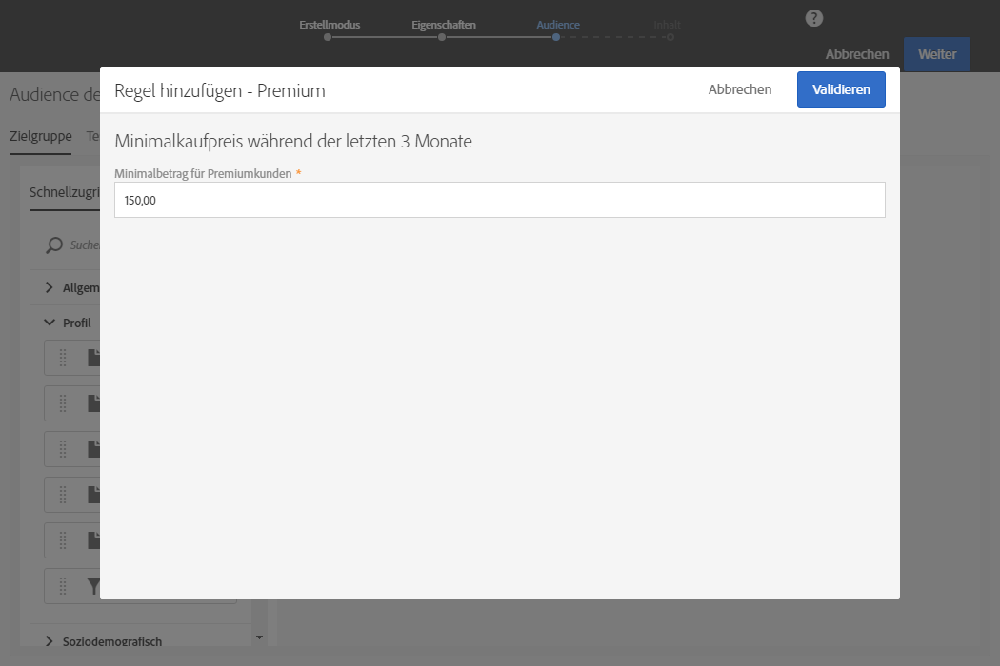
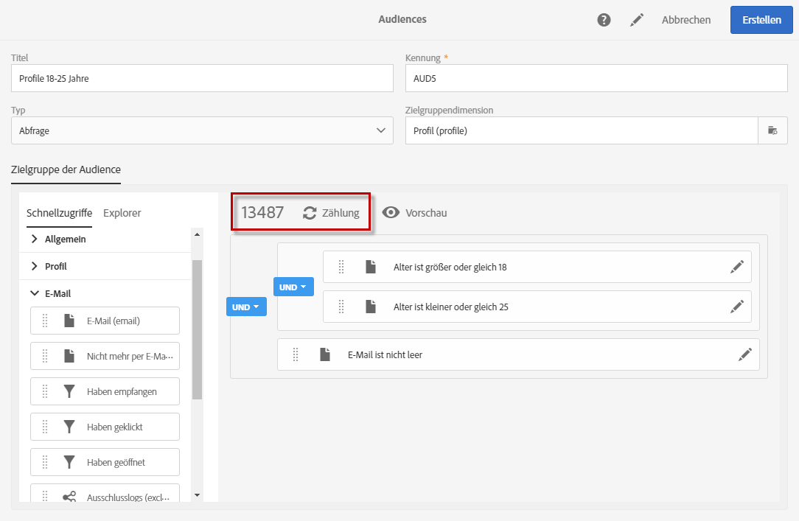

# Abfrageeditor{#editing-queries}

## Über den Abfrageeditor {#about-query-editor}

Der Adobe Campaign Abfrageeditor ist ein Assistent, der die Filterung der in der Datenbank enthaltenen Informationen ermöglicht.

Mit dieser Funktion können Sie eine Population mithilfe von Filtern und Regeln erstellen, damit Sie Ihre Empfänger optimal ansprechen können.

Der Abfrageeditor kommt in verschiedenen Funktionen zum Einsatz:

* Erstellung von **Audiences**,****
* Definition von **E-Mail-Zielgruppen**,
* Definition von Populationen in **Workflow-Aktivitäten**.

## Benutzeroberfläche des Abfrageeditors   {#query-editor-interface}

Die Benutzeroberfläche des Abfrageeditors enthält eine **Palette** und einen **Arbeitsbereich**.

### Palette   {#palette}

Die Palette befindet sich auf der linken Seite des Tools und ist in zwei Tabs unterteilt, die wiederum aus mehreren, in thematische Blöcke aufgeteilten Elementen bestehen. Diese Tabs sind:

* **Schnellzugriffe** - standardmäßig verfügbar oder durch den Instanzadministrator erstellt. Darin finden Sie Felder, Knoten, Gruppierungen, 1:1-Relationen, 1:n-Relationen und vordefinierte Filter.
* **Explorer** - bietet Zugriff auf die Gesamtheit aller in der Zielressource verfügbaren Felder: Knoten, Gruppierungselemente, Relationen (1:1 und 1:n).

Die in den Tabs enthaltenen Elemente müssen im Arbeitsbereich platziert werden, damit sie konfiguriert und bei der Abfrage berücksichtigt werden können. Je nach ausgewählter Zielgruppendimension (siehe [Zielgruppendimensionen und Ressourcen](../../automating/using/query.md#targeting-dimensions-and-resources)) stehen folgende Optionen zur Verfügung:

* Auswahl einzelner Audiences oder Profile,
* Verwendung vordefinierter Filter,
* Definition von einfachen Regeln für frei wählbare Felder,
* Definition von erweiterten Regeln zur Anwendung von Funktionen auf gewisse Felder.

### Arbeitsbereich   {#workspace}

Der Arbeitsbereich ist der zentrale Bereich des Bildschirms, in dem Sie die Regeln, Audiences und Filter konfigurieren und kombinieren können, die aus der Palette hier abgelegt werden.

Wenn Sie ein Element aus der Palette in den Arbeitsbereich ziehen, öffnet sich ein neues Fenster, mit dem sich [Abfragen erstellen](#creating-queries) lassen.

## Abfragen erstellen   {#creating-queries}

Mit dem Abfrageeditor können Sie eine Audience oder ein Testprofil in einer Nachricht oder eine Population in einem Workflow definieren und eine Audience vom Typ &quot;Abfrage&quot; erstellen.

Abfragen können während der Versanderstellung im **[!UICONTROL Audience]**-Fenster oder während der Workflow-Erstellung in der Aktivität **Abfrage** definiert werden.

1. Ziehen Sie ein Element aus der Palette in den Arbeitsbereich. Der Regeleditor öffnet sich.

   * Bei einem String- bzw. numerischen **Feld**: Geben Sie den Vergleichsoperator und einen Wert an.

      

   * Bei einem **Feld** vom Typ Datum bzw. Datum und Uhrzeit können Sie entweder ein präzises Datum, einen Abstand zwischen zwei präzisen Daten oder ein Datum bzw. einen Zeitraum angeben, die jeweils auf das Ausführungsdatum der Abfrage bezogen sind.

      

   * Bei einem booleschen **Feld**: Aktivieren Sie die Optionen, die den für das Feld möglichen Werten zugeordnet sind.
   * Bei einer **Gruppierung**: Wählen Sie das Gruppierungsfeld aus, für das Sie die Regel erstellen möchten, und definieren Sie dann die Bedingung auf die gleiche Weise wie für die anderen Felder.

      

   * Bei einer **1:1**-Relation mit einer anderen Datenbank-Ressource: Wählen Sie direkt einen Wert aus der Zieltabelle aus.

      

   * Bei einer **1:n**-Relation mit einer anderen Datenbank-Ressource: Sie können eine auf die Felder dieser zweiten Ressource bezogene Unterabfrage erstellen.

      Die Angabe einer Unterbedingung ist nicht zwingend erforderlich.

      Sie können beispielsweise nur den Operator **[!UICONTROL Existiert]** für die Trackinglogs von Profilen auswählen und die Regel validieren. Auf diese Weise gibt die Regel all die Profile aus, für die Trackinglogs existieren.

      

   * **Vordefinierte Filter** - je nach im Filter definierten Kriterien Elemente auswählen oder eingeben.

      Zur Erleichterung der Erstellung komplexer, wiederholt vorkommender Abfragen haben Administratoren die Möglichkeit, Filter zu erstellen. Diese werden im Abfrageeditor in Form von vorkonfigurierten Regeln angezeigt und ermöglichen es, die Anzahl der von Benutzern vorzunehmenden Schritte zu begrenzen.

      

1. Benennen Sie gegebenenfalls Ihre Regel. Dieser Name ist dann im Arbeitsbereich sichtbar. Wenn kein Name angegeben wird, wird ein automatischer Text angezeigt, der die Regelbedingungen zusammenfasst.
1. Verschachteln Sie verschiedene Elemente im Arbeitsbereich, um sie zu Gruppen und/oder Gruppenniveaus zu kombinieren. Definieren Sie dann einen logischen Operator zwischen Elementen desselben Niveaus:

   * **[!UICONTROL UND]** bildet die Schnittmenge aus zwei Kriterien. Nur Elemente, die beiden Kriterien entsprechen, werden berücksichtigt.
   * **[!UICONTROL ODER]** bildet die Vereinigungsmenge aus zwei Kriterien. Elemente, die wenigstens einem der Kriterien entsprechen, werden berücksichtigt.
   * Ausschlusskriterien **[!UICONTROL EXCEPT]**: schließt die dem ersten Kriterium entsprechenden Elemente aus, wenn sie auch dem zweiten Kriterium entsprechen.

1. Mithilfe der Schaltflächen  und  in der Symbolleiste können Sie jetzt die Anzahl der in der Ergebnismenge Ihrer Abfrage enthaltenen Datensätze berechnen bzw. eine Vorschau davon anzeigen.

   

Die Änderung von Abfrageelementen erfolgt über das Bearbeitungssymbol. Die Regel öffnet sich in der Form, wie sie zuvor konfiguriert wurde, und Sie können nun die notwendigen Änderungen vornehmen.

Ihre Abfragen wurden jetzt erstellt und definiert. Dadurch können Sie eine Population erstellen, mit der Sie Ihre Sendungen personalisieren können.

**Verwandte Themen:**

* [Erweiterte Funktionen](../../automating/using/advanced-expression-editing.md)
* [Filter definieren](../../developing/using/configuring-filter-definition.md)
* [Anwendungsfall: Erstellung eines einmaligen E-Mail-Versands pro Woche](../../automating/using/workflow-weekly-offer.md)
* [Anwendungsfall: Erstellung eines Standort-segmentierten Versands](../../automating/using/workflow-segmentation-location.md)
* [Anwendungsfall: Erstellen von Versendungen mit einem Komplement](../../automating/using/workflow-created-query-with-complement.md)
* [Anwendungsfall: Retargeting-Workflow für einen erneuten Versand an Nicht-Öffner](../../automating/using/workflow-cross-channel-retargeting.md)
