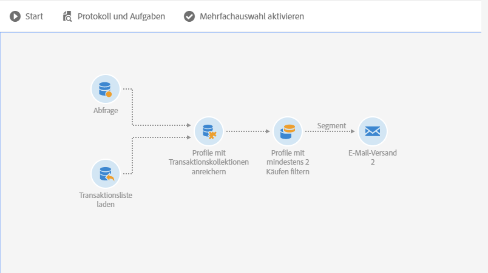
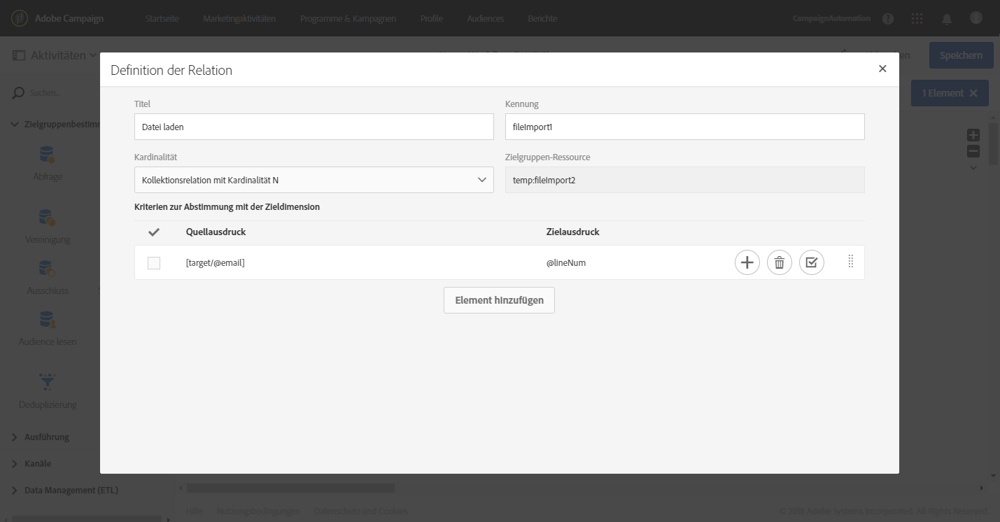
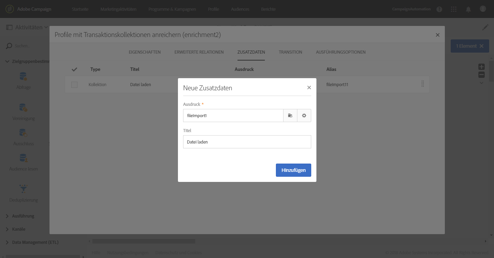
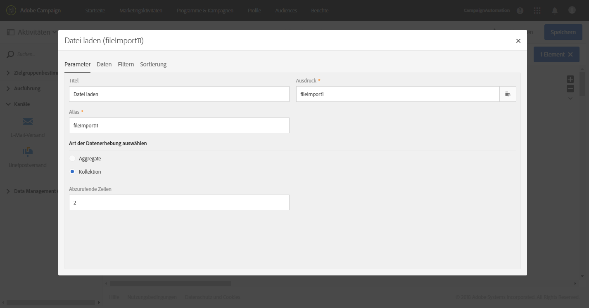
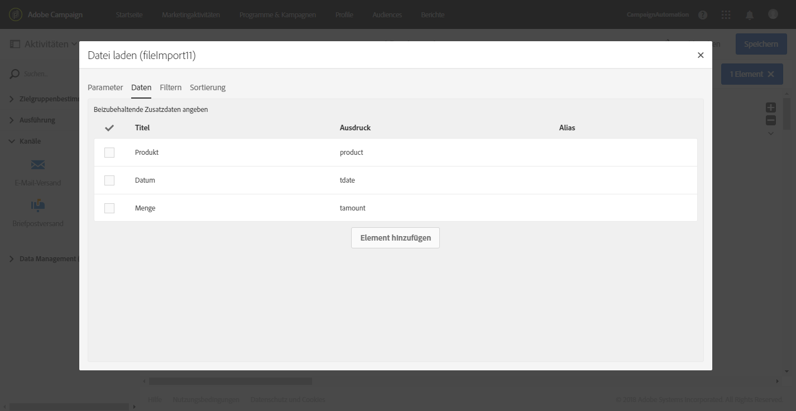
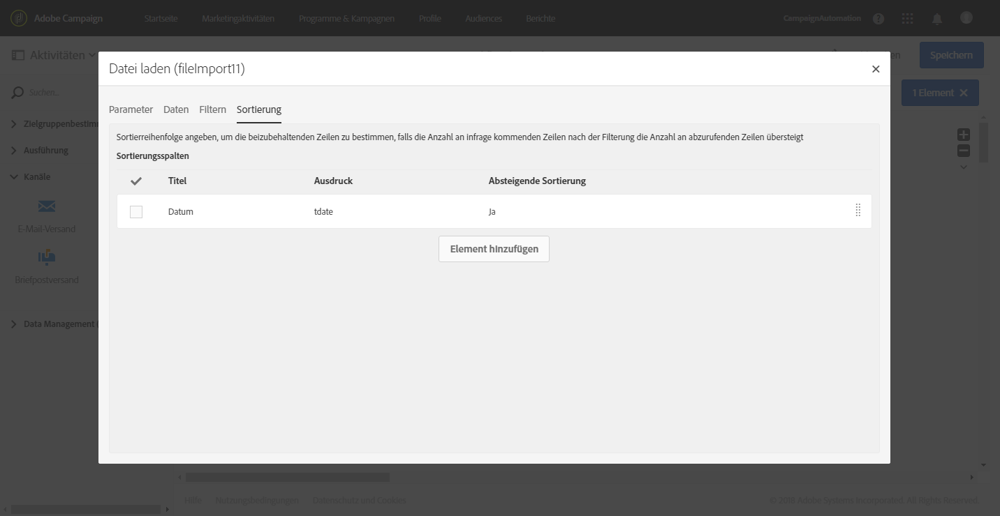
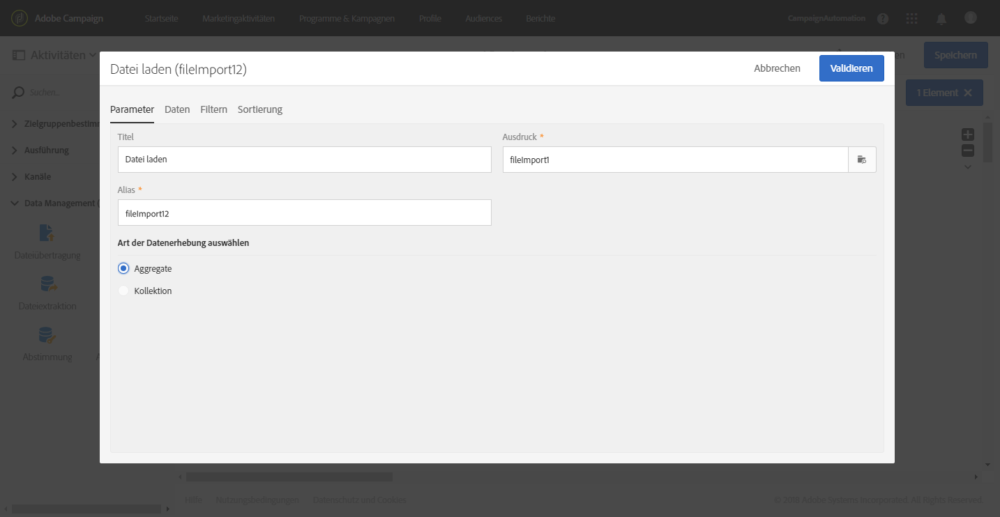
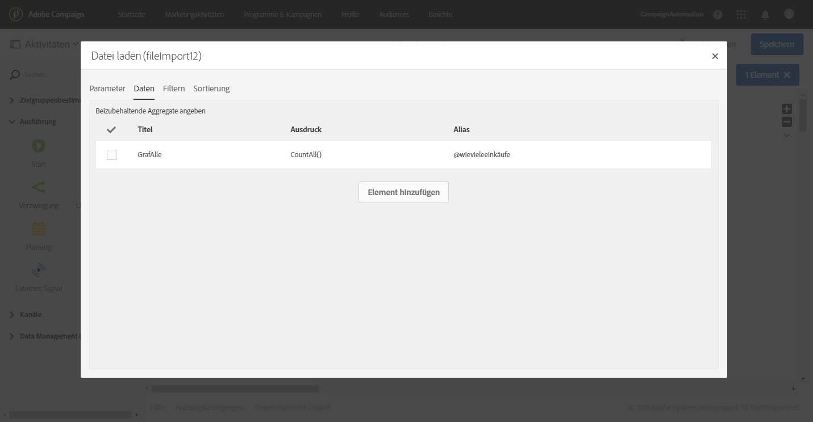
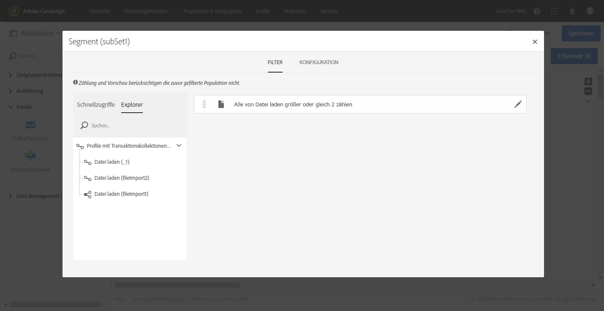
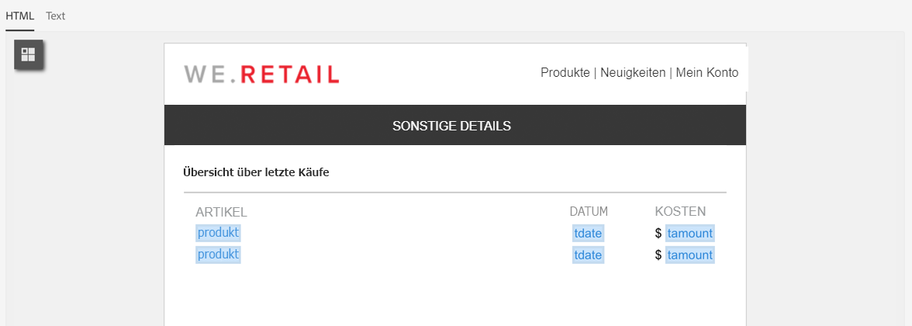

# Enriching profile data with data contained in a file {#enriching-profile-data-with-data-contained-in-a-file}

Dieses Beispiel zeigt, wie Sie die Daten des Profils mit den in einer Datei enthaltenen Kaufdaten bereichern können. In diesem Fall werden die Kaufdaten in einem Drittanbietersystem gespeichert. Von jedem Profil können mehrere Käufe in der Datei gespeichert sein. Ziel des Workflows ist es, eine E-Mail an die Zielprofile zu senden, die mindestens zwei Artikel gekauft haben, um ihnen für ihre Kundentreue zu danken.

Der Workflow setzt sich aus folgenden Aktivitäten zusammen:



* Die Aktivität [Abfrage](../../automating/using/query.md), die die Profile enthält, an die die Nachricht gesendet wird.
* Die Aktivität [Datei laden](../../automating/using/load-file.md), mit der die Kaufdaten geladen werden. Beispiel:

   ```
   tcode;tdate;customer;product;tamount
   aze123;21/05/2017;dannymars@example.com;TV;799
   aze124;28/05/2017;dannymars@example.com;Headphones;8
   aze125;31/07/2017;john.smith@example.com;Headphones;8
   aze126;14/12/2017;john.smith@example.com;Plastic Cover;4
   aze127;02/01/2018;dannymars@example.com;Case Cover;79
   aze128;04/03/2017;clara.smith@example.com;Phone;149
   ```

   Bei dieser Beispieldatei verwenden wir die E-Mail-Adresse zur Abstimmung der Daten mit den Datenbankprofilen. Sie können auch eindeutige Kennungen aktivieren, wie in [diesem Dokument](../../developing/using/configuring-the-resource-s-data-structure.md#generating-a-unique-id-for-profiles-and-custom-resources) beschrieben wird.

* Die Aktivität [Anreicherung](../../automating/using/enrichment.md), mit der eine Relation zwischen den aus der Datei geladenen Transaktionsdaten und den in der **[!UICONTROL Abfrage]** ausgewählten Profilen erstellt wird. Die Relation wird in der Aktivität im Tab **[!UICONTROL Erweiterte Relationen]** definiert. Die Relation basiert auf der von der Aktivität **[!UICONTROL Datei laden]** stammenden Transition. Als Abstimmungskriterien werden das Feld &quot;E-Mail&quot; der Profilressource und die Spalte &quot;customer&quot; der importierten Datei verwendet.

   

   Nachdem die Relation erstellt wurde, werden zwei Sätze von **[!UICONTROL Zusatzdaten]** hinzugefügt:

   * Eine Kollektion von zwei Zeilen, die den zwei letzten Transaktionen eines jeden Profils entsprechen. Für diese Kollektion werden der Produktname, das Transaktionsdatum und der Preis des Produkts als Zusatzdaten hinzugefügt. Die Daten werden absteigend sortiert. So erstellen Sie die Kollektion im Tab **[!UICONTROL Zusatzdaten]**:

      Wählen Sie die zuvor definierte Relation im Tab **[!UICONTROL Erweiterte Relationen]** der Aktivität aus.

      

      Aktivieren Sie **[!UICONTROL Kollektion]** und wählen Sie die Anzahl der Zeilen aus, die abgerufen werden sollen (in diesem Beispiel 2). Auf dieser Bildschirmseite können Sie den **[!UICONTROL Alias]** und den **[!UICONTROL Titel]** der Kollektion eingeben. Diese Werte sind bei den nachfolgenden Aktivitäten des Workflows sichtbar, wenn auf diese Kollektion Bezug genommen wird.

      

      Wählen Sie als **[!UICONTROL Daten]**, die in der Kollektion beibehalten werden sollen, die Spalten aus, die im endgültigen Versand verwendet werden.

      

      Nehmen Sie für die Transaktionsdaten eine absteigende Sortierung vor, um sicherzugehen, dass die letzten Transaktionen abgerufen werden.

      

   * Ein Aggregat, mit dem die Gesamtzahl der Transaktionen für jedes Profil gezählt wird. Dieses Aggregat wird später verwendet, um nach den Profilen zu filtern, für die mindestens zwei Transaktionen aufgezeichnet wurden. So erstellen Sie das Aggregat im Tab **[!UICONTROL Zusatzdaten]**:

      Wählen Sie die zuvor definierte Relation im Tab **[!UICONTROL Erweiterte Relationen]** der Aktivität aus.

      

      Wählen Sie **[!UICONTROL Aggregat aus]**.

      

      Definieren Sie als beizubehaltende **[!UICONTROL Daten]** das Aggregat **Zählung (alles)**. Definieren Sie bei Bedarf einen benutzerdefinierten Alias, um in den nachfolgenden Aktivitäten ein rascheres Auffinden zu ermöglichen.

      

* Die Aktivität [Segmentierung](../../automating/using/segmentation.md) mit nur einem Segment, mit dem Profile der ursprünglichen Zielgruppe abgerufen werden, für die mindestens zwei Transaktionen aufgezeichnet wurden. Profile mit nur einer Transaktion werden ausgeschlossen. Zu diesem Zweck wird die Abfrage der Segmentierung im zuvor definierten Aggregat durchgeführt.

   

* Die Aktivität [E-Mail-Versand](../../automating/using/email-delivery.md), in der mithilfe der in der **[!UICONTROL Anreicherung]** definierten Zusatzdaten die zwei letzten vom Profil getätigten Käufe dynamisch abgerufen werden. Beim Hinzufügen eines Personalisierungsfeldes finden Sie die Zusatzdaten im Knoten **Zusatzdaten (TargetData)**.

   

**Verwandtes Thema:**

* [Kundenprofile mit externen Daten anreichern](https://helpx.adobe.com/de/campaign/kb/simplify-campaign-management.html#Managedatatofuelengagingexperiences)
