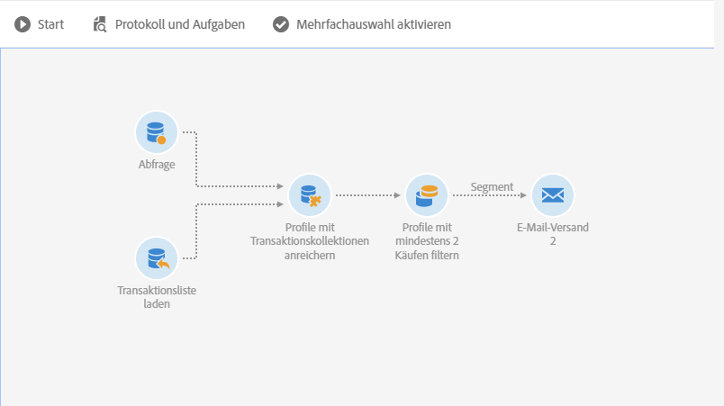
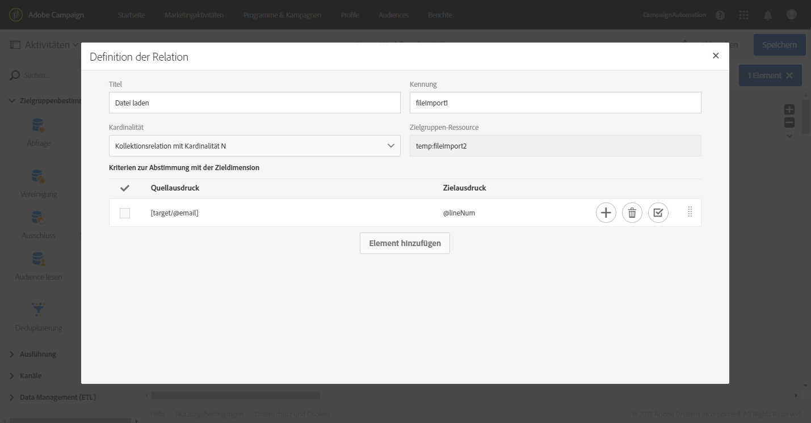
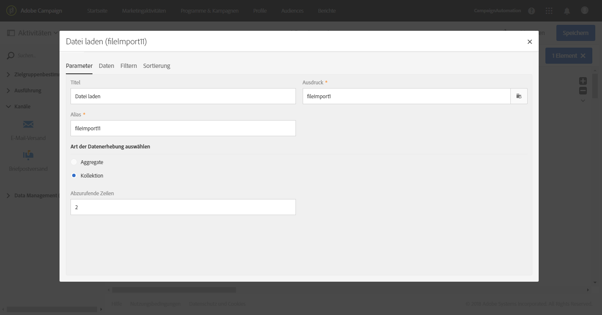
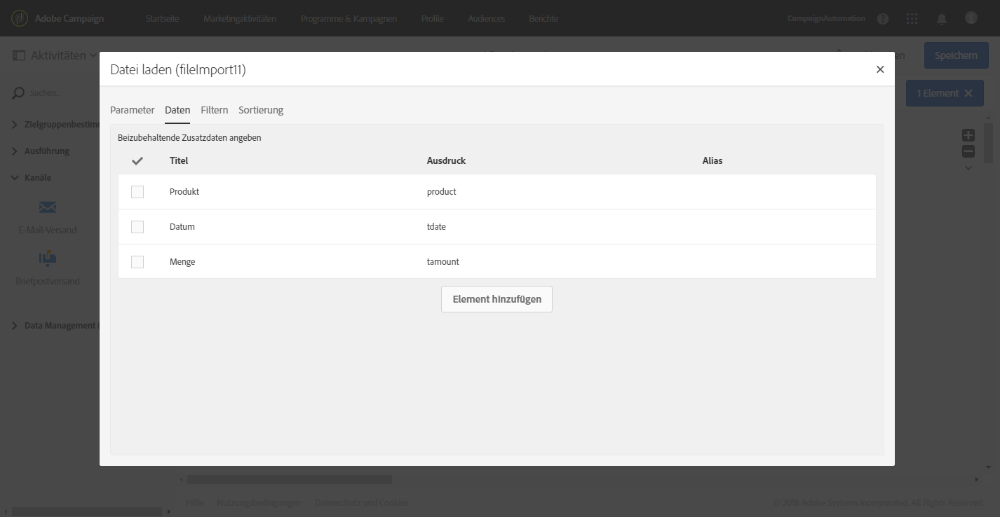
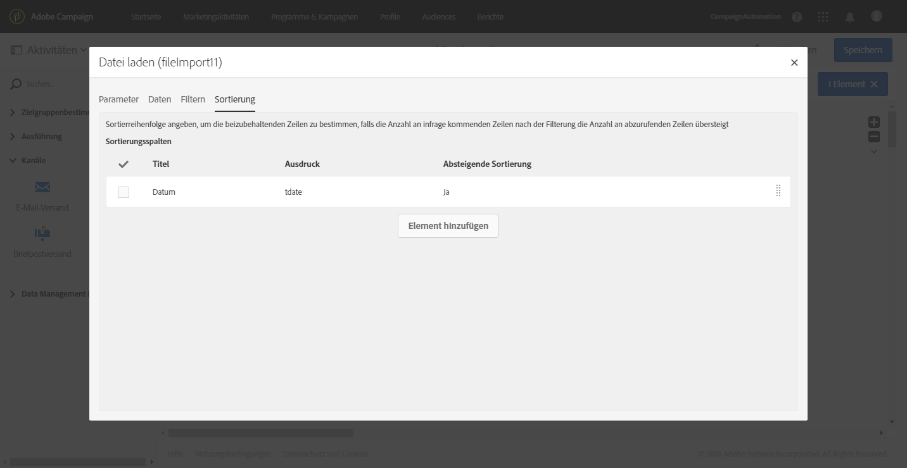
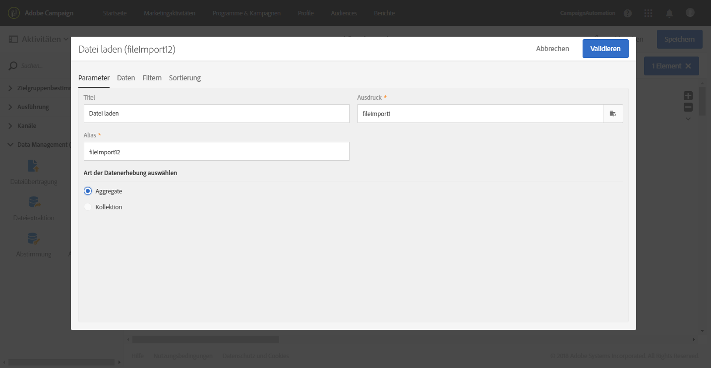
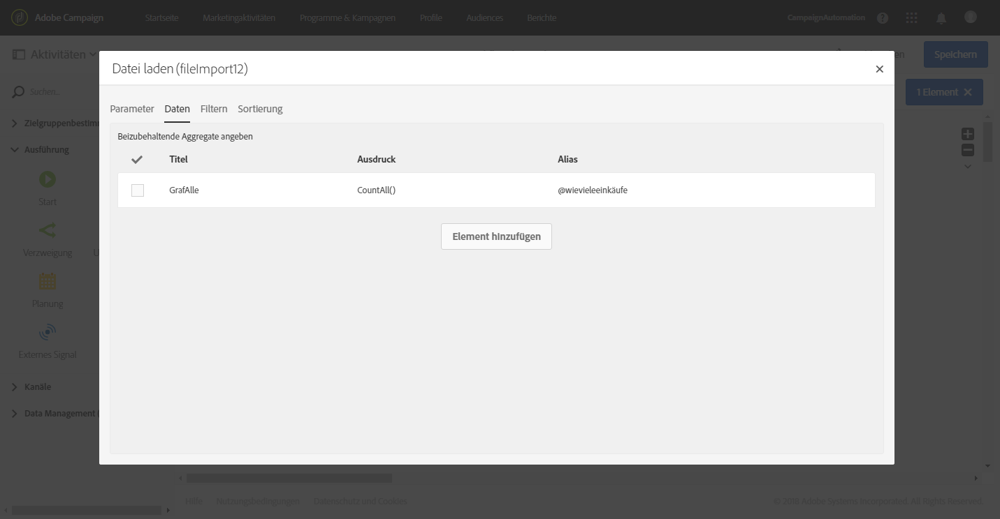
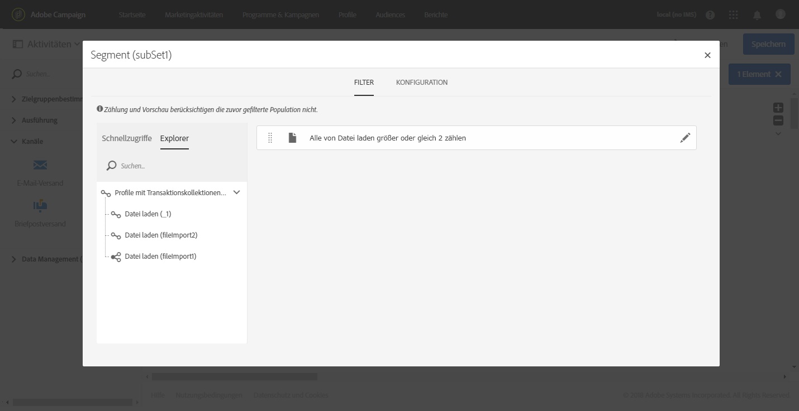

# Anreicherung{#enrichment}

## Beschreibung {#description}


Die Aktivität **[!UICONTROL Anreicherung]** ist eine erweiterte Aktivität, mit der Zusatzdaten zur Weiterverarbeitung in Ihrem Workflow definiert werden können.

## Anwendungskontext {#context-of-use}

Die Aktivität **[!UICONTROL Anreicherung]** wird im Allgemeinen im Anschluss an Zielgruppenbestimmungs- oder Dateiimportaktivitäten und vor Aktivitäten verwendet, die dem Zieldatenverbrauch dienen.

Diese Aktivität verfügt über mehr erweiterte Anreicherungsfunktionen als die Aktivität **[!UICONTROL Abfrage]**. Manche einfache Anreicherungsvorgänge können direkt in der [Abfrage-Aktivität](../../automating/using/query.md#enriching-data) ausgeführt werden.

Mit der Aktivität **[!UICONTROL Anreicherung]** können Sie die eingehende Transition nutzen und entsprechend der Konfiguration der Aktivität die ausgehende Transition mit Zusatzdaten ergänzen. Die Anreicherungsaktivität ermöglicht die Kombination von Daten aus mehreren Datensätzen oder die Erstellung von Relationen zu einer temporären Ressource.

## Konfiguration {#configuration}

So konfigurieren Sie die Aktivität **[!UICONTROL Anreicherung]**:

1. Ziehen Sie eine **[!UICONTROL Anreicherung]** in den Workflow-Arbeitsbereich.
1. Markieren Sie die Aktivität und öffnen Sie sie mithilfe der -Schaltfläche aus den angezeigten Quick Actions.
1. Wenn es für die Aktivität mehrere eingehende Transitionen gibt, wählen Sie die **[!UICONTROL Hauptmenge aus]**. Zu dieser Hauptmenge werden die in dieser Aktivität konfigurierten Zusatzdaten in der ausgehenden Transition hinzugefügt.

   Wenn die Hauptmenge bereits Zusatzdaten enthält, können Sie auswählen, ob Sie diese behalten oder entfernen möchten. Wenn Sie die Option **[!UICONTROL Alle Zusatzdaten der Hauptmenge beibehalten]** deaktivieren, werden nur die in der **[!UICONTROL Anreicherung]** konfigurierten Zusatzdaten in der ausgehenden Transition behalten.

1. Wenn mehrere eingehende Transitionen vorhanden sind, definieren Sie im Tab **[!UICONTROL Erweiterte Relationen]** Relationen zwischen der Hauptmenge und den anderen eingehenden Daten. Mit der Schaltfläche **[!UICONTROL Element hinzufügen]** können Sie mehrere Relationen hinzufügen.

   Wenn Sie eine neue Relation definieren, wählen Sie die eingehenden Datensätze aus, die mit der Hauptmenge verknüpft werden sollen. Definieren Sie anschließend den Typ der Relation. Je nach eingehenden Daten und Datenmodell sind mehrere Typen von Relationen verfügbar:

   * **[!UICONTROL Einfache Relation mit Kardinalität 1]**: Jeder eingehende Datensatz wird genau einem Datensatz der Hauptmenge zugeordnet. Jeder Datensatz der Hauptmenge ist einem Datensatz der verknüpften Menge zugeordnet.
   * **[!UICONTROL Kollektionsrelation mit Kardinalität N]**: 0, 1 oder mehr (N) Datensätze der verknüpften Menge können 1 Datensatz der Hauptmenge zugeordnet werden.
   * **[!UICONTROL Einfache Relation mit Kardinalität 0 oder 1]**: Datensätze der Hauptmenge können 0 oder maximal 1 Datensatz der verknüpften Menge zugeordnet werden.
   Nachdem die **[!UICONTROL Kardinalität]** definiert ist, legen Sie ein **[!UICONTROL Abstimmkriterium]** fest. Der **[!UICONTROL Quellausdruck]** der Abstimmungskriterien kann ein Feld der Zielgruppen-Ressource, ein [Ausdruck](../../automating/using/advanced-expression-editing.md) oder ein in Anführungszeichen angegebener Wert sein.

   Definieren Sie einen **[!UICONTROL Titel]** und eine **[!UICONTROL ID]**, die später im Workflow leicht wiedererkennbar sind.

   >[!NOTE]
   >
   >Sie können nur Relationen zwischen der Hauptmenge und den anderen eingehenden Transitionen definieren, die mit der Aktivität **[!UICONTROL Anreicherung]** verknüpft sind. Verwenden Sie für einfachere Fälle, bei denen Relationen mit Datenbank-Ressourcen definiert werden sollen, die Aktivität [Abstimmung](../../automating/using/reconciliation.md).

1. Definieren Sie die Zusatzdaten im Tab **[!UICONTROL Zusatzdaten]** der Aktivität. Sie können Zusatzdaten definieren (einfache Felder, Aggregate und Kollektionen), die mit der Zielgruppendimension der Hauptmenge verknüpft sind oder auf den Relationen basieren, die im Tab **[!UICONTROL Erweiterte Relationen]** der Aktivität **[!UICONTROL Anreicherung]** erstellt wurden.

   Lesen Sie diesbezüglich auch den Abschnitt [Daten anreichern](../../automating/using/query.md#enriching-data).

1. Validieren Sie die Konfiguration der Aktivität und speichern Sie Ihren Workflow.

Die Daten stehen jetzt bereit und können in den Aktivitäten nach der **[!UICONTROL Anreicherung verwendet werden]**. Diese Daten sind beispielsweise in einem E-Mail-Inhalt im Explorer der Personalisierungsfelder der Relation **[!UICONTROL Zusatzdaten (targetData)]** verfügbar.

## Beispiel: Profildaten mit in einer Datei enthaltenen Daten anreichern {#example--enriching-profile-data-with-data-contained-in-a-file}

In diesem Beispiel sehen Sie, wie Sie Profildaten mit in einer Datei enthaltenen Kaufdaten anreichern können. In unserem Beispiel sind die Kaufdaten in einem Fremdsystem gespeichert. Von jedem Profil können mehrere Käufe in der Datei gespeichert sein. Ziel des Workflows ist es, eine E-Mail an die Zielprofile zu senden, die mindestens zwei Artikel gekauft haben, um ihnen für ihre Kundentreue zu danken.

Der Workflow setzt sich aus folgenden Aktivitäten zusammen:



* Die Aktivität **[!UICONTROL Abfrage]**, die die Profile enthält, an die die Nachricht gesendet wird.
* Die Aktivität **[!UICONTROL Datei laden]**, mit der die Kaufdaten geladen werden. Beispiel:

   ```
   tcode;tdate;customer;product;tamount
   aze123;21/05/2017;dannymars@example.com;TV;799
   aze124;28/05/2017;dannymars@example.com;Headphones;8
   aze125;31/07/2017;john.smith@example.com;Headphones;8
   aze126;14/12/2017;john.smith@example.com;Plastic Cover;4
   aze127;02/01/2018;dannymars@example.com;Case Cover;79
   aze128;04/03/2017;clara.smith@example.com;Phone;149
   ```

   Bei dieser Beispieldatei verwenden wir die E-Mail-Adresse zur Abstimmung der Daten mit den Datenbankprofilen. Sie können auch eindeutige Kennungen aktivieren, wie in [diesem Dokument](../../developing/using/configuring-the-resource-s-data-structure.md#generating-a-unique-id-for-profiles-and-custom-resources) beschrieben wird.

* Die Aktivität **[!UICONTROL Anreicherung]**, mit der eine Relation zwischen den aus der Datei geladenen Transaktionsdaten und den in der **[!UICONTROL Abfrage]** ausgewählten Profilen erstellt wird. Die Relation wird in der Aktivität im Tab **[!UICONTROL Erweiterte Relationen]** definiert. Die Relation basiert auf der von der Aktivität **[!UICONTROL Datei laden]** stammenden Transition. Als Abstimmungskriterien werden das Feld "E-Mail" der Profilressource und die Spalte "customer" der importierten Datei verwendet.

   

   Nachdem die Relation erstellt wurde, werden zwei Sätze von **[!UICONTROL Zusatzdaten]** hinzugefügt:

   * Eine Kollektion von zwei Zeilen, die den zwei letzten Transaktionen eines jeden Profils entsprechen. Für diese Kollektion werden der Produktname, das Transaktionsdatum und der Preis des Produkts als Zusatzdaten hinzugefügt. Die Daten werden absteigend sortiert. So erstellen Sie die Kollektion im Tab **[!UICONTROL Zusatzdaten]**:

      Wählen Sie die zuvor definierte Relation im Tab **[!UICONTROL Erweiterte Relationen]** der Aktivität aus.

      

      Aktivieren Sie **[!UICONTROL Kollektion]** und wählen Sie die Anzahl der Zeilen aus, die abgerufen werden sollen (in diesem Beispiel 2). Auf dieser Bildschirmseite können Sie den **[!UICONTROL Alias]** und den **[!UICONTROL Titel]** der Kollektion eingeben. Diese Werte sind bei den nachfolgenden Aktivitäten des Workflows sichtbar, wenn auf diese Kollektion Bezug genommen wird.

      

      Wählen Sie als **[!UICONTROL Daten]**, die in der Kollektion beibehalten werden sollen, die Spalten aus, die im endgültigen Versand verwendet werden.

      

      Nehmen Sie für die Transaktionsdaten eine absteigende Sortierung vor, um sicherzugehen, dass die letzten Transaktionen abgerufen werden.

      

   * Ein Aggregat, mit dem die Gesamtzahl der Transaktionen für jedes Profil gezählt wird. Dieses Aggregat wird später verwendet, um nach den Profilen zu filtern, für die mindestens zwei Transaktionen aufgezeichnet wurden. So erstellen Sie das Aggregat im Tab **[!UICONTROL Zusatzdaten]**:

      Wählen Sie die zuvor definierte Relation im Tab **[!UICONTROL Erweiterte Relationen]** der Aktivität aus.

      

      Wählen Sie **[!UICONTROL Aggregat aus]**.

      

      Definieren Sie als beizubehaltende **[!UICONTROL Daten]** das Aggregat **Zählung (alles)**. Definieren Sie bei Bedarf einen benutzerdefinierten Alias, um in den nachfolgenden Aktivitäten ein rascheres Auffinden zu ermöglichen.

      

* Die Aktivität **[!UICONTROL Segmentierung]** mit nur einem Segment, mit dem Profile der ursprünglichen Zielgruppe abgerufen werden, für die mindestens zwei Transaktionen aufgezeichnet wurden. Profile mit nur einer Transaktion werden ausgeschlossen. Zu diesem Zweck wird die Abfrage der Segmentierung im zuvor definierten Aggregat durchgeführt.

   

* Die Aktivität **[!UICONTROL E-Mail-Versand]**, in der mithilfe der in der **[!UICONTROL Anreicherung]** definierten Zusatzdaten die zwei letzten vom Profil getätigten Käufe dynamisch abgerufen werden. Beim Hinzufügen eines Personalisierungsfeldes finden Sie die Zusatzdaten im Knoten **Zusatzdaten (TargetData)**.

   

**Verwandtes Thema:**

* [Kundenprofile mit externen Daten anreichern](https://helpx.adobe.com/de/campaign/kb/simplify-campaign-management.html#Managedatatofuelengagingexperiences)

