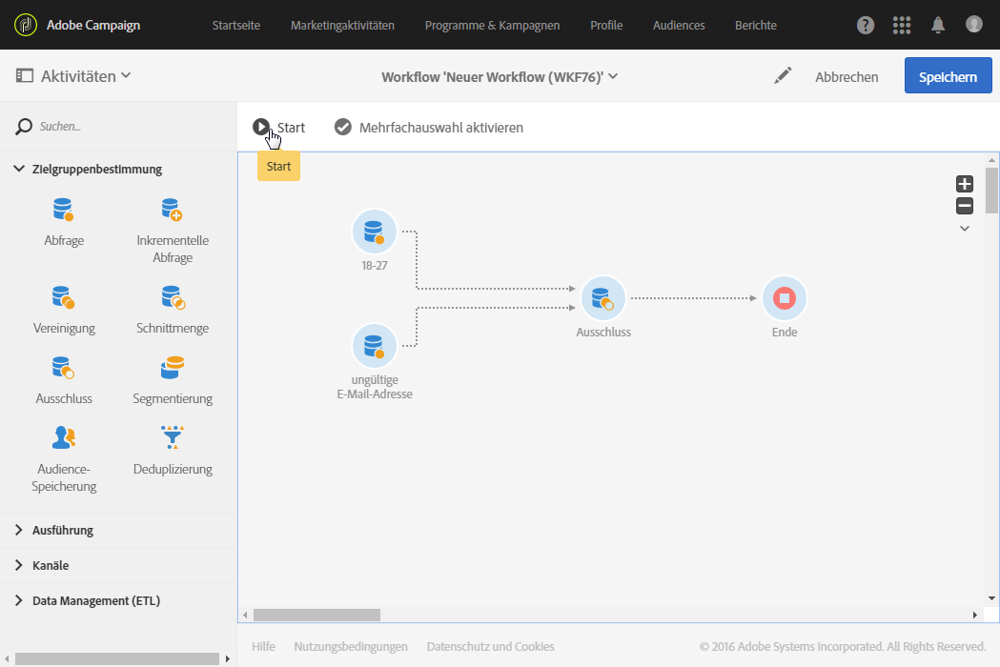

# Ausschluss{#exclusion}

## Beschreibung {#description}

Ein **[!UICONTROL Ausschluss]** ermöglicht es, gemäß bestimmten Kriterien entsprechende Elemente aus einer Population auszuschließen.

## Anwendungskontext {#context-of-use}

Die **[!UICONTROL Ausschlussaktivität]** wird insbesondere verwendet, um die Populationen der eingehenden Transitionen weiter einzugrenzen.

Aus den verschiedenen eingehenden Transitionen wird eine Hauptmenge bestimmt. Die Elemente der anderen eingehenden Transitionen werden aus der Hauptmenge ausgeschlossen. Die ausgehende Transition der Ausschlussaktivität enthält nur die Elemente der Hauptmenge, die nicht in einer oder mehreren der anderen eingehenden Transitionen enthalten sind.

## Konfiguration  {#configuration}

1. Ziehen Sie einen **[!UICONTROL Ausschluss]** in den Workflow-Arbeitsbereich.
1. Markieren Sie die Aktivität und öffnen Sie sie mithilfe der im Schnellzugriff angezeigten Schaltfläche .
1. Wählen Sie im Feld **[!UICONTROL Hauptmenge]** die eingehende Transition aus, aus der die Elemente der anderen eingehenden Transitionen ausgeschlossen werden sollen. Die eingehenden Transitionen müssen Populationen gleichen Typs enthalten.

   >[!NOTE]
   >
   >Die eingehenden Transitionen müssen Populationen gleichen Typs enthalten. Wenn beispielsweise die Hauptmenge aus Testprofilen besteht, müssen auch die anderen Transitionen Testprofile enthalten.

1. Bei Bedarf können Sie unter Verwendung von [Transitionen](../../automating/using/activity-properties.md) auf erweiterte Optionen zur Ausgabepopulation zugreifen.
1. Validieren Sie die Konfiguration der Aktivität und speichern Sie Ihren Workflow.

## Beispiel {#example}

Unten stehende Abbildung zeigt die Konfiguration zweier Abfrageaktivitäten, die alle Profile der Adobe-Campaign-Datenbank abrufen, die zwischen 18 und 27 Jahre alt sind bzw. deren E-Mail-Adresse nicht korrekt angegeben ist. Letztere werden dann von der Hauptmenge ausgeschlossen. Auf diese Weise wird in einem eventuell angeschlossenen Versand vermieden, Nachrichten an ungültige Adressen zu versenden.

