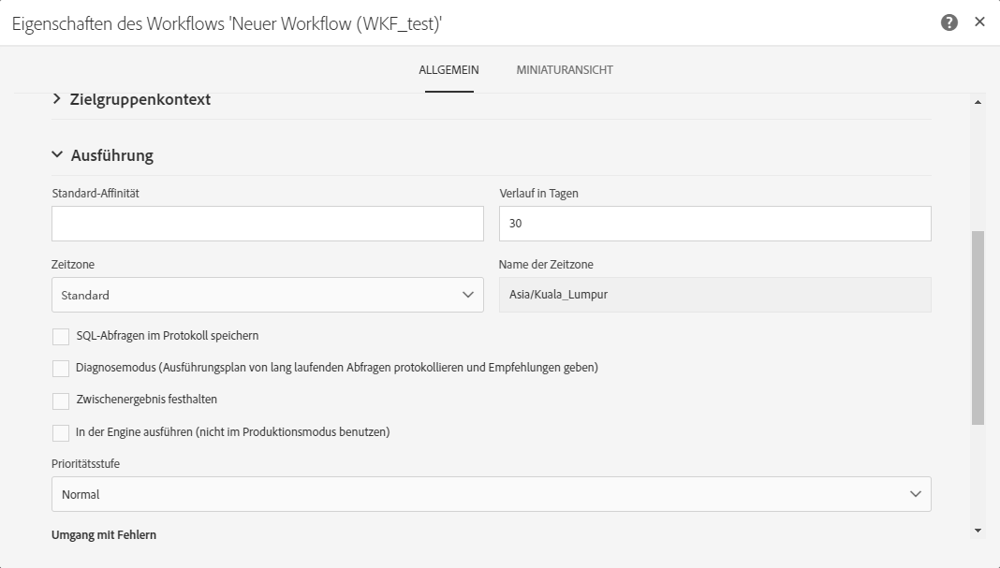
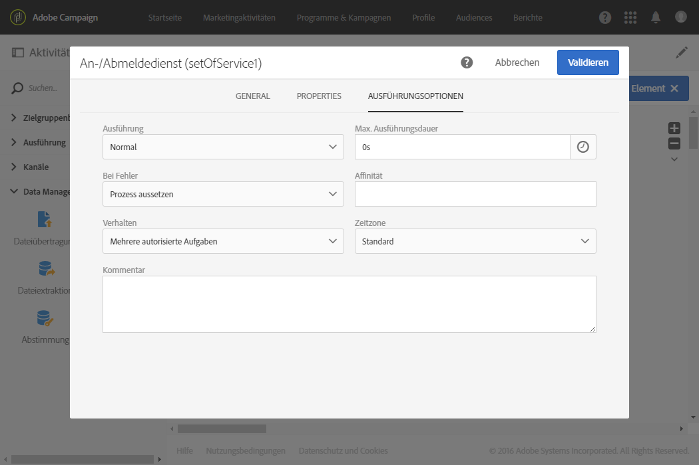

# Workflow ausführen{#executing-a-workflow}

## Über die Ausführung von Workflows {#about-workflow-execution}

Workflows werden grundsätzlich manuell gestartet, können jedoch anschließend inaktiv bleiben, wenn dies mithilfe einer [Planung](../../automating/using/scheduler.md) konfiguriert wurde.

>[!CAUTION]
>
> Adobe empfiehlt seinen Kunden, bei der Durchführung von Workflows Prioritäten festzulegen und bis zu 20 gleichzeitige Workflows auszuführen, um ständig die Maximalleistung Ihrer Instanz auszunutzen. Es können auch mehr als 20 gleichzeitige Workflows geplant werden. Diese werden standardmäßig nacheinander ausgeführt. Sie können die Standardeinstellung für die maximale Anzahl gleichzeitiger Workflows ändern, indem Sie ein Ticket an die Kundenunterstützung senden.

Bei Aktionen bezüglich der Ausführung des Workflows (Start, Stopp, Pause etc.) handelt es sich um **asynchrone** Prozesse, d. h. der jeweilige Befehl wird gespeichert und erst dann ausgeführt, wenn ein Server verfügbar ist.

Die Übermittlung der Ergebnisse der einzelnen Workflow-Aktivitäten erfolgt über Transitionen, welche in Form von Pfeilen dargestellt werden.

Transitionen, die nicht mit einer Zielaktivität verbunden sind, werden als schwebend bezeichnet.

>[!NOTE]
>
>Auch mit schwebenden Transitionen kann ein Workflow ausgeführt werden: Die Ausführung erzeugt einen Warnhinweis und wird bei Aktivierung einer derartigen Transition ausgesetzt. Es wird jedoch kein Fehler erzeugt. Auf diese Weise ist es möglich, einen Workflow zu starten, auch wenn seine Konzeption noch nicht vollständig abgeschlossen ist, und ihn nach und nach zu vervollständigen.

Sobald eine Aktivität ausgeführt worden ist, wird die Anzahl der in der Transition übertragenen Datensätze oberhalb der Transition angezeigt.

Sie können Transitionen vor oder nach der Ausführung des Workflows öffnen, um zu überprüfen, ob die übermittelten Daten korrekt sind. Die vorhandenen Daten sowie deren Struktur lassen sich visualisieren.

Standardmäßig können nur die Details der letzten Transition des Workflows abgerufen werden. To be able to access the results of the preceding activities, you need to check the **[!UICONTROL Keep interim results]** option in the **[!UICONTROL Execution]** section of the workflow properties, before starting the workflow.

>[!NOTE]
>
>Diese Option verbraucht eine große Menge an Speicherplatz und dient der Erstellung eines Workflows und der korrekten Konfiguration. Aktivieren Sie sie nicht bei Produktionsinstanzen.

When a transition is open, you can edit its **[!UICONTROL Label]** or link a **[!UICONTROL Segment code]** to it. Bearbeiten Sie hierzu die entsprechenden Felder und validieren Sie Ihre Änderungen.

Using Campaign Standard REST APIs, you can **start**, **pause**, **resume** and **stop** a workflow. Weiterführende Informationen und Beispiele von REST-Aufrufen finden Sie in der [API-Dokumentation.](../../api/using/controlling-a-workflow.md)

## Workflow-Lebenszyklen {#life-cycle}

Der Lebenszyklus eines Workflows gestaltet sich in drei Hauptetappen:

* **In Bearbeitung** (grau)

   Hierbei handelt es sich um die Phase der Erstellung (siehe [Workflow erstellen](../../automating/using/building-a-workflow.md#creating-a-workflow)). Ein derartiger Workflow wurde noch nicht vom Server übernommen und kann daher problemlos geändert werden.

* **Gestartet** (blau)

   Nach Abschluss der Erstellungsphase kann der Workflow gestartet werden. Daraufhin wird er vom Server übernommen.

* **Abgeschlossen** (grün)

   Ein Workflow ist abgeschlossen, wenn keine Aufgaben mehr zur Verarbeitung anstehen, oder wenn die Ausführung ausdrücklich angehalten wurde.

Nach dem Start kann ein Workflow zwei weitere Status aufweisen:

* **Warnhinweis** (gelb)

   Der Workflow konnte nicht abgeschlossen werden oder er wurde anhand der Schaltflächen  bzw.  ausgesetzt.

* **Fehlerhaft** (rot)

   Bei der Ausführung des Workflows ist ein Fehler aufgetreten. Die Ausführung wurde angehalten und ein Eingreifen des Benutzers ist erforderlich. Mithilfe der Schaltfläche  gelangen Sie in das Workflow-Protokoll, dem Sie die Fehlerursache entnehmen können (siehe [Monitoring](#monitoring)).

Die Liste der Marketingaktivitäten ermöglicht die Anzeige aller Workflows inklusive ihrer Status. Weiterführende Informationen dazu finden Sie im Abschnitt [Marketingaktivitäten verwalten](../../start/using/marketing-activities.md#about-marketing-activities).

## Ausführungsbefehle   {#execution-commands}

Die Schaltflächen der Symbolleiste dienen dazu, die Workflow-Ausführung zu starten, zu verfolgen und eventuell anzupassen. Siehe den Abschnitt [Symbolleiste](../../automating/using/workflow-interface.md#action-bar).

Folgende Aktionen sind möglich:

**Starten**

Die Schaltfläche  löst die Workflow-Ausführung aus. Der Workflow wechselt in den Status **Gestartet** (blau). Wenn der Workflow zuvor ausgesetzt war, handelt es sich um eine Wiederaufnahme, ansonsten werden die ersten Aktivitäten aktiviert.

>[!NOTE]
>
>Der Start eines Workflows ist ein asynchroner Prozess, d. h. der jeweilige Befehl wird gespeichert und erst dann ausgeführt, wenn ein Server verfügbar ist.

**Aussetzen**

Die Schaltfläche  setzt die Workflow-Ausführung aus. Der Workflow wechselt in den Status **Warnhinweis** (gelb). Bis zur Wiederaufnahme werden keine neuen Aktivitäten aktiviert, laufende Vorgänge werden jedoch fortgeführt.

**Anhalten**

Die Schaltfläche  hält die Workflow-Ausführung an. Der Workflow wechselt in den Status **Abgeschlossen** (grün). Importe und SQL-Abfragen werden sofort abgebrochen. Eine Wiederaufnahme an der Stelle der Unterbrechung ist nicht möglich.

**Neu starten**

Die Schaltfläche  hält die Workflow-Ausführung zunächst an und startet sie dann erneut. In den meisten Fällen ermöglicht dies einen schnelleren Neustart. Dieser Befehl bietet sich vor allem auch dann an, wenn das Anhalten eines Workflows geraume Zeit in Anspruch nimmt, da die Schaltfläche  erst wieder verfügbar ist, wenn der Workflow tatsächlich angehalten wurde.

Wenn im Workflow Aktivitäten markiert sind, stehen weitere Schaltflächen zur Verfügung:

**Vorgezogene Ausführung**

Die Schaltfläche  bietet die Möglichkeit, so schnell wie möglich die markierten ausstehenden Aufgaben zu starten.

**Normale Ausführung**

Die Schaltfläche  aktiviert ausgesetzte oder deaktivierte Aktivitäten neu.

**Ausführung ab Markierung aussetzen**

Die Schaltfläche  setzt die Ausführung des Workflows ab der ausgewählten Aktivität aus. Diese und alle im gleichen Zweig folgenden Aktivitäten werden nicht ausgeführt.

**Keine Ausführung**

Die Schaltfläche  deaktiviert die markierten Aktivitäten.

>[!NOTE]
>
>Auf die der Bearbeitung einer bestimmten Aktivität dienenden Aktionen kann auch über die Quick Actions zugegriffen werden, die bei der Markierung einer Aktivität angezeigt werden.

## Monitoring   {#monitoring}

Über die Schaltfläche  können Sie auf das Protokoll und die Aufgaben des Workflows zugreifen.

Der Workflow-Verlauf wird für die in den Ausführungseigenschaften eines Workflows angegebene Dauer gespeichert (siehe [Eigenschaften des Workflows](#workflow-properties)). Innerhalb dieser Dauer werden alle Logs gespeichert, auch wenn der Workflow neu gestartet wurde. Wenn Sie die Logs einer früheren Ausführung nicht beibehalten möchten, können Sie den Verlauf unter Verwendung der Schaltfläche  bereinigen.

The **[!UICONTROL Log]** tab contains the execution history of all the activities or any selected activities. Er zeigt in chronologischer Abfolge alle Vorgänge und Ausführungsfehler.

The **[!UICONTROL Tasks]** tab details the execution sequencing of the activities. Klicken Sie auf eine Aufgabe zur Anzeige weiterer Details.

In beiden Listen:

* gibt der Zähler Auskunft über die Anzahl an Listeneinträgen. Bei mehr als 30 Listenelementen wird durch einen Klick auf den Zähler die Gesamtzahl angezeigt.
* The **[!UICONTROL Configure list]** button allows you to choose the information displayed, define the column order, and sort the list.
* Mithilfe von Filtern können Sie Informationen schneller auffinden. Über das Suchfeld können Sie nach einem bestimmten Text in den Namen der Workflow-Aktivitäten (Beispiel: &quot;Abfrage&quot;) und Protokollen suchen.

## Umgang mit Fehlern   {#error-management}

Wenn ein Fehler auftritt, wird der Workflow ausgesetzt und die bei Fehlerauftritt ausgeführte Aktivität blinkt rot.

Der Workflow wechselt in den roten Status und der Fehler wird im Protokoll verzeichnet.

Es besteht die Möglichkeit, das Aussetzen des Workflows im Falle von Fehlern zu vermeiden und die sich anschließenden Aufgaben wie geplant auszuführen. To do this, go to the workflow properties via the  button and, in the **[!UICONTROL Execution]** section, select the **Ignore** option in the **In case of error** field.

In diesem Fall wird die fehlerhafte Aufgabe abgebrochen. Dieser Modus ist insbesondere bei Workflows mit wiederkehrenden Vorgängen angebracht, da die nächste Ausführung auf diese Weise wie geplant starten kann.

>[!NOTE]
>
>Es besteht die Möglichkeit, diese Vorgehensweise innerhalb eines Workflows nur für bestimmte Aktivitäten zu konfigurieren. Wählen Sie hierzu die gewünschte Aktivität aus, öffnen Sie sie mithilfe des Schnellzugriffs  und wählen Sie im Bereich **Ausführungsoptionen** den gewünschten Umgang mit Fehlern aus. Siehe [Ausführungsoptionen von Aktivitäten](#activity-execution-options).

In den Eigenschaften [des](#workflow-properties)Workflows stehen zusätzliche Optionen zur Fehlerverwaltung zur Verfügung.

Mögliche Optionen sind:

* **[!UICONTROL Supervisors]**: ermöglicht Ihnen, die Gruppe von Personen zu definieren, die benachrichtigt werden sollen (E-Mail- und In-App-Benachrichtigung), wenn im Workflow ein Fehler auftritt. Sollte keine Gruppe angegeben sein, wird niemand benachrichtigt. Weiterführende Informationen zu Adobe Campaign-Benachrichtigungen finden Sie in Abschnitt [Benachrichtigungen in Adobe Campaign](../../administration/using/sending-internal-notifications.md).

* **[!UICONTROL In case of error]**: können Sie angeben, welche Aktion ausgeführt werden soll, wenn die Aktivität einen Fehler auftritt. Zwei Optionen stehen zur Wahl:

   * **Prozess aussetzen** - der Workflow wird automatisch angehalten. Der Workflow-Status wechselt in **fehlerhaft** und sein Symbol wird rot hinterlegt. Nach Beseitigung der Fehlerursache kann der Workflow neu gestartet werden.
   * **Ignorieren** - die den Fehler verursachende Aktivität sowie alle im selben Zweig folgenden Aktivitäten werden nicht ausgeführt. Diese Konfiguration empfiehlt sich bei wiederkehrenden Aufgaben. Wenn der Workflow-Zweig eine Planungsaktivität enthält, führt diese automatisch zum nächsten geplanten Zeitpunkt zu einer erneuten Ausführung.

* **[!UICONTROL Consecutive errors]** : können Sie mehrere aufeinander folgende Fehler definieren, die autorisiert werden, bevor die Ausführung des Workflows automatisch ausgesetzt wird.

   * Bei Angabe von **[!UICONTROL 0]** bzw. bis zum Erreichen der angegebenen Fehleranzahl werden die fehlerhaften Aktivitäten ignoriert. Die anderen Workflow-Zweige werden regulär ausgeführt.

   * If the number specified is reached, the whole of the workflow is suspended and becomes **[!UICONTROL Erroneous]**. Sollten zuvor Supervisoren bestimmt worden sein, werden diese automatisch per E-Mail benachrichtigt. Weiterführende Informationen dazu finden Sie im Abschnitt [Benachrichtigungen in Adobe Campaign](../../administration/using/sending-internal-notifications.md).

## Workflow-Eigenschaften   {#workflow-properties}

To modify a workflow&#39;s execution options, use the  button to access the workflow properties and select the **[!UICONTROL Execution]** section.

Mögliche Optionen sind:

* **[!UICONTROL Default affinity]**: Mit diesem Feld können Sie die Ausführung eines Workflows oder einer Workflow-Aktivität auf einem bestimmten Computer erzwingen.

* **[!UICONTROL History in days]**: gibt die Anzahl der Tage an, nach denen der Verlauf bereinigt werden muss. Der Verlauf besteht aus allen Elementen, die sich auf Protokolle, Aufgaben, Ereignis beziehen. Der Standardwert beträgt 30 Tage für vordefinierte Workflow-Vorlagen.

   Der Bereinigungsvorgang erfolgt durch den technischen Arbeitsablauf für die Datenbankbereinigung, der täglich standardmäßig ausgeführt wird (siehe [Liste der Technischen Workflows](../../administration/using/technical-workflows.md)).

   >[!IMPORTANT]
   >
   >Wenn das **[!UICONTROL History in days]** Feld leer gelassen wird, wird sein Wert als &quot;1&quot;betrachtet, d. h. der Verlauf wird nach 1 Tag bereinigt.

* **[!UICONTROL Save SQL queries in the log]**: können Sie die SQL-Abfragen aus dem Workflow in den Protokollen speichern.

* ***[!UICONTROL Keep interim results]**: check this option if you would like to be able to view the detail of transitions. Achtung: Durch das Aktivieren dieser Option kann sich die Ausführung des Workflows stark verlangsamen.

* **[!UICONTROL Execute in the engine (do not use in production)]**: ermöglicht es Ihnen, den Workflow lokal auszuführen, um Entwicklungsumgebungstests durchzuführen.

* **[!UICONTROL Severity]**: können Sie eine Prioritätsstufe für die Ausführung von Workflows in Ihrer Adobe Campaign-Instanz festlegen. Kritische Workflows werden vorrangig ausgeführt.

Der **[!UICONTROL Error management]** Abschnitt enthält weitere Optionen, mit denen Sie verwalten können, wie Workflows sich im Falle von Fehlern verhalten. Diese Optionen werden im Abschnitt [Fehlerverwaltung](#error-management) beschrieben.

## Aktivitätseigenschaften   {#activity-properties}

### Allgemeine Eigenschaften einer Aktivität {#general-properties-of-an-activity}

Each activity has a **[!UICONTROL Properties]** tab. In diesem Tabs lassen sich die allgemeinen Parameter der Aktivität, insbesondere Titel und Kennung anpassen. Die Konfiguration dieses Tabs is optional.

### Verwaltung ausgehender Transitionen von Aktivitäten   {#managing-an-activity-s-outbound-transitions}

Standardmäßig verfügen bestimmte Aktivitäten nicht über ausgehende Transitionen. You can add one from the **[!UICONTROL Transitions]** tab or from the activity&#39;s **[!UICONTROL Properties]** tab to apply other processes to your population in the same workflow.

Je nach Aktivität lassen sich verschiedene Arten ausgehender Transitionen hinzufügen:

* Standardtransition: mittels der Aktivität berechnete Population.
* Transition ohne Population: Dieser Typ der ausgehenden Transition kann hinzugefügt werden, um den Workflow fortzusetzen. Er enthält keine Population, um nicht unnötig Speicherplatz im System zu belegen.
* Zurückweisungen: zurückgewiesene Population. Dies trifft zu, wenn z. B. in eine Aktivität eingehende Daten aufgrund von Fehlerhaftig- oder Unvollständigkeit nicht verarbeitet werden konnten.
* Komplement: nach der Ausführung der Aktivität verbleibende Population. Dies trifft zu, wenn z. B. eine Segmentierungsaktivität dahingehend konfiguriert ist, dass lediglich ein bestimmter Prozentsatz der eingehenden Population beibehalten wird.

If applicable, specify a **[!UICONTROL Segment code]** for the activity&#39;s outbound transition. Der Segmentcode ermöglicht es, die Herkunft von Teilmengen der Zielpopulation zu identifizieren, und kann im weiteren Verlauf für die Nachrichtenpersonalisierung verwendet werden.

### Ausführungsoptionen von Aktivitäten   {#activity-execution-options}

In the activity&#39;s properties screen, there is an **[!UICONTROL Advanced options]** tab that lets you define the activity&#39;s execution mode and behavior in case of errors.

Markieren Sie zum Zugriff auf diese Optionen die gewünschte Aktivität im Workflow und öffnen Sie sie in der Symbolleiste unter Verwendung der Schaltfläche .

The **[!UICONTROL Execution]** field allows you to define the action to be carried out when the task is started. Dabei stehen drei Optionen zur Wahl:

* **Normal** - die Aufgabe wird ausgeführt.
* **Aktivieren aber nicht ausführen** - die Aktivität wird ausgesetzt. Dies bedeutet, dass auch die nachfolgenden Aktivitäten nicht ausgeführt werden. Dies kann sich als nützlich erweisen, wenn Sie beispielsweise zum Zeitpunkt der Aufgabenaktivierung den Workflow überwachen möchten.
* **Nicht aktivieren** - die Aktivität sowie alle im selben Zweig folgenden Aktivitäten werden nicht ausgeführt.

The **[!UICONTROL In case of error]** field allows you to specify the action to be carried out should the activity encounter an error. Zwei Optionen stehen zur Wahl:

* **Prozess aussetzen** - der Workflow wird automatisch angehalten. Der Workflow-Status wechselt in **fehlerhaft** und sein Symbol wird rot hinterlegt. Nach Beseitigung der Fehlerursache kann der Workflow neu gestartet werden.
* **Ignorieren** - die den Fehler verursachende Aktivität sowie alle im selben Zweig folgenden Aktivitäten werden nicht ausgeführt. Diese Konfiguration empfiehlt sich bei wiederkehrenden Aufgaben. Wenn der Workflow-Zweig eine Planungsaktivität enthält, führt diese automatisch zum nächsten geplanten Zeitpunkt zu einer erneuten Ausführung.

The **[!UICONTROL Behavior]** field allows you to define the procedure to follow if asynchronous tasks are used. Zwei Optionen stehen zur Wahl:

* **Mehrere autorisierte Aufgaben** - mehrere Aufgaben können gleichzeitig ausgeführt werden.
* **Laufende Aufgabe hat Vorrang** - solange eine Aufgabe läuft, wird keine neue Aufgabe gestartet. Solange eine Aufgabe läuft, wird keine neue Aufgabe gestartet.

The **[!UICONTROL Max. execution duration]** field allows you to specify a duration such as &quot;30s&quot; or &quot;1h&quot;. Wenn eine Aufgabe die angegebene Dauer überschreitet, wird ein Warnhinweis erzeugt. Die Workflow-Ausführung wird hiervon jedoch nicht beeinflusst.

The **[!UICONTROL Affinity]** field allows you to force a workflow or a workflow activity to execute on a particular machine. Hierzu müssen eine oder mehrere Affinitäten auf Workflow- oder Aktivitätsniveau definiert werden.

The **[!UICONTROL Time zone]** field allows you to select the time zone of the activity. Adobe Campaign ist in der Lage, verschiedene Zeitzonen innerhalb einer Instanz zu verwalten. Die entsprechenden Einstellungen werden bei der Instanzerstellung vorgenommen.

>[!NOTE]
>
>Wenn keine Zeitzone ausgewählt ist, verwendet die Aktivität standardmäßig die in den Eigenschaften des Workflows definierte Zeitzone.

Im Feld **Kommentar** kann eine Bemerkung eingegeben werden. Es handelt sich um ein freies Textfeld.
