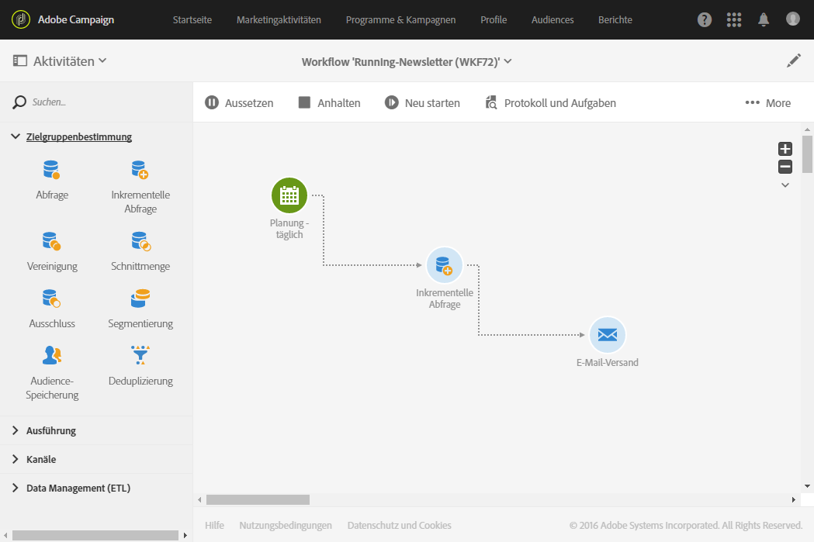

# Ausführungsbefehle     {#execution-commands}

Die Schaltflächen der Aktionsleiste dienen dazu, die Workflow-Ausführung zu starten, zu verfolgen und eventuell anzupassen. Siehe den Abschnitt [Aktionsleiste](../../automating/using/workflow-interface.md#action-bar).

Folgende Aktionen sind möglich:

**Starten**

Die Schaltfläche  löst die Workflow-Ausführung aus. Der Workflow wechselt in den Status **Gestartet** (blau). Wenn der Workflow zuvor ausgesetzt war, handelt es sich um eine Wiederaufnahme, ansonsten werden die ersten Aktivitäten aktiviert.

>[!NOTE]
>
>Der Start eines Workflows ist ein asynchroner Prozess, d. h. der jeweilige Befehl wird gespeichert und erst dann ausgeführt, wenn ein Server verfügbar ist.

**Aussetzen**

Die Schaltfläche  setzt die Workflow-Ausführung aus. Der Workflow wechselt in den Status **Warnhinweis** (gelb). Bis zur Wiederaufnahme werden keine neuen Aktivitäten aktiviert, laufende Vorgänge werden jedoch fortgeführt.

**Anhalten**

Die Schaltfläche  hält die Workflow-Ausführung an. Der Workflow wechselt in den Status **Abgeschlossen** (grün). Importe und SQL-Abfragen werden sofort abgebrochen. Eine Wiederaufnahme an der Stelle der Unterbrechung ist nicht möglich.

**Neu starten**

Die Schaltfläche  hält die Workflow-Ausführung zunächst an und startet sie dann erneut. In den meisten Fällen ermöglicht dies einen schnelleren Neustart. Dieser Befehl bietet sich vor allem auch dann an, wenn das Anhalten eines Workflows geraume Zeit in Anspruch nimmt, da die Schaltfläche  erst wieder verfügbar ist, wenn der Workflow tatsächlich angehalten wurde.

Wenn im Workflow Aktivitäten markiert sind, stehen weitere Schaltflächen zur Verfügung:

**Vorgezogene Ausführung**

Die Schaltfläche  bietet die Möglichkeit, so schnell wie möglich die markierten ausstehenden Aufgaben zu starten.

**Normale Ausführung**

Die Schaltfläche  aktiviert ausgesetzte oder deaktivierte Aktivitäten neu.

**Ausführung ab Markierung aussetzen**

Die Schaltfläche  setzt die Ausführung des Workflows ab der ausgewählten Aktivität aus. Diese und alle im gleichen Zweig folgenden Aktivitäten werden nicht ausgeführt.

**Keine Ausführung**

Die Schaltfläche  deaktiviert die markierten Aktivitäten.

>[!NOTE]
>
>Auf die der Bearbeitung einer bestimmten Aktivität dienenden Aktionen kann auch über die Schnellaktionen zugegriffen werden, die bei der Markierung einer Aktivität angezeigt werden.
