# Exportieren/Importieren benutzerdefinierter Ressourcen {#exporting-importing-custom-resources}

Das Ziel dieser kurzen Einführung besteht darin, den Export und Import eines Packages mit benutzerdefinierten Ressourcen aus einem Entwicklungsumfeld in ein Produktionsumfeld zu zeigen.

Dieses Beispiel ist an funktionale Adobe Campaign-Administratoren gerichtet.

Folgende Voraussetzungen müssen erfüllt sein:

* **Eine oder mehrere benutzerdefinierte Ressourcen**, die verfügbar und veröffentlicht sind.

  Darüber hinaus müssen Sie einen eindeutigen Schlüssel für diese Ressourcen definiert haben, da die automatischen Primärschlüssel nicht in die Packages exportiert werden. Die Ressource kann daher über einen Primärschlüssel und einen zusätzlichen eindeutigen Schlüssel verfügen, um die Einzigartigkeit der Datensätze zu gewährleisten.
* Der Benutzer muss über die für Package-Erstellung und -Export **erforderlichen Berechtigungen** verfügen.

Zusätzliche Ressourcen:

* [Package-Verwaltung](../../automating/using/managing-packages.md)
* [Package-Bereitstellung: Grundprinzip](../../developing/using/data-model-concepts.md)
* [Ressource hinzufügen oder erweitern](../../developing/using/key-steps-to-add-a-resource.md)

## Struktur exportieren {#exporting-the-structure}

In diesem Schritt nehmen wir einen ersten Package-Export vor, der die Beschreibung der physischen Datenstruktur der benutzerdefinierten Ressource enthält.

Unser Beispiel umfasst zwei benutzerdefinierte Ressourcen: **Artikel** und **Bestellungen**.

1. Gehen Sie zum Menü **[!UICONTROL Administration]** / **[!UICONTROL Bereitstellung]** / **[!UICONTROL Package-Exporte]**.

   Wir werden ein neues Package erstellen, um die **[!UICONTROL Benutzerdefinierte Ressource (cusResource)]** zu exportieren, die mit den beiden benutzerdefinierten Ressourcen &quot;Artikel&quot; und &quot;Bestellungen&quot; gefiltert wurde.

1. Wählen Sie auf der Seite **[!UICONTROL Package-Exporte]** zur Erstellung eines neuen Packages die Schaltfläche **[!UICONTROL Erstellen]** aus.
1. Füllen Sie den Titel aus und wählen Sie dann **[!UICONTROL Element erstellen]** aus.

   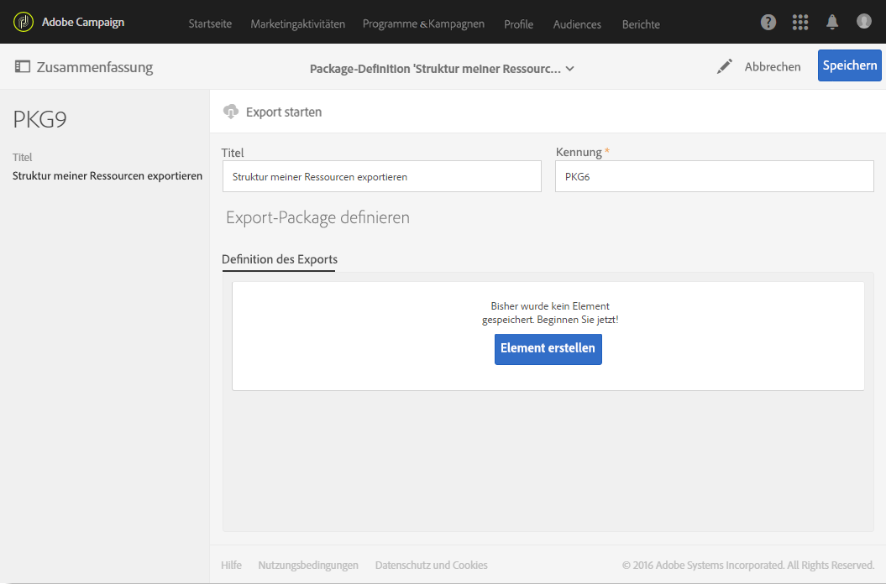

1. Wählen Sie **[!UICONTROL Benutzerdefinierte Ressource (cusResource)]** aus der Liste der Ressourcen aus.

   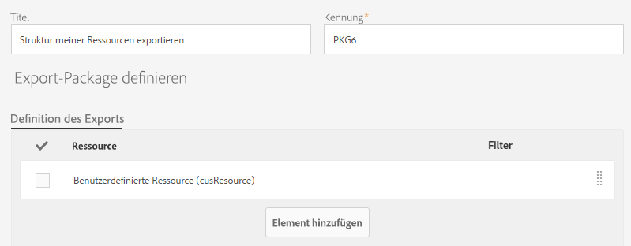

1. Konfigurieren Sie die **[!UICONTROL Benutzerdefinierte Ressource]** im Detail, indem Sie in den Filterbedingungen die beiden Ressourcen **Artikel** und **Bestellungen** auswählen.

   Vergessen Sie dabei nicht, den logischen Operator zu ändern. Der Wert muss **ODER** sein, damit die Struktur beider Ressourcen, „Artikel“ und „Bestellungen“, in das Paket integriert wird.

   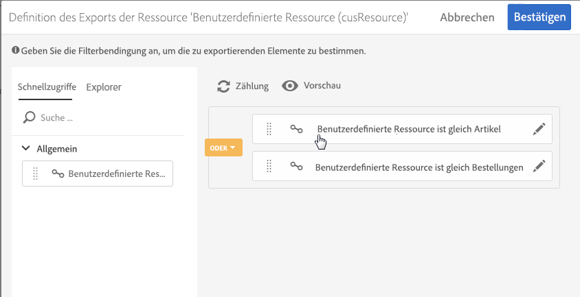

1. Validieren und speichern Sie das definierte Package.

Sie können nun mithilfe der gleichnamigen Schaltfläche den **[!UICONTROL Export starten]**.

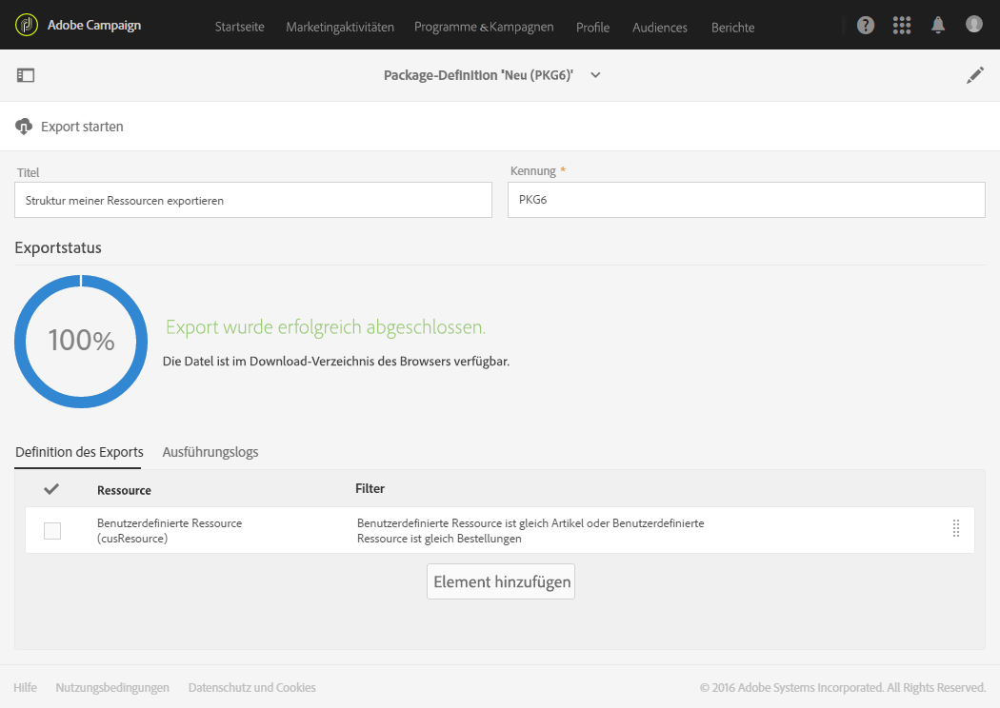

Auf das erstellte Package kann im Download-Ordner zugegriffen werden. Der Name der zip-Datei wird nach dem Zufallsprinzip vergeben. Sie können die Datei bei Bedarf umbenennen.

## Daten exportieren {#exporting-the-data}

Mithilfe dieses zweiten Exports lassen sich die Daten der benutzerdefinierten Ressourcen **Artikel** und **Bestellungen** exportieren.

Bei der Erstellung des zweiten, die Daten enthaltenden Packages nutzen Sie denselben Exporttyp wie beim Strukturexport.

1. Wählen Sie auf der Seite **[!UICONTROL Package-Exporte]** zur Erstellung eines neuen Packages die Schaltfläche **[!UICONTROL Erstellen]** aus.
1. Vergeben Sie den Titel **[!UICONTROL Daten meiner Ressourcen exportieren]** und verwenden Sie im Anschluss im Tab **[!UICONTROL Definition des Exports]** die Schaltfläche **[!UICONTROL Element erstellen]**.
1. Wählen Sie **Artikel** aus der Liste der Ressourcen aus.

   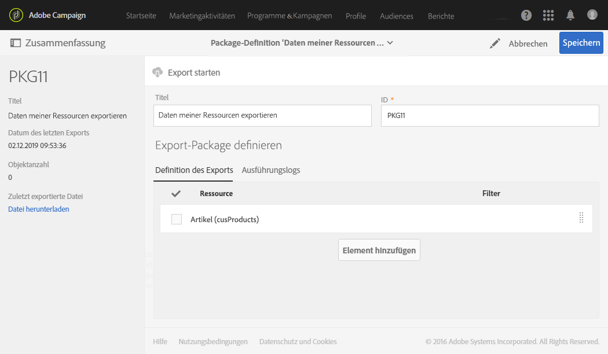

1. Konfigurieren Sie eine erweiterte **Filterbedingung** mit **@Label IS NOT NULL**.

   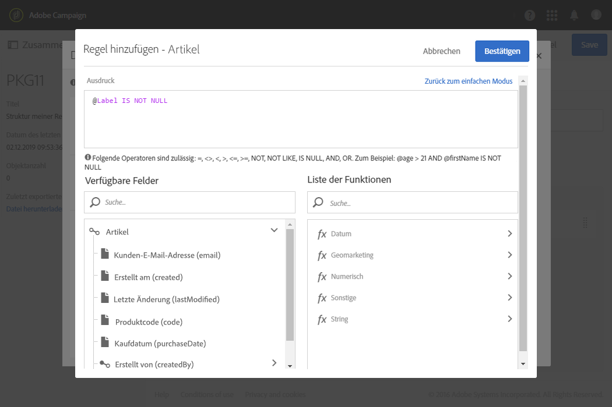

1. Überprüfen Sie die Anzahl.

   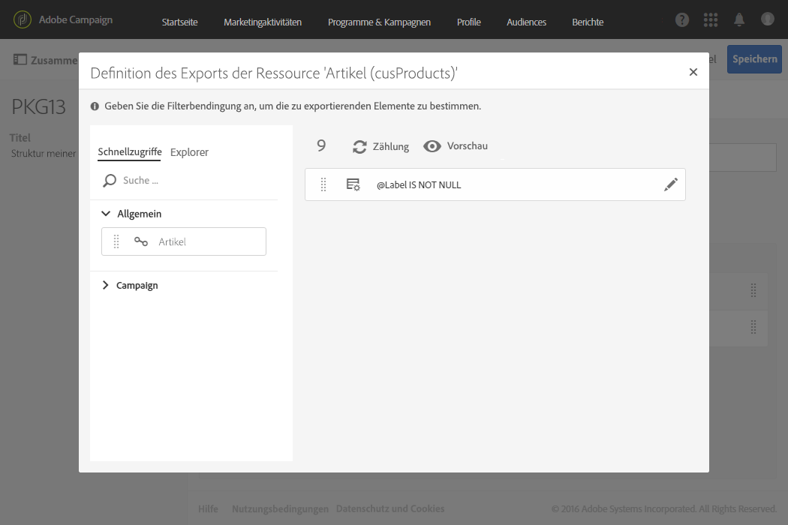

1. Wiederholen Sie den gleichen Vorgang für die benutzerdefinierte Ressource **Bestellungen**.

   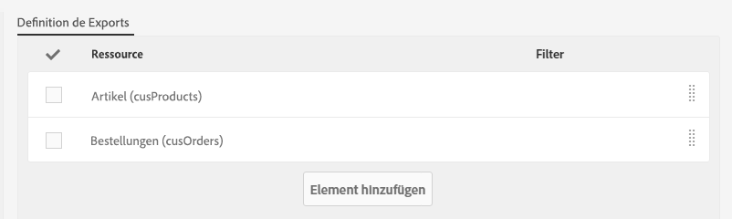

1. Validieren und speichern Sie das definierte Package.

Sie können nun mithilfe der gleichnamigen Schaltfläche den **[!UICONTROL Export starten]**.

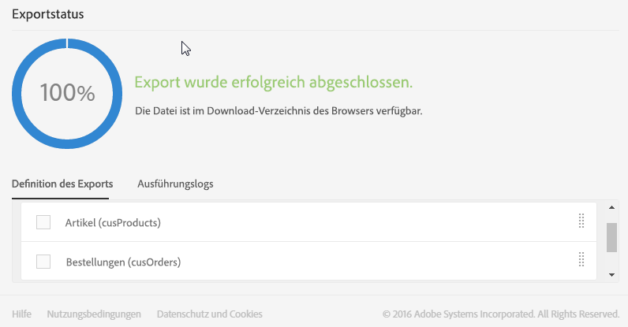

Auf das erstellte Package kann im Download-Ordner zugegriffen werden. Der Name der zip-Datei wird nach dem Zufallsprinzip vergeben. Sie können die Datei bei Bedarf umbenennen.

## Struktur importieren {#importing-the-structure}

### Package importieren {#importing-the-structure-package}

1. Loggen Sie sich in die **Zielinstanz** ein, in die Sie die gerade erstellten Packages importieren möchten.
1. Gehen Sie zum Menü **[!UICONTROL Administration]** / **[!UICONTROL Bereitstellung]** / **[!UICONTROL Package-Importe]**, um ein neues Package zum Import der aus dem ersten Export hervorgehenden Datei zu erstellen.
1. Ziehen Sie die **Strukturdatei** in den dafür vorgesehenen Bereich. Es werden die Formate ZIP oder XML unterstützt.

   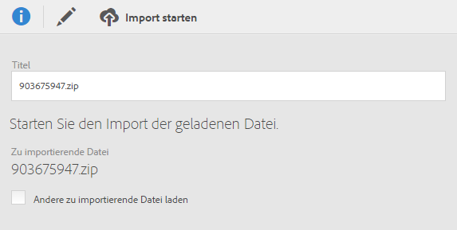

1. Ändern Sie den Titel z. B. in **Struktur importieren** und klicken Sie auf **[!UICONTROL Speichern]**.
1. Verwenden Sie die Schaltfläche **[!UICONTROL Import starten]**.

   

### Veröffentlichen {#publish-structure}

1. Gehen Sie zum Menü **[!UICONTROL Administration]** / **[!UICONTROL Entwicklung]** / **[!UICONTROL Veröffentlichung]**.
1. Verwenden Sie die Schaltflächen **[!UICONTROL Veröffentlichung vorbereiten]** und anschließend **[!UICONTROL Veröffentlichen]**, um die Instanz mit den Daten der neuen benutzerdefinierten Ressourcen zu aktualisieren.
1. Die dem installierten Package entsprechenden Menüeinträge werden in das Menü **[!UICONTROL Benutzerdefinierte Daten]** eingefügt.

   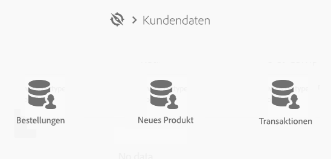

## Daten importieren {#importing-the-data}

In diesem Schritt werden wir die mit dem im vorangehenden Schritt in der Instanz installierten Package verknüpften **Daten importieren**.

Der Schritt ist hier ebenfalls in zwei Etappen unterteilt: den Package-Import und die Veröffentlichung.

### Package importieren {#importing-the-data-package}

1. Gehen Sie zum Menü **[!UICONTROL Administration]** / **[!UICONTROL Bereitstellung]** / **[!UICONTROL Package-Importe]**, um ein neues Package zum Import der die Daten enthaltenden Datei zu erstellen.
1. Ziehen Sie die Datendatei in den dafür vorgesehenen Bereich. Es werden die Formate ZIP oder XML unterstützt.
1. Ändern Sie den Titel z. B. in &quot;Daten importieren&quot; und wählen Sie **[!UICONTROL Speichern]** aus.
1. Verwenden Sie die Schaltfläche **[!UICONTROL Import starten]**.

   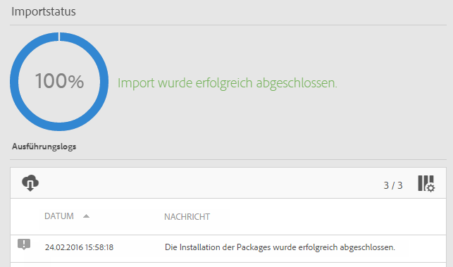

### Veröffentlichen {#publish-data}

1. Gehen Sie zum Menü **[!UICONTROL Administration]** / **[!UICONTROL Entwicklung]** / **[!UICONTROL Veröffentlichung]**.
1. Verwenden Sie die Schaltflächen **[!UICONTROL Veröffentlichung vorbereiten]** und anschließend **[!UICONTROL Veröffentlichen]**, um die Instanz mit den Daten der benutzerdefinierten Ressourcen zu aktualisieren.
