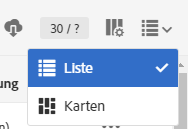
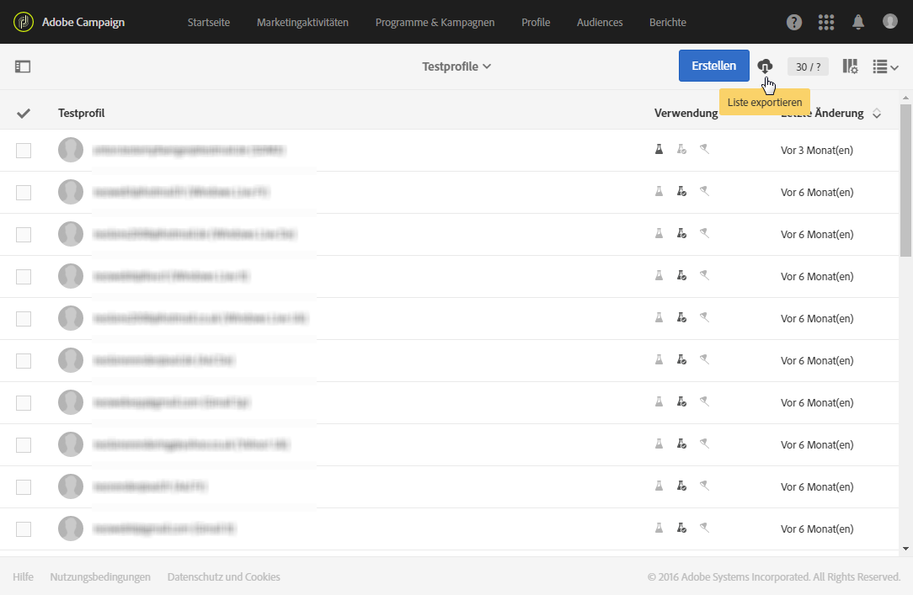

# Listenexport{#exporting-lists}

In Adobe Campaign lassen sich Inhalte von Listen direkt in eine Datei exportieren, die Sie zu einem späteren Zeitpunkt verwenden können. Durch das Exportieren einer Liste in eine Datei wird im Menü **[!UICONTROL Export-Audits]** ein Protokolleintrag erstellt. Weiterführende Informationen zu Export-Audits finden Sie im Abschnitt [Log-Exporte überprüfen](../../administration/using/auditing-export-logs.md).

Die Exportlisten-Option erlaubt standardmäßig den Export von maximal 100.000 Zeilen, die durch die Option **Nms_ExportListLimit** definiert wurden. Diese Option kann vom funktionalen Administrator im Menü **[!UICONTROL Administration]** > **[!UICONTROL Anwendungskonfiguration]** > **[!UICONTROL Optionen]** verwaltet werden.

Zugriff auf diese Funktion besteht bei allen Bildschirmen, die eine **Listen**-Ansicht aufweisen, vorausgesetzt der Benutzer verfügt über die Benutzerrolle **[!UICONTROL EXPORT (export)]**.

1. Gehen Sie zu dem von Ihnen ausgewählten Bildschirm vom Typ **Liste**, beispielsweise die Testprofil-Übersicht (**[!UICONTROL Profile &amp; Audiences]** > **[!UICONTROL Testprofile]** ).
1. Stellen Sie sicher, dass der Bildschirm sich im Anzeigemodus **Liste** befindet.

   

1. Ordnen Sie die Spalten der Liste mithilfe der Schaltfläche **[!UICONTROL Liste konfigurieren]** oben rechts so an, wie sie exportiert werden sollen. Neben den so ausgewählten Spalten wird auch der Primärschlüssel der Ressource exportiert.
1. Bei Bedarf können die Daten gefiltert werden. Verwenden Sie die Schaltfläche links oben, um das Suchemenü einzublenden.

   Wenn der Export ausgehend von einer Liste mit Ressourcen verschiedenen Typs konfiguriert wird, ist diese zunächst zu filtern, sodass nur ein Ressourcentyp angezeigt wird.

1. Bei Bedarf können die Spalten sortiert werden.
1. Verwenden Sie dann die Schaltfläche , um den Export zu starten.

   Ein Popup zur Bestätigung erscheint. Sobald Sie den Export bestätigt haben, wird die Datei automatisch auf Ihr Gerät geladen.

Die Datei wird im CSV-Format mit der Erweiterung .TXT generiert. Sie wird nach der exportierten Ressource und dem Exportdatum benannt. Zum Beispiel: profileBase_20150426_120253.txt für einen am 26. April 2015 um 12:02:53 Uhr erfolgten Export von Profilen. Sie ist im UTF-8-Format kodiert.

Numerische Werte und Daten berücksichtigen die Standortparameter (Locale) des Benutzers, der den Export ausführt. Beispiel: TT-MM-JJJJ oder MM-TT-JJJJ.

Zum Export größerer Datenmengen ist die Erstellung eines spezifischen Workflows erforderlich. Weiterführende Informationen finden Sie im Abschnitt [Dateiextraktion](../../automating/using/extract-file.md).

**Beispiel**

Das vorliegende Beispiel zeigt einen Export der wie unten stehend definierten Profilliste:

* Angezeigte Spalten (in der Reihenfolge): Nachname, Vorname, Geburtsdatum, E-Mail-Adresse.
* Die Liste ist in alphabetischer Reihenfolge der Nachnamen geordnet.



Die erzeugte Datei stellt sich folgendermaßen dar (für die ersten zehn Datensätze):

```
Last name;First name;Birth date;Email;Zip code
Abalo;Patrick;11/11/1941 02:00:00;patrick.a@testmail.com;29200
Abasq;Joel;21/08/1977 02:00:00;abasq.joel@testmail.com;92160
Abernot;John;12/07/1963 01:00:00;john.abernot@testmail.com;78510
Abiven;Christian;16/03/1975 01:00:00;chris.a@mailtest.com;35000
Abouvier;Peter;02/07/1975 01:00:00;pabouvier@mailtest.com;94560
Accardi;Mike;22/06/1948 01:00:00;mike.accardi@mail.com;76400
Accremont;Frank;27/04/1947 01:00:00;accr.frank@mailtest.com;13500
Adam;Daniel;17/09/1953 01:00:00;danieladam@mail.com;17000
Adama;Pascal;22/01/1990 01:00:00;adapascal@mailtest.com;75012
Adama;Henry;22/09/1992 02:00:00;henry.adama@mail.com;64120
```

**Verwandte Themen:**

* [Benutzerrollen](../../administration/using/list-of-roles.md)
* [Listen anpassen](../../start/using/customizing-lists.md)
* Video [Configuring list](https://docs.adobe.com/content/help/en/campaign-learn/campaign-standard-tutorials/getting-started/configure-a-list.html)
