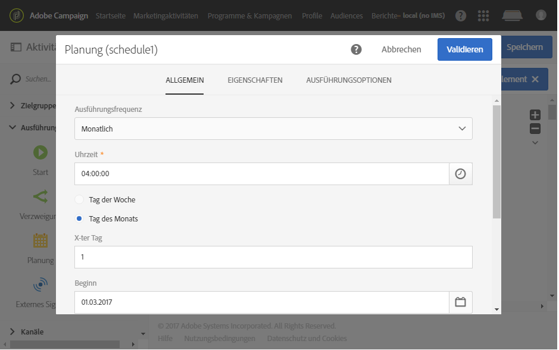
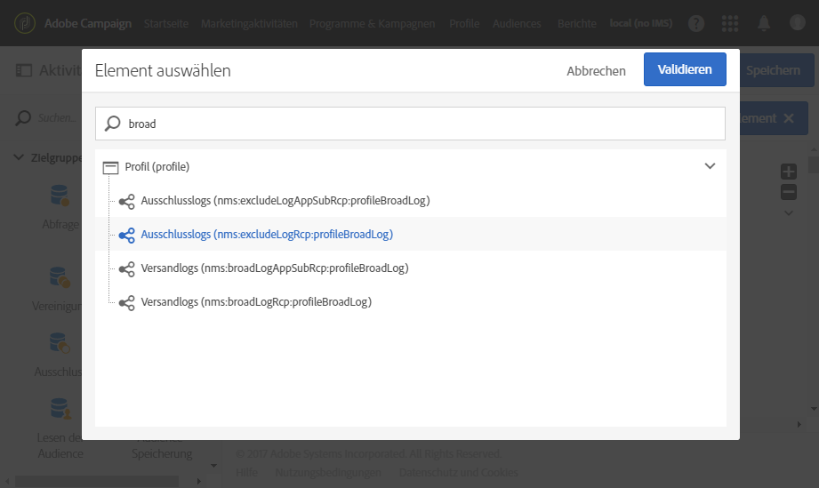
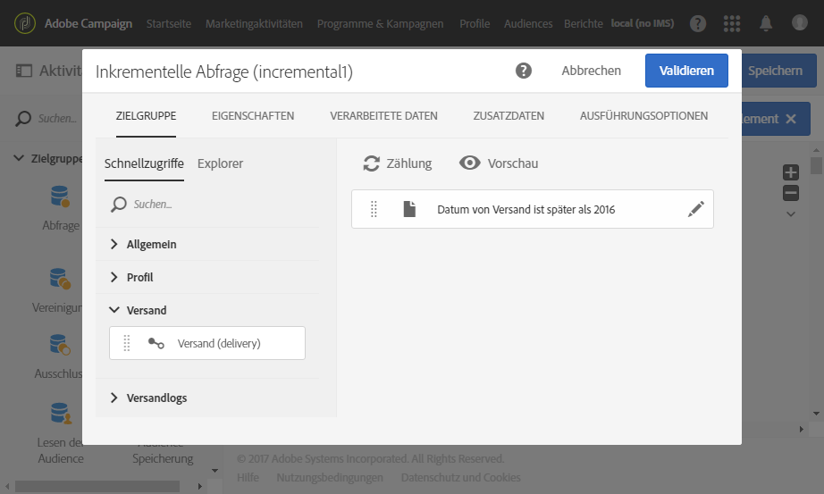
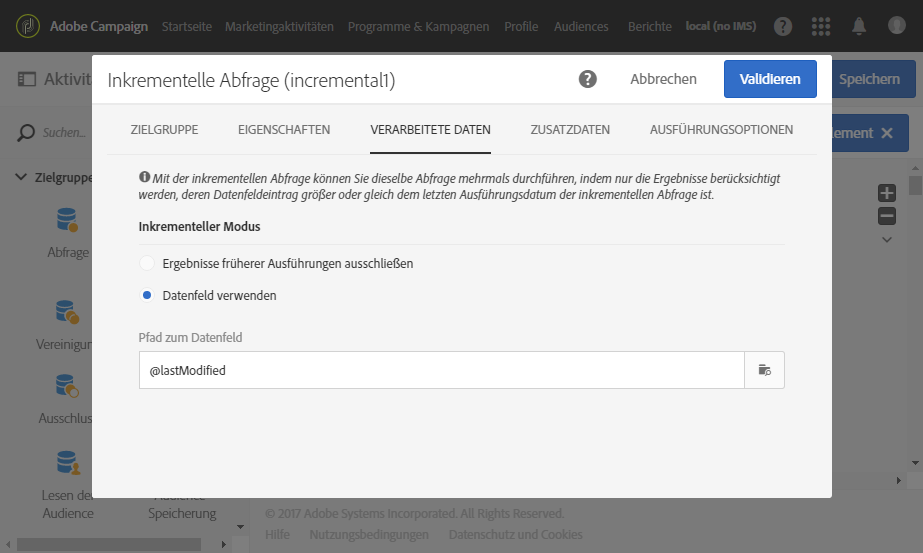
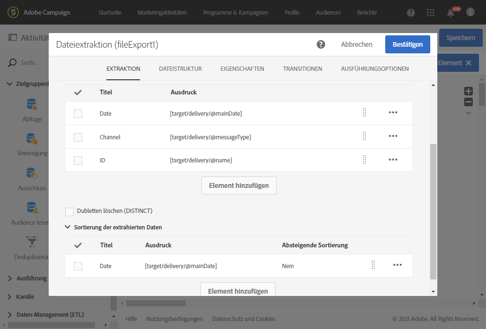
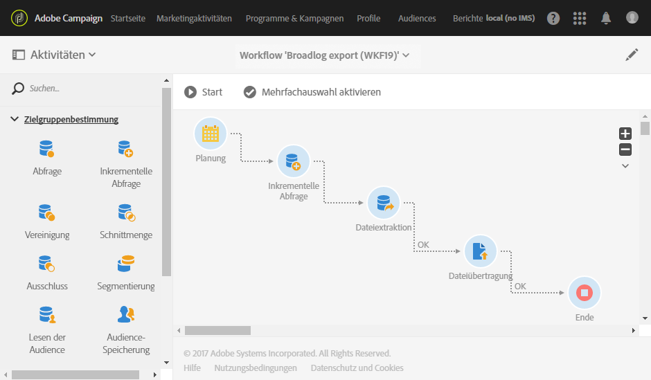

# Logs exportieren{#exporting-logs}

Mit Sendungen oder Abonnements verknüpfte Log-Daten können mit einem einfachen Workflow exportiert werden. Dadurch können Sie die Ergebnisse Ihrer Kampagnen in Ihrem eigenen Business Intelligence Tool analysieren.

>[!CAUTION]
>
>Nur funktionale [Administratoren](../../administration/using/users-management.md#functional-administrators) mit **[!UICONTROL Administratorrolle]** und Zugriff auf **alle** Einheiten können auf Versandlogs, Nachrichtenprotokolle, Trackinglogs, Ausschluss-Logs oder Abonnenten-Logs zugreifen. Ein Benutzer ohne Administratorrechte kann diese Protokolle ansprechen, muss aber mit einer verknüpften Tabelle (Profile, Versand) beginnen.

Durch eine **[!UICONTROL Inkrementelle Abfrage]**, mit der bei jeder Workflow-Ausführung immer nur jeweils neue Logs abgerufen werden, und eine einfache Aktivität des Typs **[!UICONTROL Dateiextraktion]** zur Definition der Ausgabespalten erhalten Sie eine Datei im gewünschten Format mit den erforderlichen Daten. Rufen Sie dann mit der Aktivität **[!UICONTROL Dateiübertragung]** die endgültige Datei ab. Die Ausführung des Workflows wird mit der Aktivität **[!UICONTROL Planung]** geplant.

Der Log-Export kann von Standardbenutzern durchgeführt werden. Private Ressourcen wie Broadlogs, Trackinglogs, Ausschlusslogs, Abonnentenlogs und Abonnementverlauflogs können nur vom funktionalen Administrator auf **Profile** verwaltet werden.

1. Erstellen Sie einen neuen Workflow wie in [diesem Abschnitt](../../automating/using/building-a-workflow.md#creating-a-workflow) beschrieben.
1. Fügen Sie die Aktivität **[!UICONTROL Planung]** hinzu und konfigurieren Sie sie nach Bedarf. Unten finden Sie ein Beispiel für eine monatliche Ausführung.

   

1. Fügen Sie die Aktivität **[!UICONTROL Inkrementelle Abfrage]** hinzu und konfigurieren Sie sie, sodass die gewünschten Logs ausgewählt werden. Um beispielsweise alle neuen oder aktualisierten Broadlogs (Versandlogs der Profile) auszuwählen, gehen Sie folgendermaßen vor:

   * Wählen Sie im Tab **[!UICONTROL Eigenschaften]** als Zielressource **Versandlogs** (broadLogRcp) aus.

      

   * Spezifizieren Sie im Tab **[!UICONTROL Zielgruppe]** eine Bedingung zum Abrufen aller Versandlogs, die Sendungen im Jahr 2016 oder danach entsprechen. Weiterführende Informationen hierzu finden Sie im Abschnitt [Abfragetool](../../automating/using/editing-queries.md#creating-queries).

      

   * Wählen Sie im Tab **[!UICONTROL Verarbeitete Daten]** die Option **[!UICONTROL Datumsfeld verwenden]** und danach **lastModified** aus. Bei der nächsten Ausführung des Workflows werden nur Logs abgerufen, die nach der letzten Ausführung geändert oder erstellt wurden.

      

      In diesem Tab ist nach der ersten Ausführung des Workflows das Datum der jeweils letzten Ausführung zu sehen, welches wiederum für die nächste Ausführung herangezogen wird. Es wird automatisch bei jeder Ausführung des Workflows aktualisiert. Sie können diesen Wert auch überschreiben, indem Sie einen neuen eingeben.

1. Fügen Sie die Aktivität **[!UICONTROL Dateiextraktion]** hinzu, mit der die abgefragten Daten in einer Datei exportiert werden:

   * Geben Sie im Tab **[!UICONTROL Extraktion]** den Namen der Datei ein.

      Wenn Sie die Option **[!UICONTROL Datum und Uhrzeit zum Dateinamen hinzufügen]** auswählen, wird dieser Name automatisch mit dem Datum des Exports ausgefüllt, um sicherzustellen, dass alle extrahierten Dateien eindeutig sind. Wählen Sie die Spalten, die in Ihrer Datei exportiert werden sollen. Hier können Sie Daten von verwandten Ressourcen auswählen, wie etwa Versand- oder Profilinformationen.

      >[!NOTE]
      >
      >Um eine eindeutige Kennung für jedes Protokoll zu exportieren, wählen Sie das Element **[!UICONTROL Versandlog-ID]** aus.

      Zum Ordnen der endgültigen Datei können Sie eine Sortierung vornehmen. Beispielsweise können Sie wie unten gezeigt das Log-Datum sortieren.

      

   * Geben Sie im Tab **[!UICONTROL Dateistruktur]** das Format der Ausgabedatei an.

      Wenn Sie Auflistungswerte exportieren, aktivieren Sie die Option **[!UICONTROL Titel anstelle der internen Werte der Auflistungen exportieren]**. Mit dieser Option können Sie kürzere Titel abrufen, die einfacher verständlich sind als IDs.

1. Fügen Sie die Aktivität **[!UICONTROL Dateiübertragung]** hinzu, und konfigurieren Sie sie, um die neu erstellte Datei vom Adobe Campaign-Server an einen anderen Speicherort zu übertragen, von wo Sie darauf zugreifen können, wie z. B. einen SFTP-Server.

   * Wählen Sie im Tab **[!UICONTROL Allgemein]** die Option **[!UICONTROL Datei-Upload]** aus, da die Datei vom Adobe-Campaign-Server an einen anderen Server gesendet werden soll.
   * Spezifizieren Sie im Tab **[!UICONTROL Protokoll]** die Transferparameter, und wählen Sie das zu verwendende [externe Konto](../../administration/using/external-accounts.md#creating-an-external-account) aus.

1. Fügen Sie die Aktivität **[!UICONTROL Ende]** hinzu, um sicherzustellen, dass der Upload korrekt beendet wird, und speichern Sie den Workflow.

   

Jetzt können Sie den Workflow ausführen und die Ausgabedatei auf dem externen Server abrufen.

**Verwandtes Thema:**

[Workflows](../../automating/using/get-started-workflows.md)
