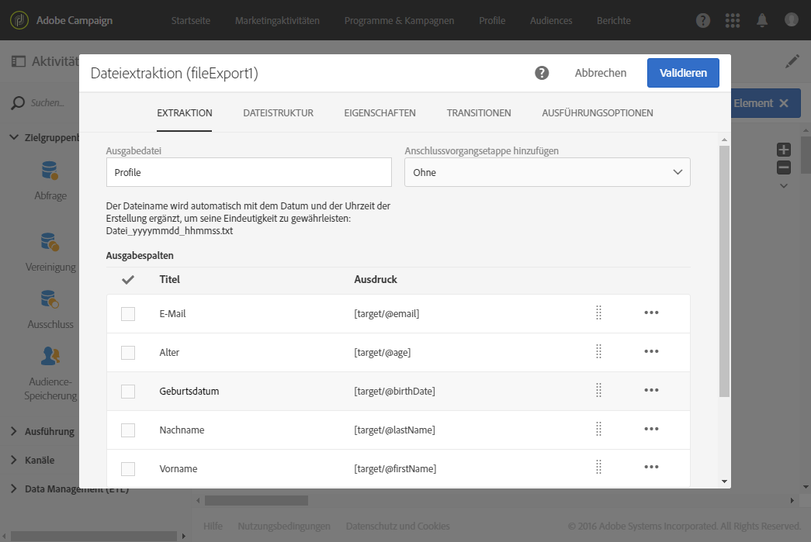
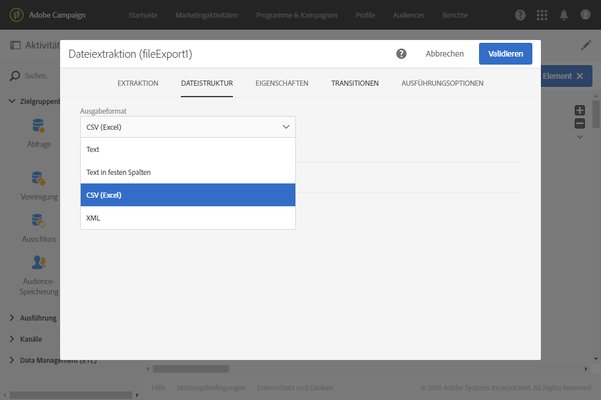
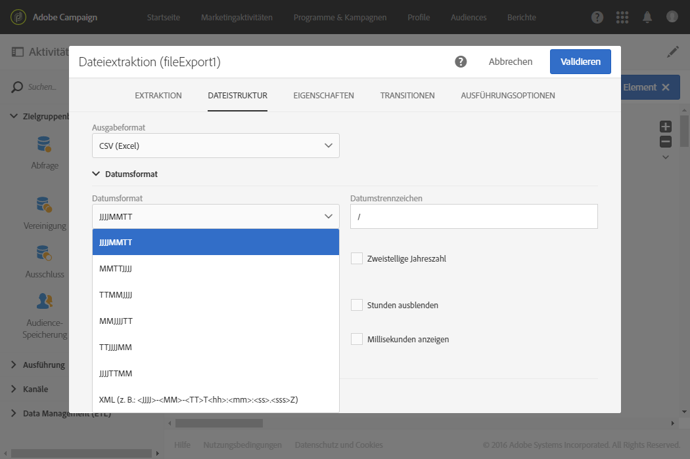
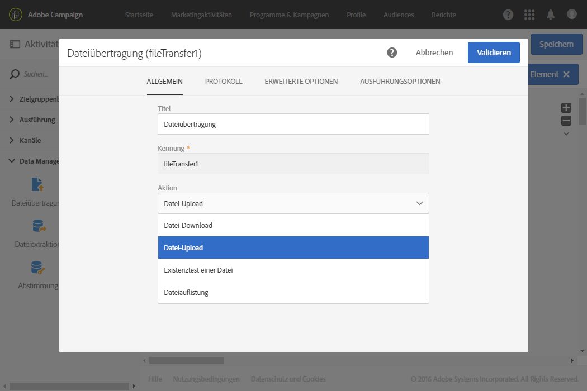
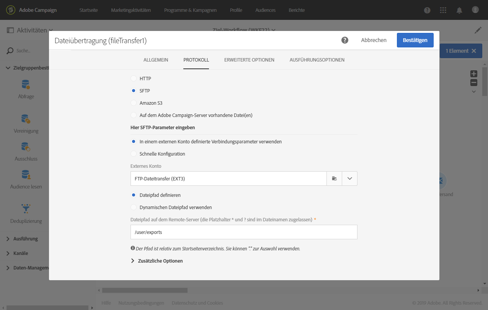

# Profile in eine externe Datei exportieren {#exporting-profiles-external-file}

Im folgenden Beispiel wird die Konfiguration einer auf eine **[!UICONTROL Abfrage]** folgenden **[!UICONTROL Dateiextraktion]** erläutert.

Ziel dieses Workflows ist es, eine Profilliste in eine externe Datei zu exportieren, um die Daten außerhalb von Adobe Campaign verwenden zu können.

1. Platzieren Sie eine [Dateiextraktion](../../automating/using/extract-file.md) im Anschluss an eine [Abfrage](../../automating/using/query.md) im Workflow-Arbeitsbereich.

   Im vorliegenden Beispiel werden alle Profile im Alter von 18 bis 30 Jahren aus der Datenbank abgefragt.

1. Öffnen Sie die Aktivität **[!UICONTROL Dateiextraktion]**, um sie zu konfigurieren.
1. Benennen Sie die Ausgabedatei.
1. Fügen Sie die gewünschten Ausgabespalten hinzu.

   Im vorliegenden Beispiel sind dies E-Mail-Adresse, Alter, Geburtsdatum, Vor- und Nachname der abgefragten Profile.

   

1. Gehen Sie in den **[!UICONTROL Dateistruktur]**-Tab und definieren Sie folgende Elemente:

   * CSV als Ausgabeformat,

      

   * Datumsformat,

      

1. Validieren Sie die Aktivität.
1. Platzieren Sie nun im Anschluss an die **[!UICONTROL Dateiextraktion]** eine [Dateiübertragung](../../automating/using/transfer-file.md), um die Extraktionsdatei mittels eines externen Kontos abrufen zu können.
1. Öffnen Sie die Aktivität und wählen Sie die Aktion **[!UICONTROL Datei-Upload]** aus.

   

1. Wählen Sie ein externes Konto aus und geben Sie den Pfad des Ordners auf dem Server an.

   

1. Validieren Sie die Aktivität und speichern Sie den Workflow.
1. Starten Sie den Workflow.

   Nach erfolgreicher Ausführung des Workflows ist die Extraktionsdatei im externen Konto verfügbar.
