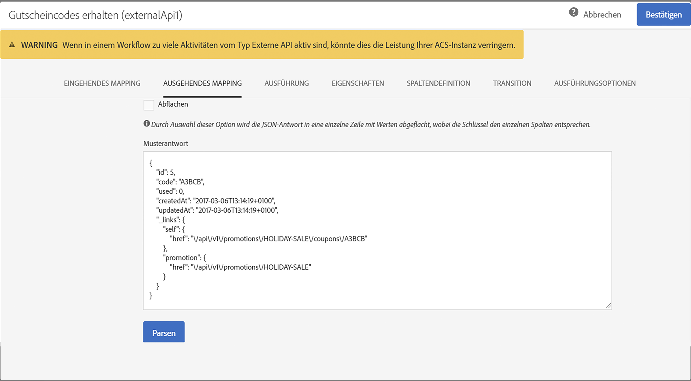

# Externe API {#external-api}

## Beschreibung {#description}

The **[!UICONTROL External API]** activity brings data into the workflow from an **external system** via a **REST API** call.

The REST endpoints can be a customer management system, an [Adobe I/O Runtime](https://www.adobe.io/apis/experienceplatform/runtime.html) instance or an Experience Cloud REST endpoints (Data Platform, Target, Analytics, Campaign, etc).

>[!CAUTION]
>
>Diese Funktion befindet sich derzeit in öffentlicher Hand. Sie müssen die Nutzungsvereinbarung akzeptieren, bevor Sie mit der Verwendung der externen API-Aktivität beginnen. Beachten Sie, dass diese öffentliche Beta-Funktion von Adobe noch nicht kommerziell veröffentlicht wurde und von Adobe Client Care nicht unterstützt wird. Es kann Fehler und möglicherweise auch andere veröffentlichte Funktionen enthalten.

Die Hauptmerkmale dieser Aktivität sind:

* Möglichkeit zur Übergabe von Daten in einem JSON-Format an einen REST-API-Endpunkt von Drittherstellern
* Möglichkeit, eine JSON-Antwort zurückzuerhalten, sie den Ausgabetabellen zuzuordnen und nachzuverfolgen an andere Workflow-Aktivitäten.
* Fehlerverwaltung mit ausgehender spezifischer Umstellung

Für diese Aktivität wurden folgende Schutzzeichen eingerichtet:

* 5 MB HTTP-Antwortdatengrößenbeschränkung
* Anfrage-Timeout beträgt 60 Sekunden
* HTTP-Weiterleitungen sind nicht zulässig.
* Nicht-HTTPS-Urls werden abgelehnt
* " Akzeptieren: application/json "request header and" Content-Type: application/json "response header are allowed

>[!CAUTION]
>
>Beachten Sie, dass die Aktivität zum Abrufen von kampagnenübergreifenden Daten (aktuellste Angebote, aktuelle Werte usw.) konzipiert ist. nicht zum Abrufen bestimmter Informationen für die einzelnen Profile, da dadurch große Datenmengen übertragen werden können. If the use case requires this, the recommendation is to use the [Transfer File](../../automating/using/transfer-file.md) activity.

## Konfiguration {#configuration}

Drag and drop an **[!UICONTROL External API]** activity into your workflow and open the activity to start the configuration.

### Inbound-Zuordnung

Inbound-Zuordnung ist eine temporäre Tabelle, die durch eine vorherige eingehende Aktivität generiert wird, die in der Benutzeroberfläche als JSON angezeigt und gesendet wird.
Basierend auf dieser temporären Tabelle kann der Benutzer Änderungen an eingehenden Daten vornehmen.

The **Inbound resource** dropdown lets you select the query activity that will create the temporary table.

The **Add count parameter** checkbox will a count value for each row coming from the temporary table. Beachten Sie, dass dieses Kontrollkästchen nur verfügbar ist, wenn die eingehende Aktivität eine temporäre Tabelle generiert.

The **Inbound Columns** section allow the user to add any fields from the inbound transition table. Die ausgewählten Spalten sind die Schlüssel im Datenobjekt. Das Datenobjekt in der JSON ist eine Array-Liste mit Daten aus den ausgewählten Spalten aus jeder Zeile der eingehenden Übergangstabelle.

The **customize parameter** text box lets you add a valid JSON with additional data needed by the external API. Diese zusätzlichen Daten werden dem params-Objekt in der generierten JSON hinzugefügt.

### Ausgehendes Mapping

This tab lets you define the sample **JSON structure** returned by the API Call.

The JSON structure pattern is: `{“data”:[{“key”:“value”}, {“key”:“value”},...]}`

The sample JSON definition must have the **following characteristics**:

* **data** ist ein obligatorischer Eigenschaftsname in der JSON-Datei, der Inhalt von "data" ein JSON-Array.
* **Array-Elemente** müssen Eigenschaften auf Erstebene enthalten (tiefere Ebenen werden nicht unterstützt).
   **Eigenschaftsnamen** würden letztendlich Spaltennamen für das Ausgabeschema der temporären Ausgabe der Ausgabe werden.
* **Die Definition des Spaltennamens** basiert auf dem ersten Element des Array "data" .
Columns definition (add/remove) and the type value of the property can be edited in the **Column definition** tab.

If the **parsing is validated** a message appears and invite you to customize the data mapping in the "Column definition" tab. In anderen Fällen wird eine Fehlermeldung angezeigt.

### Ausführung

This tab lets you define the **HTTPS Endpoint** that will send data to ACS. If needed, you can enter authentication information in the fields below.

### Eigenschaften

This tab lets you control **general properties** on the external API activity like the displayed label in the UI. Die interne ID ist nicht anpassbar.

### Spaltendefinition

>[!NOTE]
>
>This tab appears when the **response data format** is completed and validated in Outbound Mapping tab.

The **Column definition** tab allows you to precisely specify the data structure of each column in order to import data that does not contain any errors and make it match the types that are already present in the Adobe Campaign database for future operations.

Es besteht beispielsweise die Möglichkeit, Spaltentitel und Datentyp (String, Ganze Zahl, Datum etc.) anzupassen bzw. den Umgang mit Fehlern zu bestimmen.

For more information, refer to the [Load File](../../automating/using/load-file.md) section.

### Transition

This tab lets you activate the **outbound transition** and its label. This specific transition is useful in case of **timeout** or if the payload exceed the **data size limit**.

### Ausführungsoptionen

Diese Registerkarte ist in den meisten Workflow-Aktivitäten verfügbar. For more information, consult the [Activity properties](../../automating/using/executing-a-workflow.md#activity-properties) section.

## Problembehebung

Dieser neuen Workflow-Aktivität wurden zwei Arten von Protokollmeldungen hinzugefügt: Informationen und Fehler. Sie können Ihnen helfen, potenzielle Probleme zu beheben.

### Information

Diese Protokollmeldungen dienen zum Protokollieren von Informationen zu nützlichen Checkpoints während der Ausführung der Workflow-Aktivität. Insbesondere werden die folgenden Protokollmeldungen verwendet, um den ersten Versuch sowie einen Wiederholungsversuch des ersten Versuchs für den Zugriff auf die API zu protokollieren.

<table> 
 <thead> 
  <tr> 
   <th> Message format  </th> 
   <th> Beispiel  </th> 
  </tr> 
 </thead> 
 <tbody> 
  <tr> 
   <td> API-URL ' % s'aufrufen.</td> 
   <td> 
Invoking APL's https://example.com/api/v1/web-coupon?count=2'.
</td> 
  </tr> 
  <tr> 
   <td> API-URL ' % s'erneut versucht, vorheriger Versuch fehlgeschlagen (' % s ').</td> 
   <td> 
API-URL ' https://example.com/api/v1/web-coupon?count=2', vorheriger Versuch fehlgeschlagen (' HTTP - 401 ').
</td>
  </tr> 
  <tr> 
   <td> Inhalt von ' % s ' (% s/% s) übertragen.</td> 
   <td> 
Übertragen von Inhalten von ' https://example.com/api/v1/web-coupon?count=2' (1234/1234).
</td> 
  </tr>
 </tbody> 
</table>

### Fehler

Diese Protokollmeldungen dienen zum Protokollieren von Informationen zu unerwarteten Fehlerbedingungen, die letztendlich dazu führen können, dass die Workflow-Aktivität fehlschlägt.

<table> 
 <thead> 
  <tr> 
   <th> Code - Message format  </th> 
   <th> Beispiel  </th> 
  </tr> 
 </thead> 
 <tbody> 
  <tr> 
   <td> WKF -560250 - API-Anforderungshandbuch überschritten (Limit: ' % d ').</td> 
   <td> 
API-Anforderungshandbuch überschritten (Limit: ' 5242880 ').
</td> 
  </tr> 
  <tr> 
   <td> WKF -560239 - API-Antwort überschritten (Limit: ' % d ').</td> 
   <td> 
API-Antwort überschritten (Limit: 5242880 ').
</td> 
  </tr> 
  <tr> 
   <td> WKF -560245 - API-URL konnte nicht analysiert werden (Fehler: ' % d ').</td> 
   <td> 
API-URL konnte nicht analysiert werden (Fehler: " -2010" ).

   
 Hinweis: Dieser Fehler wird protokolliert, wenn die API-URL die Validierungsregeln fehlschlägt.
</td>
  </tr> 
  <tr>
   <td> WKF -560244 - API-URL-Host darf nicht als "localhost" oder als IP-Adressenliteral (URL-Host: ' % s ').</td> 
   <td> 
API-URL-Host darf nicht "localhost" oder" IP-Adressliteral" (URL-Host: ' localhost ').

    
API-URL-Host darf nicht "localhost" oder" IP-Adressliteral" (URL-Host: ' 192.168.0.5 ').

    
API-URL-Host darf nicht "localhost" oder" IP-Adressliteral" (URL-Host: ' [2001]').
</td>
  </tr> 
  <tr> 
   <td> WKF -560238 - API-URL muss eine sichere URL (HTTPS) sein (angeforderte URL: ' % s ').</td> 
   <td> 
API-URL muss eine sichere URL (HTTPS) sein (angeforderte URL: ' https://example.com/api/v1/web-coupon?count=2').
</td> 
  </tr> 
  <tr> 
   <td> WKF -560249 - Anforderungs-JSON konnte nicht erstellt werden. Fehler beim Hinzufügen von ' % s '.</td> 
   <td> 
JSON-Datei für Anforderungsanfrage konnte nicht erstellt werden. Fehler beim Hinzufügen von'params '.

    
JSON-Datei für Anforderungsanfrage konnte nicht erstellt werden. Fehler beim Hinzufügen von'Daten '.
</td>
  </tr> 
  <tr> 
   <td> WKF -560246 - HTTP-Header-Schlüssel ist fehlerhaft (Kopfzeilenschlüssel: ' % s ').</td> 
   <td> 
HTTP-Header-Schlüssel ist fehlerhaft (Kopfzeilenschlüssel: ' % s ').

   
 Note: This error is logged when the custom header key fails validation according to <a href="https://tools.ietf.org/html/rfc7230#section-3.2.html">RFC</a>
</td> 
  </tr>
 <tr> 
   <td> WKF -560248 - HTTP-Header-Schlüssel ist nicht zulässig (Kopfzeilenschlüssel: ' % s ').</td> 
   <td> 
HTTP-Header-Schlüssel ist nicht zulässig (Kopfzeilenschlüssel: ' Accept ').
</td> 
  </tr> 
  <tr> 
   <td> WKF -560247 - AHTTP-Header-Wert ist fehlerhaft (Kopfzeilenwert: ' % s ').</td> 
   <td> 
HTTP-Header-Wert ist ungültig (Kopfzeilenwert: ' % s '). 

    
Note: This error is logged when the custom header value fails validation according to <a href="https://tools.ietf.org/html/rfc7230#section-3.2.html">RFC</a>
</td> 
  </tr> 
  <tr> 
   <td> WKF -560240 - JSON-Nutzlast hat die Eigenschaft ' % s '.</td> 
   <td> 
JSON-Nutzlast hat ungültige Eigenschaft'blah '.
</td>
  </tr> 
  <tr>
   <td> WKF -560241 - Fehlerhaft formatierte JSON- oder unzulässige Formate.</td> 
   <td> 
Ungültige JSON oder falsches Format

   
Hinweis: Diese Meldung gilt nur für die Analyse des Antwortkörpers aus der externen API und wird protokolliert, wenn versucht wird, zu überprüfen, ob der Antwortkörper dem von dieser Aktivität vorgeschriebenen JSON-Format entspricht.
</td>
  </tr>
  <tr> 
   <td> WKF -560246 - Aktivität fehlgeschlagen (Grund: ' % s ').</td> 
   <td> 
Wenn Aktivität aufgrund der HTTP 401-Fehlerantwort fehlschlägt, fehlgeschlagen (Grund: ' HTTP - 401 ')

        
Wenn Aktivität aufgrund eines fehlgeschlagenen internen Aufrufs fehlschlägt - Aktivität fehlgeschlagen (Grund: ' Irc - -nn ').

        
Wenn die Aktivität aufgrund einer ungültigen Kopfzeile des Inhaltstyps fehlschlägt. - Aktivität fehlgeschlagen (Grund: " Content-Type - application/html" ).
</td> 
  </tr>
 </tbody> 
</table>

<!--
## Example: Managing coupons with External API Activity

This example illustrates how to **add coupon value** retrieving by a REST call to profiles and then sending an email containing these coupon values.

The workflow is presented as follows:

1. Drag and drop an **External API** activity
    1. Parse the JSON sample responsa as {"data":[{"code":"value"}]}.
    1. Add the **Rest endpoint URL** and define authentication setting if needed
    
    1. In the **column definition** tab, add a new column called **code** that will store the code value.
        
    1. Enabled an **outbound transition** to manage request failures.
1. Drag and drop a **Query** activity
    1. Configure the **Target** tab to query all the **@adobe.com** email. For different Query samples, refer to the [Query](../../automating/using/query.md) section.
    1. In the **additional data** tab, add a new column based on **rowId()** function. This additional column allows you to reconciliate coupon code with the profile ID..
        

        >[!NOTE]
        >
        >This reconciliation approach means that the profile query number is equal to the number of coupon values returned by the REST call.
1. Once this two activities are configured, drag and drop an **Enrichment** activity to associate coupon values with profiles.
    1. Select the previous Query activity in the **primarySet** field.
        
    1. Create a new relation in the **Advanced relations** tab, and add the following reconciliation criteria:
    1. **@expr1** coming grom the Query activity in the source expression field.
    1. **@lineNum** as an expression that returns the line number for each coupon value in the destination field.
        
        More information on the enrichment activity are available [here](../../automating/using/enrichment.md)

    1. The transition **Data Structure** will contain:
        
1. Finally drag and drop a **Send via Email** activity.
    You can modify your email template by adding the **code** personnalized field.

-->
