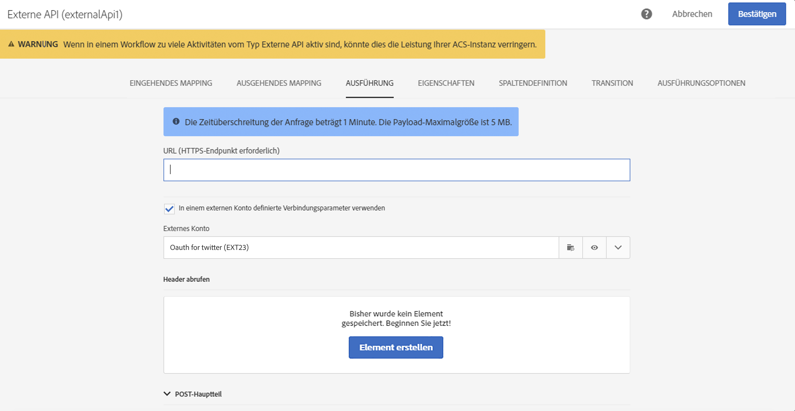

# Externe API {#external-api}

## Beschreibung {#description}

Mit der Aktivität **[!UICONTROL Externe API]** können Daten aus einem **externen System** über einen **HTTP-API**-Aufruf in den Workflow integriert werden.

Bei den externen Systemendpunkten kann es sich um öffentliche API-Endpunkte, Kunden-Management-Systeme oder Server-lose Anwendungsinstanzen (z. B. [Adobe I/O Runtime](https://www.adobe.io/apis/experienceplatform/runtime.html)) handeln, um einige Kategorien zu nennen.

>[!NOTE]
>
>Aus Sicherheitsgründen wird die Verwendung von JSSPs in Campaign Standard nicht unterstützt. Wenn Sie Code ausführen müssen, können Sie eine Adobe I/O Runtime-Instanz über eine externe API-Aktivität aufrufen.

Die Hauptmerkmale dieser Aktivität sind:

* Möglichkeit zur Übertragung von Daten im JSON-Format an einen REST-API-Endpunkt eines Drittanbieters
* Möglichkeit, eine JSON-Antwort zu erhalten, sie mit Ausgabetabellen zu mappen und an nachfolgende Workflow-Aktivitäten zu übermitteln
* Fehlermanagement mit einer speziellen ausgehenden Transition

### Hinweise zur Abwärtskompatibilität {#from-beta-to-ga}

Mit Version 20.4 von Campaign Standard wurden die Leitplanken für die Größenbeschränkung für HTTP-Antwortdaten und das Antwort-Timeout abgesenkt, um den Best Practices zu entsprechen (siehe [Einschränkungen und Limits](#guardrails)). Diese Änderungen der Leitplanken wirken sich nicht auf bestehende externe API-Aktivitäten aus. Daher wird empfohlen, bestehende externe API-Aktivitäten in allen Workflows durch neue zu ersetzen.

Fügen Sie beim Ersetzen externer API-Aktivitäten die neue externe API-Aktivität zum Workflow hinzu, kopieren Sie manuell die Konfigurationsdetails und löschen Sie dann die alte Aktivität.

>[!NOTE]
>
>Sie können keine aktivitätenspezifische Header-Werte kopieren, da diese in der Aktivität maskiert sind.

### Einschränkungen und Leitplanken {#guardrails}

Für diese Aktivität gelten die folgenden Schutzmaßnahmen:

* Größenbeschränkung für HTTP-Antwortdaten von 5 MB (Hinweis: Dies ist eine Änderung gegenüber der Beschränkung von 50 MB in der vorherigen Version).
* Die Zeitüberschreitung bei Anfragen beträgt 1 Minute (Hinweis: Dies ist eine Änderung gegenüber der Zeitüberschreitung von 10 Minuten in der vorherigen Version).
* HTTP-Umleitungen sind nicht zulässig.
* Andere URLs als HTTPS werden abgelehnt.
* Erlaubt sind Abfrage-Header vom Typ &quot;Accept: application/json&quot; und Antwort-Header vom Typ &quot;Content-Type: application/json&quot;.

Es wurden spezielle Schutzmaßnahmen eingeführt:

* **Max. JSON-Tiefe**: begrenzt die maximale Tiefe einer benutzerdefinierten verschachtelten JSON, die auf 10 Ebenen verarbeitet werden kann.
* **Max. JSON-Schlüssellänge**: begrenzt die maximale Länge des internen Schlüssels auf 255. Dieser Schlüssel ist mit der Spaltenkennung verknüpft.
* **Max. zulässige Zahl an JSON-Duplikatschlüsseln**: begrenzt die maximale Gesamtzahl der als Spaltenkennung verwendeten Duplikat-JSON-Eigenschaftsnamen auf 150.

>[!CAUTION]
>
>Die Externe API-Aktivität ist zum Abrufen von Daten aus der gesamten Kampagne (letzte Angebotspakete, aktuelle Bewertungen usw.) und nicht zum Abrufen spezifischer Informationen für jedes Profil gedacht, da dies zu einer Übertragung großer Datenmengen führen kann. Sollte dies dennoch erforderlich sein, wird empfohlen, die Aktivität [Datei übertragen](../../automating/using/transfer-file.md) zu verwenden.

## Konfiguration {#configuration}

Ziehen Sie die Aktivität **[!UICONTROL Externe API]** in Ihren Workflow und öffnen Sie sie, um sie zu konfigurieren.

### Eingehendes Mapping

Beim eingehenden Mapping handelt es sich um eine temporäre Tabelle, die durch eine vorherige eingehende Aktivität generiert wurde. Sie wird in der Benutzeroberfläche als JSON angezeigt und gesendet.
Mithilfe dieser temporären Tabelle kann der Benutzer Änderungen an eingehenden Daten vornehmen.

Im Dropdown-Feld **Eingehende Ressource** können Sie die Abfrageaktivität auswählen, die die temporäre Tabelle erstellen soll.

Mit der Checkbox **Zählerparameter hinzufügen** wird ein Zählerwert für jede Zeile hinzugefügt, die aus der temporären Tabelle stammt. Beachten Sie, dass diese Checkbox nur verfügbar ist, wenn die eingehende Aktivität eine temporäre Tabelle generiert.

Der Bereich **Eingehende Spalten** ermöglicht Ihnen, beliebige Felder der Tabelle für eingehende Transitionen hinzuzufügen. Die ausgewählte(n) Spalte(n) dienen im Datenobjekt als Schlüssel. Das Datenobjekt im JSON-Format ist eine Array-Liste mit Daten für die ausgewählten Spalten aus jeder Zeile der Tabelle eingehender Transitionen.

Mit dem Textfeld **Parameter anpassen** können ein gültiges JSON-Format mit zusätzlichen Daten hinzufügen, die von der externen API benötigt werden. Diese zusätzlichen Daten werden dem params-Objekt im generierten JSON-Format hinzugefügt.

### Ausgehendes Mapping

In diesem Tab können Sie das Muster der **JSON-Struktur** definieren, das vom API-Aufruf zurückgegeben wird.

Der JSON-Parser ist so konzipiert, dass er mit einigen Ausnahmen standardmäßige JSON-Strukturmustertypen aufnehmen kann. Ein Beispiel für ein Standardmuster ist: `{“data”:[{“key”:“value”}, {“key”:“value”},...]}`

Die JSON-Definition des Musters muss die **folgenden Merkmale** aufweisen:

* **Array-Elemente** müssen Eigenschaften der ersten Ebene enthalten (tiefere Ebenen werden nicht unterstützt).
  **Eigenschaftsnamen** werden zu Spaltennamen für das Ausgabeschema der temporären Ausgabetabelle.
* Zu erfassende **JSON-Elemente** dürfen innerhalb der JSON-Antwort maximal 10 Verschachtelungsebenen aufweisen.
* Die Definition von **Column name** basiert auf dem ersten Element des &quot;data&quot;-Array.
Die Spaltendefinitionen (Hinzufügen/Entfernen) und der Wert des Eigenschaftentyps können im Tab **Spaltendefinition** bearbeitet werden.

Verhalten der **Checkbox &quot;Abflachen&quot;**:

Die Checkbox &quot;Abflachen&quot; (Standard: deaktiviert) dient zur Angabe, ob JSON auf eine Schlüssel/Wert-Zuordnung abgeflacht werden soll oder nicht.

* Wenn die **Checkbox deaktiviert** (nicht markiert) ist, wird die JSON-Musterdatei analysiert, um nach einem Array-Objekt zu suchen. Der Anwender muss eine reduzierte Version des JSON-Musterformats für die API-Antwort bereitstellen, damit Adobe Campaign genau bestimmen kann, welches Array der Anwender nutzen möchte. Beim Authoring des Workflows wird der Pfad zum verschachtelten Array-Objekt ermittelt und erfasst, sodass er zur Ausführungszeit verwendet werden kann, um auf dieses Array-Objekt aus dem JSON-Antwortteil zuzugreifen, der vom API-Aufruf empfangen wurde.

* Wenn die **Checkbox aktiviert** (markiert) ist, wird die JSON-Musterdatei abgeflacht und alle Eigenschaften, die in der bereitgestellten JSON-Musterdatei angegeben sind, werden genutzt, um Spalten der temporären Ausgabentabelle zu erstellen. Zudem erfolgt eine Anzeige auf dem Tab &quot;Spaltendefinitionen&quot;. Beachten Sie, dass alle Elemente dieser Array-Objekte ebenfalls abgeflacht werden, wenn sich in der JSON-Musterdatei ein Array-Objekt befindet.

Wenn das **Parsen validiert wird**, erscheint eine Meldung, die Sie auffordert, das Daten-Mapping im Tab &quot;Spaltendefinition&quot; anzupassen. Andernfalls wird eine Fehlermeldung angezeigt.

### Ausführung

In diesem Tab können Sie den Endpunkt der Verbindung definieren. Mit dem Feld **[!UICONTROL URL]** können Sie den **HTTPS-Endpunkt** definieren, mit dem Campaign Standard kommuniziert.

Falls der Endpunkt dies benötigt, stehen zwei Authentifizierungsmechanismen zur Verfügung:

* Einfache Authentifizierung: Geben Sie in den Abschnitt **[!UICONTROL Header abrufen]** Ihren Benutzernamen und Ihr Passwort ein.

* OAuth-Authentifizierung: Durch Klicken auf **[!UICONTROL In einem externen Konto definierte Verbindungsparameter verwenden]** können Sie ein externes Konto auswählen, in dem die OAuth-Authentifizierung definiert ist. Weiterführende Informationen hierzu finden Sie im Abschnitt [Externe Konten](../../administration/using/external-accounts.md).

### Eigenschaften

In diesem Tab können Sie **allgemeine Eigenschaften** der externen API-Aktivität steuern, wie den in der Benutzeroberfläche angezeigten Titel. Die interne ID kann nicht verändert werden.

### Spaltendefinition

>[!NOTE]
>
>Dieser Tab wird angezeigt, wenn das **Antwortdatenformat** ausgefüllt und im Tab &quot;Ausgehendes Mapping&quot; validiert wird.

Im Tab **Spaltendefinition** lässt sich die Datenstruktur für jede Spalte separat definieren, um fehlerfreie Daten zu importieren und die Kompatibilität mit den bereits in der Datenbank existierenden Daten zu gewährleisten.

Es besteht beispielsweise die Möglichkeit, Spaltentitel und Datentyp (String, Ganze Zahl, Datum etc.) anzupassen bzw. den Umgang mit Fehlern zu bestimmen.

Weiterführende Informationen hierzu finden Sie im Abschnitt [Datei laden](../../automating/using/load-file.md).

### Transition

In diesem Tab können Sie die **ausgehende Transition** und ihren Titel aktivieren. Diese spezifische Transition ist nützlich im Fall von **Zeitüberschreitung** oder wenn die Payload die **maximale Datengröße** überschritten hat.

### Ausführungsoptionen

Dieser Tab ist in den meisten Workflow-Aktivitäten verfügbar. Lesen Sie für weiterführende Informationen den Abschnitt [Aktivitätseigenschaften](../../automating/using/activity-properties.md).

## Testen

Wenn Sie die Funktionalität der externen API mit einem einfachen Test-Endpunkt testen möchten, können Sie Postman Echo verwenden: https://docs.postman-echo.com.

## Fehlerbehebung

Zu dieser neuen Workflow-Aktivität wurden zwei Arten von Lognachrichten hinzugefügt: Informationen und Fehler. Diese können Ihnen helfen, potenzielle Probleme zu beheben.

### Informationen

In diesen Lognachrichten werden während der Ausführung der Workflow-Aktivität Informationen über nützliche Kontrollpunkte protokolliert.
<table> 
 <thead> 
  <tr> 
   <th> Nachrichtenformat  </th> 
   <th> Beispiel  </th> 
  </tr> 
 </thead> 
 <tbody> 
  <tr> 
   <td> API-URL '%s' wird aufgerufen.</td> 
   <td> 
API-URL 'https://example.com/api/v1/web-coupon?count=2' wird aufgerufen.
</td> 
  </tr> 
  <tr> 
   <td> Wiederholen der API-URL '%s' wegen %s in %d ms, Versuch %d.</td> 
   <td> 
Wiederholen der API URL 'https://example.com/api/v1/web-coupon?count=0' wegen HTTP - 401 in 2364 ms, Versuch 2.
</td>
  </tr> 
  <tr> 
   <td> Inhalt wird aus '%s' (%s / %s) transferiert.</td> 
   <td> 
Inhalt wird aus 'https://example.com/api/v1/web-coupon?count=2' (1234 / 1234) transferiert.
</td> 
  </tr>
  <tr> 
   <td> Verwendung des Zugriffs-Tokens im Cache für Anbieter-ID '%s'.</td> 
   <td> 
Verwendung des Zugriffs-Tokens im Cache für Anbieter-ID 'EXT25'. Hinweis: EXT25 ist die ID (oder der Name) des externen Kontos. 
</td> 
  </tr>
  <tr> 
   <td> Zugriffs-Token für Anbieter-ID '%s' vom Server abgerufen.</td> 
   <td> 
Zugriffs-Token für Anbieter-ID 'EXT25' vom Server abgerufen. Hinweis: EXT25 ist die ID (oder der Name) des externen Kontos.
</td> 
  </tr>
  <tr> 
   <td> Aktualisierung des OAuth-Zugriffs-Tokens aufgrund eines Fehlers (HTTP: '%d').</td> 
   <td> 
Aktualisierung des OAuth-Zugriffs-Tokens aufgrund eines Fehlers (HTTP: '401').
</td> 
  </tr>
  <tr> 
   <td> Fehler beim Aktualisieren des OAuth-Zugriffs-Tokens (Fehler: '%d'). </td> 
   <td> 
Fehler beim Aktualisieren des OAuth-Zugriffs-Tokens (Fehler: '404').
</td> 
  </tr>
  <tr> 
   <td> Das OAuth-Zugriffstoken konnte mit dem spezifizierten externen Konto bei Versuch %d nicht abgerufen werden, Wiederholungsversuch in %d ms.</td> 
   <td> 
Das OAuth-Zugriffstoken konnte mit dem spezifizierten externen Konto bei Versuch 1 nicht abgerufen werden, Wiederholungsversuch in 1387 ms.
</td> 
  </tr>
 </tbody> 
</table>

### Fehler

In diesen Lognachrichten werden Informationen zu unerwarteten Fehlerbedingungen protokolliert, die letztendlich dazu führen können, dass die Workflow-Aktivität fehlschlägt.

<table> 
 <thead> 
  <tr> 
   <th> Code - Nachrichtenformat  </th> 
   <th> Beispiel  </th> 
  </tr> 
 </thead> 
 <tbody> 
  <tr> 
   <td> WKF-560250 - API-Anfrage-Hauptteil überschritt Limit (Limit: '%d').</td> 
   <td> 
API-Anfrage-Hauptteil überschritt Limit (Limit: '5242880‘).
</td> 
  </tr> 
  <tr> 
   <td> WKF-560239 - API-Antwort hat Limit überschritten (Limit: '%d').</td> 
   <td> 
API-Antwort hat Limit überschritten (Limit: 5242880').
</td> 
  </tr> 
  <tr> 
   <td> WKF-560245 - API-URL konnte nicht geparst werden (Fehler: '%d').</td> 
   <td> 
API-URL konnte nicht geparst werden (Fehler: '-2010').

   
 Hinweis: Dieser Fehler wird protokolliert, wenn die API-URL die Validierungsregeln nicht erfüllt.
</td>
  </tr> 
  <tr>
   <td> WKF-560244 - API-URL-Host darf nicht 'localhost' oder IP-Adressen-Literal sein (URL-Host: '%s').</td> 
   <td> 
API-URL-Host darf nicht 'localhost' oder IP-Adressen-Literal sein (URL-Host: 'localhost‘).

    
API-URL-Host darf nicht 'localhost' oder IP-Adressen-Literal sein (URL-Host: '192.168.0.5').

    
API-URL-Host darf nicht 'localhost' oder IP-Adressen-Literal sein (URL-Host: '[2001]‘).
</td>
  </tr> 
  <tr> 
   <td> WKF-560238 - API-URL muss eine sichere URL sein (HTTPS) (angefragte URL: '%s').</td> 
   <td> 
API-URL muss eine sichere URL (HTTPS) sein (angeforderte URL: 'https://example.com/api/v1/web-coupon?count=2').
</td> 
  </tr> 
  <tr> 
   <td> WKF-560249 - angeforderte JSON konnte nicht erstellt werden. Fehler beim Hinzufügen von '%s'.</td> 
   <td> 
Angeforderte JSON konnte nicht erstellt werden. Fehler beim Hinzufügen von 'params'.

    
Angeforderte JSON konnte nicht erstellt werden. Fehler beim Hinzufügen von 'data'.
</td>
  </tr> 
  <tr> 
   <td> WKF-560246 - HTTP-Header-Schlüssel ist ungültig (Header-Schlüssel: '%s').</td> 
   <td> 
HTTP-Header-Schlüssel ist ungültig (Header-Schlüssel: '%s').

   
 Hinweis: Dieser Fehler wird protokolliert, wenn der benutzerdefinierte Header-Schlüssel die <a href="https://tools.ietf.org/html/rfc7230#section-3.2.html">RFC</a>-Validierung nicht besteht.
</td> 
  </tr>
 <tr> 
   <td> WKF-560248 - HTTP-Header-Schlüssel ist nicht erlaubt (Header-Schlüssel: '%s').</td> 
   <td> 
HTTP-Header-Schlüssel ist nicht erlaubt (Header-Schlüssel: 'Accept').
</td> 
  </tr> 
  <tr> 
   <td> WKF-560247 - HTTP-Header-Wert ist ungültig (Header-Wert: '%s').</td> 
   <td> 
HTTP-Header-Wert ist ungültig (Header-Wert: '%s'). 

    
Hinweis: Dieser Fehler wird protokolliert, wenn der benutzerdefinierte Header-Wert die <a href="https://tools.ietf.org/html/rfc7230#section-3.2.html">RFC</a>-Validierung nicht besteht.
</td> 
  </tr> 
  <tr> 
   <td> WKF-560240 - JSON-Payload hat ungültige Eigenschaft '%s'.</td> 
   <td> 
JSON-Payload hat ungültige Eigenschaft 'blah'.
</td>
  </tr> 
  <tr>
   <td> WKF-560241 - Ungültige JSON oder falsches Format.</td> 
   <td> 
Ungültige JSON oder falsches Format

   
Hinweis: Diese Nachricht gilt nur für das Parsen des Antwort-Hauptteils in der externen API und wird protokolliert, wenn versucht wird, zu überprüfen, ob der Antwort-Hauptteil dem durch diese Aktivität vorgeschriebenen JSON-Format entspricht.
</td>
  </tr>
  <tr> 
   <td> WKF-560246 - Aktivität fehlgeschlagen (Grund: '%s').</td> 
   <td> 
Wenn die Aktivität aufgrund der HTTP 401-Fehlerantwort fehlschlägt - Aktivität fehlgeschlagen (Grund: 'HTTP - 401').

        
Wenn die Aktivität aufgrund eines fehlgeschlagenen internen Aufrufs fehlschlägt - Aktivität fehlgeschlagen (Grund: 'iRc - -Nn').

        
Wenn die Aktivität aufgrund eines Headers eines ungültigen Inhaltstyps fehlschlägt. - Aktivität fehlgeschlagen (Grund: 'Content-Type - application/html').
</td> 
  </tr>
  <tr> 
   <td> WKF-560278 – "Fehler beim Initialisieren des OAuth-Helfers (Fehler: '%d')".</td> 
   <td> 
Dieser Fehler weist darauf hin, dass die Aktivität die interne OAuth2.0-Hilfsfunktion nicht initialisieren konnte, da die im externen Konto konfigurierten Attribute zur Initialisierung der Hilfsfunktion fehlerhaft verwendet wurden.
</td>
  </tr>
  <tr> 
   <td> WKF-560279 – "HTTP-Header-Schlüssel ist nicht erlaubt (Header-Schlüssel: '%s')."</td> 
   <td> 
Diese Warnmeldung (keine Fehlermeldung) weist darauf hin, dass das externe OAuth 2.0-Konto so konfiguriert wurde, dass Zugangsdaten als ein HTTP-Header hinzugefügt werden, der verwendete Header-Schlüssel jedoch nicht zulässig ist, da es sich um einen reservierten Header-Schlüssel handelt.
</td>
  </tr>
  <tr> 
   <td> WKF-560280 – Das externe Konto der Kennung '%s' kann nicht gefunden werden.</td> 
   <td> 
Das externe Konto der Kennung 'EXT25' kann nicht gefunden werden.  Hinweis: Dieser Fehler weist darauf hin, dass die Aktivität für die Verwendung eines externen Kontos konfiguriert ist, das nicht mehr gefunden werden kann. Dies ist am wahrscheinlichsten, wenn das Konto aus der Datenbank gelöscht wurde, und ist als solches unter normalen Betriebsbedingungen nicht zu erwarten.
</td>
  </tr>
  <tr> 
   <td> WKF-560281 – Das externe Konto der Kennung '%s' ist deaktiviert.</td> 
   <td> 
Das externe Konto der Kennung 'EXT25' ist deaktiviert. Hinweis: Dieser Fehler weist darauf hin, dass die Aktivität zur Verwendung eines externen Kontos konfiguriert ist, dieses Konto jedoch deaktiviert (oder als inaktiv markiert) wurde.
</td>
  </tr>
  <tr> 
   <td> WKF-560282 – Protokoll wird nicht unterstützt.</td> 
   <td> 
Dieser Fehler weist darauf hin, dass das mit der Aktivität verknüpfte externe Konto kein externes OAuth2.0-Konto ist. Daher ist es unwahrscheinlich, dass dieser Fehler auftritt, es sei denn, die Konfiguration der Aktivität wurde beschädigt oder manuell geändert.
</td>
  </tr>
  <tr> 
   <td> WKF-560283 – Abrufen des OAuth-Zugriffs-Tokens fehlgeschlagen.</td> 
   <td> 
Die häufigste Ursache dieses Fehlers ist eine Fehlkonfiguration des externen Kontos (z. B.: Verwendung des externen Kontos ohne Prüfung, ob die Verbindung erfolgreich hergestellt wurde). Möglicherweise werden die URL-/Zugangsdaten im externen Konto geändert.
</td>
  </tr>
  <tr> 
   <td> CRL-290199 – Seite nicht erreichbar unter: %s.</td> 
   <td> 
Diese Fehlermeldung wird auf dem Bildschirm der Benutzeroberfläche des externen Kontos angezeigt, wenn dieses für OAuth eingerichtet wird. Sie bedeutet, dass die URL für den externen Autorisierungs-Server entweder falsch oder geändert wurde oder der Server mit "Seite nicht gefunden" antwortet.
</td>
  </tr>
  <tr> 
   <td> CRL-290200 – Unvollständige/falsche Zugriffsdaten.</td> 
   <td> 
Diese Fehlermeldung wird auf dem Bildschirm der Benutzeroberfläche des externen Kontos angezeigt, wenn dieses für OAuth eingerichtet wird. Sie bedeutet, dass die Zugangsdaten entweder falsch sind oder andere erforderliche Zugangsdaten für die Verbindung mit dem Autorisierungs-Server fehlen.

</td>
  </tr>
 </tbody> 
</table>

<!--
## Example: Managing coupons with External API Activity

This example illustrates how to **add coupon value** retrieving by a REST call to profiles and then sending an email containing these coupon values.

The workflow is presented as follows:

1. Drag and drop an **External API** activity
    1. Parse the JSON sample response as {"data":[{"code":"value"}]}.
    1. Add the **Rest endpoint URL** and define authentication setting if needed
    
    1. In the **column definition** tab, add a new column called **code** that will store the code value.
        
    1. Enabled an **outbound transition** to manage request failures.
1. Drag and drop a **Query** activity
    1. Configure the **Target** tab to query all the **@adobe.com** email. For different Query samples, refer to the [Query](../../automating/using/query.md) section.
    1. In the **additional data** tab, add a new column based on **rowId()** function. This additional column allows you to reconciliate coupon code with the profile ID..
        

        >[!NOTE]
        >
        >This reconciliation approach means that the profile query number is equal to the number of coupon values returned by the REST call.
1. Once this two activities are configured, drag and drop an **Enrichment** activity to associate coupon values with profiles.
    1. Select the previous Query activity in the **primarySet** field.
        
    1. Create a new relation in the **Advanced relations** tab, and add the following reconciliation criteria:
    1. **@expr1** coming grom the Query activity in the source expression field.
    1. **@lineNum** as an expression that returns the line number for each coupon value in the destination field.
        
        More information on the enrichment activity are available [here](../../automating/using/enrichment.md)

    1. The transition **Data Structure** will contain:
        
1. Finally drag and drop a **Send via Email** activity.
    You can modify your email template by adding the **code** personalized field.

-->
