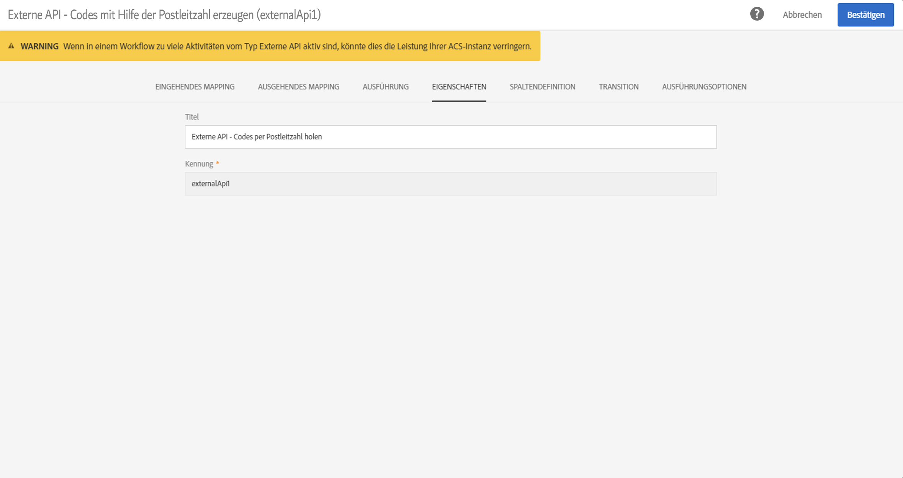
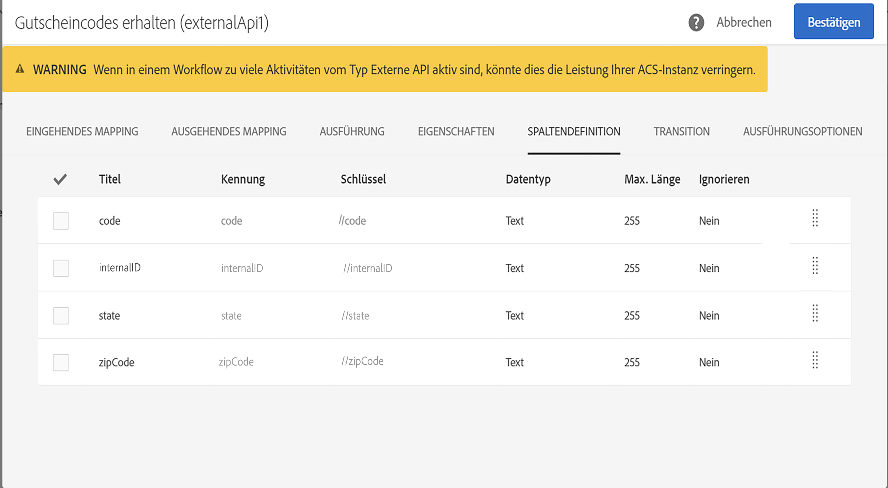

# Externe API {#external-api}

## Beschreibung {#description}

The **[!UICONTROL External API]** activity brings data into the workflow from an **external system** via a **REST API** call.

Die REST-Endpunkte können ein Customer Management System, die Plattform [Adobe I/O Runtime](https://www.adobe.io/apis/experienceplatform/runtime.html) oder ein Experience Cloud REST-Endpunkt (Data Platform, Target, Analytics, Campaign usw.) sein.

>[!NOTE]
>
>Aus Sicherheitsgründen wird die Verwendung von JSSPs in Campaign Standard nicht unterstützt. Wenn Sie Code ausführen müssen, können Sie eine Adobe I/O Runtime-Instanz über eine externe API-Aktivität aufrufen.

>[!IMPORTANT]
>
>Diese Funktion befindet sich derzeit in der Betaphase. Vor der Verwendung der Externe API-Aktivität müssen Sie die Nutzungsvereinbarung akzeptieren. Beachten Sie, dass diese Betafunktion von Adobe noch nicht veröffentlicht wurde und daher vom Adobe-Kundendienst nicht unterstützt wird. Die Funktion kann Fehler enthalten und funktioniert möglicherweise nicht so gut wie veröffentlichte Funktionen.

Die Hauptmerkmale dieser Aktivität sind:

* Möglichkeit zur Übertragung von Daten im JSON-Format an einen REST-API-Endpunkt eines Drittanbieters
* Möglichkeit, eine JSON-Antwort zu erhalten, sie mit Ausgabetabellen zu mappen und an nachfolgende Workflow-Aktivitäten zu übermitteln
* Fehlermanagement mit einer speziellen ausgehenden Transition

Für diese Aktivität wurden folgende Limits festgelegt:

* Maximal 50 MB für die HTTP-Antwort
* Anforderungs-Timeout beträgt 10 Minuten
* HTTP-Weiterleitungen sind nicht zulässig.
* Andere URLs als HTTPS werden abgelehnt.
* Erlaubt sind Abfrage-Header vom Typ &quot;Accept: application/json&quot; und Antwort-Header vom Typ &quot;Content-Type: application/json&quot;.

>[!CAUTION]
>
>Beachten Sie, dass die Aktivität zum Abrufen von kampagnenübergreifenden Daten (aktuelle Angebote, aktuelle Werte usw.) konzipiert ist. Sie eignet sich nicht zum Abrufen bestimmter Informationen zu einzelnen Profilen, da dadurch große Datenmengen übertragen werden können. Sollte dies dennoch erforderlich sein, wird empfohlen, die Aktivität [Datei übertragen](../../automating/using/transfer-file.md) zu verwenden.

## Konfiguration {#configuration}

Drag and drop an **[!UICONTROL External API]** activity into your workflow and open the activity to start the configuration.

### Eingehendes Mapping

Beim eingehenden Mapping handelt es sich um eine temporäre Tabelle, die durch eine vorherige eingehende Aktivität generiert wurde. Sie wird in der Benutzeroberfläche als JSON angezeigt und gesendet.
Mithilfe dieser temporären Tabelle kann der Benutzer Änderungen an eingehenden Daten vornehmen.

Im Dropdown-Feld **Eingehende Ressource** können Sie die Abfrageaktivität auswählen, die die temporäre Tabelle erstellen soll.

Mit der Checkbox **Zählerparameter hinzufügen** wird ein Zählerwert für jede Zeile hinzugefügt, die aus der temporären Tabelle stammt. Beachten Sie, dass diese Checkbox nur verfügbar ist, wenn die eingehende Aktivität eine temporäre Tabelle generiert.

Der Bereich **Eingehende Spalten** ermöglicht Ihnen, beliebige Felder der Tabelle für eingehende Transitionen hinzuzufügen. Die ausgewählte(n) Spalte(n) dienen im Datenobjekt als Schlüssel. Das Datenobjekt im JSON-Format ist eine Array-Liste mit Daten für die ausgewählten Spalten aus jeder Zeile der Tabelle eingehender Transitionen.

Mit dem Textfeld **Parameter anpassen** können ein gültiges JSON-Format mit zusätzlichen Daten hinzufügen, die von der externen API benötigt werden. Diese zusätzlichen Daten werden dem params-Objekt im generierten JSON-Format hinzugefügt.

### Ausgehendes Mapping

In diesem Tab können Sie das Muster der **JSON-Struktur** definieren, das vom API-Aufruf zurückgegeben wird.

Das Muster der JSON-Struktur sieht folgendermaßen aus: `{“data”:[{“key”:“value”}, {“key”:“value”},...]}`

Die JSON-Definition des Musters muss die **folgenden Merkmale** aufweisen:

* **data** ist im JSON-Format ein obligatorischer Eigenschaftsname; &quot;data&quot; beinhaltet ein JSON-Array.
* **Array elements** müssen Eigenschaften der ersten Ebene enthalten (tiefere Ebenen werden nicht unterstützt).
   **Property names** werden zu Spaltennamen für das Ausgabeschema der temporären Ausgabetabelle.
* Die Definition von **Column name** basiert auf dem ersten Element des &quot;data&quot;-Array.
Die Spaltendefinitionen (Hinzufügen/Entfernen) und der Wert des Eigenschaftentyps können im Tab **Spaltendefinition** bearbeitet werden.

Wenn das **Parsen validiert wird**, erscheint eine Meldung, die Sie auffordert, das Daten-Mapping im Tab &quot;Spaltendefinition&quot; anzupassen. Andernfalls wird eine Fehlermeldung angezeigt.

### Ausführung

Auf diesem Tab können Sie den **HTTPS-Endpunkt** definieren, der Daten an ACS sendet. Bei Bedarf können Sie in folgende Felder Authentifizierungsinformationen eingeben.

### Eigenschaften

In diesem Tab können Sie **allgemeine Eigenschaften** der externen API-Aktivität steuern, wie den in der Benutzeroberfläche angezeigten Titel. Die interne ID kann nicht verändert werden.

### Spaltendefinition

>[!NOTE]
>
>Dieser Tab wird angezeigt, wenn das **Antwortdatenformat** ausgefüllt und im Tab &quot;Ausgehendes Mapping&quot; validiert wird.

Im Tab **Spaltendefinition** lässt sich die Datenstruktur für jede Spalte separat definieren, um fehlerfreie Daten zu importieren und die Kompatibilität mit den bereits in der Datenbank existierenden Daten zu gewährleisten.

Es besteht beispielsweise die Möglichkeit, Spaltentitel und Datentyp (String, Ganze Zahl, Datum etc.) anzupassen bzw. den Umgang mit Fehlern zu bestimmen.

Weiterführende Informationen hierzu finden Sie im Abschnitt [Datei laden](../../automating/using/load-file.md).

### Transition

In diesem Tab können Sie die **ausgehende Transition** und ihren Titel aktivieren. Diese spezifische Transition ist nützlich im Fall von **Zeitüberschreitung** oder wenn die Payload die **maximale Datengröße** überschritten hat.

### Ausführungsoptionen

Dieser Tab ist in den meisten Workflow-Aktivitäten verfügbar. Lesen Sie für weiterführende Informationen den Abschnitt [Aktivitätseigenschaften](../../automating/using/executing-a-workflow.md#activity-properties).

## Problembehebung

Zu dieser neuen Workflow-Aktivität wurden zwei Arten von Lognachrichten hinzugefügt: Informationen und Fehler. Diese können Ihnen helfen, potenzielle Probleme zu beheben.

### Informationen

In diesen Lognachrichten werden während der Ausführung der Workflow-Aktivität Informationen über nützliche Kontrollpunkte protokolliert. Insbesondere werden die folgenden Lognachrichten verwendet, um den ersten Versuch sowie einen Wiederholungsversuch (und den Grund für das Fehlschlagen des ersten Versuchs) beim Zugriff auf die API zu protokollieren.

<table> 
 <thead> 
  <tr> 
   <th> Nachrichtenformat  </th> 
   <th> Beispiel  </th> 
  </tr> 
 </thead> 
 <tbody> 
  <tr> 
   <td> API-URL '%s' wird aufgerufen.</td> 
   <td> 
API-URL 'https://example.com/api/v1/web-coupon?count=2' wird aufgerufen.
</td> 
  </tr> 
  <tr> 
   <td> Versuch mit API-URL '%s' wird wiederholt, vorheriger Versuch ist fehlgeschlagen ('%s').</td> 
   <td> 
Versuch mit API-URL 'https://example.com/api/v1/web-coupon?count=2' wird wiederholt, vorheriger Versuch ist fehlgeschlagen ('HTTP - 401').
</td>
  </tr> 
  <tr> 
   <td> Inhalt wird aus '%s' (%s / %s) transferiert.</td> 
   <td> 
Inhalt wird aus 'https://example.com/api/v1/web-coupon?count=2' (1234 / 1234) transferiert.
</td> 
  </tr>
 </tbody> 
</table>

### Fehler

In diesen Lognachrichten werden Informationen zu unerwarteten Fehlerbedingungen protokolliert, die letztendlich dazu führen können, dass die Workflow-Aktivität fehlschlägt.

<table> 
 <thead> 
  <tr> 
   <th> Code - Nachrichtenformat  </th> 
   <th> Beispiel  </th> 
  </tr> 
 </thead> 
 <tbody> 
  <tr> 
   <td> WKF-560250 - API-Anfrage-Hauptteil überschritt Limit (Limit: '%d').</td> 
   <td> 
API-Anfrage-Hauptteil überschritt Limit (Limit: '5242880‘).
</td> 
  </tr> 
  <tr> 
   <td> WKF-560239 - API-Antwort hat Limit überschritten (Limit: '%d').</td> 
   <td> 
API-Antwort hat Limit überschritten (Limit: 5242880').
</td> 
  </tr> 
  <tr> 
   <td> WKF-560245 - API-URL konnte nicht geparst werden (Fehler: '%d').</td> 
   <td> 
API-URL konnte nicht geparst werden (Fehler: '-2010').

   
 Hinweis: Dieser Fehler wird protokolliert, wenn die API-URL die Validierungsregeln nicht erfüllt.
</td>
  </tr> 
  <tr>
   <td> WKF-560244 - API-URL-Host darf nicht 'localhost' oder IP-Adressen-Literal sein (URL-Host: '%s').</td> 
   <td> 
API-URL-Host darf nicht 'localhost' oder IP-Adressen-Literal sein (URL-Host: 'localhost‘).

    
API-URL-Host darf nicht 'localhost' oder IP-Adressen-Literal sein (URL-Host: '192.168.0.5').

    
API-URL-Host darf nicht 'localhost' oder IP-Adressen-Literal sein (URL-Host: '[2001]‘).
</td>
  </tr> 
  <tr> 
   <td> WKF-560238 - API-URL muss eine sichere URL sein (HTTPS) (angefragte URL: '%s').</td> 
   <td> 
API-URL muss eine sichere URL (HTTPS) sein (angeforderte URL: 'https://example.com/api/v1/web-coupon?count=2').
</td> 
  </tr> 
  <tr> 
   <td> WKF-560249 - angeforderte JSON konnte nicht erstellt werden. Fehler beim Hinzufügen von '%s'.</td> 
   <td> 
Angeforderte JSON konnte nicht erstellt werden. Fehler beim Hinzufügen von 'params'.

    
Angeforderte JSON konnte nicht erstellt werden. Fehler beim Hinzufügen von 'data'.
</td>
  </tr> 
  <tr> 
   <td> WKF-560246 - HTTP-Header-Schlüssel ist ungültig (Header-Schlüssel: '%s').</td> 
   <td> 
HTTP-Header-Schlüssel ist ungültig (Header-Schlüssel: '%s').

   
 Hinweis: Dieser Fehler wird protokolliert, wenn der benutzerdefinierte Header-Schlüssel die <a href="https://tools.ietf.org/html/rfc7230#section-3.2.html">RFC</a>-Validierung nicht besteht.
</td> 
  </tr>
 <tr> 
   <td> WKF-560248 - HTTP-Header-Schlüssel ist nicht erlaubt (Header-Schlüssel: '%s').</td> 
   <td> 
HTTP-Header-Schlüssel ist nicht erlaubt (Header-Schlüssel: 'Accept').
</td> 
  </tr> 
  <tr> 
   <td> WKF-560247 - AHTTP-Header-Wert ist fehlerhaft (Header-Wert: '%s').</td> 
   <td> 
HTTP-Header-Wert ist ungültig (Header-Wert: '%s'). 

    
Hinweis: Dieser Fehler wird protokolliert, wenn der benutzerdefinierte Header-Wert die <a href="https://tools.ietf.org/html/rfc7230#section-3.2.html">RFC</a>-Validierung nicht besteht.
</td> 
  </tr> 
  <tr> 
   <td> WKF-560240 - JSON-Payload hat ungültige Eigenschaft '%s'.</td> 
   <td> 
JSON-Payload hat ungültige Eigenschaft 'blah'.
</td>
  </tr> 
  <tr>
   <td> WKF-560241 - Ungültige JSON oder falsches Format.</td> 
   <td> 
Ungültige JSON oder falsches Format

   
Hinweis: Diese Nachricht gilt nur für das Parsen des Antwort-Hauptteils in der externen API und wird protokolliert, wenn versucht wird, zu überprüfen, ob der Antwort-Hauptteil dem durch diese Aktivität vorgeschriebenen JSON-Format entspricht.
</td>
  </tr>
  <tr> 
   <td> WKF-560246 - Aktivität fehlgeschlagen (Grund: '%s').</td> 
   <td> 
Wenn die Aktivität aufgrund der HTTP 401-Fehlerantwort fehlschlägt - Aktivität fehlgeschlagen (Grund: 'HTTP - 401').

        
Wenn die Aktivität aufgrund eines fehlgeschlagenen internen Aufrufs fehlschlägt - Aktivität fehlgeschlagen (Grund: 'iRc - -Nn').

        
Wenn die Aktivität aufgrund eines Headers eines ungültigen Inhaltstyps fehlschlägt. - Aktivität fehlgeschlagen (Grund: 'Content-Type - application/html').
</td> 
  </tr>
 </tbody> 
</table>

<!--
## Example: Managing coupons with External API Activity

This example illustrates how to **add coupon value** retrieving by a REST call to profiles and then sending an email containing these coupon values.

The workflow is presented as follows:

1. Drag and drop an **External API** activity
    1. Parse the JSON sample responsa as {"data":[{"code":"value"}]}.
    1. Add the **Rest endpoint URL** and define authentication setting if needed
    
    1. In the **column definition** tab, add a new column called **code** that will store the code value.
        
    1. Enabled an **outbound transition** to manage request failures.
1. Drag and drop a **Query** activity
    1. Configure the **Target** tab to query all the **@adobe.com** email. For different Query samples, refer to the [Query](../../automating/using/query.md) section.
    1. In the **additional data** tab, add a new column based on **rowId()** function. This additional column allows you to reconciliate coupon code with the profile ID..
        

        >[!NOTE]
        >
        >This reconciliation approach means that the profile query number is equal to the number of coupon values returned by the REST call.
1. Once this two activities are configured, drag and drop an **Enrichment** activity to associate coupon values with profiles.
    1. Select the previous Query activity in the **primarySet** field.
        
    1. Create a new relation in the **Advanced relations** tab, and add the following reconciliation criteria:
    1. **@expr1** coming grom the Query activity in the source expression field.
    1. **@lineNum** as an expression that returns the line number for each coupon value in the destination field.
        
        More information on the enrichment activity are available [here](../../automating/using/enrichment.md)

    1. The transition **Data Structure** will contain:
        
1. Finally drag and drop a **Send via Email** activity.
    You can modify your email template by adding the **code** personnalized field.

-->
