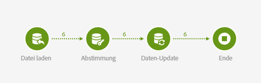
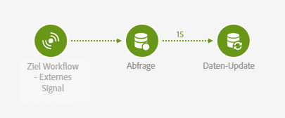

# Externes Signal und Datenimport {#external-signal-data-import}

Das folgende Beispiel erläutert die Aktivität **[!UICONTROL Externes Signal]** anhand eines typischen Fallbeispiels. In einem Ursprungs-Workflow wird ein Datenimport vorgenommen. Nachdem der Import abgeschlossen und die Datenbank aktualisiert wurde, wird ein zweiter Workflow ausgelöst. Mit dem zweiten Workflow wird ein Aggregat der importierten Daten aktualisiert.

Der Ursprungs-Workflow stellt sich folgendermaßen dar:

* Die Aktivität [Datei laden](../../automating/using/load-file.md) lädt eine Datei mit neuen Kaufdaten hoch. Beachten Sie, dass die [Datenbank entsprechend erweitert wurde](../../developing/using/data-model-concepts.md), da Kaufdaten nicht standardmäßig im Datamart vorhanden sind.

  Beispiel:

  ```
  tcode;tdate;customer;product;tamount
  aze123;21/05/2015;dannymars@example.com;A2;799
  aze124;28/05/2015;dannymars@example.com;A7;8
  aze125;31/07/2015;john.smith@example.com;A7;8
  aze126;14/12/2015;john.smith@example.com;A10;4
  aze127;02/01/2016;dannymars@example.com;A3;79
  aze128;04/03/2016;clara.smith@example.com;A8;149
  ```

* Die Aktivität [Abstimmung](../../automating/using/reconciliation.md) erstellt Relationen zwischen den importierten Daten und der Datenbank, sodass die Transaktionsdaten ordnungsgemäß mit den Profilen und Produkten verknüpft werden.
* Durch die Aktivität [Daten-Update](../../automating/using/update-data.md) werden die eingehenden Daten eingefügt und die Transaktionsquelle der Datenbank entsprechend aktualisiert.
* Eine [Ende](../../automating/using/start-and-end.md)-Aktivität löst den Ziel-Workflow aus, mit dem Aggregate aktualisiert werden.



Der Ziel-Workflow stellt sich folgendermaßen dar:

* Die Aktivität [Externes Signal](../../automating/using/external-signal.md) wartet, bis der Ursprungs-Workflow abgeschlossen ist.
* Eine [Abfrage](../../automating/using/query.md#enriching-data)-Aktivität reichert die Profile mit einer Sammlung an, die das letzte Kaufdatum abruft.
* Die Aktivität [Daten-Update](../../automating/using/update-data.md) speichert die Zusatzdaten in einem dafür vorgesehenen benutzerdefinierten Feld. Beachten Sie, dass die Profil-Ressource um das Feld **Letztes Kaufdatum** erweitert wurde.


