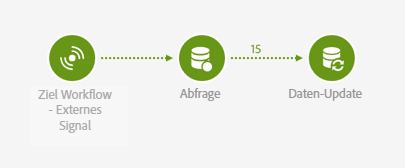

# Externes Signal{#external-signal}

## Beschreibung {#description}


Mit der Aktivität **[!UICONTROL Externes Signal]** wird ein Workflow ausgelöst, wenn in einem anderen Workflow oder einem REST-API-Aufruf gewisse Bedingungen erfüllt werden.

## Anwendungskontext {#context-of-use}

Mit der Aktivität **[!UICONTROL Externes Signal]** können unterschiedliche Prozesse organisiert und geplant werden, die Teil derselben Customer Journey in unterschiedlichen Workflows sind. Dadurch kann ein Workflow durch einen anderen aktiviert werden, wodurch komplexere Customer Journeys unterstützt werden. Dies ermöglicht wiederum eine bessere Überwachung der Prozesse und eine raschere Reaktion im Fall von Problemen.

Die Aktivität **[!UICONTROL Externes Signal]** ist die erste Aktivität eines Workflows. Sie kann durch die **[!UICONTROL Ende]**-Aktivität eines anderen Workflows oder einen REST-API-Aufruf ausgelöst werden (mehr dazu finden Sie in der [API-Dokumentation](https://final-docs.campaign.adobe.com/doc/standard/en/api/ACS_API.html#triggering-a-signal-activity)).

Nach dem Aufruf können externe Parameter definiert und in den Workflow-Ereignisvariablen verfügbar gemacht werden. Der Vorgang zum Aufrufen eines Workflows mit externen Parametern wird in [diesem Abschnitt](../../automating/using/calling-a-workflow-with-external-parameters.md) beschrieben.

>[!NOTE]
>
>Die Aktivität kann maximal alle 10 Minuten ausgelöst werden.

Beachten Sie, dass die Aktivität **[!UICONTROL Externes Signal]** von mehreren Ereignissen ausgelöst werden kann. In diesem Fall wird das **[!UICONTROL externe Signal]** aktiviert, sobald einer der Ursprungs-Workflows oder API-Aufrufe ausgeführt wird. Dazu müssen nicht alle Ursprungs-Workflows abgeschlossen sein.

## Konfiguration   {#configuration}

Bei der Konfiguration eines externes Signals muss zuerst die Aktivität **[!UICONTROL Externes Signal]im Ziel-Workflow konfiguriert werden.** Danach ist die Aktivität **[!UICONTROL Externes Signal]** dieses Workflows verfügbar, um die **[!UICONTROL Ende]**-Aktivität des Ursprungs-Workflows zu konfigurieren.

1. Ziehen Sie die Aktivität **[!UICONTROL Externes Signal]** in den Ziel-Workflow.
1. Markieren Sie die Aktivität und öffnen Sie sie mithilfe der -Schaltfläche aus den angezeigten Quick Actions.
1. Bearbeiten Sie den Titel der Aktivität. Diesen Titel benötigen Sie bei der Konfiguration des Ursprungs-Workflows, der das **[!UICONTROL externe Signal auslöst]**.

   Wenn Sie den Workflow mit Parametern aufrufen möchten, deklarieren Sie sie im Bereich **[!UICONTROL Parameter]**. Weiterführende Informationen hierzu finden Sie in [diesem Abschnitt](../../automating/using/calling-a-workflow-with-external-parameters.md#declaring-the-parameters-in-the-external-signal-activity).

   

1. Validieren Sie die Konfiguration Ihrer Aktivität, fügen Sie etwaige andere erforderliche Aktivitäten hinzu und speichern Sie Ihren Workflow.

   >[!NOTE]
   >
   >Wenn Sie den Ziel-Workflow in einem anderen Workflow auslösen möchten, gehen Sie folgendermaßen vor. Weiterführende Informationen zum Auslösen des Ziel-Workflows über einen REST-API-Aufruf finden Sie in der [API-Dokumentation](https://final-docs.campaign.adobe.com/doc/standard/en/api/ACS_API.html#triggering-a-signal-activity).

1. Öffnen Sie den Ursprungs-Workflow und wählen Sie eine **[!UICONTROL Ende]**-Aktivität aus. Wenn keine **[!UICONTROL Ende]**-Aktivität verfügbar ist, fügen Sie eine nach der letzten Aktivität eines Workflow-Zweigs hinzu.

   Manche Aktivitäten haben standardmäßig keine ausgehende Transition. Sie können eine ausgehende Transition im Tab **[!UICONTROL Eigenschaften]** dieser Aktivitäten hinzufügen.

   Beispielsweise können Sie für eine **[!UICONTROL Daten-Update]**-Aktivität im Tab **[!UICONTROL Transitionen]** die Option **[!UICONTROL Ausgehende Transition ohne Population]** auswählen. Mit dieser Option können Sie eine Transition hinzufügen, die keine Daten enthält und somit nicht unnötig Platz in Ihrem System belegt. Sie wird nur verwendet, um die zusätzliche **[!UICONTROL Ende]**-Aktivität zu verbinden, die den Ziel-Workflow auslöst.

   

1. Wählen Sie im Tab **[!UICONTROL Externes Signal]** der **[!UICONTROL Ende]**-Aktivität den Ziel-Workflow sowie die Aktivität **[!UICONTROL Externes Signal]** aus, um diesen Workflow auszulösen.

   Wenn Sie eine **[!UICONTROL Ende]**-Aktivität festlegen, die einen weiteren Workflow auslöst, wird ihrem Symbol ein zusätzliches Signalsymbol hinzugefügt.

   Wenn Sie den Workflow mit Parametern aufrufen möchten, verwenden Sie den Bereich **[!UICONTROL Parameter und Werte]**. Weiterführende Informationen hierzu finden Sie in [diesem Abschnitt](../../automating/using/calling-a-workflow-with-external-parameters.md#defining-the-parameters-when-calling-the-workflow).

   

1. Speichern Sie den Ursprungs-Workflow.

Sobald die **[!UICONTROL Ende]**-Aktivität des Ursprungs-Workflows oder des REST-API-Aufrufs ausgeführt wird, wird der Ziel-Workflow automatisch durch die Aktivität **[!UICONTROL Externes Signal]** ausgelöst.

>[!NOTE]
>
>Der Ziel-Workflow muss manuell gestartet werden, bevor er ausgelöst werden kann. Beim Start wird die **[!UICONTROL externe Aktivität]** aktiviert, die auf das Signal vom Ursprungs-Workflow wartet.

## Beispiel {#example}

Das folgende Beispiel erläutert die Aktivität **[!UICONTROL Externes Signal]** anhand eines typischen Fallbeispiels. In einem Ursprungs-Workflow wird ein Datenimport vorgenommen. Nachdem der Import abgeschlossen und die Datenbank aktualisiert wurde, wird ein zweiter Workflow ausgelöst. Mit dem zweiten Workflow wird ein Aggregat der importierten Daten aktualisiert.

Der Ursprungs-Workflow stellt sich folgendermaßen dar:

* Die Aktivität [Datei laden](../../automating/using/load-file.md) lädt eine Datei mit neuen Kaufdaten hoch. Beachten Sie, dass die [Datenbank entsprechend erweitert wurde](../../developing/using/data-model-concepts.md), da Kaufdaten nicht standardmäßig im Datamart vorhanden sind.

   Beispiel:

   ```
   tcode;tdate;customer;product;tamount
   aze123;21/05/2015;dannymars@example.com;A2;799
   aze124;28/05/2015;dannymars@example.com;A7;8
   aze125;31/07/2015;john.smith@example.com;A7;8
   aze126;14/12/2015;john.smith@example.com;A10;4
   aze127;02/01/2016;dannymars@example.com;A3;79
   aze128;04/03/2016;clara.smith@example.com;A8;149
   ```

* Die Aktivität [Abstimmung](../../automating/using/reconciliation.md) erstellt Relationen zwischen den importierten Daten und der Datenbank, sodass die Transaktionsdaten ordnungsgemäß mit den Profilen und Produkten verknüpft werden.
* Durch die Aktivität [Daten-Update](../../automating/using/update-data.md) werden die eingehenden Daten eingefügt und die Transaktionsquelle der Datenbank entsprechend aktualisiert.
* Eine **[!UICONTROL Ende]**-Aktivität löst den Ziel-Workflow aus, mit dem Aggregate aktualisiert werden.


Der Ziel-Workflow stellt sich folgendermaßen dar:

* Die Aktivität **[!UICONTROL Externes Signal]** wartet, bis der Ursprungs-Workflow abgeschlossen ist.
* Eine [Abfrage](../../automating/using/query.md#enriching-data)-Aktivität reichert die Profile mit einer Kollektion an, die das letzte Kaufdatum abruft.
* Die Aktivität [Daten-Update](../../automating/using/update-data.md) speichert die Zusatzdaten in einem dafür vorgesehenen benutzerdefinierten Feld. Beachten Sie, dass die Profil-Ressource um das Feld **Letztes Kaufdatum** erweitert wurde.



