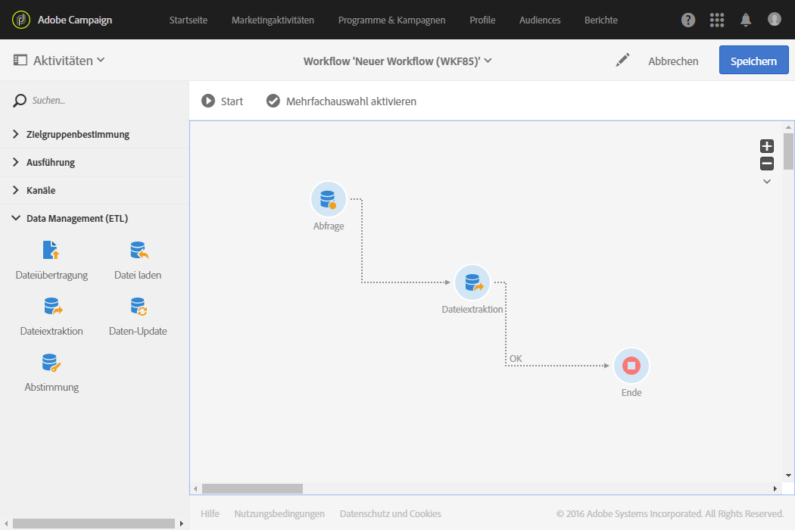

# Dateiextraktion{#extract-file}

## Beschreibung {#description}

Die Aktivität **[!UICONTROL Dateiextraktion]** erlaubt den Export von in Adobe Campaign enthaltenen Daten in Form von externen Dateien.

## Anwendungskontext {#context-of-use}

Die Art der Datenextraktion wird im Zuge der Aktivitätskonfiguration definiert.

>[!CAUTION]
>
>Die Aktivität **[!UICONTROL Dateiextraktion]** kann nur im Anschluss an eine **[!UICONTROL Abfrage]**-Aktivität verwendet werden.

**Verwandte Themen:**

* [Anwendungsfall: Profile in eine externe Datei exportieren](../../automating/using/exporting-profiles-in-file.md)

## Konfiguration {#configuration}

1. Ziehen Sie eine **[!UICONTROL Dateiextraktion]** in den Workflow-Arbeitsbereich.

   

1. Markieren Sie die Aktivität und öffnen Sie sie mithilfe der in der Schnellaktion angezeigten Schaltfläche .
1. Geben Sie den Titel der **Ausgabedatei** an. Der Dateiname wird automatisch mit dem Datum und der Uhrzeit der Erstellung ergänzt, um seine Eindeutigkeit zu gewährleisten, z. B.: Beispiel: recipients_20150815_081532.txt für eine Datei, die am 15. August 2015 um 08:15:32 Uhr erstellt wurde.

   >[!NOTE]
   >
   >Sie können den Dateinamen mit der in diesem Feld befindlichen Funktion **[!UICONTROL formatDate]** spezifizieren.

1. Sie können die Ausgabedatei bei Bedarf komprimieren, indem Sie im Feld **[!UICONTROL Nachbearbeitungsschritt hinzufügen]** die Option **[!UICONTROL Komprimierung]** auswählen. Die Ausgabedatei wird in eine GZIP-Datei (.gz) komprimiert.

   Das Feld **[!UICONTROL Nachbearbeitungsschritt hinzufügen]** ermöglicht Ihnen auch, eine Datei zu verschlüsseln, bevor Sie sie extrahieren. Weitere Informationen zum Arbeiten mit verschlüsselten Dateien finden Sie in [diesem Abschnitt](../../automating/using/managing-encrypted-data.md)

1. Fügen Sie mithilfe der Schaltfläche **[!UICONTROL Element erstellen]** eine Ausgabespalte hinzu.

   

   Es öffnet sich ein neues Fenster.

   

1. Erstellen Sie einen Ausdruck. Hierzu können Sie einen bereits existierenden Ausdruck auswählen oder mit dem **Ausdruckseditor** einen neuen erstellen.
1. Validieren Sie den Ausdruck.

   Der Ausdruck wird den Ausgabespalten hinzugefügt.

1. Erstellen Sie so viele Spalten wie nötig. Klicken Sie zur Bearbeitung der Spalten auf deren Ausdruck oder Titel.

   Wenn Sie Profile exportieren, um sie in einem externen Tool zu verwenden, empfehlen wir auch den Export einer eindeutigen Kennung. Nicht alle Profile verfügen standardmäßig über eine eindeutige Kennung. Dies hängt von der Weise ab, wie sie zur Datenbank hinzugefügt werden. Weiterführende Informationen finden Sie im Abschnitt [Eindeutige Kennung für Profile erstellen](../../developing/using/configuring-the-resource-s-data-structure.md#generating-a-unique-id-for-profiles-and-custom-resources).

1. Klicken Sie auf den **[!UICONTROL Dateistruktur]**-Tab, um das Ausgabe-, Datums- und Zahlenformat der zu exportierenden Datei zu konfigurieren.

   Wenn Sie Auflistungswerte exportieren, aktivieren Sie die Option **[!UICONTROL Titel anstelle der internen Werte der Auflistungen exportieren]**. Mit dieser Option können Sie kürzere Titel abrufen, die einfacher verständlich sind als IDs.

   

   >[!NOTE]
   >
   >Wenn Sie Daten in eine CSV-Datei mit einer bestimmten Codierung extrahieren möchten, wählen Sie zunächst das Ausgabeformat „Text“ aus. Wählen Sie die gewünschte Codierung aus der Dropdown-Liste aus und ändern Sie dann das Ausgabeformat in „CSV (Excel)“.

1. Wählen Sie im Tab **[!UICONTROL Eigenschaften]** die Option **[!UICONTROL Keine Datei erstellen, wenn die eingehende Transition leer ist]** aus, um zu verhindern, dass leere Dateien erstellt und auf SFTP-Server hochgeladen werden, wenn die eingehende Transition leer ist.
1. Validieren Sie die Konfiguration der Aktivität und speichern Sie Ihren Workflow.
