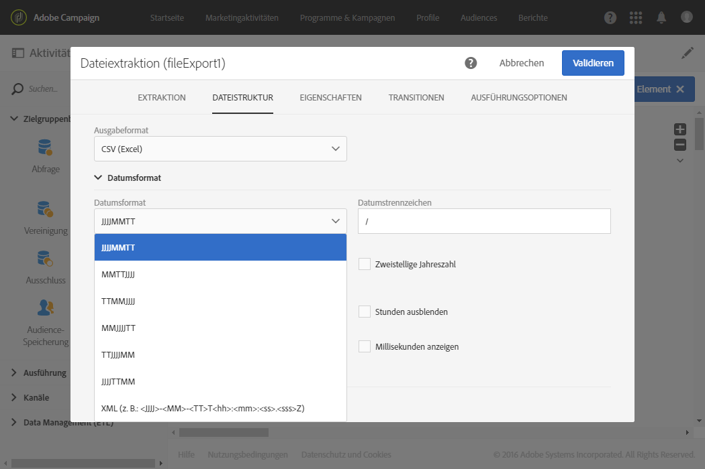

# Dateiextraktion{#extract-file}

## Beschreibung {#description}

Die Aktivität **[!UICONTROL Dateiextraktion]erlaubt den Export von in Adobe Campaign enthaltenen Daten in Form von externen Dateien.**

## Anwendungskontext {#context-of-use}

Die Art der Datenextraktion wird im Zuge der Aktivitätskonfiguration definiert.

>[!CAUTION]
>
>Die Aktivität **[!UICONTROL Dateiextraktion]** kann nur im Anschluss an eine **Abfrage]-Aktivität verwendet werden.[!UICONTROL **

## Konfiguration {#configuration}

1. Ziehen Sie eine **[!UICONTROL Dateiextraktion]in den Workflow-Arbeitsbereich.**

   

1. Markieren Sie die Aktivität und öffnen Sie sie mithilfe der 
1. Geben Sie den Titel der **Ausgabedatei** an. Der Dateiname wird automatisch mit dem Datum und der Uhrzeit der Erstellung ergänzt, um seine Eindeutigkeit zu gewährleisten, z. B.: Empfänger_20150815_081532.txt für eine Datei, die am 15. August 2015 um 8.15 Uhr und 32 Sekunden erstellt wurde.

   >[!NOTE]
   >
   >Sie können den Dateinamen mit der in diesem Feld befindlichen Funktion **[!UICONTROL formatDate]spezifizieren.**

1. Sie können die Ausgabedatei bei Bedarf komprimieren, indem Sie im Feld **[!UICONTROL Anschlussvorgangsetappe hinzufügen]** die Option **Komprimierung]auswählen.[!UICONTROL ** Die Ausgabedatei wird in eine GZIP-Datei (.gz) komprimiert.
1. Fügen Sie mithilfe der Schaltflächen  oder **Element hinzufügen]eine Ausgabespalte hinzu.[!UICONTROL **

   

   Es öffnet sich ein neues Fenster.

   

1. Erstellen Sie einen Ausdruck. Hierzu können Sie einen bereits existierenden Ausdruck auswählen oder mit dem **Ausdruckseditor** einen neuen erstellen.
1. Validieren Sie den Ausdruck.

   Der Ausdruck wird den Ausgabespalten hinzugefügt.

1. Erstellen Sie so viele Spalten wie nötig. Klicken Sie zur Bearbeitung der Spalten auf deren Ausdruck oder Titel.

   Wenn Sie Profile exportieren, um sie in einem externen Tool zu verwenden, empfehlen wir auch den Export einer eindeutigen Kennung. Nicht alle Profile verfügen standardmäßig über eine eindeutige Kennung. Dies hängt von der Weise ab, wie sie zur Datenbank hinzugefügt werden. Weiterführende Informationen finden Sie im Abschnitt [Eindeutige Kennung für Profile erstellen](../../developing/using/configuring-the-resource-s-data-structure.md#generating-a-unique-id-for-profiles-and-custom-resources).

1. Klicken Sie auf den **[!UICONTROL Dateistruktur]-Tab, um das Ausgabe-, Datums- und Zahlenformat der zu exportierenden Datei zu konfigurieren.**

   Wenn Sie Auflistungswerte exportieren, aktivieren Sie die Option **[!UICONTROL Titel anstelle der internen Werte der Auflistungen exportieren.]** Mit dieser Option können Sie kürzere Titel abrufen, die einfacher verständlich sind als IDs.

1. Wählen Sie im Tab **[!UICONTROL Eigenschaften]** die Option **Keine Datei erstellen, wenn die eingehende Transition leer ist]aus, um zu verhindern, dass leere Dateien erstellt und auf SFTP-Server hochgeladen werden, wenn die eingehende Transition leer ist.[!UICONTROL **
1. Validieren Sie die Konfiguration der Aktivität und speichern Sie Ihren Workflow.

## Beispiel {#example}

Im folgenden Beispiel wird die Konfiguration einer auf eine **[!UICONTROL Abfrage]** folgenden **Dateiextraktion]erläutert.[!UICONTROL **

Ziel dieses Workflows ist es, eine Profilliste in eine externe Datei zu exportieren, um die Daten außerhalb von Adobe Campaign verwenden zu können.

1. Platzieren Sie eine **[!UICONTROL Dateiextraktion]** im Anschluss an eine **Abfrage]im Workflow-Arbeitsbereich.[!UICONTROL **

   Im vorliegenden Beispiel werden alle Profile im Alter von 18 bis 30 Jahren aus der Datenbank abgefragt.

1. Öffnen Sie die Dateiextraktion, um sie zu konfigurieren.
1. Benennen Sie die Ausgabedatei.
1. Fügen Sie die gewünschten Ausgabespalten hinzu.

   Im vorliegenden Beispiel sind dies E-Mail-Adresse, Alter, Geburtsdatum, Vor- und Nachname der abgefragten Profile.

   

1. Gehen Sie in den **[!UICONTROL Dateistruktur]-Tab und definieren Sie folgende Elemente:**

   * CSV als Ausgabeformat,

      

   * Datumsformat,

      

1. Validieren Sie die Aktivität.
1. Platzieren Sie nun im Anschluss an die **[!UICONTROL Dateiextraktion]** eine **Dateiübertragung], um die Extraktionsdatei mittels eines externen Kontos abrufen zu können.[!UICONTROL **
1. Öffnen Sie die Aktivität und wählen Sie die Aktion **[!UICONTROL Datei-Upload]aus.**

   

1. Wählen Sie ein externes Konto aus und geben Sie den Pfad des Ordners auf dem Server an.

   

1. Validieren Sie die Aktivität und speichern Sie den Workflow.
1. Starten Sie den Workflow.

   Nach erfolgreicher Ausführung des Workflows ist die Extraktionsdatei im externen Konto verfügbar.

