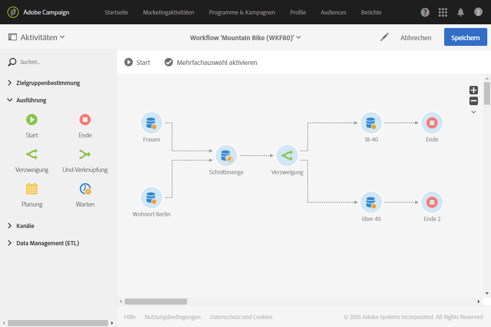

# Verzweigung{#fork}

## Beschreibung {#description}

Eine **[!UICONTROL Verzweigung]** erzeugt ausgehende Transitionen, um mehrere Workflow-Aktivitäten parallel zu starten.

## Anwendungskontext {#context-of-use}

Die Aktivität **[!UICONTROL Verzweigung]** ermöglicht insbesondere die unabhängige Ausführung verschiedener Aktivitäten innerhalb desselben Workflows.

## Konfiguration {#configuration}

1. Ziehen Sie eine **[!UICONTROL Verzweigung]** in den Workflow-Arbeitsbereich.
1. Schließen Sie sie an Aktivitäten wie beispielsweise Abfragen an.
1. Markieren Sie die Aktivität und öffnen Sie sie mithilfe der in der Schnellaktion angezeigten Schaltfläche .
1. Definieren Sie die Anzahl an ausgehenden Transitionen. Dies kann durch die Erstellung neuer bzw. Duplizierung oder Löschung bestehender Transitionen erfolgen. Benennen Sie gegebenenfalls die Transitionen.
1. Validieren Sie die Konfiguration der Aktivität und speichern Sie Ihren Workflow.

## Beispiel  {#example}

Unten stehende Abbildung zeigt die Schnittmenge aus zwei Abfragen. Gesucht werden alle Profile der Adobe-Campaign-Datenbank, die weiblichen Geschlechts sind und die in Berlin leben. Die Verzweigung ermöglicht es dann, mehrere Aktivitäten parallel zu starten: einerseits eine Audience-Speicherung, um die berechnete Population zwischenzuspeichern, und andererseits eine Segmentierung, die es ermöglicht, den Empfängern in den verschiedenen Segmenten eine E-Mail mit segmentspezifischen Inhalten zu senden. Die erste E-Mail richtet sich an alle Berlinerinnen zwischen 18 und 40 Jahren und die zweite an alle Berlinerinnen über 40 Jahre.

