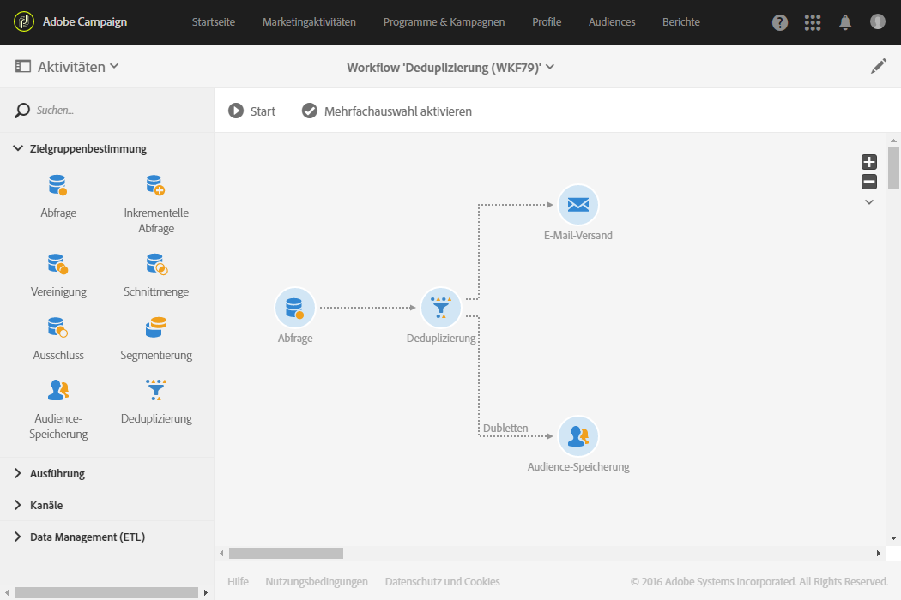
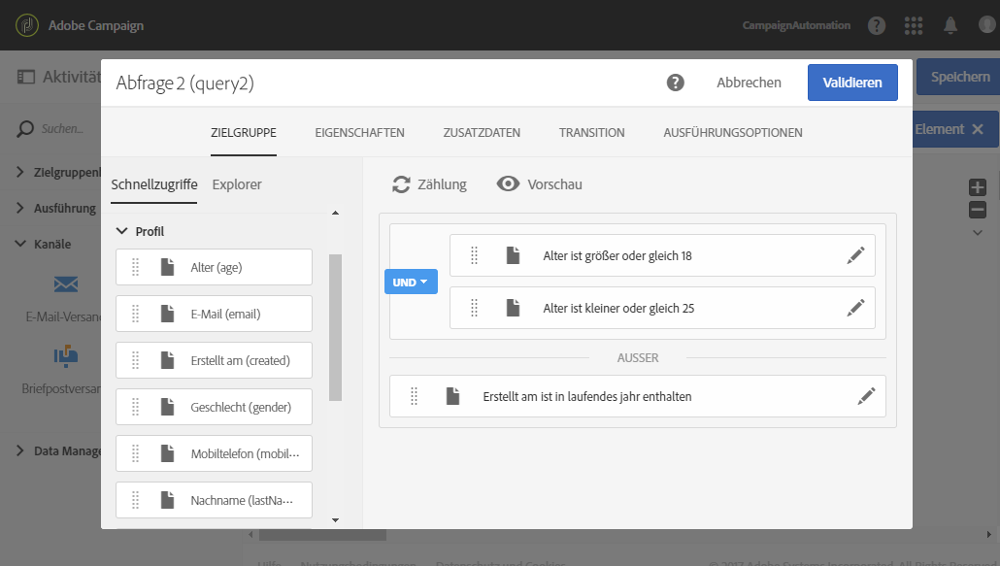
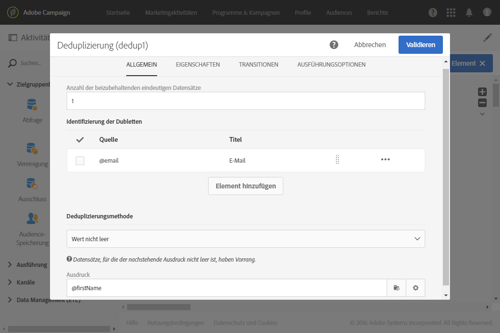

# Duplikate vor einem Versand identifizieren {#identifying-duplicates-before-a-delivery}

Das folgende Beispiel zeigt eine Deduplizierung, mithilfe derer die Duplikate einer Zielgruppe vor dem Versand einer E-Mail ausgeschlossen werden können. Dadurch lässt sich vermeiden, eine Information mehrmals an ein und dasselbe Profil zu schicken.

Der Workflow setzt sich folgendermaßen zusammen:

* [Abfrage](../../automating/using/query.md) zur Bestimmung der Zielgruppe der E-Mail. Im vorliegenden Beispiel zielt der Workflow auf all jene Profile im Alter zwischen 18 und 25 Jahren ab, die seit mehr als einem Jahr in der Kundendatenbank sind.

  

* [Deduplizierung](../../automating/using/deduplication.md) zur Identifizierung der aus der vorangehenden Abfrage hervorgehenden Duplikate. Im vorliegenden Beispiel wird für jedes Duplikat ein einziger Datensatz beibehalten. Die Duplikate werden mittels der E-Mail-Adresse identifiziert. Auf diese Weise kann ein E-Mail-Versand nur ein einziges Mal an jede in der Zielgruppenbestimmung enthaltene E-Mail-Adresse gesendet werden.

  Bei der ausgewählten Deduplizierungsmethode handelt es sich um **[!UICONTROL Wert nicht leer]**. Dadurch kann sichergestellt werden, dass es sich bei den im Fall von Duplikaten beibehaltenen Datensätzen vornehmlich um diejenigen handelt, bei denen das Feld **Vorname** ausgefüllt ist. Dies ist insbesondere dann empfehlenswert, wenn der Vorname in den Personalisierungsfeldern des E-Mail-Inhalts verwendet wird.

  Des Weiteren wird eine komplementäre Transition erzeugt, um die Duplikate beizubehalten und sie auflisten zu können.

  

* [E-Mail-Versand](../../automating/using/email-delivery.md), der im Anschluss an die ausgehende Haupttransition der Deduplizierung platziert wird.
* Die Aktivität [Zielgruppen-Speicherung](../../automating/using/save-audience.md), die im Anschluss an die zusätzliche Transition der Deduplizierung platziert wird, um die Duplikate in einer **Duplikate**-Zielgruppe zu speichern. Diese Zielgruppe kann in der Folge wiederverwendet werden, um ihre Mitglieder direkt von jeglichem E-Mail-Versand auszuschließen.
