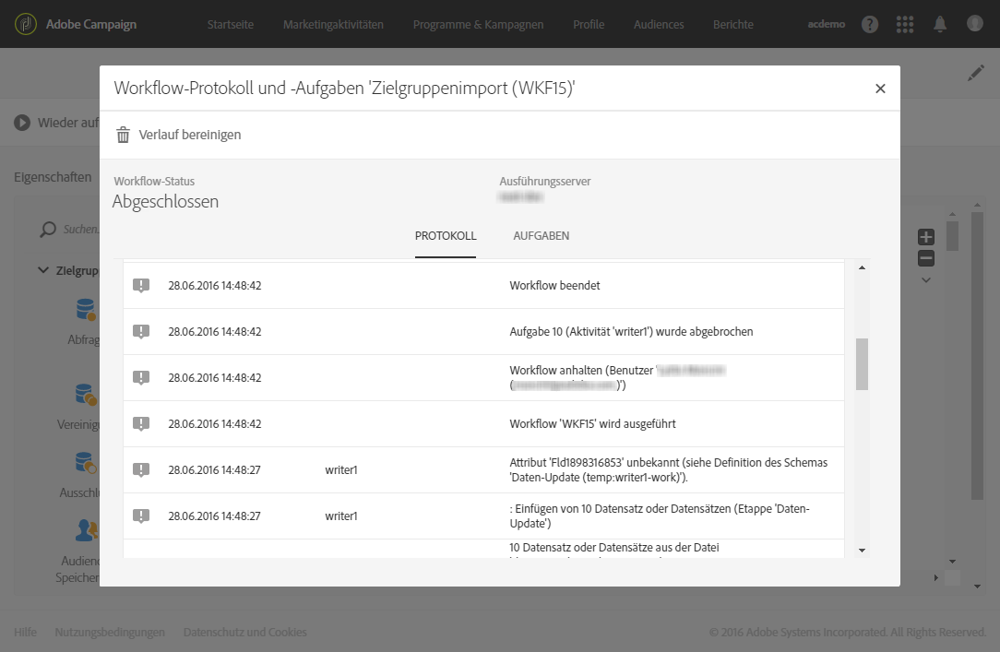
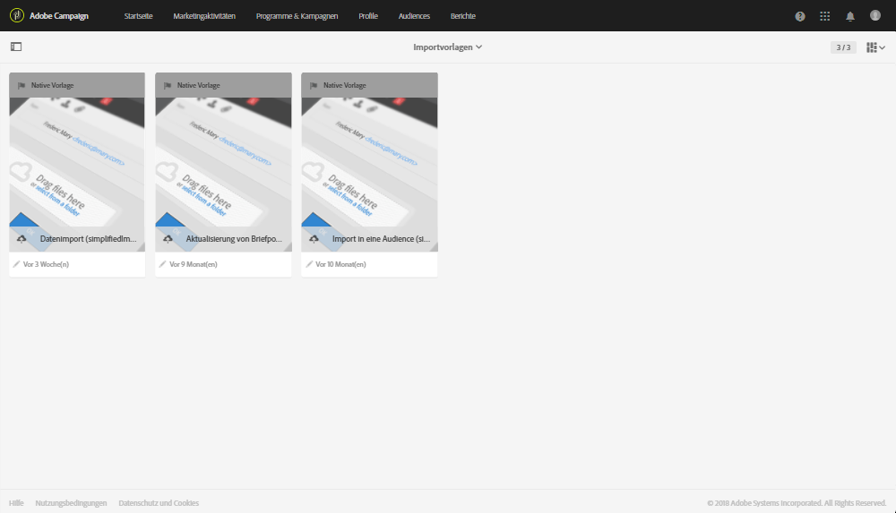
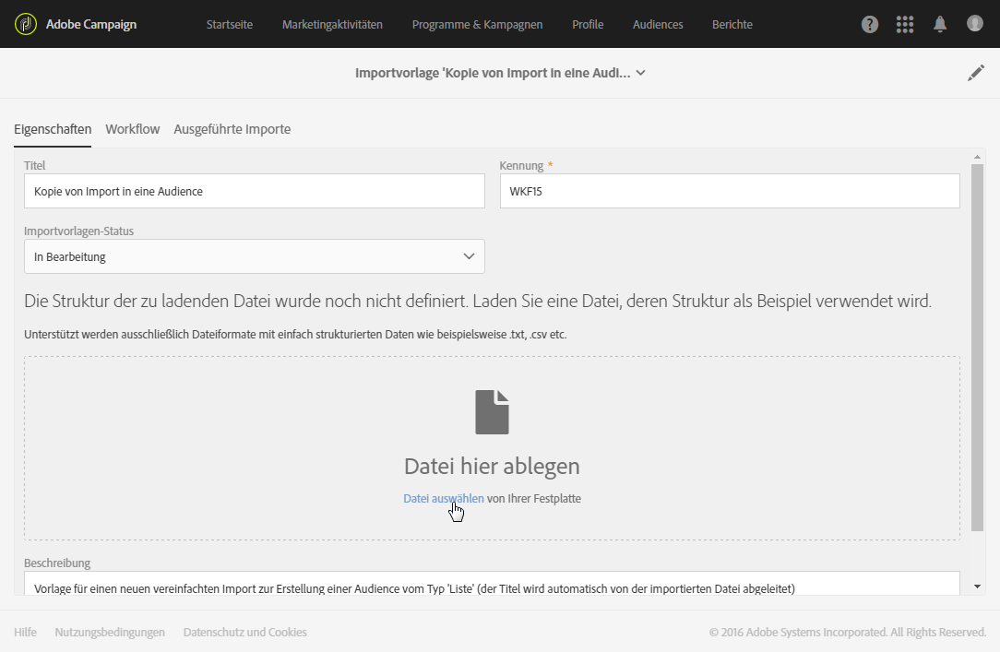
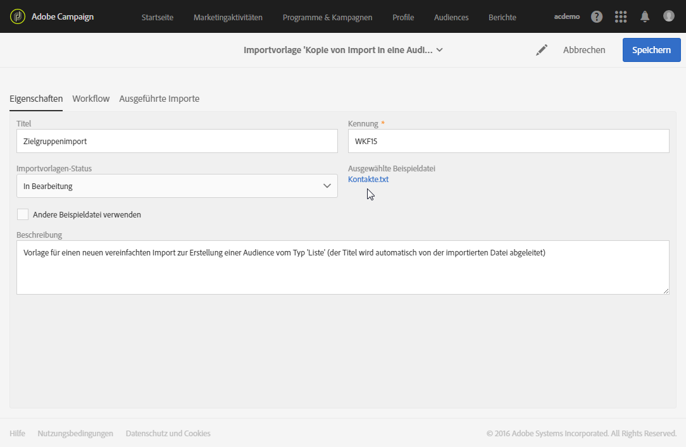
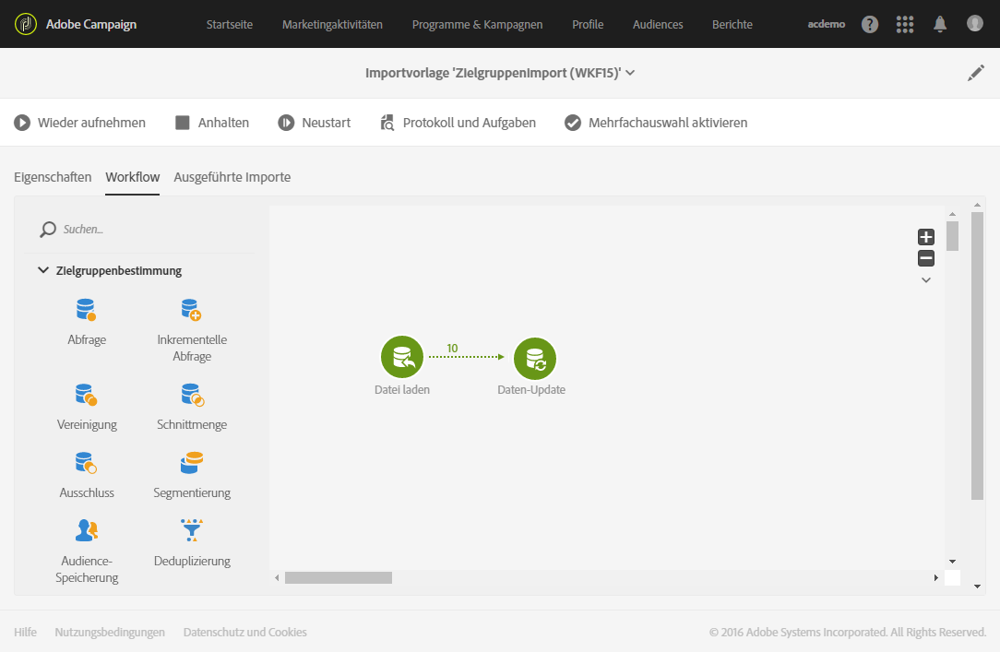

# Datenimport mit Importvorlagen{#importing-data-with-import-templates}

Durch den Datenimport können Sie Daten erfassen und Ihre Adobe-Campaign-Datenbank erweitern.

Adobe Campaign bietet eine vereinfachte Importfunktion, welche unter bestimmten Bedingungen eine Alternative zur Verwendung komplexerer [Workflow](../../automating/using/get-started-workflows.md)-Aktivitäten darstellt.

Das Prinzip dahinter sieht wie folgt aus: Ein **Administrator** definiert und verwaltet Importvorlagen (siehe [Importvorlagen konfigurieren](../../automating/using/importing-data-with-import-templates.md#setting-up-import-templates)). Diese Importvorlagen werden dann Benutzern im Menü **[!UICONTROL Profile &amp; Audiences]** > **[!UICONTROL Importe]** mit vereinfachten Ansichten zur Verfügung gestellt.

Die Benutzer müssen lediglich den gewünschten Importtyp auswählen und die Datei mit den zu importierenden Daten hochladen. Für den Benutzer transparent wird nun der zuvor durch den Administrator konfigurierte Workflow ausgeführt. Nach Abschluss des Imports kann der Benutzer auf das Ergebnis des Imports zugreifen.

>[!NOTE]
>
>Die Datenimportfunktion kann von Benutzern mit den Benutzerrollen **[!UICONTROL ALLGEMEINER IMPORT (import)]** und **[!UICONTROL WORKFLOW (workflow)]** verwaltet werden. Weiterführende Informationen zu Benutzerrollen finden Sie in [diesem Abschnitt](../../administration/using/list-of-roles.md).

Die Importliste kann nach der zugrunde liegenden Vorlage, dem Ausführungsdatum und -status gefiltert werden.

1. Verwenden Sie in der Importübersicht die **[!UICONTROL Erstellen]**-Schaltfläche, um den Importassistenten zu öffnen.
1. Wählen Sie den gewünschten Importtyp aus. Die Importtypen entsprechen den verfügbaren Importvorlagen.
1. Laden Sie bei Bedarf die in der Vorlage enthaltene Beispieldatei herunter, um sicherzustellen, dass die in der zu importierenden Datei enthaltenen Daten den erwarteten Datentypen entsprechen.
1. Laden Sie die Datei mit den zu importierenden Daten im Assistenten hoch.
1. Starten Sie den Import. Der Assistent wird geschlossen und Sie werden zur Liste der anhand der verwendeten Vorlage realisierten Importe weitergeleitet.
1. Aktualisieren Sie die Seite und wählen Sie den zuvor ausgeführten Import aus, um die Ausführungsdetails anzuzeigen.

   

Die Ausführungsdetails sind jetzt verfügbar. Sie haben somit die Möglichkeit, die importierte Datei sowie eine die Zurückweisungen, d. h. nicht importierte Daten, enthaltende Datei herunterzuladen.

## Importvorlagen einrichten {#setting-up-import-templates}

Mit Importvorlagen kann der Administrator gewisse technische Importparameter konfigurieren. Diese Vorlagen können dann den Standardbenutzern zur Verfügung gestellt werden, um Datei-Uploads durchzuführen.

Eine Importvorlage wird vom funktionalen Administrator konfiguriert. Der Zugriff erfolgt über **[!UICONTROL Ressourcen]** > **[!UICONTROL Vorlagen]** > **[!UICONTROL Importvorlagen]**.

Drei schreibgeschützte Vorlagen stehen standardmäßig zur Verfügung:

* **[!UICONTROL Aktualisierung von Briefpost-Quarantänen und Versandlogs]**: Diese Vorlage dient als Grundlage für neue Importe, mit denen Briefpost-Quarantänen und -Versandlogs aktualisiert werden können. Der dieser Vorlage zugrunde liegende Workflow enthält die folgenden Aktivitäten:
* **[!UICONTROL Datenimport]**: Diese Vorlage ermöglicht Importe, die Daten aus einer Datei zur Datenbank hinzufügen. Der dieser Vorlage zugrunde liegende Workflow enthält die folgenden Aktivitäten:

   * **[!UICONTROL Datei laden]** – lädt Daten einer Datei auf den Adobe Campaign-Server.
   * **[!UICONTROL Daten-Update]** – fügt die in der Datei enthaltenen Daten zur Datenbank hinzu.

* **[!UICONTROL Listenimport]**: Diese Vorlage ermöglicht Importe, die ausgehend von den Daten einer Datei Zielgruppen vom Typ **Liste** erstellen. Der dieser Vorlage zugrunde liegende Workflow enthält die folgenden Aktivitäten:

   * **[!UICONTROL Datei laden]** – lädt Daten einer Datei auf den Adobe Campaign-Server.
   * **[!UICONTROL Abstimmung]** – ordnet, wenn möglich, den importierten Daten eine Zielgruppendimension zu. Dies erlaubt im Anschluss die Erstellung einer Zielgruppe vom Typ **Liste**. Sollte die Zielgruppendimension der importierten Daten nicht bekannt sein, ist die erstellte Audience vom Typ **Datei**. Siehe [Zielgruppendimensionen und Ressourcen](../../automating/using/query.md#targeting-dimensions-and-resources).
   * **[!UICONTROL Zielgruppe speichern]** – speichert die importierten Daten als Zielgruppe vom Typ **Liste**. Der Name der gespeicherten Zielgruppe entspricht dem Namen der importierten Datei, dem das Datum und die Uhrzeit des Imports als Suffix beigefügt werden. Beispiel: &#39;profiles_20150406_151448&#39;.

Diese Standardvorlagen sind schreibgeschützt und für Standardbenutzer nicht sichtbar. Um eine Vorlage zu erstellen, die Benutzer verwenden können, gehen Sie folgendermaßen vor:

1. Duplizieren Sie eine der Standardvorlagen. Die duplizierte Vorlage enthält drei Tabs:

   * **[!UICONTROL Eigenschaften]** mit den allgemeinen Eigenschaften der Importvorlage. Dieser Tab ermöglicht es insbesondere, die Vorlage zu aktivieren und eine Beispieldatei zu laden.
   * **[!UICONTROL Workflow]** zur Konfiguration des Import-Workflows. In diesem Tab werden die einzelnen Workflow-Aktivitäten zur Ausführung des Imports definiert. Diese sind für den Benutzer, der sich letztlich des vereinfachten Imports bedient, nicht sichtbar.
   * **[!UICONTROL Ausgeführte Importe]** mit der Liste der anhand dieser Vorlage realisierten Importe. Angezeigt werden Status, Details und Ergebnisse aller auf der Vorlage beruhenden Importe. Von dieser Liste aus können Sie direkt auf den (für den Import durchführenden Endbenutzer verborgen ausgeführten) Workflow zugreifen.

1. Passen Sie im **[!UICONTROL Eigenschaften]**-Tab den Titel der Vorlage an und fügen Sie eine Beschreibung hinzu. Letztere ist für die Benutzer sichtbar, sobald die Vorlage verfügbar gemacht wurde.

   

1. Gehen Sie in den **[!UICONTROL Workflow]**-Tab. Ergänzen Sie hier bei Bedarf den standardmäßig angebotenen Workflow mit weiteren Aktivitäten.

   Weiterführende Informationen zur Konfiguration der Workflow-Aktivitäten erfahren Sie im Anwendungsbeispiel in diesem Abschnitt: [Beispiel: Import-Workflow-Vorlage](../../automating/using/creating-import-workflow-templates.md). In diesem Anwendungsbeispiel wird gezeigt, wie ein Workflow für den wiederholten Import von Profilen aus einer CRM-Lösung in der Adobe Campaign-Datenbank erstellt wird.

1. Speichern Sie die Vorlage, damit die Konfiguration des Workflows berücksichtigt wird.
1. Laden Sie im **[!UICONTROL Eigenschaften]**-Tab eine Beispieldatei hoch. Neben den für den Import erforderlichen Spalten kann die Beispieldatei auch Daten enthalten, die es ermöglichen, den vereinfachten Import nach der Workflow-Erstellung zu testen. Die Daten in der Beispieldatei ermöglichen es Ihnen, den vereinfachten Import zu testen, sobald der Workflow definiert wurde.

   

   Sie kann beispielsweise heruntergeladen und mit den zu importierenden Daten ausgefüllt werden. Dieser Zweck sollte bei der Auswahl der Beispieldatei berücksichtigt werden. Speichern Sie die Vorlage.

1. Die Beispieldatei wird fortan berücksichtigt. Sie können sie jederzeit lokal herunterladen, um ihren Inhalt zu prüfen. Verwenden Sie zur Auswahl einer anderen Beispieldatei die Option **[!UICONTROL Andere Beispieldatei verwenden]**.

   

1. Gehen Sie erneut in den **[!UICONTROL Workflow]**-Tab und öffnen Sie die **[!UICONTROL Datei laden]**-Aktivität, um die Spaltenkonfiguration der zuvor geladenen Beispieldatei zu prüfen und gegebenenfalls anzupassen.
1. Testen Sie den Import, indem Sie den Workflow starten. Hierzu muss die im Schritt **5** geladene Beispieldatei Daten enthalten.

   Die Daten der Beispieldatei werden dann importiert. Verwenden Sie fiktive Daten in geringem Umfang, um die Kapazität Ihrer Datenbank nicht zu überfordern.

1. Prüfen Sie nun das Workflow-Ausführungsprotokoll, auf das Sie über die entsprechende Schaltfläche in der Aktionsleiste zugreifen können. Sollten Fehler aufgetreten sein, ist die Konfiguration der Aktivitäten zu prüfen.

   

1. Setzen Sie im **[!UICONTROL Eigenschaften]**-Tab den **[!UICONTROL Importvorlagen-Status]** auf **[!UICONTROL Verfügbar]** und speichern Sie die Vorlage. Wenn die Vorlage nicht mehr verwendet werden soll, können Sie den **[!UICONTROL Importvorlagen-Status]** auf **[!UICONTROL Archiviert]** setzen.

Der Vorlagen-Workflow kann geändert werden, indem die Beispieldatei erneut hochgeladen und die Konfiguration **[!UICONTROL Datei laden]** überprüft wird.

Die Importvorlage ist jetzt für Benutzer zum Hochladen von Dateien verfügbar.

**Verwandte Themen:**

* [Workflows](../../automating/using/get-started-workflows.md)
* [Beispiel: Import-Workflow-Vorlage](../../automating/using/creating-import-workflow-templates.md)
